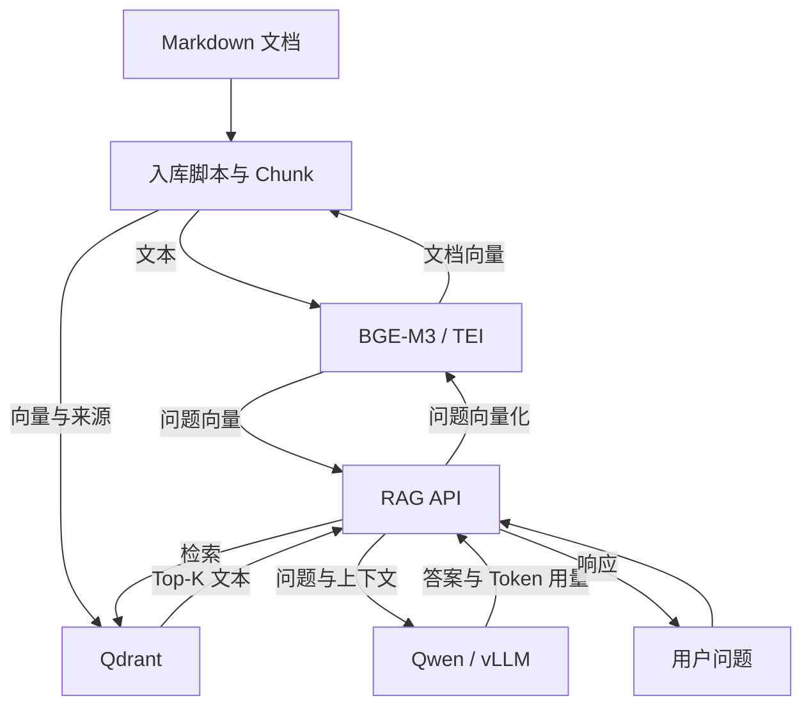
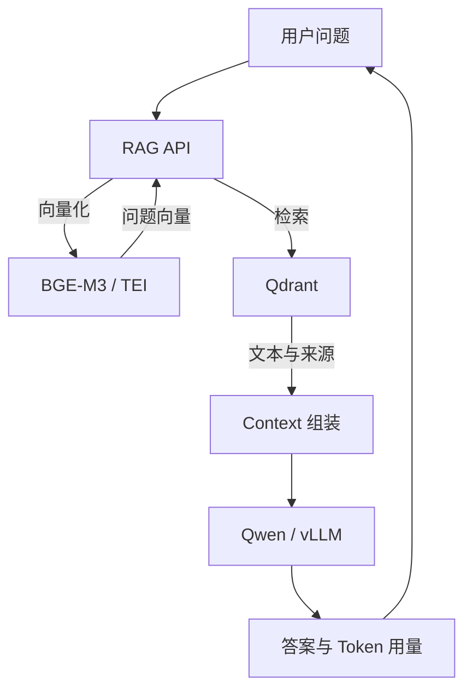

# AI Infra Lab：单节点 AI 基础设施实验室

> 从传统运维进入 AI 基础设施：在一张 RTX 4060 8GB 上，完成 GPU 容器化、Kubernetes 调度、模型服务、RAG、可观测性与故障恢复。
>
> 作者：是垚不是土 · 实验记录基线：2026 年 9 月 · 文档形态：操作手册与实验记录

[TOC]

## 一、项目介绍与整体思路

### 1. 实验背景与学习目标

这次实验起源于一套由量化 Qwen、BGE-M3、Qdrant 和 Prometheus / Grafana 组成的知识库环境。对运维工程师而言，其中值得研究的是模型服务如何获得计算资源、怎样进入 Kubernetes、如何解释延迟和显存变化，以及发生故障后如何恢复。

AI Infra Lab 使用 RAG 作为真实工作负载，把已有的 Linux、容器、网络、存储和监控知识延伸到 GPU 与模型推理。完成实验后，应能够说明一次请求经过了哪些组件，为每一层找到验证方法，并依据指标和日志判断故障范围。

| 已有运维能力 | 在本实验中扩展的能力 | 需要留下的证据 |
|---|---|---|
| Linux 与容器 | Windows / WSL GPU 通路、NVIDIA Runtime | 主机与容器中的 GPU 检查结果 |
| Kubernetes 调度 | Device Plugin、扩展资源、GPU 共享 | Node 资源、Pod limits、调度 Events |
| 应用发布 | 模型文件与推理引擎分离、显存预算 | YAML、模型加载日志、API 响应 |
| 数据与应用链路 | Embedding、向量库、检索与生成 | Chunk、Point、检索来源、答案 |
| 监控与排障 | GPU、Token、TTFT、TPOT、阶段耗时 | 指标、看板、请求日志、实验汇总 |
| 运维恢复 | 受控故障、配置回退、快照恢复 | 故障证据、恢复记录、业务验收 |

### 2. 实验环境与适用范围

现有设备是一台同时承担日常工作的 Windows 电脑，GPU 为 NVIDIA RTX 4060 8GB。实验通过 WSL2 运行 Ubuntu，再由 Sealos 部署单节点 Kubernetes。Windows 桌面和其他 GPU 程序会影响显存基线，因此后续容量判断必须使用当次观测值。

| 项目 | 本实验约定 |
|---|---|
| Windows / Linux | Windows + WSL2 + Ubuntu 24.04；发行版名称 `Ubuntu-24.04` |
| GPU | NVIDIA RTX 4060 8GB；以 `nvidia-smi` 的实际设备、总量与占用为准 |
| Kubernetes Node | `ai-infra`，单节点、单 GPU |
| 系统内存 | 双模型阶段将 WSL 上限设为 10GB；Swap 另行检查 kubelet 兼容性 |
| 工作目录 | WSL `/data`；模型、配置、应用、实验数据分别存放 |
| 业务目标 | 串行、小规模 RAG 请求与可解释的基础设施实验 |
| 存储形态 | 单节点 `hostPath`；Qdrant 另做下载快照与恢复验证 |
| 监控形态 | Prometheus + Grafana；第十章验证规则状态，未配置外部通知 |

WSL2 足以支撑本书中的 CUDA、容器、调度、Serving 和 RAG 实验。原生 Linux 驱动管理、PCIe 直通、多节点、高可用和多卡训练属于后续课题。本机性能结果只适用于记录中的硬件、参数与请求，不能外推为生产容量。

### 3. 系统架构与数据流

系统有两条数据流。知识入库时，Markdown 被切成 Chunk，经 BGE-M3 转成 1024 维向量，连同原文和来源写入 Qdrant；在线问答时，问题先生成向量，检索出的文本再作为上下文交给 Qwen。



Qwen 与 BGE-M3 使用同一张 GPU。NVIDIA Runtime 负责容器访问 GPU，Device Plugin 向 kubelet 注册调度资源；Prometheus 采集 GPU、Kubernetes 和各应用指标，Grafana 展示这些时间序列。GPU 调度、显存使用、应用健康和指标可采集性需要分别验证。

### 4. 阅读顺序与阶段产物

首次搭建按章节顺序推进。每章的验收通过后再进入下一层；已经完成部署的环境，优先使用第八至十章进行观察和运维。

| 阶段 | 核心问题 | 阶段产物与通过条件 |
|---|---|---|
| 二：WSL 与 CUDA | Linux 是否能执行 GPU 计算？ | PyTorch CUDA 运算成功，设备与占用可观察 |
| 三：Kubernetes | 节点与容器基础设施是否正常？ | Node Ready，系统 Pod 就绪，网络测试通过 |
| 四：GPU 基础设施 | GPU 是否能被调度到 Pod？ | Device Plugin 注册资源，CUDA Sample 成功 |
| 五：Qwen Serving | 模型是否能经 API 生成答案？ | 权重、镜像、Deployment、响应和 Token 用量 |
| 五-A：单卡共享 | 两个模型是否既能调度，又有足够显存？ | 共享份额、单模型基线、双模型最终配置 |
| 六：Embedding 与向量库 | 文本能否入库、检索并持久化？ | 1024 维向量、测试 Collection、持久化验证 |
| 七：RAG | 答案能否关联到检索来源？ | Chunk、正式 Collection、Kubernetes RAG API |
| 八：可观测性 | 能否定位请求慢在哪一层？ | Targets、应用埋点、日志关联、Grafana 看板 |
| 九：性能观察 | 参数变化如何影响这组请求？ | JSONL 原始记录、统计表、有限范围的结论 |
| 十：运维演练 | 能否发现故障并验证恢复？ | 恢复补丁、故障记录、快照校验与恢复手册 |

### 5. 版本与最终配置基线

下表汇总本文记录使用的版本，不表示这些版本是最新版本或适合所有环境。重新搭建时先核对组件兼容性；更换版本后应重新执行对应阶段的验证。镜像引用与截图对应的历史命令保留在原章节。

| 组件 | 文中版本 / 配置 | 说明 |
|---|---|---|
| Sealos | 5.1.1 | 以第三章命令输出记录为基准 |
| Kubernetes | v1.29.9 | 本实验已有单节点版本 |
| Cilium | 1.15.19 | 1.13.4 属于早期失败记录；正式创建使用 1.15.19 |
| Helm | 初始 v3.9.4；监控安装阶段更新为 v3.17.3 | 第八章保留更新命令 |
| NVIDIA Device Plugin | 0.20.0 | 共享阶段暴露 `nvidia.com/gpu.shared: 2` |
| Qwen / vLLM | Qwen3-4B-AWQ / `vllm/vllm-openai:v0.29.0` | 双模型阶段使用五-A 第 17 节最终 YAML |
| BGE-M3 / TEI | BAAI/bge-m3 / `89-1.9` | Dense、1024 维、FP16；保留批量与并发限制 |
| Qdrant | `qdrant/qdrant:v1.19.1` | 正式 Collection 为 `ai_infra_lab_docs` |
| kube-prometheus-stack | 91.4.1 | Helm Release 为 `monitoring` |
| DCGM Exporter | `4.4.1-4.6.0-ubuntu22.04` | 节点监控不申请计算用 GPU 共享份额 |
| RAG Runtime | `python:3.12-slim` | 代码用 ConfigMap，监控依赖来自只读挂载目录 |

Qwen 的最终实验参数为：上下文 2048、`max-num-seqs=1`、`max-num-batched-tokens=2048`、`kv-cache-memory-bytes=384M`、`gpu-memory-utilization=0.55`、`--enforce-eager`。其中显式 KV Cache 大小决定缓存容量，不再根据显存比例自动推导该容量；该参数也不是显存隔离机制。

| 配置阶段 | Qwen 关键参数 | 使用场景 |
|---|---|---|
| 第五章独占验证 | 4096 Context、显存比例 0.80、`nvidia.com/gpu: 1` | 先验证单模型 Serving |
| 五-A 早期共享实测 | 4096 Context、显存比例 0.60、`gpu.shared: 1` | 对应早期显存测量记录，尚未完成双模型收敛 |
| 五-A 最终双模型配置 | 2048 Context、384M KV Cache、单序列、eager | 第六至十章的后续实验基线 |

### 6. 执行约定与证据阅读方法

- 标注 PowerShell 的命令在 Windows 执行；Bash 命令在 WSL 执行。文中 WSL 操作记录采用 root 环境。
- `kubectl port-forward` 和 `kubectl logs -f` 需要独立终端。各章可能复用本地端口，进入下一阶段前确认旧转发是否仍在占用端口。
- 图片、终端输出和命令按原实验顺序保留。输出中的 IP、Pod 名称、时间和数值是当时记录；现场值应以当前检查结果为准。
- `C:\Users\15509\...` 是本机文件路径。图片引用沿用原地址，保持在原电脑使用 Typora 时的对应关系。
- “预期结果”是验收条件；“实测记录”是本文已有的数据；“恢复脚本已提供”不等同于演练已经完成。没有证据的项目保留为未确认。
- 更改 GPU 模式、重启 WSL、删除实验 Pod 或恢复快照前，先执行所在章节的前置检查和备份步骤。

### 7. WSL 重启后的历史检查记录

下面保留早期独占 GPU 阶段的检查与定向恢复命令，其中查询的是 `nvidia.com/gpu`，固定 IP 也来自当时记录。进入共享阶段后，以第十章第 11 节的 `gpu.shared` 检查和基线 IP 恢复流程为维护入口；不要把下面的历史恢复段当作每次启动必执行项。

wsl重启后的检测：

```bash
echo '===== WSL ====='
hostname
ip -4 addr show eth0 | grep 'inet '

echo '===== KUBERNETES ====='
systemctl is-active kubelet
kubectl get nodes
kubectl get pods -A

echo '===== GPU ====='
kubectl get node ai-infra \
  -o jsonpath='{.status.allocatable.nvidia\.com/gpu}{"\n"}'
```

出问题之后处理：

```bash
# 重启wsl之后操作： 一次性恢复操作：

EXPECTED_IP="172.19.130.165"
CURRENT_IP=$(ip -4 addr show eth0 | awk '/inet / {print $2}' | cut -d/ -f1)

echo "Expected IP : $EXPECTED_IP"
echo "Current IP  : $CURRENT_IP"

if [ "$CURRENT_IP" != "$EXPECTED_IP" ]; then
    echo "ERROR: WSL IP changed: $EXPECTED_IP -> $CURRENT_IP"
    echo "Do NOT automatically restart Kubernetes."
    exit 1
fi

hostname ai-infra
echo "ai-infra" > /etc/hostname

sed -i '/apiserver\.cluster\.local/d;/sealos\.hub/d;/127\.0\.1\.1.*ai-infra/d' /etc/hosts

cat >> /etc/hosts <<EOF
127.0.1.1 ai-infra
$EXPECTED_IP apiserver.cluster.local
$EXPECTED_IP sealos.hub
EOF

systemctl restart kubelet

sleep 20

echo '===== HOSTNAME ====='
hostname

echo '===== APISERVER ====='
getent hosts apiserver.cluster.local

echo '===== KUBELET ====='
systemctl is-active kubelet

echo '===== NODE ====='
kubectl get nodes -o wide

echo '===== PODS ====='
kubectl get pods -A
```

## 二、WSL2 基础环境与 GPU 能力验证

### 1. 本阶段目标

本章确认 Windows 驱动、WSL GPU 接口和 Linux 用户空间能够共同完成 CUDA 运算。先验证主机，再验证 WSL，最后用 PyTorch 执行计算，避免将后续容器问题与底层 GPU 问题混在一起。

| 检查层 | 验证内容 | 本章通过条件 |
|---|---|---|
| Windows | NVIDIA 驱动、WSL2、Ubuntu 发行版 | GPU 可识别，发行版运行于 WSL2 |
| WSL | `/dev/dxg`、GPU 用户空间接口、systemd | 设备接口存在，必要服务可管理 |
| CUDA 应用 | PyTorch 设备识别与矩阵计算 | CUDA 可用，计算完成，能观察资源变化 |

`nvidia-smi` 的 CUDA Version 表示驱动支持能力，不能据此认定 WSL 已安装同版本 CUDA Toolkit。当前阶段通过 PyTorch 运行时验证计算，后续容器使用各自镜像中的用户空间依赖。

### 2. Windows 主机环境检查

首先不要进入 WSL，在 Windows PowerShell 中检查宿主机本身的 GPU 状态。

执行：

```powershell
nvidia-smi
```

重点关注：

```text
GPU Name
Driver Version
CUDA Version
Memory-Usage
```


对于当前实验机器，应该能够识别：

```text
NVIDIA GeForce RTX 4060
```

显存容量应该在：`8 GB`左右。

这里需要提前理解 `nvidia-smi` 中：`CUDA Version`这一字段的含义。

例如看到：`CUDA Version: 13.x`并不代表 Windows 已经安装了 CUDA Toolkit 13.x，也不代表后面 PyTorch 必须使用 CUDA 13.x。这里显示的主要是当前 NVIDIA Driver 所支持的 CUDA Driver API 能力。因此当前阶段不需要纠结 CUDA Toolkit，只需要确认：`Windows` → `NVIDIA Driver` → `RTX 4060`这一层工作正常。

如果 Windows 本身执行 `nvidia-smi` 就存在异常，那么暂时不要继续处理 WSL，因为 WSL2 的 GPU 能力建立在 Windows NVIDIA Driver 正常工作的基础上。

确认 GPU 后继续检查 WSL：

```powershell
wsl --version

WSL 版本: 2.6.3.0
内核版本: 6.6.87.2-1
WSLg 版本: 1.0.71
MSRDC 版本: 1.2.6353
Direct3D 版本: 1.611.1-81528511
DXCore 版本: 10.0.26100.1-240331-1435.ge-release
Windows: 10.0.26200.9457
```

然后：

```powershell
wsl --status

默认分发: Ubuntu
默认版本: 2
```

最后：

```powershell
wsl -l -v

  NAME              STATE           VERSION
* Ubuntu            Stopped         2
  docker-desktop    Stopped         2
```

重点关注：`VERSION`例如：

```text
NAME            STATE           VERSION
Ubuntu-24.04    Stopped         2
```

这里必须确认使用：`WSL 2`而不是 WSL1。如果当前 Ubuntu 显示：`VERSION 1`可以转换：

```powershell
wsl --set-version Ubuntu-24.04 2
```

具体发行版名称以：

```powershell
wsl -l -v
```

实际输出为准。

随后更新 WSL：

```powershell
wsl --update
```

完成以后：

```powershell
wsl --shutdown
```

这里需要记住 `wsl --shutdown`。

后面如果修改 WSL 本身的一些配置，经常需要通过这个命令彻底关闭 WSL 虚拟机，然后重新启动，而不仅仅是退出当前 Shell。

### 3. 准备 Ubuntu 24.04

如果当前已经存在 Ubuntu WSL 环境，本实验仍选择**删除原有 Ubuntu，重新创建一套干净的 Ubuntu 24.04 WSL2 环境**。

这样做主要有两个考虑：第一，避免原有 WSL 环境中已经安装的软件、Docker、网络配置或其他历史配置对后续 Kubernetes 和 GPU 实验产生干扰；第二，AI Infra Lab 后续会产生 Kubernetes 镜像、模型文件、监控数据等大量内容，而系统盘 C 盘空间有限，因此从一开始就将实验使用的 Ubuntu WSL 数据存放到 D 盘。

首先查看当前 WSL Distribution：

```powershell
wsl -l -v
```

当前环境为：

```text
NAME              STATE      VERSION
Ubuntu            Stopped    2
docker-desktop    Stopped    2
```

其中 `Ubuntu` 是原有 Linux 环境，`docker-desktop` 则属于 Docker Desktop，不需要处理。确认原有 Ubuntu 中没有需要保留的数据后，删除原 Ubuntu：

```powershell
wsl --unregister Ubuntu
```

> `wsl --unregister` 会直接删除该 WSL Distribution 以及其中保存的 Linux 文件、软件和配置，因此执行之前需要确认旧环境中的数据已经不再需要。

删除以后重新检查：

```powershell
wsl -l -v
```

此时原有的 `Ubuntu` 应该已经消失。接下来更新 WSL：

```powershell
wsl --update
```

查看当前可以安装的 Linux Distribution：

```powershell
wsl --list --online
```

本实验统一选择：`Ubuntu 24.04 LTS`对应 Distribution 名称通常为：`Ubuntu-24.04`。由于 C 盘空间有限，同时后续 Kubernetes、Container Image 和 AI 相关组件会持续占用磁盘空间，因此不使用默认安装位置，而是在 D 盘建立专门的 WSL 数据目录：

```powershell
mkdir D:\wsl
```

本实验规划 Ubuntu 的存储位置为：`D:\wsl\Ubuntu`。然后指定安装目录创建 Ubuntu 24.04：

```powershell
wsl --install -d Ubuntu-24.04 --location D:\wsl\Ubuntu
```

这样 Ubuntu 的主要 Linux 文件系统将存放在 D 盘，而不是默认占用 C 盘用户目录。安装完成以后，第一次启动 Ubuntu 会要求创建 Linux 用户：`Enter new UNIX username:`、`New password:`、`Retype new password:`。这里创建的是 **Ubuntu 内部的 Linux 用户**，与 Windows 登录用户不是一个概念。

初始化完成以后，重新在 Windows PowerShell 中检查：

```powershell
wsl -l -v
```

正常情况下应该能够看到类似：

```text
NAME              STATE      VERSION
Ubuntu-24.04      Running    2
docker-desktop    Stopped    2
```

重点确认：`VERSION = 2`说明当前 Ubuntu 运行在 WSL2 环境中。

随后可以将 Ubuntu 24.04 设置为默认 WSL Distribution：

```powershell
wsl --set-default Ubuntu-24.04
```

再次检查：

```powershell
wsl -l -v
```

正常情况下 Ubuntu 前面会出现 `*`：

```text
  NAME              STATE      VERSION
* Ubuntu-24.04      Running    2
  docker-desktop    Stopped    2
```

同时检查 D 盘目录：

```powershell
dir D:\wsl\Ubuntu
```

确认 Ubuntu 的 WSL 数据已经存储在：`D:\wsl\Ubuntu`至此，我们得到了一套重新创建的、相对干净的 Ubuntu 24.04 WSL2 环境，并将其主要存储空间从 C 盘迁移到了 D 盘。

后续 AI Infra Lab 中的 Linux 软件、Sealos、Kubernetes、Container Runtime 以及 Kubernetes 使用的容器镜像等内容，都将在这套新的 Ubuntu 环境基础上继续部署。

> 记得设置root密码：
>
> ```bash
> sudo passwd root
> [sudo] password for hzy:
> New password:
> Retype new password:
> passwd: password updated successfully
> ```

### 4. WSL2 Linux 基础环境检查

进入 Ubuntu：

```powershell
wsl -d Ubuntu-24.04
```

如果当前默认 Distribution 就是实验使用的 Ubuntu，也可以直接：

```powershell
wsl
```

进入以后先不要安装 CUDA、Docker、Sealos 或 Kubernetes。

首先查看当前用户：

```bash
whoami
```

查看操作系统：

```bash
cat /etc/os-release

PRETTY_NAME="Ubuntu 24.04.5 LTS"
NAME="Ubuntu"
VERSION_ID="24.04"
VERSION="24.04.5 LTS (Noble Numbat)"
VERSION_CODENAME=noble
ID=ubuntu
ID_LIKE=debian
HOME_URL="https://www.ubuntu.com/"
SUPPORT_URL="https://help.ubuntu.com/"
BUG_REPORT_URL="https://bugs.launchpad.net/ubuntu/"
PRIVACY_POLICY_URL="https://www.ubuntu.com/legal/terms-and-policies/privacy-policy"
UBUNTU_CODENAME=noble
LOGO=ubuntu-logo
```

查看 Kernel：

```bash
uname -a

Linux localhost 6.6.87.2-microsoft-standard-WSL2 #1 SMP PREEMPT_DYNAMIC Thu Jun  5 18:30:46 UTC 2025 x86_64 x86_64 x86_64 GNU/Linux
```

查看 CPU：

```bash
lscpu

Architecture:             x86_64
  CPU op-mode(s):         32-bit, 64-bit
  Address sizes:          48 bits physical, 48 bits virtual
  Byte Order:             Little Endian
CPU(s):                   16
  On-line CPU(s) list:    0-15
Vendor ID:                AuthenticAMD
  Model name:             AMD Ryzen 7 7745HX with Radeon Graphics
    CPU family:           25
    Model:                97
    Thread(s) per core:   2
    Core(s) per socket:   8
    Socket(s):            1
    Stepping:             2
    BogoMIPS:             7186.34
    Flags:                fpu vme de pse tsc msr pae mce cx8 apic sep mtrr pge mca cmov pat pse36 clflush mmx fxsr sse s
                          se2 ht syscall nx mmxext fxsr_opt pdpe1gb rdtscp lm constant_tsc rep_good nopl tsc_reliable no
                          nstop_tsc cpuid extd_apicid tsc_known_freq pni pclmulqdq ssse3 fma cx16 sse4_1 sse4_2 movbe po
                          pcnt aes xsave avx f16c rdrand hypervisor lahf_lm cmp_legacy svm cr8_legacy abm sse4a misalign
                          sse 3dnowprefetch osvw topoext perfctr_core ssbd ibrs ibpb stibp vmmcall fsgsbase bmi1 avx2 sm
                          ep bmi2 erms invpcid avx512f avx512dq rdseed adx smap avx512ifma clflushopt clwb avx512cd sha_
                          ni avx512bw avx512vl xsaveopt xsavec xgetbv1 xsaves avx512_bf16 clzero xsaveerptr arat npt nri
                          p_save tsc_scale vmcb_clean flushbyasid decodeassists pausefilter pfthreshold v_vmsave_vmload
                          avx512vbmi umip avx512_vbmi2 gfni vaes vpclmulqdq avx512_vnni avx512_bitalg avx512_vpopcntdq r
                          dpid fsrm
......
```

查看内存：

```bash
free -h
```

查看根文件系统：

```bash
df -h /
```

这里实际上是在第一次建立对这个实验节点的资源认知。

虽然 WSL2 并不是一台真正独立的物理服务器，但是从后面的 Kubernetes 视角来看，这个 Ubuntu 最终就是我们的：`Kubernetes Node`。所以从现在开始，可以逐渐按照管理一台 Linux Server 的方式看待它。继续检查 PID 1：

```bash
ps -p 1 -o pid,comm,args
```

正常情况下应该能够看到：

```text
PID COMMAND         COMMAND
1   systemd         /sbin/init
```

继续：

```bash
systemctl is-system-running
```

以及：

```bash
systemctl --version
```

我们希望当前 WSL Ubuntu 已经正常启用 systemd。这是因为后面的 Container Runtime、Kubernetes 以及大量 Linux Service 都会依赖正常的 systemd 环境。

如果：

```bash
ps -p 1 -o comm=
```

已经输出：`systemd`那么不要修改任何东西。

如果 systemd 没有启用，再编辑：

```bash
sudo vim /etc/wsl.conf
```

增加：

```ini
[boot]
systemd=true
```

然后退出 WSL。回到 Windows PowerShell：

```powershell
wsl --shutdown
```

重新进入：

```powershell
wsl
```

再次确认：

```bash
ps -p 1 -o pid,comm,args
```

直到 systemd 正常工作。这里也建立一个后续实验原则：

> **已经正常工作的配置，不为了“跟着教程走一遍”而重复修改。**

### 5. 更新基础系统环境

确认 Ubuntu 工作正常以后，进行一次基础更新：

```bash
sudo apt update
```

然后：

```bash
sudo apt upgrade -y
```

安装后面实验会经常使用的一些基础工具：

```bash
sudo apt install -y \
  curl \
  wget \
  vim \
  git \
  jq \
  unzip \
  tar \
  ca-certificates \
  gnupg \
  lsb-release \
  pciutils \
  iproute2 \
  net-tools \
  htop \
  python3 \
  python3-pip \
  python3-venv
```

完成以后再次检查：

```bash
cat /etc/os-release
uname -r
systemctl is-system-running
free -h
df -h /
```

到这里，WSL2 已经可以作为 AI Infra Lab 后续实验的 Linux 基础环境。

### 6. 理解 WSL2 的 GPU 工作方式

WSL2 的 GPU 通路由 Windows NVIDIA 驱动与 WSL GPU 虚拟化接口共同提供。Linux 应用通过 WSL 暴露的设备和库访问 GPU；这里不采用在原生 Linux 上安装内核驱动的流程。

在当前 WSL 环境中，不应为了解决 `nvidia-smi: command not found` 就直接安装 Linux NVIDIA 显示驱动。先检查 `/usr/lib/wsl/lib/nvidia-smi` 和 `/dev/dxg`：绝对路径可用而短命令不可用时，优先处理 PATH。容器侧仍需单独配置 NVIDIA Container Toolkit。

| 组件 | 作用 | 排查入口 |
|---|---|---|
| Windows NVIDIA 驱动 | 管理物理 GPU，向 WSL 提供计算能力 | Windows 中的 GPU 检查 |
| WSL `/dev/dxg` | GPU 虚拟化设备接口 | 下一节的设备检查 |
| WSL GPU 库 | 提供 Linux 用户空间调用接口 | `/usr/lib/wsl/lib` |
| PyTorch / 容器运行时 | 使用 CUDA 执行应用计算 | 实际运算结果与应用日志 |

这一机制和支持边界参见 [NVIDIA CUDA on WSL 指南](https://docs.nvidia.com/cuda/wsl-user-guide/index.html)。如果 Windows 层也无法识别 GPU，应先在该层恢复，再继续 Linux 或 Kubernetes 排查。

### 7. 检查 WSL GPU Interface

首先检查：

```bash
ls -l /dev/dxg

crw-rw-rw- 1 root root 10, 125 Sep 21 17:50 /dev/dxg
```

正常情况下应该存在：`/dev/dxg`这是 WSL2 GPU 支持中的一个关键设备接口。

然后查看 WSL 提供的 NVIDIA 相关库：

```bash
ls -lah /usr/lib/wsl/lib/
```

通常能够看到类似：

```text
libcuda.so
libcuda.so.1
nvidia-smi
```

继续：

```bash
ldconfig -p | grep -E 'libcuda|libnvidia'

        libnvidia-opticalflow.so.1 (libc6,x86-64) => /usr/lib/wsl/lib/libnvidia-opticalflow.so.1
        libnvidia-ngx.so.1 (libc6,x86-64) => /usr/lib/wsl/lib/libnvidia-ngx.so.1
        libnvidia-ml.so.1 (libc6,x86-64) => /usr/lib/wsl/lib/libnvidia-ml.so.1
        libnvidia-gpucomp.so.590.52.01 (libc6,x86-64) => /usr/lib/wsl/lib/libnvidia-gpucomp.so.590.52.01
        libnvidia-encode.so.1 (libc6,x86-64) => /usr/lib/wsl/lib/libnvidia-encode.so.1
        libcudadebugger.so.1 (libc6,x86-64) => /usr/lib/wsl/lib/libcudadebugger.so.1
        libcuda.so.1 (libc6,x86-64) => /usr/lib/wsl/lib/libcuda.so.1
```

这一步开始验证：`Windows NVIDIA Driver` → `WSL GPU Interface` → `Linux CUDA Driver Interface`是否已经进入 Ubuntu。

### 8. 在 WSL2 中识别 RTX 4060

直接执行：

```bash
nvidia-smi
```

如果能够正常工作，应该能够看到：`NVIDIA GeForce RTX 4060`以及大约：`8192 MiB`显存。

如果提示：

```text
nvidia-smi: command not found
```

不要立即安装 Ubuntu 的 `nvidia-utils`。先检查：

```bash
ls -l /usr/lib/wsl/lib/nvidia-smi
```

然后直接执行：

```bash
/usr/lib/wsl/lib/nvidia-smi

Mon Sep 21 17:59:44 2026
+-----------------------------------------------------------------------------------------+
| NVIDIA-SMI 590.52.01              Driver Version: 591.74         CUDA Version: 13.1     |
+-----------------------------------------+------------------------+----------------------+
| GPU  Name                 Persistence-M | Bus-Id          Disp.A | Volatile Uncorr. ECC |
| Fan  Temp   Perf          Pwr:Usage/Cap |           Memory-Usage | GPU-Util  Compute M. |
|                                         |                        |               MIG M. |
|=========================================+========================+======================|
|   0  NVIDIA GeForce RTX 4060 ...    On  |   00000000:01:00.0  On |                  N/A |
| N/A   45C    P8              4W /  120W |    2149MiB /   8188MiB |      3%      Default |
|                                         |                        |                  N/A |
+-----------------------------------------+------------------------+----------------------+

+-----------------------------------------------------------------------------------------+
| Processes:                                                                              |
|  GPU   GI   CI              PID   Type   Process name                        GPU Memory |
|        ID   ID                                                               Usage      |
|=========================================================================================|
|  No running processes found                                                             |
+-----------------------------------------------------------------------------------------+
```

如果这样能够正常看到 RTX 4060，说明 GPU 本身已经正常，只是当前 PATH 没有包含对应目录。

可以继续查看：

```bash
echo "$PATH"
```

当前阶段真正需要确认的是：

```text
Windows NVIDIA Driver
        ↓
WSL2
        ↓
Ubuntu
        ↓
nvidia-smi
        ↓
RTX 4060
```

这条链路已经建立。但是这里不能把：

```text
nvidia-smi 能看到 GPU
```

直接等同于：AI 程序已经能够使用 GPU。所以还需要继续做一次真正的 CUDA Compute 验证。

### 9. 使用 PyTorch 验证 CUDA

这一阶段暂时不安装完整 CUDA Toolkit。因为我们的目标不是编译 CUDA C/C++ 程序，而是验证后续 AI Framework 能不能真正使用 GPU。创建一个独立 Python Virtual Environment：

```bash
python3 -m venv ~/ai-infra-gpu-test
```

激活：

```bash
source ~/ai-infra-gpu-test/bin/activate
```

查看：

```bash
which python
```

应该类似：`/home/<user>/ai-infra-gpu-test/bin/python`升级 pip：

```bash
python -m pip install -i https://pypi.tuna.tsinghua.edu.cn/simple --upgrade pip
```

然后安装支持 CUDA 的 PyTorch。

```bash
python -m pip install torch==2.14.0 --index-url https://download.pytorch.org/whl/cu130
```


这里不建议在长期维护的实验文档中写死某一个 CUDA Wheel 地址，因为 PyTorch 支持的 CUDA Runtime 会随着版本变化。实际安装时应以 PyTorch 官方当前提供的 **Linux + Pip + CUDA** 安装方式为准。

安装完成以后执行：

```bash
python - <<'PY'
import torch

print("PyTorch Version :", torch.__version__)
print("CUDA Available  :", torch.cuda.is_available())
print("CUDA Runtime    :", torch.version.cuda)

if torch.cuda.is_available():
    print("GPU Count       :", torch.cuda.device_count())
    print("GPU Name        :", torch.cuda.get_device_name(0))
    print(
        "VRAM Total      :",
        round(torch.cuda.get_device_properties(0).total_memory / 1024**3, 2),
        "GB"
    )
PY
```


这一阶段最重要的是：

```text
CUDA Available  : True
GPU Count       : 1
GPU Name        : NVIDIA GeForce RTX 4060
VRAM Total      : 8.xx GB
```

如果：`CUDA Available : False`那么暂时不要继续 Kubernetes。因为 GPU Compute 这一层还没有真正打通。

### 10. 第一次真正使用 RTX 4060 进行计算

确认 PyTorch 能够识别 CUDA 后，进行一次实际矩阵运算。

执行：

```bash
python - <<'PY'
import time
import torch

assert torch.cuda.is_available(), "CUDA is not available"

device = torch.device("cuda")

print("GPU:", torch.cuda.get_device_name(0))

size = 4096

a = torch.randn(size, size, device=device)
b = torch.randn(size, size, device=device)

torch.cuda.synchronize()

start = time.time()

c = torch.matmul(a, b)

torch.cuda.synchronize()

elapsed = time.time() - start

print("Matrix size :", f"{size} x {size}")
print("Result      :", c[0, 0].item())
print("Time        :", round(elapsed, 4), "seconds")
print(
    "VRAM used   :",
    round(torch.cuda.memory_allocated() / 1024**3, 2),
    "GB"
)

print("CUDA compute test: PASS")
PY
```

如果最终出现：`CUDA compute test: PASS`这一结果的意义比 `nvidia-smi` 能够显示 GPU 更重要。此时真正完成的是：

```text
Python
   │
   ▼
PyTorch
   │
   ▼
CUDA Runtime
   │
   ▼
WSL GPU Interface
   │
   ▼
Windows NVIDIA Driver
   │
   ▼
RTX 4060
   │
   ▼
Matrix Multiplication
```

也就是说，RTX 4060 已经真正成为 WSL2 Linux 中可以使用的计算资源。

### 11. GPU 负载观察

前面的矩阵乘法可能只需要很短时间就执行完成，不容易通过 `nvidia-smi` 观察 GPU 工作状态。因此再做一次持续时间稍长的 GPU Workload。打开两个 WSL Terminal。

第一个 Terminal 持续观察 GPU：

```bash
watch -n 1 nvidia-smi
```

或者：

```bash
/usr/lib/wsl/lib/nvidia-smi -l 1
```


重点关注：

```text
Memory-Usage
GPU-Util
Power
Temperature
Processes
```

在第二个终端重新进入上一节的 Python 虚拟环境，执行上一节的矩阵乘法代码，同时在第一个终端观察 GPU。计算结束后，PyTorch 内存统计与整卡占用的口径可能不同；短任务也可能落在两次采样之间，因此没有捕获到利用率峰值不等于没有执行 CUDA。

**本章验收**

| 验收项 | 通过依据 | 未通过时的定位入口 |
|---|---|---|
| Windows GPU | 主机能识别实际 GPU | Windows 驱动与设备状态 |
| WSL GPU 接口 | `/dev/dxg` 与 WSL GPU 工具可用 | WSL 版本、驱动通路、PATH |
| CUDA 实际计算 | PyTorch 在 CUDA 设备完成矩阵运算 | 当前虚拟环境、PyTorch 运行时、错误日志 |
| 资源记录 | 保存设备名称、显存总量与本机内存 | 补采原始命令输出 |

以上条件成立后再进入 Kubernetes。此时只证明主机计算通路，容器和 Pod 能否使用 GPU 留到第四章验证。

## 三、Sealos 单节点 Kubernetes 环境部署

### 1. 本阶段实验目标

本章使用 Sealos 建立单节点 Kubernetes，并确认节点身份、控制平面、containerd、Cilium 和集群 DNS 正常。只有这些基础条件成立，GPU Device Plugin 和模型 Pod 的故障才具有可解释的排查范围。

阶段产物为可用的 kubeconfig、`ai-infra` 节点和正常运行的系统组件。此时节点尚未注册 GPU 属于正常状态；GPU 资源将在第四章由 Device Plugin 提供。

### 2. 退出前面的 Python GPU 测试环境

上一阶段为了验证 CUDA 创建了：`/root/ai-infra-gpu-test`。当前 Shell 前面仍然可能显示：`(ai-infra-gpu-test) root@localhost:~#`。先退出 Python Virtual Environment：

```bash
deactivate
```

退出以后恢复：`root@localhost:~#`。这个 Python Virtual Environment 后面可以保留，它只是前面进行 GPU Compute 验证时使用的测试环境，不会影响 Kubernetes。

### 3. Kubernetes 部署前的系统检查

不要直接开始安装 Sealos。先确认当前 Ubuntu 环境仍然满足前面的基础条件：

```bash
cat /etc/os-release
```

确认系统为：`Ubuntu 24.04 LTS`检查 Kernel：

```bash
uname -r
```

检查 systemd：

```bash
ps -p 1 -o pid,comm,args
```

确认 PID 1 为：`systemd`。继续：

```bash
systemctl is-system-running
```

如果系统能够正常运行，再检查 CPU、内存和磁盘：

```bash
nproc
free -h
df -h /
```

由于当前 Windows 主机只有 16GB RAM，而 WSL2 后面还需要同时承载 Kubernetes、模型、Qdrant 和监控组件，因此这里需要记录当前实际分配给 WSL 的资源情况，后面整个实验过程中持续观察。

再检查 hostname：

```bash
hostname
```

当前如果仍然是：`localhost`。建议在正式创建 Kubernetes 之前改成一个具有明确含义的节点名称，例如：`ai-infra`。执行：

```bash
hostnamectl set-hostname ai-infra
```

然后检查：

```bash
hostname
hostnamectl
```

后面 Kubernetes 中看到的 Node 名称就更加容易识别。

### 4. 检查当前是否存在冲突的容器环境

Sealos 官方建议使用相对干净的 Linux 环境创建 Kubernetes，不要提前在节点内部自行安装 Docker 等容器运行环境。因此首先检查：

```bash
which docker
which containerd
which kubelet
which kubeadm
which kubectl
```

继续检查：

```bash
docker --version 2>/dev/null
containerd --version 2>/dev/null
kubelet --version 2>/dev/null
kubectl version --client 2>/dev/null
```

如果这些命令基本都不存在，反而是我们当前最希望看到的状态。这意味着当前 Ubuntu 仍然是一套比较干净的 Linux 环境，可以直接交给 Sealos 建立 Kubernetes。需要注意 Windows 上存在 Docker Desktop 并不等于当前 Ubuntu 内已经安装 Docker。

Windows：`docker-desktop`是 Docker Desktop 自己维护的 WSL Distribution。而当前实验使用的是：`Ubuntu-24.04`。两个 WSL Distribution 是不同的环境。只要当前 Ubuntu 内没有人为安装 Docker、containerd、kubeadm 等组件，就不需要处理 `docker-desktop`。

### 5. 安装 Sealos CLI

首先安装 Sealos CLI。为了后续能够明确记录版本，安装完成以后需要检查：

```bash
sealos version
```

Sealos 官方提供多种安装方式，包括安装脚本、DEB 软件源以及手动下载 Binary。对于当前 Ubuntu 24.04 实验环境，可以使用官方 DEB 软件源安装：

```bash
echo "deb [trusted=yes] https://apt.fury.io/labring/ /" \
  | tee /etc/apt/sources.list.d/labring.list
```

更新软件源：

```bash
apt update
```

安装 Sealos：

```bash
apt install -y sealos
```

安装完成以后：

```bash
sealos version

SealosVersion:
  buildDate: "2025-11-17T04:16:18Z"
  compiler: gc
  gitCommit: 1e312ad2c
  gitVersion: 5.1.1
  goVersion: go1.23.12
  platform: linux/amd64
```

记录当前实际安装的 Sealos Version。不要仅仅确认：

```text
sealos command exists
```

而是把实际版本写入实验记录，因为 Kubernetes Version、Sealos Version 和后续 Cluster Image 之间存在兼容关系。Sealos 官方当前说明 Kubernetes `>=1.30` 的集群镜像需要 Sealos `>=5.1.0`。因此我们不会脱离实际 Sealos Version 随意指定 Kubernetes Version。

### 6. 理解 Sealos 在这一阶段到底做什么

Sealos 根据集群镜像安装和配置 Kubernetes、Helm、网络插件等基础组件。部署完成后，容器由 containerd 运行，节点由 kubelet 管理，工作负载通过 Kubernetes API 调度。

排障时应区分安装工具和运行组件：镜像获取、初始化失败先看 Sealos 操作；Pod 创建、网络、运行时异常则继续检查 Kubernetes Events、kubelet、containerd 和 Cilium。Sealos 不承担模型推理，也不负责 GPU 显存分配。

### 7. 选择 Kubernetes 与基础组件

**版本演进说明：**下面首先保留早期参考组合，其中 Cilium 为 1.13.4；该组合在本机出现过兼容问题。本文正式创建节点采用下一节末尾的 **Kubernetes v1.29.9 + Cilium 1.15.19 + 显式 `--masters "$NODE_IP"`**。已有集群不要重复执行创建命令，直接进入节点验收。

当前实验使用单节点 Kubernetes。早期参考的单机部署示例为：

```bash
sealos run \
  registry.cn-shanghai.aliyuncs.com/labring/kubernetes:v1.29.9 \
  registry.cn-shanghai.aliyuncs.com/labring/helm:v3.9.4 \
  registry.cn-shanghai.aliyuncs.com/labring/cilium:v1.13.4 \
  --single
```

其中：`kubernetes`负责 Kubernetes 集群本身；`helm`提供后面大量 Kubernetes Application 会使用的 Helm；`cilium`负责 Kubernetes 网络。需要注意镜像顺序。Sealos 官方明确要求：`helm`应当位于：`cilium`之前。

不过这里不建议看到文档示例以后立即执行。先查看我们刚刚实际安装的：

```bash
sealos version
```

确认 Sealos Version 后，再最终确定 Kubernetes Cluster Image Version。这样避免为了追求 Kubernetes 最新版本而人为制造 Sealos 与 Kubernetes Cluster Image 的兼容问题。

### 8. 创建单节点 Kubernetes

在正式创建 Kubernetes 之前，需要先考虑实验环境的网络问题。

Sealos 在创建 Kubernetes 集群时，需要从远程 Registry 拉取 Kubernetes、Helm、Cilium 等 Cluster Image。后续实验还会继续下载 NVIDIA、vLLM、Prometheus、Grafana 等容器镜像，以及数 GB 规模的大模型文件。因此对于 AI Infra Lab 来说，网络下载能力本身也是基础环境的一部分。实际测试过程中发现，WSL2 直接访问部分 Registry 时速度较慢。

Cilium Cluster Image 大约 400 MB，但实际下载速度只有几百 KB/s。继续使用这种网络状态虽然理论上也能够完成部署，但后续大量容器镜像和模型文件都会遇到类似问题，因此这里不选择单纯等待，而是临时让 WSL2 使用 Windows 主机已经存在的网络代理。

当前 Windows 主机已经运行本地代理：`Proxy Port: 7890`。这里不直接把代理永久写入 Ubuntu，而是采用**临时环境变量**的方式。这样代理只对当前 Shell Session 生效，关闭终端或者主动执行 `unset` 后即可恢复，不会长期影响后面的 Kubernetes 网络环境。

首先需要明确 WSL2 与 Windows Host 之间的网络关系。

默认 NAT 网络模式下，WSL2 实际运行在一个独立的虚拟网络中，因此 WSL 内部的：`127.0.0.1`表示的是 WSL2 自己，而不是 Windows Host。

此时不能直接假设：`http://127.0.0.1:7890`就是 Windows 上的代理。

在 WSL2 中执行：

```bash
ip route
```

通常可以看到：`default via 172.x.x.1 dev eth0`。这个默认网关地址通常就是 WSL2 当前视角下的 Windows Host 地址。Microsoft 对 WSL 默认 NAT 网络的说明中也推荐通过默认路由获取 Windows Host IP。

为了避免手工记录每次可能发生变化的 IP，可以直接执行：

```bash
WIN_HOST=$(ip route | awk '/default/ {print $3}')
```

查看结果：

```bash
echo "$WIN_HOST"
```

例如：`172.25.224.1`。此时网络关系可以理解为：

```text
WSL2 Ubuntu
    │
    │ 172.25.224.1:7890
    ▼
Windows Host
    │
    ▼
Local Proxy
    │
    ▼
Internet
```

在真正配置代理之前，先测试 WSL 是否能够访问 Windows 的 7890 端口：

```bash
curl -I \
  --connect-timeout 5 \
  -x http://$WIN_HOST:7890 \
  https://github.com
```

如果能够看到：`HTTP/1.1 200 Connection established`以及后续正常的 HTTP Response，说明：`WSL2` → `Windows Host` → `7890 Proxy`这条网络链路已经打通。如果这里出现：`Connection refused`或者：`Failed to connect`，则需要检查 Windows 上的代理软件是否允许来自 WSL 虚拟网络的连接。很多代理软件默认只监听：`127.0.0.1:7890`。这种情况下 Windows 本机可以使用代理，但是 WSL2 无法通过 Windows Host IP 访问。可以在 Windows 中检查：

```powershell
netstat -ano | findstr :7890
```

如果代理软件支持：`Allow LAN`、允许局域网连接，则需要开启该能力，使 WSL2 能够访问这个代理端口。确认代理链路正常以后，在当前 WSL Shell 中设置：

```bash
export http_proxy="http://$WIN_HOST:7890"
export https_proxy="http://$WIN_HOST:7890"

export HTTP_PROXY="http://$WIN_HOST:7890"
export HTTPS_PROXY="http://$WIN_HOST:7890"
```

同时设置本地地址不经过代理：

```bash
export no_proxy="localhost,127.0.0.1,::1"
export NO_PROXY="$no_proxy"
```

检查当前环境：

```bash
env | grep -i proxy
```

正常应该能够看到类似：

```text
http_proxy=http://172.x.x.1:7890
https_proxy=http://172.x.x.1:7890
HTTP_PROXY=http://172.x.x.1:7890
HTTPS_PROXY=http://172.x.x.1:7890

no_proxy=localhost,127.0.0.1,::1
NO_PROXY=localhost,127.0.0.1,::1
```

随后重新测试外部网络：

```bash
curl -I https://github.com
```

如果能够正常访问，说明当前 Shell 的 HTTP/HTTPS 请求已经具备使用 Windows Proxy 的条件。

这里没有将代理写入：`/etc/environment`、`/etc/profile`、`~/.bashrc`，因为本实验目前只希望临时解决 Cluster Image 和外部资源下载问题，而不希望代理配置长期影响 Kubernetes、Container Runtime、Service CIDR、Pod CIDR 等后续内部通信。

需要关闭代理时，直接执行：

```bash
unset http_proxy
unset https_proxy
unset HTTP_PROXY
unset HTTPS_PROXY
unset no_proxy
unset NO_PROXY
```

再次检查：

```bash
env | grep -i proxy
```

没有输出即表示当前 Shell 的临时代理环境变量已经清除。

需要特别注意的是，当前配置解决的是：当前 WSL Shell → `HTTP / HTTPS Proxy` → `Windows :7890`它并不等价于以后 Kubernetes Pod、containerd 或 Kubernetes Node 中所有组件都会自动使用这个代理。

后面如果出现 Container Runtime 拉取业务镜像缓慢的问题，需要单独判断究竟是谁在发起网络请求，再决定是否给 containerd、systemd Service 或对应组件配置代理。

本阶段不提前修改这些配置。当前只解决一个明确的问题：

> **让 Sealos 在创建 Kubernetes 之前能够以正常速度获取所需的 Cluster Image。**

确认代理工作以后，可以先重新测试之前速度较慢的 Cilium Cluster Image：

```bash
sealos pull \
  registry.cn-shanghai.aliyuncs.com/labring/cilium:v1.13.4
```

如果原本只有几百 KB/s 的下载速度出现明显提升，则说明临时代理已经达到预期效果。完成网络准备以后，再正式进入单节点 Kubernetes 的创建。

确认 Sealos Version 与 Kubernetes Cluster Image Version 后，正式创建 Single-Node Kubernetes。本机经过节点 IP 与 Cilium 兼容性排查后，采用下面的创建命令：

```bash
apt update
apt install -y iptables ebtables socat

# wsl在这个位置部署K8s的坑在这已经踩过了 不然按照网上其他的方法 大模型的容器根本起不来
NODE_IP=$(ip route get 1.1.1.1 | awk '{for(i=1;i<=NF;i++) if($i=="src") print $(i+1); exit}')
echo "$NODE_IP"

sealos run \
  registry.cn-shanghai.aliyuncs.com/labring/kubernetes:v1.29.9 \
  registry.cn-shanghai.aliyuncs.com/labring/helm:v3.9.4 \
  registry.cn-shanghai.aliyuncs.com/labring/cilium:1.15.19 \
  --masters "$NODE_IP"
```

这个过程会拉取 Kubernetes Cluster Image，并初始化当前节点。

由于当前实验环境位于国内网络环境时可能存在 Registry 或 GitHub 下载速度问题，因此如果这里出现：`timeout`、`connection reset`、`TLS handshake timeout`、`image pull failed`不要直接重复安装。先确定究竟是哪一个 Registry 或资源下载失败，再决定是否切换镜像源或代理。Sealos 官方文档本身提供了 `registry.cn-shanghai.aliyuncs.com/labring/...` 的镜像地址，因此本实验优先按照这一地址进行部署。安装完成以后不要立即继续部署 GPU。先完整验收 Kubernetes。

### 9. 检查 Kubernetes Node

首先：

```bash
kubectl get nodes
```

正常情况下应该能够看到一个节点：

```text
NAME       STATUS   ROLES           AGE   VERSION
ai-infra   Ready    control-plane   49s   v1.29.9
```

当前只有一个 Node 是正常的。

因为本实验本身就是：`Single-Node Kubernetes`进一步查看：

```bash
kubectl get nodes -o wide
```

记录：

```text
NAME
STATUS
ROLES
INTERNAL-IP
OS-IMAGE
KERNEL-VERSION
CONTAINER-RUNTIME
```

这里尤其需要关注：`CONTAINER-RUNTIME`。后面 NVIDIA Container Toolkit 与 GPU Runtime 的接入会直接涉及这一层。继续：

```bash
kubectl describe node ai-infra
```

如果实际 Node Name 不是 `ai-infra`，则替换成：

```bash
kubectl get nodes
```

实际显示的名称。这里第一次认真观察 Kubernetes Node 中的：`Capacity`、`Allocatable`、`Conditions`、`System Info`、`Allocated resources`。此时预计只能看到：`cpu`、`memory`、`ephemeral-storage`、`pods`还不会出现：`nvidia.com/gpu`这是完全正常的。因为：WSL 能使用 GPU并不等于：Kubernetes 已经认识 GPU。这个差异正是下一阶段要解决的问题。

### 10. 检查 Kubernetes 系统组件

查看所有 Namespace：

```bash
kubectl get ns
```

然后查看所有 Pod：

```bash
kubectl get pods -A
```

重点检查系统组件是否正常。理想情况下主要 Pod 应该处于：`Running`或者已经正常完成初始化。如果发现：`Pending`、`CrashLoopBackOff`、`ImagePullBackOff`、`Error`暂时不要继续。先通过：

```bash
kubectl describe pod <pod-name> -n <namespace>
```

以及：

```bash
kubectl logs <pod-name> -n <namespace>
```

定位问题。对于本实验而言，Kubernetes System Pod 没有稳定以前，不进入 GPU 部署阶段。

### 11. 检查 Container Runtime

执行：

```bash
kubectl get node -o wide
```

然后：

```bash
kubectl get node ai-infra \
  -o jsonpath='{.status.nodeInfo.containerRuntimeVersion}'
```

预期看到类似：`containerd://1.7.27`。继续在 Host 上检查：

```bash
systemctl status containerd --no-pager
```

以及：

```bash
ctr version
```

这一步非常重要。因为后面 GPU 并不是直接：`Kubernetes` → `GPU`。真正链路会逐渐变成：`Kubernetes` → `Kubelet` → `Container Runtime` → `NVIDIA Container Runtime` → `CUDA` → `GPU`。所以从现在开始，Container Runtime 会成为 AI Infra Lab 中非常重要的一层。

### 12. 检查 Kubernetes 网络

只看到：`Node Ready`还不足以证明整个 Kubernetes 已经完全可用。

继续检查 CNI：

```bash
kubectl get pods -A -o wide
```

观察系统 Pod 是否正常获得 Pod IP。

然后创建一个非常简单的测试 Workload：

```bash
kubectl create deployment nginx-test --image=nginx:alpine
```

等待：

```bash
kubectl get pods -w
```

当 Pod 进入：`Running`以后按：`Ctrl+C`。查看：

```bash
kubectl get pods -o wide
```

确认 nginx Pod 已经获得 Pod IP。

继续查看 Deployment：

```bash
kubectl get deployment nginx-test
```

如果：`READY`、`1/1`说明最基本的 Kubernetes Scheduling、Container Runtime、Image Pull 和 Pod Network 已经工作。

测试结束以后删除：

```bash
kubectl delete deployment nginx-test
```

### 13. 观察 Kubernetes 的资源视角

到这里，可以第一次从 Kubernetes 的角度观察这台 WSL2 主机。

执行：

```bash
kubectl describe node
```

找到：`Capacity:`以及：`Allocatable:`。这里需要理解两个概念。

`Capacity` 表示这个 Node 总共拥有多少资源。

`Allocatable` 表示扣除 Kubernetes 和系统自身需要保留的部分以后，可以实际提供给 Pod 调度的资源。

例如可能看到：

```text
Capacity:
  cpu:                8
  memory:             ...
  ephemeral-storage:  ...
  pods:               ...

Allocatable:
  cpu:                ...
  memory:             ...
  ephemeral-storage:  ...
  pods:               ...
```

目前这里不会存在 GPU。

也就是说，我们已经走到了一个非常关键的位置：Windows 知道有 RTX 4060 → WSL 知道有 RTX 4060 → PyTorch 知道有 RTX 4060 → CUDA 可以使用 RTX 4060 → 但是 → Kubernetes 不知道有 RTX 4060这正好为下一阶段留下一个非常明确的问题。将这些结果作为本阶段最终实验记录。

> **WSL2 → Sealos → Single-Node Kubernetes 基础设施链路已经建立完成。**

此时整个 AI Infra Lab 已经从单纯的 Linux GPU 实验环境，开始变成真正的 Kubernetes Infrastructure。

下一阶段将不再研究 Kubernetes 本身怎么安装，而是解决一个更加关键的问题：

> **已经能够被 WSL2 和 CUDA 使用的 RTX 4060，怎样进入 Kubernetes，并最终变成一个可以被 Pod 申请和调度的 `nvidia.com/gpu` Resource？**

这将正式进入 AI Infra Lab 的 **Kubernetes GPU Infrastructure** 阶段。

**本章验收**

| 验收项 | 通过依据 |
|---|---|
| 节点身份 | hostname 为 `ai-infra`，InternalIP 对应当前 WSL 网络 |
| 控制平面 | `kubectl` 可查询集群，Node 为 Ready |
| 系统组件 | Cilium、CoreDNS 等 Pod 就绪且没有持续异常重启 |
| 容器与网络 | containerd 正常，测试 Pod 与 DNS 检查成功 |
| 版本记录 | 保留 Sealos、Kubernetes、Cilium 与 Helm 的实际版本 |

记录当前 WSL IP 和节点名，后续重启恢复时与该基线比较。出现 API Server 无法连接时，先处理基础设施，暂不进入模型层排障。

## 四、Kubernetes GPU 基础设施

### 1. 本阶段要解决什么问题

本章把 WSL 中已经验证的 GPU 计算能力交给容器，并让 Kubernetes 能按资源声明安排 GPU Pod。顺序是检查主机 → 配置 NVIDIA Runtime → 部署 Device Plugin → 验证扩展资源 → 运行 CUDA Sample。

先观察当前节点资源：

```bash
kubectl describe node ai-infra
```

尚未部署 Device Plugin 时，没有 `nvidia.com/gpu` 属于当前阶段的预期状态。安装完成后，本章分别验证“资源注册成功”和“Pod 实际计算成功”；只满足前者不能结束验收。

### 2. 为什么 Linux 能使用 GPU，Container 却不一定能使用 GPU

主机上的进程与容器中的进程具有不同的设备和库可见性。容器镜像包含应用运行时，但仅凭镜像本身不能保证拿到 Windows / WSL 提供的 GPU 接口。

主机检查常使用：

```bash
nvidia-smi
```

本实验也保留 `/usr/lib/wsl/lib/nvidia-smi` 的绝对路径。主机检查正常后，继续确认 Toolkit 和 containerd 的 NVIDIA Runtime；若主机正常而容器提示 NVML 库缺失，应沿容器设备与库注入链路排查。

本文各 GPU YAML 没有单独指定 `runtimeClassName`，因此采用本机已验证的 NVIDIA 默认 Runtime 方案。下一节配置时，需要同时确认 Runtime 已注册和默认选择正确。

### 3. 部署前重新确认基础环境

GPU 基础设施属于建立在 Kubernetes 和 WSL GPU 两个基础之上的第三层能力，因此正式修改 containerd 之前，再做一次基础检查。

首先确认宿主 WSL 仍然能够看到 GPU：

```bash
/usr/lib/wsl/lib/nvidia-smi
```

确认至少能够看到：`NVIDIA GeForce RTX 4060 Laptop GPU`。然后确认 Kubernetes：

```bash
kubectl get nodes -o wide
```

节点应该保持：`STATUS`、`Ready`。继续检查：

```bash
kubectl get pods -A
```

核心 Pod 应该处于：`Running`。然后确认 Sealos 当前使用的 Container Runtime：

```bash
containerd --version
```

查看服务：

```bash
systemctl status containerd --no-pager
```

继续查看 Kubernetes Node：

```bash
kubectl get node ai-infra -o jsonpath='{.status.nodeInfo.containerRuntimeVersion}{"\n"}'
```

正常应该看到：`containerd://...`最后查看当前节点是否已经存在 GPU Resource：

```bash
kubectl describe node ai-infra | grep -A20 -E 'Capacity:|Allocatable:'
```

在 NVIDIA Device Plugin 尚未安装之前，正常情况下不会存在：`nvidia.com/gpu`。这个结果非常重要。

因为我们需要记录 GPU 加入 Kubernetes 前后的变化。

### 4. 安装 NVIDIA Container Toolkit

首先安装 NVIDIA Container Toolkit 官方软件源所需要的基础组件：

```bash
apt update

apt install -y \
  ca-certificates \
  curl \
  gnupg
```

导入 NVIDIA 官方 GPG Key：

```bash
curl -fsSL \
  https://nvidia.github.io/libnvidia-container/gpgkey \
  | gpg --dearmor \
  -o /usr/share/keyrings/nvidia-container-toolkit-keyring.gpg
```

添加 NVIDIA Container Toolkit Repository：

```bash
curl -s -L \
  https://nvidia.github.io/libnvidia-container/stable/deb/nvidia-container-toolkit.list \
  | sed \
    's#deb https://#deb [signed-by=/usr/share/keyrings/nvidia-container-toolkit-keyring.gpg] https://#g' \
  | tee /etc/apt/sources.list.d/nvidia-container-toolkit.list
```

更新 APT：

```bash
apt update
```


查看当前可以安装的版本：

```bash
apt-cache policy nvidia-container-toolkit
```

确认 Package 能够正常获取以后安装：

```bash
apt install -y nvidia-container-toolkit


# 走代理下载 不然下载几个小时
WIN_HOST=$(ip route | awk '/default/ {print $3}')
echo "$WIN_HOST"

apt \
  -o Acquire::http::Proxy="http://$WIN_HOST:7890" \
  -o Acquire::https::Proxy="http://$WIN_HOST:7890" \
  install -y nvidia-container-toolkit
```

安装完成以后检查：

```bash
nvidia-ctk --version

NVIDIA Container Toolkit CLI version 1.20.1
commit: dffc40b4f820cexxxxxxxxxxxxxxxxxxxxxxxxxxxxxx
```

以及：

```bash
dpkg -l | grep nvidia-container

ii  libnvidia-container-tools       1.20.1-1                                         amd64        NVIDIA container runtime library (command-line tools)
ii  libnvidia-container1:amd64      1.20.1-1                                         amd64        NVIDIA container runtime library
ii  nvidia-container-toolkit        1.20.1-1                                         amd64        NVIDIA Container toolkit
ii  nvidia-container-toolkit-base   1.20.1-1                                         amd64        NVIDIA Container Toolkit Base
```

到这里我们只是把 NVIDIA Container Toolkit 安装到了 WSL2 Ubuntu 中。

**GPU 还没有因此自动进入 Kubernetes。**下一步需要让当前 Kubernetes 使用的 containerd 知道 NVIDIA Runtime 的存在。

### 5. 配置 containerd NVIDIA Runtime

Sealos 部署 Kubernetes 后，当前节点已经存在自己的 containerd，因此这里不重新安装 Docker，也不重新安装另外一套 containerd。

这一点非常重要。

当前链路是：

```text
Sealos
   │
   ▼
Kubernetes
   │
   ▼
containerd
```

我们现在要做的是：

```text
现有 containerd
       │
       ├── runc
       │
       └── NVIDIA Runtime
```

而不是：重新安装 Docker、重新安装 containerd首先备份当前 containerd 配置：

```bash
cp -a \
  /etc/containerd/config.toml \
  /etc/containerd/config.toml.before-nvidia
```

如果当前 Sealos/containerd 使用了额外的配置目录，也先查看：

```bash
ls -lah /etc/containerd/
```

然后使用 NVIDIA 官方提供的 `nvidia-ctk` 修改 containerd Runtime 配置：

```bash
nvidia-ctk runtime configure --runtime=containerd
```

执行完成以后检查：

```bash
grep -Rni "nvidia" /etc/containerd/

/etc/containerd/conf.d/99-nvidia.toml:24:        [plugins."io.containerd.grpc.v1.cri".containerd.runtimes.nvidia]
/etc/containerd/conf.d/99-nvidia.toml:27:          [plugins."io.containerd.grpc.v1.cri".containerd.runtimes.nvidia.options]
/etc/containerd/conf.d/99-nvidia.toml:28:            BinaryName = "/usr/bin/nvidia-container-runtime"
```

我们希望能够看到 NVIDIA Runtime 相关配置。

这里不要在完全没有检查配置的情况下直接继续。

因为这是本阶段第一次真正修改 Kubernetes Container Runtime。

确认 NVIDIA Runtime 已经进入 containerd 配置以后，重新加载并重启：

```bash
systemctl restart containerd
```

立即检查：

```bash
systemctl status containerd --no-pager
```

确认：`Active: active (running)`。然后检查 Kubernetes：

```bash
kubectl get nodes
```

节点应该重新恢复或者保持：`Ready`。继续：

```bash
kubectl get pods -A
```

确认已有 Kubernetes Workload 没有因为 containerd 配置变化出现异常。

如果 containerd 重启失败，不继续部署 NVIDIA Device Plugin。

此时应该首先执行：

```bash
journalctl -u containerd -n 100 --no-pager
```

定位 Runtime Configuration 问题。

**与后续 YAML 对齐：**上面的命令先注册 NVIDIA Runtime；本实验还采用 NVIDIA 作为 containerd 默认 Runtime，供未指定 `runtimeClassName` 的 GPU Pod 使用。附录 A 第 7 节记录过集群重建后默认 Runtime 丢失导致的 NVML 故障。

若当前有效配置尚未将 NVIDIA 设为默认，在前面备份完成的基础上执行本机已验证的配置方式，然后再验收 containerd 与节点：

```bash
nvidia-ctk runtime configure   --runtime=containerd   --set-as-default

systemctl restart containerd
systemctl is-active containerd
kubectl get nodes
```

配置片段可能位于 `/etc/containerd/conf.d/`，不能只查看主文件中的文本就判断是否生效。已经采用显式 RuntimeClass 的其他环境应使用其对应的 Pod 配置；不要混用两种前提。

### 6. 理解 NVIDIA Device Plugin

NVIDIA Device Plugin 作为节点上的插件发现 GPU，通过 kubelet 的 Device Plugin 接口注册扩展资源。调度器根据节点可分配数量和 Pod 请求决定能否安排工作负载；真正的容器设备访问仍依赖正确的 NVIDIA Runtime。

| 对象 | 承担的职责 | 不能据此推断的结论 |
|---|---|---|
| NVIDIA Container Toolkit / Runtime | 让容器获得所需设备与驱动接口 | 安装完成不等于 Kubernetes 已注册 GPU |
| Device Plugin | 发现设备、注册资源、参与设备分配 | 资源出现不等于模型一定装得进显存 |
| Scheduler / kubelet | 按资源请求调度并启动 Pod | GPU 份额不是自动计算出的显存额度 |
| CUDA Sample / 模型服务 | 实际调用 GPU 计算 | 必须分别检查计算结果和业务接口 |

本章先使用独占资源 `nvidia.com/gpu`。五-A 章再引入 Time-Slicing，并明确改用 `nvidia.com/gpu.shared`。

### 7. 使用 Helm 部署 NVIDIA Device Plugin

前面的 NVIDIA Container Toolkit 和 containerd NVIDIA Runtime 解决的是：`Container` → `NVIDIA Runtime` → `WSL GPU` → `RTX 4060`。但是此时 Kubernetes 本身仍然不知道当前节点拥有 GPU。

Kubernetes 对 GPU 的管理依赖 **Device Plugin**。NVIDIA Device Plugin 会运行在 GPU Node 上，发现当前节点中的 NVIDIA GPU，并将其注册给 kubelet。注册完成以后，GPU 才会以：`nvidia.com/gpu`。这种 Kubernetes Extended Resource 的形式出现。因此这一阶段真正要完成的是：`RTX 4060` → `NVIDIA Container Runtime` → `NVIDIA Device Plugin` → `kubelet` → `Kubernetes` → `nvidia.com/gpu`在安装之前，首先确认当前 Kubernetes 基础环境正常：

```bash
kubectl get nodes
kubectl get pods -A
```

当前节点应该处于：`Ready`同时 Cilium、CoreDNS 等基础组件应该已经全部进入：`Running`确认 Kubernetes 本身健康以后，再继续部署 NVIDIA Device Plugin。本实验已经在 Sealos 创建 Kubernetes 时部署 Helm，因此这里直接使用 Helm。

首先确认 Helm：

```bash
helm version
```

添加 NVIDIA Device Plugin Repository：

```bash
helm repo add nvdp \
  https://nvidia.github.io/k8s-device-plugin
```

更新 Repository：

```bash
helm repo update
```

查询当前 Chart：

```bash
helm search repo nvdp/nvidia-device-plugin
```

本实验实际使用：`NVIDIA Device Plugin 0.20.0`。由于第一阶段暂时不部署 Node Feature Discovery 和 GPU Feature Discovery，因此这里先手工标记当前节点为 GPU Node：

```bash
kubectl label node ai-infra \
  nvidia.com/gpu.present=true
```

检查：

```bash
kubectl get node ai-infra --show-labels | grep nvidia
```

应该能够看到：`nvidia.com/gpu.present=true`。需要注意，这里的 Label 只是告诉 NVIDIA Device Plugin：

> **当前节点需要部署 GPU Device Plugin。**

它并不代表 Kubernetes 已经真正识别到了 GPU。

接下来正式安装 NVIDIA Device Plugin：

```bash
helm upgrade -i nvdp \
  nvdp/nvidia-device-plugin \
  --version 0.20.0 \
  --namespace nvidia-device-plugin \
  --create-namespace
```

这里暂时不启用：`GPU Feature Discovery`、`Time-Slicing`、`MPS`、`MIG`、`GPU Operator`。第一遍实验只做最基础的一件事情：

> **让 Kubernetes 正确识别这一张 RTX 4060。**

安装完成以后查看：

```bash
kubectl get pods \
  -n nvidia-device-plugin \
  -o wide
```

正常情况下应该出现 NVIDIA Device Plugin Pod，并最终进入：

```text
Running
```


同时查看 DaemonSet：

```bash
kubectl get daemonset \
  -n nvidia-device-plugin
```

当前只有一个 GPU Node，因此正常情况下应该看到：

```text
DESIRED   CURRENT   READY
1         1         1
```

如果 Device Plugin 没有进入 `Running`，不要继续后面的 GPU Pod 实验。

首先查看：

```bash
kubectl describe pod \
  -n nvidia-device-plugin \
  <实际Pod名称>
```

然后：

```bash
kubectl logs \
  -n nvidia-device-plugin \
  <实际Pod名称>
```

如果日志中出现：`Failed to initialize NVML`或者：`libnvidia-ml.so.1`相关错误，不要在 WSL2 中重新安装 Linux NVIDIA Driver。

应该重新检查：`WSL GPU Interface` → `NVIDIA Container Toolkit` → `containerd NVIDIA Runtime` → `NVIDIA Device Plugin`这条链路是否完整。

Device Plugin 正常运行以后，最后验证 Kubernetes 是否真正发现 GPU：

```bash
kubectl describe node ai-infra | \
  grep -A15 -E 'Capacity|Allocatable'
```

重点查看：

```text
Capacity:
  nvidia.com/gpu: 1

Allocatable:
  nvidia.com/gpu: 1
```


也可以直接执行：

```bash
kubectl get node ai-infra \
  -o jsonpath='{.status.capacity.nvidia\.com/gpu}{"\n"}'
```

如果返回：`1`说明 RTX 4060 已经成功注册到 Kubernetes。

这里需要区分两个概念：`nvidia.com/gpu.present=true`是我们手工添加的 **Node Label**，用于标记 GPU Node。

而：`nvidia.com/gpu: 1`才是 NVIDIA Device Plugin 实际发现 GPU 后注册给 Kubernetes 的 **GPU Resource**。

因此，本阶段最终的验收标准不是 Helm 显示：`STATUS: deployed`也不仅仅是 Device Plugin Pod：`Running`而是 Kubernetes Node 中真正出现：`nvidia.com/gpu: 1`到这里，可以认为：

> **Kubernetes 已经能够识别 RTX 4060，并将其作为可调度的 GPU Resource 管理。**

下一步再创建一个真正申请：`nvidia.com/gpu: 1`的测试 Pod，在 Kubernetes 容器内部执行 `nvidia-smi` 和 CUDA 计算，从而验证 GPU 调度链路。

### 8. Kubernetes Resource

Device Plugin 正常后，检查节点是否同时报告 GPU Capacity 与 Allocatable：

```bash
kubectl describe node ai-infra
```

分别读取两个字段：

```bash
kubectl get node ai-infra \
  -o jsonpath='{.status.capacity.nvidia\.com/gpu}{"\n"}'
```

```bash
kubectl get node ai-infra \
  -o jsonpath='{.status.allocatable.nvidia\.com/gpu}{"\n"}'
```

本章独占模式下，二者预期均为 1。Allocatable 表示节点可用于调度的资源总量，不会因为一个 Pod 已经申请 GPU 就自动变成 0；判断剩余可调度量还要看已有 Pod 请求及 `Allocated resources`。

GPU 扩展资源按整数申请。单 GPU 已被其他未完成的 Pod 占用时，新申请会因资源不足而等待。第四章完成后检查测试 Pod 是否已结束，再进入模型部署；不要把旧测试负载占用误认为驱动故障。

### 9. 创建 Kubernetes GPU Pod

看到：`nvidia.com/gpu: 1`还不够。

和第二部分一样，我们不能停留在“能够看到设备”，还需要真正创建一个 Kubernetes Pod，让这个 Pod 申请 GPU 并执行 CUDA Workload。

NVIDIA Device Plugin 官方提供了 CUDA Vector Add Sample，可以直接用于验证。

创建：

```bash
cat > /root/gpu-4060.yaml <<'EOF'
apiVersion: v1
kind: Pod
metadata:
  name: gpu-4060
spec:
  restartPolicy: Never
  containers:
    - name: cuda-test
      image: nvcr.io/nvidia/k8s/cuda-sample:vectoradd-cuda12.5.0
      resources:
        limits:
          nvidia.com/gpu: 1
EOF
```

这里最重要的是：

```yaml
resources:
  limits:
    nvidia.com/gpu: 1
```

这意味着这个 Pod 明确向 Kubernetes 申请：`1 × NVIDIA GPU`应用：

```bash
kubectl apply -f /root/gpu-test.yaml
```

观察：

```bash
kubectl get pod gpu-test -w
```


Pod 正常情况下会经历：

```text
Pending
   ↓
ContainerCreating
   ↓
Running
   ↓
Completed
```

完成以后：

```bash
kubectl logs gpu-4060
```

如果能够看到 CUDA Vector Addition 执行并最终：

```text
Test PASSED
```


就证明：

```text
Kubernetes Scheduler
        ↓
GPU Resource Request
        ↓
NVIDIA Device Plugin
        ↓
containerd
        ↓
NVIDIA Runtime
        ↓
WSL GPU Interface
        ↓
RTX 4060
        ↓
CUDA Kernel
```

这条链路真正跑通。

### 10. 观察 Kubernetes GPU 资源分配

完成 GPU Pod 后，再从 Kubernetes 角度观察一次资源。

执行：

```bash
kubectl describe node ai-infra
```

重点观察：`Allocated resources:`。其中应该出现：`nvidia.com/gpu`。这里需要建立一个重要认识：**Kubernetes 对 GPU 的管理方式和 CPU 并不完全相同。**CPU 可以：

```yaml
requests:
  cpu: 500m
```

也就是说，一个 Pod 可以申请半个 CPU Core。

但是 NVIDIA GPU 在当前默认配置下作为 Extended Resource 暴露时，申请方式是整数：

```yaml
limits:
  nvidia.com/gpu: 1
```

当前节点只有：`nvidia.com/gpu: 1`至此：**WSL2 单节点 Kubernetes GPU 基础设施已经打通。Kubernetes 能够识别 RTX 4060，将其注册为 `nvidia.com/gpu` Extended Resource，并能够将申请 GPU 的 Pod 调度到该节点，通过 NVIDIA Container Runtime 实际执行 CUDA 计算。****本章验收**

| 验收项 | 通过依据 |
|---|---|
| Runtime | NVIDIA Runtime 生效，containerd 正常 |
| Plugin | Device Plugin Pod 就绪，没有 NVML 初始化错误 |
| 资源 | 独占模式下 Capacity / Allocatable 报告一个 GPU |
| 实际计算 | CUDA Sample 正常完成，而不是仅创建了 Pod |
| 资源释放 | 测试负载已经结束，不阻塞下一章模型申请 |

GPU 数量表示调度资源，实际显存仍由运行中的模型和进程消耗。下一章同时检查模型加载和 API 推理，继续验证更完整的工作负载。

## 五、部署 Qwen 大模型推理服务

CUDA Sample 验证通过后，本章将 Qwen3-4B-AWQ 部署为可经 HTTP 调用的模型服务。依次准备权重、vLLM 镜像、Deployment 和 Service，再检查加载日志与实际推理响应。

| 对象 | 在本实验中的形式 | 职责 |
|---|---|---|
| 模型 | `/data/models/Qwen3-4B-AWQ` | 权重、模型配置与 Tokenizer |
| 推理引擎 | `vllm/vllm-openai:v0.29.0` | 模型加载、请求调度、KV Cache 与生成 |
| 部署配置 | Kubernetes Deployment + Service | 参数、模型挂载、资源申请与 API 入口 |
| 计算资源 | `nvidia.com/gpu: 1` | 本章先完成单模型独占验证 |

模型目录通过只读 `hostPath` 挂载到容器；镜像提供运行时，模型文件独立保存。后续 RAG 经模型 API 调用 Qwen，因此这一层应先独立验收。共享阶段的参数调整见五-A 章，本章的独占配置不作为最终双模型配置。

### 1. 模型、推理引擎与显存规划

模型参数量只能用来估算权重下限，不能直接代表运行显存。例如 14B 参数按 FP16 粗算约需 28 GB 十进制权重空间，按 4-bit 粗算约 7 GB；量化元数据、未量化参数、运行时和 KV Cache 还会增加占用。

当前选择已经量化的 Qwen3-4B-AWQ。部署时读取模型自带配置，不在本实验中重新执行量化；随后通过 vLLM 加载日志和整卡观测确认实际使用量。

| 显存来源 | 主要影响因素 | 本实验的观察或控制方式 |
|---|---|---|
| 模型权重 | 参数量、量化格式、数据类型 | 模型配置与加载日志 |
| KV Cache | 缓存容量、上下文和同时运行的序列 | vLLM 日志、缓存指标、最终容量参数 |
| 运行时与临时张量 | Batch、算子、CUDA Graph、请求形态 | 运行中的占用与错误日志 |
| Windows / WSL 及其他进程 | 桌面负载和并行 GPU 程序 | 同一时间窗口记录整卡基线 |

本章先验证单模型能启动并完成请求。之后按五-A 章分别测量 Qwen 与 BGE-M3，再收敛双模型参数。降低最大上下文会减少单请求所需容量，但不保证自动减小已经预分配的 KV Cache 池，缓存规划还受 vLLM 的容量配置影响。

### 2. 在 WSL 中下载 Qwen3-4B-AWQ

首先创建统一模型目录：

```bash
mkdir -p /data/models
```

查看磁盘空间：

```bash
df -h /data
```

本实验使用 Hugging Face 官方 CLI 下载模型。

为了不污染系统 Python，单独创建一个 CLI Virtual Environment：

```bash
mkdir -p /data/venvs

python3 -m venv /data/venvs/hf-cli
```

进入环境：

```bash
source /data/venvs/hf-cli/bin/activate
```

安装 Hugging Face CLI：

```bash
pip config set global.index-url https://pypi.tuna.tsinghua.edu.cn/simple

python -m pip install --upgrade pip
python -m pip install --upgrade huggingface_hub
```

检查：

```bash
hf version

Hint: The `hf-cli` skill is not installed. Run `hf skills add -g --claude` to teach your AI agents how to use the `hf` CLI.
✓ hf version
  version: 1.32.0
```

然后直接下载完整模型仓库：

```bash
# 依旧是开启代理进行下载
WIN_HOST=$(ip route | awk '/default/ {print $3; exit}')
echo "$WIN_HOST"
export http_proxy="http://${WIN_HOST}:7890"
export https_proxy="http://${WIN_HOST}:7890"
export HTTP_PROXY="$http_proxy"
export HTTPS_PROXY="$https_proxy"

hf download \
  Qwen/Qwen3-4B-AWQ \
  --local-dir /data/models/Qwen3-4B-AWQ
  
# 下载完成后关闭代理
unset http_proxy
unset https_proxy
unset HTTP_PROXY
unset HTTPS_PROXY
```


这里没有指定某一个文件，因此会下载完整 Model Repository。下载完成以后：

```bash
ls -lah /data/models/Qwen3-4B-AWQ
```

正常应该能够看到类似：

```text
config.json
generation_config.json
merges.txt
model.safetensors
tokenizer.json
tokenizer_config.json
vocab.json
README.md
LICENSE
...
```

查看模型总大小：

```bash
du -sh /data/models/Qwen3-4B-AWQ
```

最终模型目录统一确定为：`/data/models/Qwen3-4B-AWQ`。这里需要理解为什么不能只下载：`model.safetensors``model.safetensors` 主要保存 Model Weight，而完整模型运行还需要：`config.json` → 描述模型结构和量化配置 → `Tokenizer Files` → `Text → Token → Token ID` → `generation_config.json` → 模型默认生成参数模型真正处理的并不是："Kubernetes 如何使用 GPU？"。这样的字符串，而是 Tokenizer 转换后的 Token ID。

所以完整链路实际上是：用户文本 → `Tokenizer` → `Token ID` → `Qwen` → `Token` → `Tokenizer` → 最终文本。如果 Hugging Face 下载速度较慢，不需要改变模型存储方式，可以直接使用前面已经验证过的 WSL 临时代理，再重新执行 `hf download`。

`hf download` 本身支持断点和缓存机制，不需要因为中途失败就删除整个模型目录重新开始。

### 3. 准备 vLLM 推理环境

模型文件只是静态数据，真正负责运行模型的是 vLLM。

vLLM 是专门用于 LLM Inference / Serving 的推理引擎。相比单纯使用 Transformers 加载模型，它更加关注在线推理环境中的：`GPU Memory Management`、`KV Cache`、`Request Scheduling`、`Continuous Batching`、`Token Throughput`、`Inference API`。这些能力也是后续 AI Infra 运维真正需要观察的内容。

本实验固定使用：`vLLM v0.29.0`官方 CUDA 13.0 镜像：`vllm/vllm-openai:v0.29.0`这与当前已经验证工作的 NVIDIA Driver / CUDA 环境能够对应。

正式创建 Pod 前先拉取镜像：

```bash
# 依旧是走代理下载
WIN_HOST=$(ip route | awk '/default/ {print $3; exit}')
echo "$WIN_HOST"
HTTP_PROXY="http://${WIN_HOST}:7890" \
HTTPS_PROXY="http://${WIN_HOST}:7890" \
NO_PROXY="localhost,127.0.0.1,10.0.0.0/8,172.19.0.0/16,.cluster.local,apiserver.cluster.local,sealos.hub" \
ctr -n k8s.io images pull \
  docker.io/vllm/vllm-openai:v0.29.0
```

vLLM Image 本身比较大，第一次下载需要一定时间。

查看：（这东西相当大了，实际有21G的大小）

```bash
ctr -n k8s.io images list | grep vllm
```


确认：

```text
docker.io/vllm/vllm-openai:v0.29.0
```

已经存在。

这里提前准备 Image 和 Model，是为了把部署过程拆成：`Model Download` → `Image Pull` → `Kubernetes Deployment` → `Model Loading` → `GPU Inference`以后如果 Pod 启动失败，可以快速判断到底属于：`Image Pull`、`Model File`、`CUDA / GPU`、`vLLM`哪一层，而不是所有问题同时混在 Pod 启动阶段。

### 4. 创建 vLLM Kubernetes Deployment

模型文件和 vLLM Container Image 准备完成以后，开始正式创建 Kubernetes 中的大模型推理服务。

创建工作目录：

```bash
mkdir -p /data/k8s/vllm
cd /data/k8s/vllm
```

创建：

```bash
vim qwen3-4b-awq.yaml
```

写入：

```yaml
apiVersion: apps/v1
kind: Deployment
metadata:
  name: qwen3-4b-awq

spec:
  replicas: 1

  selector:
    matchLabels:
      app: qwen3-4b-awq

  template:
    metadata:
      labels:
        app: qwen3-4b-awq

    spec:
      containers:
        - name: vllm
          image: vllm/vllm-openai:v0.29.0
          imagePullPolicy: IfNotPresent

          env:
            - name: VLLM_WSL2_ENABLE_PIN_MEMORY
              value: "1"

          args:
            - "/models/Qwen3-4B-AWQ"

            - "--served-model-name"
            - "qwen3-4b-awq"

            - "--host"
            - "0.0.0.0"

            - "--port"
            - "8000"

            - "--quantization"
            - "awq"

            - "--dtype"
            - "half"

            - "--max-model-len"
            - "4096"

            - "--gpu-memory-utilization"
            - "0.80"

          ports:
            - containerPort: 8000

          resources:
            limits:
              nvidia.com/gpu: 1

          readinessProbe:
            httpGet:
              path: /health
              port: 8000
            initialDelaySeconds: 20
            periodSeconds: 10
            failureThreshold: 60

          volumeMounts:
            - name: model
              mountPath: /models/Qwen3-4B-AWQ
              readOnly: true

      volumes:
        - name: model
          hostPath:
            path: /data/models/Qwen3-4B-AWQ
            type: Directory

---
apiVersion: v1
kind: Service
metadata:
  name: qwen3-4b-awq

spec:
  selector:
    app: qwen3-4b-awq

  ports:
    - name: http
      port: 8000
      targetPort: 8000

  type: ClusterIP
```

这里实际上完成了三件事情：

```text
vLLM Container Image
        +
Qwen3-4B-AWQ Model
        +
nvidia.com/gpu: 1
        ↓
Kubernetes LLM Workload
```

其中模型和 vLLM Runtime 仍然保持分离。宿主机中的模型：`/data/models/Qwen3-4B-AWQ`通过 Kubernetes `hostPath` 挂载到 Container：

```text
WSL

/data/models/Qwen3-4B-AWQ
        │
        │ hostPath
        ▼

vLLM Container

/models/Qwen3-4B-AWQ
```

vLLM 启动以后，再从这个目录读取模型配置、Tokenizer 和 Model Weight，并最终将模型加载到 RTX 4060。模型路径：`/models/Qwen3-4B-AWQ`直接作为 `vllm serve` 的模型位置参数传入。这里没有继续使用：`--model /models/Qwen3-4B-AWQ`是因为当前 vLLM 0.29.0 已经提示 `--model` 参数后续将被移除，推荐直接将模型作为位置参数传入。然后：`--served-model-name qwen3-4b-awq`定义模型对 API Client 暴露的名称。

后面调用：`/v1/chat/completions`时使用：

```json
"model": "qwen3-4b-awq"
```

即可。

`--max-model-len 4096` 将第一阶段最大 Context Length 控制在 4096 Token。Context 可以理解为一次模型推理过程中模型需要同时处理的信息，例如：

```text
System Prompt
+
用户问题
+
历史对话
+
后续 RAG 检索内容
+
生成内容
```

Context 越大，一次能够处理的信息越多，但同时也会增加 KV Cache 等 GPU Memory 开销。因此：`Context Length`不仅属于模型能力参数，也是 AI Infra 中非常重要的容量参数。

另外：`--gpu-memory-utilization 0.80`表示当前 vLLM 实例按照约 80% GPU Memory 的目标进行显存规划。当前实验只有：`RTX 4060`、`8GB VRAM`。所以第一遍先保留一定显存余量，不直接将 GPU Memory Utilization 推到极限。

最后：

```yaml
resources:
  limits:
    nvidia.com/gpu: 1
```

就是前面 GPU Infrastructure 阶段已经验证成功的 Kubernetes GPU Resource。

它告诉 Kubernetes：

> 当前 vLLM Pod 需要分配一张 NVIDIA GPU。

因此从 Kubernetes 的角度来看：`CUDA Sample Pod`和：`vLLM Pod`使用 GPU 的基础机制实际上完全相同。

区别只是 GPU 上运行的 Workload 已经从简单的 VectorAdd CUDA Kernel，变成了真正的大语言模型推理引擎。

**WSL2 环境下的 vLLM UVA 问题**：第一次按照普通 Linux GPU Server 的方式启动 vLLM 0.29.0 时，本实验实际遇到了：`Using V2 Model Runner`、`...`、`RuntimeError: UVA is not available`Pod 随后退出并重新启动。

这个问题最开始容易被误认为：RTX 4060 8GB 显存不足但从 vLLM 日志可以确认，错误发生在 EngineCore 初始化阶段，模型权重甚至还没有真正进入显存，因此它与当前 8GB VRAM 是否能够容纳 Qwen3-4B-AWQ 没有直接关系。

实际链路是：`vLLM 0.29.0` → `V2 Model Runner` → `UVA Buffer` → 需要 Pinned Host Memory → WSL2 默认没有启用 → `UVA is not available` → EngineCore 初始化失败UVA 即 Unified Virtual Addressing。

这里不需要深入 CUDA 内部实现，只需要理解：vLLM V2 Model Runner 在当前运行路径中需要使用 UVA，而 UVA 的这条路径依赖 Pinned Host Memory。

WSL2 与普通 Bare Metal Linux 的 GPU Memory 环境存在差异，因此 vLLM 默认不会直接在 WSL2 中启用这项能力。

当前 WSL Kernel 为：`6.6.87.2-microsoft-standard-WSL2`。因此本实验按照 vLLM 对 WSL2 的支持方式，在 Pod 中增加：

```yaml
env:
  - name: VLLM_WSL2_ENABLE_PIN_MEMORY
    value: "1"
```

从而允许 vLLM 在当前 WSL2 环境中启用 Pinned Memory，继续完成 UVA 初始化。

修正后的链路变成：`WSL2` → `VLLM_WSL2_ENABLE_PIN_MEMORY=1` → `Pinned Host Memory` → `UVA` → `vLLM V2 Model Runner` → `Qwen Model Loading` → `RTX 4060`。因此，这个环境变量属于**当前 WSL2 实验环境的兼容性配置**。

### 5. 启动模型并观察模型加载

完成 Deployment 配置以后，正式启动 Qwen：

```bash
kubectl apply -f qwen3-4b-awq.yaml
```

查看 Pod：

```bash
kubectl get pods -o wide
```

持续观察状态：

```bash
kubectl get pods -w
```

同时打开另一个 Terminal 查看 vLLM 日志：

```bash
kubectl logs -f \
  deployment/qwen3-4b-awq
```

LLM Serving 的启动过程和普通 Web Service 有明显区别。

普通服务通常是：`Process Start` → `Load Config` → `Listen Port`而大模型服务还需要经历模型加载和 GPU 初始化：

```text
Pod Scheduled
      ↓
Container Start
      ↓
vLLM Start
      ↓
读取 Model Config / Tokenizer
      ↓
初始化 CUDA
      ↓
初始化 Model Runner
      ↓
加载 Model Weight
      ↓
Model Weight → GPU VRAM
      ↓
GPU Memory Profiling
      ↓
初始化 KV Cache
      ↓
Inference Engine Ready
      ↓
API Server Ready
```

因此 vLLM Pod 启动以后，不应该只看到：

```text
STATUS = Running
```

就立即认为模型已经可用。


Kubernetes 中：

```text
Running
```

只能说明 Container Process 已经运行，而我们配置的：

```yaml
readinessProbe:
  httpGet:
    path: /health
    port: 8000
```

还会继续检查 vLLM 是否真正完成初始化。

所以正常的启动过程可能是：`0/1 Running` → `Model Loading` → GPU 初始化 → KV Cache 初始化 → `API Ready` → `1/1 Running`。最终执行：

```bash
kubectl get pods
```

应该看到：

```text
NAME                              READY   STATUS
qwen3-4b-awq-xxxxxxxxxx-xxxxx     1/1     Running
```

此时再验证健康检查：

```bash
kubectl port-forward \
  service/qwen3-4b-awq \
  8000:8000
```

保持这个 Terminal 运行。

另外打开一个 Terminal：

```bash
curl http://127.0.0.1:8000/health
```

正常情况下返回 HTTP 200，即说明 vLLM 已经真正具备提供服务的能力。

模型启动过程中，还应该同时观察 GPU。

打开另外一个 WSL Terminal：

```bash
watch -n 1 /usr/lib/wsl/lib/nvidia-smi
```

重点观察：

```text
Memory-Usage
GPU-Util
Power
Temperature
```

随着模型加载，可以看到 GPU Memory Usage 明显上升。


这个过程实际上就是：

```text
磁盘

/data/models/Qwen3-4B-AWQ
        ↓
        │ hostPath
        ↓
vLLM Container
        ↓
读取 Model Weight
        ↓
CUDA
        ↓
RTX 4060 VRAM
```

模型从磁盘中的静态文件，变成 GPU 中真正可以参与推理计算的数据。

这里也会第一次真正接触：`KV Cache`大语言模型生成回答时，本质上是不断预测下一个 Token：`Prompt` → `Token 1` → `Token 2` → `Token 3` → `...`。如果每生成一个新 Token，都重新计算前面所有 Token 的 Attention，会产生大量重复计算。

因此模型会把已经处理过的 Token 对应的 Key / Value 保存起来：已经处理过的 Token → `Key / Value` → `KV Cache` → 后续 Token 继续复用可以把显存占用简单理解成：

```text
GPU VRAM
│
├── Model Weight
│
├── KV Cache
│
├── CUDA Runtime
│
├── Activation / Temporary Tensor
│
└── vLLM Runtime
```

其中：`Model Weight`主要与模型参数规模和量化方式有关。

而：`KV Cache`则会受到 Context Length、当前请求长度和并发请求数量等因素影响。

所以：`模型文件约 2.7GB`并不意味着：`运行模型只需要约 2.7GB VRAM`这也是前面为什么没有直接拿 14B INT4 模型去塞 RTX 4060 8GB。

我们需要给模型运行时、KV Cache 和实际推理过程留下足够的显存空间。

前面配置的：`--max-model-len 4096`和：`--gpu-memory-utilization 0.80`本质上都属于 GPU Capacity Planning 的一部分。

第一阶段先使用相对保守的配置让模型稳定运行，后续再逐渐增加 Context、并发和显存利用率，观察这些参数对 GPU 的影响。

### 6. 访问 vLLM API 并完成推理

模型进入：`1/1 Running`以后，检查 Service：

```bash
kubectl get svc qwen3-4b-awq
```

应该能够看到类似：

```text
NAME             TYPE        CLUSTER-IP      PORT(S)
qwen3-4b-awq     ClusterIP   10.96.x.x       8000/TCP
```

当前 Service 类型为：`ClusterIP`意味着这个服务主要用于 Kubernetes Cluster 内部访问。

第一阶段不急着引入：`Ingress`、`Nginx`、`NodePort`、`LoadBalancer`而是继续使用 Port Forward：

```bash
kubectl port-forward \
  service/qwen3-4b-awq \
  8000:8000
```

此时形成：

```text
WSL localhost:8000
        ↓
kubectl port-forward
        ↓
Kubernetes Service
        ↓
qwen3-4b-awq Pod
        ↓
vLLM :8000
```

先查询 vLLM 当前提供的模型：

```bash
curl http://127.0.0.1:8000/v1/models

{"object":"list","data":[{"id":"qwen3-4b-awq","object":"model","created":1790009662,"owned_by":"vllm","root":"/models/Qwen3-4B-AWQ","parent":null,"max_model_len":4096,"permission":[{"id":"modelperm-a7c04c9ae89fefda","object":"model_permission","created":1790009662,"allow_create_engine":false,"allow_sampling":true,"allow_logprobs":true,"allow_search_indices":false,"allow_view":true,"allow_fine_tuning":false,"organization":"*","group":null,"is_blocking":false}]}]}
```

正常情况下应该能够看到：`qwen3-4b-awq`。这里返回的名称来自前面配置的：`--served-model-name qwen3-4b-awq`。确认模型存在以后，发起第一次真正的大模型推理请求：

```bash
curl http://127.0.0.1:8000/v1/chat/completions \
  -H "Content-Type: application/json" \
  -d '{
    "model": "qwen3-4b-awq",
    "messages": [
      {
        "role": "user",
        "content": "简单介绍一下 Kubernetes GPU 调度。"
      }
    ],
    "chat_template_kwargs": {
      "enable_thinking": false
    },
    "temperature": 0.7,
    "top_p": 0.8,
    "max_tokens": 512,
    "stream": false
  }'
```


vLLM 提供的是 OpenAI Compatible API，因此请求格式与 OpenAI Chat Completions API 基本一致。

这里上层 Client 并不需要知道：

```text
模型文件在哪里
GPU 是哪张卡
CUDA 如何调用
Kubernetes 如何分配 GPU
```

Client 只需要访问：`/v1/chat/completions`即可。

请求真正进入系统以后，大致会经历：

```text
用户 Prompt
     ↓
OpenAI Compatible API
     ↓
Tokenizer
     ↓
Text → Token
     ↓
Prefill
     ↓
Qwen3-4B-AWQ
     ↓
RTX 4060 CUDA Compute
     ↓
Decode
     ↓
Token Generation
     ↓
Token → Text
     ↓
HTTP Response
```

这里出现了两个后续 AI Infra 中经常会看到的概念：`Prefill`、`Decode`Prefill 主要处理用户已经提交的 Prompt。

例如：请简单介绍一下 Kubernetes GPU 调度模型首先需要把整段输入 Token 处理一遍，并建立对应的 KV Cache。

完成以后才进入 Decode 阶段。

Decode 则负责：生成 Token 1 → 生成 Token 2 → 生成 Token 3 → `...`不断生成最终回答。

所以一次 LLM Request 可以简单理解成：`Request` → `Queue` → `Prefill` → `First Token` → `Decode` → `Response`这也为后面监控中的：`TTFT`、`TPOT`、`Token Throughput`打下基础。

其中 TTFT：`Time To First Token`主要关注从请求进入，到用户拿到第一个 Token 花了多长时间。

而后续 Token 的生成速度，则反映 Decode 阶段的实际推理性能。

第一次实验暂时不深入做性能 Benchmark，先确认：

> **Qwen3-4B-AWQ 能够通过 Kubernetes 中的 vLLM 服务正常生成回答。**

### 7. 观察真实的 LLM GPU Workload

模型能够正常回答以后，再从 AI Infra 角度观察一次完整推理过程。

保持一个 Terminal：

```bash
watch -n 1 /usr/lib/wsl/lib/nvidia-smi
```

另外一个 Terminal 保持：

```bash
kubectl logs -f \
  deployment/qwen3-4b-awq
```

再打开一个 Terminal 发送推理请求：

```bash
curl -s http://127.0.0.1:8000/v1/chat/completions \
  -H "Content-Type: application/json" \
  -d '{
    "model": "qwen3-4b-awq",
    "messages": [
      {
        "role": "system",
        "content": "你是一名 AI Infra 和 Kubernetes 技术工程师。回答时要求技术概念准确，明确区分 Kubernetes Scheduler、NVIDIA Device Plugin、NVIDIA Container Runtime、containerd 和 GPU Pod 的职责。不要把 Device Plugin 描述成 GPU Scheduler，也不要假设必须安装 GPU Operator。结合 Kubernetes 原生 GPU Extended Resource 机制进行说明。"
      },
      {
        "role": "user",
        "content": "详细介绍 Kubernetes 中 NVIDIA Device Plugin、containerd、NVIDIA Container Runtime、Kubernetes Scheduler 和 GPU Pod 之间的关系。请按照 GPU 被发现、注册为 nvidia.com/gpu、Pod 申请 GPU、Scheduler 调度、Container Runtime 创建容器、GPU 最终被 Pod 使用的完整链路进行讲解，并结合一个 resources.limits.nvidia.com/gpu=1 的 Pod 示例说明。最后总结每个组件分别负责什么。"
      }
    ],
    "chat_template_kwargs": {
      "enable_thinking": false
    },
    "temperature": 0.3,
    "top_p": 0.8,
    "max_tokens": 1024,
    "stream": false
  }'
```

此时重点观察：

```text
请求前

GPU VRAM       已经有较高占用
GPU Util       相对较低


请求进入

GPU Util       明显上升
Power          可能上升
Temperature    逐渐变化
KV Cache       开始被请求使用


请求结束

GPU Util       下降
VRAM           不会恢复到模型启动前
```


这里有一个和普通应用非常不同的现象：

> **没有请求，不代表 GPU 显存就应该释放。**

因为 Qwen Model Weight 已经常驻 VRAM。

所以模型空闲时可能出现：

```text
GPU Util    0% ～ 较低
VRAM        仍然较高
```

这是正常状态。这和传统 Web Service 中：没有请求 → → CPU 接近空闲类似，但是 LLM Serving 多了一层：Model Weight 常驻 GPU Memory。因此后面做 AI Infra Monitoring 时：`GPU Utilization`和：`GPU Memory Usage`必须分开观察。vLLM 本身还提供 Prometheus Compatible Metrics。

在 Port Forward 已经建立的情况下：

```bash
curl http://127.0.0.1:8000/metrics
```

即可看到大量 vLLM 指标。

第一阶段可以重点观察：

```bash
curl -s http://127.0.0.1:8000/metrics | \
  grep -E 'vllm:(num_requests_running|num_requests_waiting|kv_cache_usage_perc|prompt_tokens|generation_tokens|time_to_first_token_seconds)'
```

其中比较重要的包括：`vllm:num_requests_running`。当前正在运行的推理请求数量。

`vllm:num_requests_waiting`。当前正在等待调度的请求数量。

`vllm:kv_cache_usage_perc`KV Cache 当前使用比例。

`vllm:prompt_tokens`已经处理的 Prompt Token。

`vllm:generation_tokens`已经生成的 Token。

`vllm:time_to_first_token_seconds`TTFT，也就是 Time To First Token。

后面的 Prometheus + Grafana 阶段，就会真正采集这些指标。

因此未来的监控体系不再只有：`CPU`、`Memory`、`Disk`、`Network`而会逐渐变成：

```text
Infrastructure Metrics

CPU
Memory
GPU Util
GPU VRAM
Temperature
Power


        +


LLM Metrics

Running Requests
Waiting Requests
KV Cache Usage
Prompt Tokens
Generation Tokens
TTFT
TPOT
Token Throughput
```

这也是传统 Infra Monitoring 向 AI Observability 延伸的重要部分。

### 8. 验证 Kubernetes GPU Resource 占用

模型稳定运行以后，再回到 Kubernetes 资源调度层观察。

执行：

```bash
kubectl describe node ai-infra
```

重点查看：

```text
Allocated resources
```


应该能够看到：

```text
nvidia.com/gpu
```

已经被当前 vLLM Pod 申请。

也可以直接查看 Pod：

```bash
kubectl describe pod \
  $(kubectl get pod \
    -l app=qwen3-4b-awq \
    -o jsonpath='{.items[0].metadata.name}')
```


其中应该存在：

```text
Limits:
  nvidia.com/gpu: 1
```

这意味着当前 GPU Resource 状态实际上是：

```text
RTX 4060

Capacity
nvidia.com/gpu: 1
        ↓
Allocatable
nvidia.com/gpu: 1
        ↓
vLLM Pod Request
nvidia.com/gpu: 1
        ↓
Remaining
nvidia.com/gpu: 0
```

当前没有配置：`Time-Slicing`、`MPS`、`MIG`。因此 Kubernetes 将 RTX 4060 当成一张完整 GPU 进行分配。

### 9. 固定模型服务访问方式并完成阶段验收

模型服务通过 ClusterIP Service 提供集群内入口。后续 RAG 使用 Service DNS，不绑定 Pod IP 或当前 WSL IP；人工调试继续使用本地端口转发。

检查 Service：

```bash
kubectl get svc qwen3-4b-awq
```

| 调用位置 | 地址 |
|---|---|
| 同 Namespace 应用 | `http://qwen3-4b-awq:8000/v1` |
| 完整集群 DNS | `http://qwen3-4b-awq.default.svc.cluster.local:8000/v1` |
| WSL 人工调试 | `http://127.0.0.1:8000/v1`，依赖 port-forward |
| 请求中的模型名 | `qwen3-4b-awq` |

在独立终端开启人工调试入口：

```bash
kubectl port-forward \
  service/qwen3-4b-awq \
  8000:8000
```

模型 Pod 重建后，Service 名称保持不变；本地转发仍可能结束，需要重新建立。Service DNS 稳定也不代表控制平面 IP 变化会自动修复，WSL 地址变更仍按恢复手册处理。

依次检查节点、Pod、Service 与已申请的 GPU：

```bash
kubectl get nodes
kubectl get pods -A
```

```bash
kubectl get svc qwen3-4b-awq
```

```bash
kubectl describe node ai-infra | \
  grep -A15 'Allocated resources'
```

查看整卡状态：

```bash
/usr/lib/wsl/lib/nvidia-smi
```

下面保留完整 API 验收时的转发命令；若前面的同端口转发仍在运行，复用即可，不必重复启动：

```bash
kubectl port-forward \
  service/qwen3-4b-awq \
  8000:8000
```

在另一个终端查看模型列表并发送推理请求：

```bash
curl -s http://127.0.0.1:8000/v1/models
```

```bash
curl -s http://127.0.0.1:8000/v1/chat/completions \
  -H "Content-Type: application/json" \
  -d '{
    "model": "qwen3-4b-awq",
    "messages": [
      {
        "role": "user",
        "content": "介绍一下 Kubernetes GPU 调度。"
      }
    ],
    "chat_template_kwargs": {
      "enable_thinking": false
    },
    "temperature": 0.3,
    "top_p": 0.8,
    "max_tokens": 512,
    "stream": false
  }'
```


这次请求对应的分层验证记录如下：

```text
GPU Infrastructure
        ↓
Kubernetes GPU Scheduling
        ↓
NVIDIA Device Plugin
        ↓
vLLM Inference Engine
        ↓
Qwen3-4B-AWQ
        ↓
GPU Model Loading
        ↓
LLM Inference
        ↓
OpenAI Compatible API
        ↓
Kubernetes Service
```

验收需要同时满足：Pod Ready、模型初始化完成、API 返回有效文本和 Token 用量、GPU 资源声明符合独占阶段。保留该阶段的 YAML 和加载日志，五-A 章再切换共享资源与最终显存配置。

## 五-A、受限 GPU 资源下的单卡多模型共享

本章解决一张 8GB GPU 同时承载 Qwen 与 BGE-M3 的问题。工作分为三步：先开放两个调度份额，再分别测量单模型占用，最后用收敛后的参数验证双模型共存。

| 阶段 | 改变什么 | 保留的证据 |
|---|---|---|
| 调度改造 | Device Plugin 暴露两个共享资源，Pod 各申请一个 | Node Capacity、Allocated resources、Pod limits |
| 单模型测量 | 一次只运行一个模型，记录同一窗口的基线 | `nvidia-smi`、加载日志、模型请求 |
| 双模型收敛 | 限制上下文、KV Cache、Batch，并使用 eager | 最终 YAML、双模型健康与实际请求 |

第 6—14 节保留早期探索配置和测量值；第 17—18 节给出后续 RAG 使用的最终配置。对已有环境进行维护时，先核对当前阶段，避免重新应用早期参数。

### 1. 理解当前要解决的两个不同问题

第一个问题是调度：默认独占模式下，一张 GPU 注册为一个资源，Qwen 申请后，BGE-M3 没有可用的 GPU 资源。Time-Slicing 增加的是允许调度的共享访问份额。

第二个问题是显存：两个 Pod 即使都已经 Running，权重、KV Cache、临时张量和桌面负载仍共用同一张卡。调度成功不能作为显存充足的证明。

因此应分别记录两组证据：用 Node / Pod 资源和 Events 判断调度，用模型日志、实际请求与整卡显存判断运行容量。`Pending / Insufficient GPU` 与 `CUDA OOM` 的处理入口不同。

### 2. 理解 MIG、MPS 与 Time-Slicing

| 机制 | 解决的问题 | 在本实验中的选择 |
|---|---|---|
| MIG | 支持的 GPU 上进行硬件资源分区 | RTX 4060 不作为 MIG 实验平台 |
| MPS | 多进程 CUDA 工作的协调与共享 | 本书不部署；需要单独验证硬件、驱动与平台支持 |
| Time-Slicing | 让多个工作负载共享同一 GPU 的访问 | 本实验通过 NVIDIA Device Plugin 启用 |

Time-Slicing 不建立独立显存分区，也不提供 MIG 那样的内存与故障隔离。`replicas: 2` 表示向 Kubernetes 公布两个共享份额，不代表两张物理 GPU，更不能把每个份额理解为固定 4GB 显存。

`renameByDefault: true` 将共享资源明确命名为 `nvidia.com/gpu.shared`；`failRequestsGreaterThanOne: true` 限制一次申请多个共享份额，避免把份额数误认为按比例增加的计算能力。说明依据 [NVIDIA GPU Time-Slicing 文档](https://docs.nvidia.com/datacenter/cloud-native/gpu-operator/latest/gpu-sharing.html)。

### 3. 记录当前 GPU 独占状态并停止 Qwen

修改 GPU Resource Model 之前，先记录当前状态。

创建扩展实验工作目录：

```bash
mkdir -p /data/k8s/gpu-sharing
cd /data/k8s/gpu-sharing
```

查看当前 Node GPU：

```bash
kubectl get node ai-infra \
  -o jsonpath='{.status.capacity.nvidia\.com/gpu}{"\n"}'
```

当前应该：`1`查看当前分配：

```bash
kubectl describe node ai-infra | \
  grep -A15 'Allocated resources'
```

应该能够看到：`nvidia.com/gpu   1`查看 Qwen：

```bash
kubectl get pods \
  -l app=qwen3-4b-awq \
  -o wide
```

以及：

```bash
/usr/lib/wsl/lib/nvidia-smi
```

此时 Qwen Model Weight、KV Cache 和 vLLM Runtime 已经占用了较大一部分 GPU Memory。

修改 NVIDIA Device Plugin 之前，先暂时停止 Qwen：

```bash
kubectl scale deployment qwen3-4b-awq \
  --replicas=0
```

观察：

```bash
kubectl get pods \
  -l app=qwen3-4b-awq \
  -w
```

Pod 消失以后：

```bash
/usr/lib/wsl/lib/nvidia-smi
```

确认 Qwen 对 GPU VRAM 的占用已经释放。

这里没有删除：`Deployment`、`Service`、`Model`、`vLLM Image`只是暂时停止：`Qwen Pod`。所以后面可以重新启动。

同时记录当前 NVIDIA Device Plugin Helm Revision：

```bash
helm history nvdp \
  -n nvidia-device-plugin
```

并保存当前 Helm Values：

```bash
helm get values nvdp \
  -n nvidia-device-plugin \
  -o yaml \
  > /data/k8s/gpu-sharing/nvdp-values.before-sharing.yaml
```

这样如果后面的 Time-Slicing 配置出现问题，可以回滚 NVIDIA Device Plugin，而不需要重新安装 Kubernetes。

### 4. 配置 NVIDIA Device Plugin Time-Slicing

创建：

```bash
vim /data/k8s/gpu-sharing/time-slicing.yaml
```

写入：

```yaml
version: v1

flags:
  migStrategy: none

sharing:
  timeSlicing:
    renameByDefault: true
    failRequestsGreaterThanOne: true

    resources:
      - name: nvidia.com/gpu
        replicas: 2
```

这里最关键的是：

```yaml
replicas: 2
```

当前只有一张：`RTX 4060`配置以后 NVIDIA Device Plugin 会向 Kubernetes 暴露两个 Shared Access。

同时：

```yaml
renameByDefault: true
```

表示共享资源不继续使用：`nvidia.com/gpu`而是明确命名成：`nvidia.com/gpu.shared`。这样做的好处是后面看到 Pod YAML 时，可以立即知道：`nvidia.com/gpu`表示普通独占 GPU Resource；而：`nvidia.com/gpu.shared`表示当前使用的是 Shared GPU Resource。

另外：

```yaml
failRequestsGreaterThanOne: true
```

用于避免一个 Pod 在当前共享模型下申请：`nvidia.com/gpu.shared: 2`，因为这里的：`2`并不代表两张物理 GPU。

当前只有：`Physical GPU = 1`。所以每个 Workload 只申请：`nvidia.com/gpu.shared: 1`更加符合当前实验的资源语义。

接下来更新已经存在的 NVIDIA Device Plugin Helm Release：

```bash
helm upgrade nvdp \
  nvdp/nvidia-device-plugin \
  --version 0.20.0 \
  --namespace nvidia-device-plugin \
  --reuse-values \
  --set config.default=time-slicing \
  --set-file config.map.time-slicing=/data/k8s/gpu-sharing/time-slicing.yaml
```


这里不是重新安装 Device Plugin。

当前仍然使用第五部分之前已经部署好的：

```text
NVIDIA Device Plugin 0.20.0
```

只是增加：`Time-Slicing Configuration`。查看：

```bash
kubectl get pods \
  -n nvidia-device-plugin \
  -w
```

等待 Device Plugin 重新恢复：`1/1 Running`。然后检查 Helm：

```bash
helm get values nvdp \
  -n nvidia-device-plugin
```

确认：`config`中已经存在：

```text
timeSlicing
replicas: 2
```


### 5. 验证 Kubernetes Shared GPU Resource

Device Plugin 恢复以后，重新检查 Node。

首先查看原来的独占资源：

```bash
echo -n "Exclusive GPU: "

kubectl get node ai-infra \
  -o jsonpath='{.status.capacity.nvidia\.com/gpu}{"\n"}'
```

然后查看新的 Shared Resource：

```bash
echo -n "Shared GPU: "

kubectl get node ai-infra \
  -o jsonpath='{.status.capacity.nvidia\.com/gpu\.shared}{"\n"}'
```

当前目标是：`Exclusive GPU:`、`Shared GPU: 2`也可以：

```bash
kubectl describe node ai-infra | \
  grep -A20 -E 'Capacity:|Allocatable:'
```

应该能够看到：

```text
Capacity:
  nvidia.com/gpu.shared: 2

Allocatable:
  nvidia.com/gpu.shared: 2
```

此时需要非常明确地理解这个变化。


之前：

```text
Physical GPU
RTX 4060 × 1

        ↓

Kubernetes

nvidia.com/gpu: 1
```

现在：`Physical GPU` → `RTX 4060 × 1` → `NVIDIA Device Plugin` → `Time-Slicing` → `Kubernetes` → `nvidia.com/gpu.shared: 2`变化的是：`Kubernetes Resource Model`没有变化的是：

```text
Physical GPU Count = 1
VRAM = 8GB
```

所以：`nvidia.com/gpu.shared: 2`绝对不能理解成：`GPU × 2`它表示：

> **这张物理 GPU 现在允许 Kubernetes 分配两个 Shared Access。**

### 6. 调整 Qwen 为 Shared GPU Workload

本节把独占资源改成共享资源，并采用 `Recreate` 更新策略。为使后续实测记录一致，早期共享配置统一按下面完整 YAML 的 **4096 Context、显存比例 0.60** 解释；最终 2048 Context 和显式 KV Cache 配置位于第 17 节。

先保留独占版本，再生成共享版本：

```bash
cp -a \
  /data/k8s/vllm/qwen3-4b-awq.yaml \
  /data/k8s/gpu-sharing/qwen3-4b-awq.exclusive.yaml
```

```bash
cp -a \
  /data/k8s/vllm/qwen3-4b-awq.yaml \
  /data/k8s/gpu-sharing/qwen3-4b-awq.shared.yaml
```

编辑共享配置：

```bash
vim /data/k8s/gpu-sharing/qwen3-4b-awq.shared.yaml
```

将 GPU 资源声明从独占模式：

```yaml
resources:
  limits:
    nvidia.com/gpu: 1
```

改为共享模式：

```yaml
resources:
  limits:
    nvidia.com/gpu.shared: 1
```

这里的显存比例 0.60 是该 vLLM 实例的规划参数，不是硬件隔离。BGE-M3 启动前仍需完成后续的显存测量；不要仅因为还有一个调度份额就同时加载第二个模型。

默认 RollingUpdate 可能短暂保留新旧两个 Qwen Pod。单 GPU 小显存环境采用 `Recreate`，让旧实例退出后再加载新实例。若旧对象已经保存了 `rollingUpdate` 字段，直接切换策略可能出现字段冲突：`spec.strategy.rollingUpdate:`、`Forbidden:`、`may not be specified when strategy type is 'Recreate'`。在前面已把 Qwen 缩容为 0 的前提下，执行策略补丁：

```bash
kubectl patch deployment qwen3-4b-awq \
  --type strategic \
  -p '{
    "spec": {
      "strategy": {
        "$retainKeys": ["type"],
        "type": "Recreate"
      }
    }
  }'
```

检查策略：

```bash
kubectl get deployment qwen3-4b-awq \
  -o jsonpath='{.spec.strategy.type}{"\n"}'
```

预期为 `Recreate`。将共享文件保存为下面的完整配置，再进入下一节应用与观察：

```yaml
apiVersion: apps/v1
kind: Deployment
metadata:
  name: qwen3-4b-awq

spec:
  replicas: 1

  strategy:
    type: Recreate

  selector:
    matchLabels:
      app: qwen3-4b-awq

  template:
    metadata:
      labels:
        app: qwen3-4b-awq

    spec:
      containers:
        - name: vllm
          image: vllm/vllm-openai:v0.29.0
          imagePullPolicy: IfNotPresent

          env:
            - name: VLLM_WSL2_ENABLE_PIN_MEMORY
              value: "1"

          args:
            - "/models/Qwen3-4B-AWQ"

            - "--served-model-name"
            - "qwen3-4b-awq"

            - "--host"
            - "0.0.0.0"

            - "--port"
            - "8000"

            - "--quantization"
            - "awq"

            - "--dtype"
            - "half"

            - "--max-model-len"
            - "4096"

            - "--gpu-memory-utilization"
            - "0.60"

          ports:
            - name: http
              containerPort: 8000

          resources:
            requests:
              cpu: "2"
              memory: "4Gi"
            limits:
              memory: "8Gi"
              nvidia.com/gpu.shared: 1

          readinessProbe:
            httpGet:
              path: /health
              port: 8000
            initialDelaySeconds: 20
            periodSeconds: 10
            failureThreshold: 60

          volumeMounts:
            - name: model
              mountPath: /models/Qwen3-4B-AWQ
              readOnly: true

      volumes:
        - name: model
          hostPath:
            path: /data/models/Qwen3-4B-AWQ
            type: Directory

---
apiVersion: v1
kind: Service
metadata:
  name: qwen3-4b-awq

spec:
  selector:
    app: qwen3-4b-awq

  ports:
    - name: http
      port: 8000
      targetPort: 8000

  type: ClusterIP
```

### 7. 重新部署 Qwen 并验证 Shared GPU

正式部署之前，先确认当前 GPU Resource：

```bash
kubectl get node ai-infra \
  -o jsonpath='{.status.capacity.nvidia\.com/gpu\.shared}{"\n"}'
```

应该：`2`同时确认当前没有 Qwen Pod：

```bash
kubectl get pods \
  -l app=qwen3-4b-awq
```

然后应用 Shared GPU 版本：

```bash
kubectl apply -f \
  /data/k8s/gpu-sharing/qwen3-4b-awq.shared.yaml
```

检查 Deployment：

```bash
kubectl get deployment qwen3-4b-awq
```

持续观察：

```bash
kubectl get pods \
  -l app=qwen3-4b-awq \
  -w
```

Qwen 会重新经历：`Pending` → `ContainerCreating` → `0/1 Running` → `Model Loading` → `GPU Memory Profiling` → `KV Cache Initialization` → `1/1 Running`同时观察日志：

```bash
kubectl logs -f \
  deployment/qwen3-4b-awq
```

这里重点关注：`CUDA Out Of Memory`以及：`Free memory on device`相关错误。

本次记录使用的显存比例为 0.60。若本机仍不能完成加载，先保存 vLLM 初始化日志并确认整卡可用显存、Windows 基线和模型配置；暂不启动 BGE-M3。不同桌面负载下，比例参数的可用范围需要重新验证。后续第 15—17 节会用显式 KV Cache 与 eager 模式进一步收敛占用。

Qwen 成功进入：`1/1 Running`以后，确认它申请的已经不是独占 GPU：

```bash
POD=$(kubectl get pod \
  -l app=qwen3-4b-awq \
  -o jsonpath='{.items[0].metadata.name}')

kubectl get pod "$POD" \
  -o jsonpath='{.spec.containers[0].resources.limits.nvidia\.com/gpu\.shared}{"\n"}'
```

应该返回：`1`。然后查看 Node：

```bash
kubectl describe node ai-infra | \
  grep -A15 'Allocated resources'
```

当前应该出现类似：`nvidia.com/gpu.shared    1`而 Node 总容量为：`nvidia.com/gpu.shared    2`。因此当前资源状态已经变成：`RTX 4060` → `Physical GPU = 1` → `Time-Slicing` → `Kubernetes` → `Shared GPU Capacity = 2` → `Qwen` → `Shared GPU Request = 1` → `Remaining Shared Access = 1`。这个：`Remaining = 1`就是下一阶段留给：`BGE-M3`的 GPU Scheduling Capacity。

再次检查 GPU：

```bash
/usr/lib/wsl/lib/nvidia-smi
```


或者：

```bash
watch -n 1 \
  /usr/lib/wsl/lib/nvidia-smi
```

记录当前 Qwen Shared 模式下的：`Memory-Usage`、`GPU-Util`、`Power`、`Temperature`。尤其记录：`Memory-Usage`，因为后面 BGE-M3 启动以后，需要比较：`Qwen Only` → `VRAM Usage` → `Qwen + BGE-M3` → `VRAM Usage`。这将成为后面真正判断：`8GB VRAM`是否足够的重要依据。

### 8. 验证 Qwen Shared GPU 模式仍然能够正常推理

GPU Resource 改成 Shared 以后，不能只确认：`Pod = Running`还需要确认：`LLM Serving`仍然正常。

重新建立 Port Forward：

```bash
kubectl port-forward \
  service/qwen3-4b-awq \
  8000:8000
```

保持 Terminal 运行。

另外一个 Terminal：

```bash
curl -s \
  http://127.0.0.1:8000/v1/models \
  | jq
```

确认：

```text
qwen3-4b-awq
```

仍然存在。


然后执行：

```bash
curl -s \
  http://127.0.0.1:8000/v1/chat/completions \
  -H "Content-Type: application/json" \
  -d '{
    "model": "qwen3-4b-awq",
    "messages": [
      {
        "role": "user",
        "content": "简单说明 Kubernetes GPU Time-Slicing 的作用。"
      }
    ],
    "chat_template_kwargs": {
      "enable_thinking": false
    },
    "temperature": 0.3,
    "top_p": 0.8,
    "max_tokens": 256,
    "stream": false
  }' \
  | jq '.choices[0].message.content'
```


能够正常返回以后，可以确认：

```text
GPU Resource Model
Exclusive
   ↓
Shared

发生变化
```

但：`Client` → `Service` → `vLLM` → `Qwen` → `GPU` → `Response`这条 Serving 链路没有发生变化。

也就是说，对于上层 Application 来说：`http://qwen3-4b-awq:8000/v1`仍然是原来的 LLM Endpoint。

GPU Sharing 属于：`Infrastructure Layer`变化。

而不是：`Application API Layer`变化。

这正是基础设施抽象的价值。

### 9. 暂停 Qwen，建立 BGE-M3 显存测试基线

前面的实验已经完成：`RTX 4060 × 1` → `NVIDIA Device Plugin Time-Slicing` → `nvidia.com/gpu.shared: 2` → `Qwen` → 申请 shared GPU × 1 → 正常 Running。此时 Kubernetes 层面的 GPU Sharing 已经验证成功。

Qwen 当前配置为：

```text
max-model-len            = 4096
gpu-memory-utilization   = 0.60
GPU Resource             = nvidia.com/gpu.shared: 1
```

vLLM 启动日志中记录：

```text
Model Weight             ≈ 2.5 GiB
KV Cache                 ≈ 0.83 GiB
KV Cache Tokens          = 6016
4096 Context Concurrency ≈ 1.47x
```

同时宿主机：

```bash
/usr/lib/wsl/lib/nvidia-smi
```

实际观察到：

```text
Memory-Usage

6635 MiB / 8188 MiB
```

也就是说，即使已经把：`gpu-memory-utilization` → `0.80` → `0.60`Qwen 运行以后整张 RTX 4060 实际仍然已经使用约：`6.5 GiB`。剩余物理显存只有约：`1.5 GiB`。这里再次证明：`nvidia.com/gpu.shared: 2`只解决了 Kubernetes Scheduling 层面的共享问题。

它并没有把：`RTX 4060 8GB`物理切成：

```text
Qwen   4GB
BGE    4GB
```

因此现在不能直接启动 BGE-M3，然后等 CUDA OOM 再处理。

更合理的办法是先测量：`BGE-M3`单独运行时到底需要多少 GPU Memory。

因此暂时停止 Qwen：

```bash
kubectl scale deployment qwen3-4b-awq \
  --replicas=0
```

观察：

```bash
kubectl get pods \
  -l app=qwen3-4b-awq \
  -w
```

等待 Qwen Pod 完全消失。

确认：

```bash
kubectl get pods \
  -l app=qwen3-4b-awq
```

应该：`No resources found`再次查看 Shared GPU：

```bash
kubectl get node ai-infra \
  -o jsonpath='{.status.capacity.nvidia\.com/gpu\.shared}{"\n"}'
```

仍然应该：`2`这说明：`Time-Slicing`配置仍然存在。

变化的只是：`Qwen`、`nvidia.com/gpu.shared: 1`已经释放。

继续：

```bash
kubectl describe node ai-infra | \
  grep -A15 'Allocated resources'
```

确认当前已经没有 AI Workload 占用 Shared GPU。

最后：

```bash
/usr/lib/wsl/lib/nvidia-smi
```

记录 Qwen 停止以后 RTX 4060 的基础显存占用。

这里建议把这个数记录下来：`GPU Base VRAM = ______ MiB`，因为后面计算 BGE-M3 的真实显存 Footprint 时，需要使用：

```text
BGE-M3 Running VRAM
        -
GPU Base VRAM
        =
BGE-M3 Approx VRAM Footprint
```

这样比单纯看：

```text
nvidia-smi
```

中的总显存占用更加准确。

### 10. 下载 BGE-M3 模型

Qwen 暂停以后，开始准备第二个 AI Model：`BAAI/bge-m3`模型仍然统一存放在：`/data/models`进入前面已经创建好的 Hugging Face CLI Virtual Environment：

```bash
source /data/venvs/hf-cli/bin/activate
```

当前 Shell 应该变成：`(hf-cli) root@ai-infra:...`。由于 Hugging Face 直连速度较慢，继续使用 Windows 主机的：`7890`临时代理。

执行：

```bash
WIN_HOST=$(ip route | awk '/default/ {print $3; exit}')

export http_proxy="http://${WIN_HOST}:7890"
export https_proxy="http://${WIN_HOST}:7890"

export HTTP_PROXY="$http_proxy"
export HTTPS_PROXY="$https_proxy"

hf download \
  BAAI/bge-m3 \
  --local-dir /data/models/bge-m3

unset http_proxy
unset https_proxy
unset HTTP_PROXY
unset HTTPS_PROXY
```

本次实际下载完成：`Fetching 30 files`、`100%`。最终：`Download complete`、`Reconstruction complete`。模型保存到：`/data/models/bge-m3`下载过程中出现：`Warning:`、`You are sending unauthenticated requests to the HF Hub.`、`Please set a HF_TOKEN to enable higher rate limits`、`and faster downloads.`。这个 Warning 不代表下载失败。

当前：`BAAI/bge-m3`属于公开模型，因此不配置：`HF_TOKEN`也可以正常下载。

只是匿名请求的 Rate Limit 相对较低。

本次实际下载速度已经达到：`十几 MB/s ～ 数十 MB/s`。因此当前实验没有必要为了这个 Warning 单独配置 Hugging Face Token。

下载完成以后检查：

```bash
du -sh /data/models/bge-m3
```

然后：

```bash
ls -lah /data/models/bge-m3
```

重点确认：`config.json`、`tokenizer.json`、`tokenizer_config.json`、`model.safetensors`、`modules.json`、`1_Pooling/`都已经存在。

进一步检查：

```bash
cat /data/models/bge-m3/1_Pooling/config.json
```

应该能够看到：

```json
{
  "word_embedding_dimension": 1024,
  "pooling_mode_cls_token": true,
  "pooling_mode_mean_tokens": false,
  "pooling_mode_max_tokens": false,
  "pooling_mode_mean_sqrt_len_tokens": false
}
```

这说明当前模型的 Dense Embedding：

```text
Dimension = 1024
Pooling   = CLS
```

BGE-M3 官方模型配置也是 1024 维，并使用 CLS Pooling。

这里还有一个容易误解的地方。

本次完整模型仓库最终大约：`4.59GB`。但是这并不意味着：`BGE-M3 Model Weight = 4.59GB`。当前 Hugging Face Repository 中同时包含：`model.safetensors`、`≈ 2.27GB`、和、`pytorch_model.bin`、`≈ 2.27GB`也就是同一套模型权重的不同保存格式，因此完整 Repository 的磁盘大小会接近：`4.59GB`官方当前仓库也确实同时保留这两份约 2.27GB 的权重文件。

所以这里需要继续区分：`Model Repository Disk Size`、`≠`、`Model Weight Size`、`≠`、`GPU Runtime VRAM Usage`。真正运行以后到底占用多少 VRAM，仍然需要实际测量。

完成检查以后退出 Virtual Environment：

```bash
deactivate
```

### 11. 准备 BGE-M3 的 TEI Runtime

和 Qwen 一样：`BGE-M3`只是模型。

它本身不会主动：监听 HTTP Port、接收请求、管理 Batch、执行 Serving。因此还需要一个 Embedding Inference Engine。

当前选择：`Hugging Face`、`Text Embeddings Inference`简称：`TEI`关系与第五部分非常相似：

```text
第五部分

Qwen3-4B-AWQ
      +
vLLM
      ↓
LLM Serving


当前

BGE-M3
   +
TEI
   ↓
Embedding Serving
```

TEI 是专门面向 Embedding Model 的推理服务，支持 Dynamic Batching、Safetensors、GPU Inference、OpenAI Compatible Embeddings API 和 Prometheus Metrics。

当前 RTX 4060 属于：`Ada Lovelace`、`Compute Capability 8.9`。因此本实验固定使用 TEI 官方为 RTX 4000 系列提供的：`ghcr.io/huggingface/text-embeddings-inference:89-1.9`而不是通用写成：`cuda-1.9`TEI 官方 Hardware Matrix 中，RTX 4000 系列对应的就是 `89-1.9`。

先拉取镜像：

```bash
WIN_HOST=$(ip route | awk '/default/ {print $3; exit}')

HTTP_PROXY="http://${WIN_HOST}:7890" \
HTTPS_PROXY="http://${WIN_HOST}:7890" \
NO_PROXY="localhost,127.0.0.1,10.0.0.0/8,172.19.0.0/16,.cluster.local,apiserver.cluster.local,sealos.hub" \
ctr -n k8s.io images pull \
  ghcr.io/huggingface/text-embeddings-inference:89-1.9
```

下载完成以后：

```bash
ctr -n k8s.io images list | \
  grep text-embeddings-inference
```

确认：`ghcr.io/huggingface/text-embeddings-inference:89-1.9`已经存在于：`containerd`、`k8s.io Namespace`。如果当前网络环境拉取 GHCR 仍然过慢，可以继续沿用第五部分 vLLM Image 的处理方式：

```text
其他 Docker Host
      ↓
docker pull
      ↓
docker save
      ↓
传入 WSL
      ↓
ctr -n k8s.io images import
```

这里不为了下载一个镜像修改 containerd 的长期代理配置。

### 12. 创建 BGE-M3 单模型 GPU 测试 Deployment

当前这个 Deployment 的目标还不是最终 RAG。

现在只做：

> **BGE-M3 单独运行时的 GPU Memory Baseline Test。**

创建目录：

```bash
mkdir -p /data/k8s/bge-m3
cd /data/k8s/bge-m3
```

创建：

```bash
vim bge-m3-gpu-test.yaml
```

写入：

```yaml
apiVersion: apps/v1
kind: Deployment
metadata:
  name: bge-m3

spec:
  replicas: 1

  strategy:
    type: Recreate

  selector:
    matchLabels:
      app: bge-m3

  template:
    metadata:
      labels:
        app: bge-m3

    spec:
      containers:
        - name: tei
          image: ghcr.io/huggingface/text-embeddings-inference:89-1.9
          imagePullPolicy: IfNotPresent

          args:
            - "--model-id"
            - "/models/bge-m3"

            - "--served-model-name"
            - "bge-m3"

            - "--pooling"
            - "cls"

            - "--dtype"
            - "float16"

            - "--max-batch-tokens"
            - "4096"

            - "--max-client-batch-size"
            - "8"

            - "--port"
            - "80"

          ports:
            - name: http
              containerPort: 80

          resources:
            requests:
              cpu: "1"
              memory: "2Gi"

            limits:
              memory: "6Gi"
              nvidia.com/gpu.shared: 1

          readinessProbe:
            httpGet:
              path: /health
              port: 80
            initialDelaySeconds: 10
            periodSeconds: 10
            failureThreshold: 30

          volumeMounts:
            - name: model
              mountPath: /models/bge-m3
              readOnly: true

      volumes:
        - name: model
          hostPath:
            path: /data/models/bge-m3
            type: Directory

---
apiVersion: v1
kind: Service
metadata:
  name: bge-m3

spec:
  selector:
    app: bge-m3

  ports:
    - name: http
      port: 80
      targetPort: 80

  type: ClusterIP
```

这里继续使用：

```yaml
nvidia.com/gpu.shared: 1
```

而不是：

```yaml
nvidia.com/gpu: 1
```

因为前面的扩展实验已经把当前 GPU Resource Model 从：`Exclusive GPU`切换成：`Shared GPU`。所以即使当前 Qwen 已经停止，BGE-M3 仍然按照最终计划申请：`Shared GPU Resource`。这样后面重新启动 Qwen 时，不需要再修改 BGE-M3 的 Resource Definition。

当前：

```text
max-batch-tokens = 4096
max-client-batch-size = 8
```

也故意比 TEI 默认配置保守。

TEI 的 `max-batch-tokens` 控制一个 Batch 中允许处理的 Token 总量，`max-client-batch-size` 控制单个 Client Request 最多包含多少个 Input；这些参数会直接影响 Serving 的吞吐和内存压力。

当前目标不是 Benchmark。

因此先使用较保守的：`4096`、`8`建立显存基线。

后面的性能实验再逐渐放大。

### 13. 启动 BGE-M3 并测量真实 GPU Memory

首先确认 Qwen 仍然没有运行：

```bash
kubectl get pods \
  -l app=qwen3-4b-awq
```

然后确认当前 Shared GPU：

```bash
kubectl get node ai-infra \
  -o jsonpath='{.status.capacity.nvidia\.com/gpu\.shared}{"\n"}'
```

应该：`2`记录启动前 GPU：

```bash
/usr/lib/wsl/lib/nvidia-smi
```

本次实际基线：

```text
Memory-Usage

1964 MiB / 8188 MiB
```

这个数字不是 Kubernetes Workload 占用，而是当前 Windows、WSL2、桌面显示等环境本身已经使用的 GPU Memory。

因此记录：`GPU_BASELINE = 1964 MiB`。然后部署：

```bash
kubectl apply -f bge-m3-gpu-test.yaml
```

观察：

```bash
kubectl get pods \
  -l app=bge-m3 \
  -w
```

同时：

```bash
kubectl logs -f \
  deployment/bge-m3
```

本次实际日志中已经出现：


```text
TEI
 ↓
BGE-M3
 ↓
CUDA
 ↓
RTX 4060
```

已经完整打通。

日志同时提示：

```text
maximum input length = 8192

max-batch-tokens = 4096
```

因此当前 TEI 会把超过 4096 Token 的 Input 自动截断到 4096。

这不是故障。

当前实验本来就在主动限制 BGE-M3 的 Batch 和输入规模，避免单张 8GB GPU 出现过大的瞬时显存压力。

Pod 最终：

```bash
kubectl get pods \
  -l app=bge-m3
```

进入：`1/1 Running`。然后检查：

```bash
/usr/lib/wsl/lib/nvidia-smi
```


本次连续两次观察分别得到：

```text
3143 MiB / 8188 MiB
```

和：`3153 MiB / 8188 MiB`。因此保守按照：`BGE_RUNNING = 3153 MiB`计算。

真正属于 BGE-M3 增加的 GPU Memory 约为：

```text
BGE_GPU_FOOTPRINT

= BGE_RUNNING - GPU_BASELINE

= 3153 - 1964

= 1189 MiB
```

也就是说，当前：

```text
BGE-M3
+
TEI
+
CUDA Runtime
```

稳定运行以后，大约额外增加：`1.16 GiB`GPU Memory。

测量完成以后暂时停止 BGE-M3：

```bash
kubectl delete -f bge-m3-gpu-test.yaml
```

此时：

```text
Qwen = Stopped

BGE-M3 = Stopped
```

重新回到纯 GPU Baseline 状态。

### 14. 根据真实数据计算双模型显存预算

下面使用前面保留的单模型测量记录估算双模型驻留空间。差值估算要求基线相近，因此它适合发现容量风险，不能替代双模型实际请求验证。

| 观测项 | 当时记录 | 解释 |
|---|---:|---|
| GPU 总显存 | 8188 MiB | 以本机 `nvidia-smi` 为准 |
| Windows / WSL 基线 | 1964 MiB | 当时非目标模型的整卡占用 |
| Qwen 运行时整卡占用 | 6635 MiB | 对应早期共享参数 |
| Qwen 差值占用 | 4671 MiB | 6635 − 1964 |
| BGE-M3 运行时整卡占用 | 3153 MiB | 单模型测试记录 |
| BGE-M3 差值占用 | 1189 MiB | 3153 − 1964 |
| 双模型驻留粗估 | 7824 MiB | 1964 + 4671 + 1189 |
| 剩余空间粗估 | 364 MiB | 8188 − 7824 |

364 MiB 余量不足以支持“可以稳定共存”的结论。推理时的临时张量、Batch 峰值、运行时分配和桌面占用变化还需要空间，因此下一节继续收缩 Qwen 的缓存与执行配置。Time-Slicing 到这里仅完成了调度条件。

### 15. 确定显存优化方向

前面的 vLLM 日志记录约 2.5 GiB 权重、0.83 GiB KV Cache 和 0.26 GiB CUDA Graph；BGE-M3 的差值占用约 1.16 GiB。当前优先限制 Qwen 缓存与执行峰值，同时控制 TEI 的 Batch 和并发。

| 参数 / 策略 | 最终取值 | 作用与代价 |
|---|---|---|
| 最大上下文 | 2048 Token | 限制一次请求的总上下文；需要约束检索文本与输出预算 |
| KV Cache | `--kv-cache-memory-bytes 384M` | 显式指定每 GPU 缓存容量；实际可容纳 Token 数看启动日志 |
| 执行模式 | `--enforce-eager` | 取消 CUDA Graph 路径，接受可能的性能取舍 |
| 同时处理序列 | `--max-num-seqs 1` | 控制本机实验的同时执行规模 |
| Batch Token 上限 | `--max-num-batched-tokens 2048` | 限制一个调度批次处理的 Token 规模 |
| TEI Batch / 并发 | 最终 YAML 中的 2048 / 4 / 4 / 8 | 分别约束 Batch Token、Batch 请求、客户端批量与并发 |

`384M` 使用 vLLM 参数解析的二进制大写单位，对应 384 MiB。显式指定该容量后，不再根据 `gpu-memory-utilization` 自动推导 KV Cache；最终文件仍保留比例参数 0.55，但不能将两者解释为两个独立的硬隔离上限。参见 [vLLM 0.29.0 Engine Arguments](https://docs.vllm.ai/en/v0.29.0/configuration/engine_args/)。

按原日志近似计算，KV Cache 从 0.83 GiB 减到 384 MiB 可少约 466 MiB，加上取消 CUDA Graph 的约 266 MiB，估计余量由 364 MiB 增至约 1096 MiB。这里叠加的是不同阶段的近似记录，最终占用必须重新观察，不能当作必然释放量。

原缓存日志约为 6016 Token，按容量比例粗估 384 MiB 约可容纳 2700 Token；分块、模型配置和版本会影响实际结果。只有启动日志确认容量足够，且真实请求成功，才能进入下一阶段。

### 16. 双模型运行前调整 WSL Memory

同时运行 Kubernetes、Cilium、CoreDNS、NVIDIA Device Plugin，以及 vLLM 承载的 Qwen、TEI 承载的 BGE-M3 时，除了 GPU 显存，也需要关注系统内存。

前面观察到 Kubernetes Node 的内存约为：

```
Capacity     ≈ 7.35 GiB
Allocatable  ≈ 7.25 GiB
```

本实验计划将 WSL2 内存上限调整为 **10GB**，并配置 **8GB Swap**。调整前应确认 Windows 主机有足够物理内存供宿主系统及其他程序使用，并为 Swap 留出磁盘空间。该设置不代表双模型一定可以稳定运行，仍需结合模型配置与实际占用验证。

`.wslconfig` 位于 **Windows 用户目录**，不是 Ubuntu 内部。本机正确路径为：`C:\Users\15509\.wslconfig`通用路径是：`%UserProfile%\.wslconfig`**这个文件默认不存在，需要时手动创建。**它对当前 Windows 用户下的所有 WSL2 发行版生效，并非只影响 Ubuntu-24.04；不要与 Ubuntu 中的 `/etc/wsl.conf` 混淆。[微软官方说明](https://learn.microsoft.com/en-us/windows/wsl/wsl-config)在 Windows PowerShell 中打开：

```
notepad "$env:USERPROFILE\.wslconfig"
```

如果提示文件不存在，选择创建，填写：

```
[wsl2]
memory=10GB
swap=8GB
```

保存时注意：

- 文件名必须是 `.wslconfig`，不能是 `.wslconfig.txt`。
- 使用记事本“另存为”时，将文件类型选择为“所有文件”。
- 如果文件已经存在，保留其他配置；在已有 `[wsl2]` 节中增加或修改 `memory`、`swap`，不要重复添加同名节或配置项。

`memory` 设置 WSL2 虚拟机的内存上限；`swap` 设置磁盘交换空间，**不等于增加了物理内存或 GPU 显存**。[配置项说明](https://learn.microsoft.com/en-us/windows/wsl/wsl-config#wslconfig)**不能仅设置 `swap=8GB`，就假定 Kubernetes 一定可以正常恢复。**kubelet 默认可能因节点启用了 Swap 而拒绝启动。使用 Swap 需要确认当前 Kubernetes 版本及 kubelet 配置支持并允许它，例如有效配置中的 `failSwapOn: false`。允许节点存在 Swap，也不代表 Pod 自动可以使用 Swap。[Kubernetes 官方说明](https://kubernetes.io/docs/concepts/cluster-administration/swap-memory-management/)。因此：

- 已确认 kubelet 兼容 Swap：使用上面的 `swap=8GB`。
- 尚未确认：先完成兼容性检查；若本阶段只扩容内存，可暂用 `swap=0`，之后再单独启用 Swap。

不要把 8GB Swap 算入 Kubernetes 可调度的物理内存额度。

先保存工作，确认可以中断当前服务。以下命令会关闭**所有正在运行的 WSL 发行版及 WSL2 虚拟机**，不只是 Ubuntu-24.04。[微软官方说明](https://learn.microsoft.com/en-us/windows/wsl/wsl-config)在 Windows PowerShell 中执行：

```
wsl --shutdown
```

随后重新启动 Ubuntu：

```
wsl -d Ubuntu-24.04
```

进入 Ubuntu 后执行：

```
free -h
swapon --show
```

检查内存总量是否反映新的上限；如果采用 `swap=8GB` 且未被其他启动配置禁用，应看到相应 Swap。Linux 显示的可用总内存可能略低于配置值，不要求精确显示 `10Gi`。

随后检查：

```
kubectl get nodes
kubectl get pods -A
kubectl describe node ai-infra
```

等待节点恢复，确认：

- `ai-infra` 为 `Ready`。
- Cilium、CoreDNS、NVIDIA Device Plugin 对应 Pod 为 `Running`，且 `READY` 数量完整。
- 节点没有 `MemoryPressure`。
- Node 的 `Capacity` 和 `Allocatable` 已更新；二者不必与 WSL 配置值完全相等。

重新检查 Shared GPU：

```
kubectl get node ai-infra \
  -o jsonpath='{.status.capacity.nvidia\.com/gpu\.shared}{"\n"}'
```

如果此前已配置共享副本数为 2，并启用了该资源命名方式，预期仍为：`2`。这里的 `2` 表示共享 GPU 调度资源数量，不代表两张物理 GPU，也不代表显存翻倍。

> WSL 和 Kubernetes 正常恢复后，不需要固定执行 `systemctl restart kubelet`。只有 Node 持续异常，或发现 hostname、kubelet、Swap 兼容性等实际问题时，才根据日志进入对应排查与恢复流程。

### 17. 创建最终 Qwen Shared GPU 配置

**后续实验基线：**第六至十章以本节文件为准。应用完成后核对实际 Deployment 参数，并保留加载日志；不要再应用本章第 6 节的早期共享文件覆盖本配置。Qwen 更新采用 `Recreate`，模型重载期间单副本服务会暂时不可用。

现在正式收敛 Qwen 配置。

创建：

```bash
vim /data/k8s/gpu-sharing/qwen3-4b-awq.final.yaml
```

写入：

```yaml
apiVersion: apps/v1
kind: Deployment
metadata:
  name: qwen3-4b-awq

spec:
  replicas: 1

  strategy:
    type: Recreate

  selector:
    matchLabels:
      app: qwen3-4b-awq

  template:
    metadata:
      labels:
        app: qwen3-4b-awq

    spec:
      containers:
        - name: vllm
          image: vllm/vllm-openai:v0.29.0
          imagePullPolicy: IfNotPresent

          env:
            - name: VLLM_WSL2_ENABLE_PIN_MEMORY
              value: "1"

          args:
            - "/models/Qwen3-4B-AWQ"

            - "--served-model-name"
            - "qwen3-4b-awq"

            - "--host"
            - "0.0.0.0"

            - "--port"
            - "8000"

            - "--quantization"
            - "awq"

            - "--dtype"
            - "half"

            - "--max-model-len"
            - "2048"

            - "--gpu-memory-utilization"
            - "0.55"

            - "--kv-cache-memory-bytes"
            - "384M"

            - "--max-num-seqs"
            - "1"

            - "--max-num-batched-tokens"
            - "2048"

            - "--enforce-eager"

          ports:
            - name: http
              containerPort: 8000

          resources:
            requests:
              cpu: "2"
              memory: "2Gi"

            limits:
              nvidia.com/gpu.shared: 1

          readinessProbe:
            httpGet:
              path: /health
              port: 8000
            initialDelaySeconds: 20
            periodSeconds: 10
            failureThreshold: 60

          volumeMounts:
            - name: model
              mountPath: /models/Qwen3-4B-AWQ
              readOnly: true

      volumes:
        - name: model
          hostPath:
            path: /data/models/Qwen3-4B-AWQ
            type: Directory

---
apiVersion: v1
kind: Service
metadata:
  name: qwen3-4b-awq

spec:
  selector:
    app: qwen3-4b-awq

  ports:
    - name: http
      port: 8000
      targetPort: 8000

  type: ClusterIP
```

### 18. 创建最终 BGE-M3 Shared GPU 配置

前面的单模型测量记录为整卡基线 1964 MiB、运行后约 3153 MiB，差值约 1189 MiB。最终配置保留 BGE-M3 / TEI 的模型与精度，主要通过 Batch 和并发限制控制运行峰值。

创建配置文件：

```bash
vim /data/k8s/gpu-sharing/bge-m3.final.yaml
```

保存完整 Deployment 与 Service：

```yaml
apiVersion: apps/v1
kind: Deployment
metadata:
  name: bge-m3

spec:
  replicas: 1

  strategy:
    type: Recreate

  selector:
    matchLabels:
      app: bge-m3

  template:
    metadata:
      labels:
        app: bge-m3

    spec:
      containers:
        - name: tei
          image: ghcr.io/huggingface/text-embeddings-inference:89-1.9
          imagePullPolicy: IfNotPresent

          args:
            - "--model-id"
            - "/models/bge-m3"

            - "--served-model-name"
            - "bge-m3"

            - "--pooling"
            - "cls"

            - "--dtype"
            - "float16"

            - "--hostname"
            - "0.0.0.0"

            - "--port"
            - "80"

            - "--max-batch-tokens"
            - "2048"

            - "--max-batch-requests"
            - "4"

            - "--max-client-batch-size"
            - "4"

            - "--max-concurrent-requests"
            - "8"

            - "--auto-truncate"

          ports:
            - name: http
              containerPort: 80

            - name: metrics
              containerPort: 9000

          resources:
            requests:
              cpu: "1"
              memory: "1Gi"

            limits:
              cpu: "4"
              memory: "4Gi"
              nvidia.com/gpu.shared: 1

          readinessProbe:
            httpGet:
              path: /health
              port: 80
            initialDelaySeconds: 10
            periodSeconds: 10
            failureThreshold: 30

          livenessProbe:
            httpGet:
              path: /health
              port: 80
            initialDelaySeconds: 30
            periodSeconds: 20
            failureThreshold: 5

          volumeMounts:
            - name: model
              mountPath: /models/bge-m3
              readOnly: true

      volumes:
        - name: model
          hostPath:
            path: /data/models/bge-m3
            type: Directory

---
apiVersion: v1
kind: Service
metadata:
  name: bge-m3

spec:
  selector:
    app: bge-m3

  ports:
    - name: http
      port: 80
      targetPort: 80

    - name: metrics
      port: 9000
      targetPort: 9000

  type: ClusterIP
```

共享资源声明保留为：

```yaml
nvidia.com/gpu.shared: 1
```

| 配置 | 取值 | 作用 |
|---|---|---|
| GPU 资源 | `nvidia.com/gpu.shared: 1` | 与 Qwen 各申请一个共享份额 |
| 数据类型 / Pooling | `float16` / `cls` | 保留已验证的 Dense Embedding 方式 |
| `max-batch-tokens` | 2048 | 约束服务批处理的 Token 预算 |
| `max-batch-requests` | 4 | 约束一个动态 Batch 的请求数量 |
| `max-client-batch-size` | 4 | 约束一个客户端请求内的文本数量 |
| `max-concurrent-requests` | 8 | 约束服务接受的同时请求规模 |
| `auto-truncate` | 启用 | 按服务生效的输入限制处理超长输入；仍需确认是否发生内容截断 |
| 保留的端口声明 | 9000 | 第八章指标采集基线使用 `80/metrics`；以当前镜像实际暴露的端点为准 |

这些限制主要影响请求处理峰值，不会按比例缩小模型权重。模型标称输入上限与当前服务的批处理预算也不是同一概念，实际可接受输入以 TEI 的配置、启动日志和响应为准。正式入库时先限制 Chunk 长度，并检查是否丢失长文本尾部信息。

本节配置供第六章正式部署使用。确认 Qwen 已采用第 17 节最终配置，再验证两个服务同时驻留与依次调用。只有共享资源数量、模型健康检查和真实请求都通过，才算达到本章目标。

原实验在此保留了后续容量探索方向和双模型观察截图；截图对应的实验位置不变：

```text
Batch
Concurrency
Context
```


## 六、Embedding 与向量数据库基础设施

前一阶段的模型服务链路记录如下，保留为上面两张双模型截图之后的上下文：

```text
Qwen3-4B-AWQ
      ↓
vLLM
      ↓
RTX 4060
      ↓
OpenAI Compatible API
```

在双模型配置收敛后，本章独立验证 BGE-M3 / TEI 和 Qdrant：先获得 1024 维向量，再完成写入、检索与数据持久化检查。本章使用四条测试知识和 `ai_infra_docs` Collection；第七章另建正式文档库 `ai_infra_lab_docs`。

阶段通过条件是向量维度一致、Point 与原文对应、检索结果可以解释，并在 Pod 重建后确认数据仍然存在。WSL 重启的验证还需分别检查 Kubernetes 恢复和数据恢复。

### 1. 理解 Embedding：为什么文本可以变成 Vector

Embedding 模型把文本转换为一组固定维度的数值，用于表达模型学习到的语义特征。相似度检索比较这些向量，寻找与问题相关的文本；向量本身不是答案，也不能直接还原完整原文。

本实验使用同一 BGE-M3 模型为文档和问题生成 Dense Embedding，并以 Cosine 进行检索。这样它们处于同一表示空间。更换 Embedding 模型时，即使维度仍是 1024，也需要重新评估并通常重新生成文档向量，不能仅凭维度相同混用。

| 概念 | 含义 | 本实验中的验证 |
|---|---|---|
| 文本长度 | 原文字符数或分词后的 Token 数 | Chunk 记录与实际 Token 用量 |
| 向量维度 | 一次 Dense Embedding 输出的数值个数 | BGE-M3 输出 1024 个数值 |
| 相似度 | 当前表示和距离函数下的相关程度 | 查看 Top-K 原文，而不只看分数 |
| Payload | 随向量保存的原文与来源 | 用于解释检索结果和组装上下文 |

### 2. 理解 BGE-M3 以及为什么选择它

本实验使用 `BAAI/bge-m3`。模型提供多语言、多种检索表示和不同文本粒度的能力；本书只使用其中的 Dense Embedding，输出维度为 1024。模型标称输入上限不等于本次 TEI 部署允许的请求范围，现场还受批量、Token 和截断参数限制。

Qdrant Collection 的向量维度必须与模型输出一致。本实验要求每个文档向量和问题向量长度都为 1024，并把原文与来源存为 Payload。后续脚本会显式检查维度，避免把模型调用成功误当成入库格式正确。

Sparse、Multi-Vector、混合检索和 Reranker 可以作为后续检索质量实验；当前先验证 Dense 路径及其基础设施行为。

### 3. 理解 TEI：Embedding Model 也需要 Serving Engine

TEI（Text Embeddings Inference）为 BGE-M3 提供模型加载、Tokenization、批量处理和 HTTP 接口。它与 vLLM 分别服务于本实验中的 Embedding 和文本生成，两者使用不同的模型、参数和 API。

| 服务 | 输入 | 输出 | 本实验入口 |
|---|---|---|---|
| BGE-M3 / TEI | 文本或文本列表 | Dense 向量列表 | `POST /embed` |
| Qwen / vLLM | Messages 与生成参数 | 文本、Token 用量与结束原因 | `POST /v1/chat/completions` |

模型权重继续通过只读目录挂载。TEI 的业务 API 使用 80 端口。此处 YAML 还保留了 9000 端口声明，但第八章记录的指标检查与采集基线是 `bge-m3:80/metrics`；声明端口本身不能证明进程正在监听。健康检查、成功生成向量、指标可采集性分别验收，后续先完成单服务调用，再接入 Qdrant。

### 4. 正式部署 BGE-M3 Embedding Service

扩展实验已经完成 GPU Capacity Planning，因此正式使用最终配置：

```bash
cd /data/k8s/gpu-sharing
```

确认：

```bash
ls -lh bge-m3.final.yaml
```

最终配置为：

```yaml
apiVersion: apps/v1
kind: Deployment
metadata:
  name: bge-m3

spec:
  replicas: 1

  strategy:
    type: Recreate

  selector:
    matchLabels:
      app: bge-m3

  template:
    metadata:
      labels:
        app: bge-m3

    spec:
      containers:
        - name: tei
          image: ghcr.io/huggingface/text-embeddings-inference:89-1.9
          imagePullPolicy: IfNotPresent

          args:
            - "--model-id"
            - "/models/bge-m3"

            - "--served-model-name"
            - "bge-m3"

            - "--pooling"
            - "cls"

            - "--dtype"
            - "float16"

            - "--hostname"
            - "0.0.0.0"

            - "--port"
            - "80"

            - "--max-batch-tokens"
            - "2048"

            - "--max-batch-requests"
            - "4"

            - "--max-client-batch-size"
            - "4"

            - "--max-concurrent-requests"
            - "8"

            - "--auto-truncate"

          ports:
            - name: http
              containerPort: 80

            - name: metrics
              containerPort: 9000

          resources:
            requests:
              cpu: "1"
              memory: "1Gi"

            limits:
              cpu: "4"
              memory: "4Gi"
              nvidia.com/gpu.shared: 1

          readinessProbe:
            httpGet:
              path: /health
              port: 80
            initialDelaySeconds: 10
            periodSeconds: 10
            failureThreshold: 30

          livenessProbe:
            httpGet:
              path: /health
              port: 80
            initialDelaySeconds: 30
            periodSeconds: 20
            failureThreshold: 5

          volumeMounts:
            - name: model
              mountPath: /models/bge-m3
              readOnly: true

      volumes:
        - name: model
          hostPath:
            path: /data/models/bge-m3
            type: Directory

---
apiVersion: v1
kind: Service
metadata:
  name: bge-m3

spec:
  selector:
    app: bge-m3

  ports:
    - name: http
      port: 80
      targetPort: 80

    - name: metrics
      port: 9000
      targetPort: 9000

  type: ClusterIP
```

当前配置不追求 BGE-M3 最大吞吐。

因为这张 RTX 4060 还需要同时运行：`Qwen3-4B-AWQ`。所以当前策略是：

```text
Batch Tokens        2048
Batch Requests      4
Client Batch        4
Concurrent Requests 8
```

通过限制 Batch 和 Concurrency，控制高负载时的 Activation 和 Temporary Tensor 显存峰值。

应用：

```bash
kubectl apply -f \
  /data/k8s/gpu-sharing/bge-m3.final.yaml
```

观察：

```bash
kubectl get pods \
  -l app=bge-m3 \
  -w
```


同时：

```bash
kubectl logs -f \
  deployment/bge-m3
```


```text
Starting model backend
        ↓
Starting FlashBert model on Cuda
        ↓
Warming up model
        ↓
Starting HTTP server
        ↓
Ready
```

最终：

```bash
kubectl get pods \
  -l app=bge-m3
```

应该：

```text
READY   STATUS
1/1     Running
```

同时检查 Qwen：

```bash
kubectl get pods \
  -l app=qwen3-4b-awq
```

当前阶段的目标是：

```text
Qwen3-4B-AWQ    1/1 Running
BGE-M3          1/1 Running
```

也就是说：

```text
RTX 4060
   │
   ├── Qwen / vLLM
   │
   └── BGE-M3 / TEI
```

两个 Model Serving 同时存在。

### 5. 完成第一次 Embedding 测试

BGE-M3 正常进入：`1/1 Running`以后，当前已经具备：`Text` → `TEI` → `BGE-M3` → `RTX 4060` → `Embedding Vector`完整的 Embedding Inference 能力。

但和前面的 GPU 实验一样，这里不能只停留在：`Pod Running`还需要真正发送一次 Embedding Request，确认模型能够把文本转换成 Vector。

首先建立人工调试入口：

```bash
kubectl port-forward \
  service/bge-m3 \
  8080:80
```

保持当前 Terminal 运行。

另外打开一个 Terminal，首先检查：

```bash
curl -i \
  http://127.0.0.1:8080/health
```

正常情况下应该返回：`HTTP/1.1 200 OK`。这一步只能说明：

```text
TEI
+
BGE-M3
+
HTTP Service
```

已经 Ready。

接下来真正执行第一次 Embedding：

```bash
curl -s \
  http://127.0.0.1:8080/embed \
  -H "Content-Type: application/json" \
  -d '{
    "inputs": "Kubernetes 通过 NVIDIA Device Plugin 将 GPU 注册为 nvidia.com/gpu 资源。"
  }' \
  | jq
```

返回内容与 Qwen 完全不同。


Qwen 返回的是：

```text
自然语言
```

而 BGE-M3 返回的是类似：

```text
[
  [
    0.0123,
    -0.0371,
    0.0087,
    ...
  ]
]
```

这样的浮点数数组。

这就是：`Embedding Vector`完整过程为：

```text
原始文本

"Kubernetes 通过 NVIDIA Device Plugin
将 GPU 注册为 nvidia.com/gpu 资源。"

              ↓

          Tokenizer

              ↓

           BGE-M3

              ↓

       Transformer Inference

              ↓

          CLS Pooling

              ↓

       Dense Embedding

              ↓

        1024-d Vector
```

前面已经知道 BGE-M3 当前 Dense Embedding Dimension 为：`1024`。现在直接通过 API 验证。

执行：

```bash
curl -s \
  http://127.0.0.1:8080/embed \
  -H "Content-Type: application/json" \
  -d '{
    "inputs": "Kubernetes GPU Scheduling"
  }' \
  | jq '.[0] | length'
```


正常应该返回：

```text
1024
```

这意味着：`"Kubernetes GPU Scheduling"`已经被 BGE-M3 转换成：`Vector[1024]`也就是：1024 个浮点数。如果不希望每次都在终端打印全部 1024 个值，可以只观察前 10 个：

```bash
curl -s \
  http://127.0.0.1:8080/embed \
  -H "Content-Type: application/json" \
  -d '{
    "inputs": "Kubernetes GPU Scheduling"
  }' \
  | jq '.[0][0:10]'
```


这里不要试图单独解释：

```text
第 1 个数字是什么意思
第 2 个数字是什么意思
第 100 个数字是什么意思
```

Embedding 真正有意义的不是某一个 Dimension，而是：整个 Vector以及：`Vector`、和、`Vector`、之间的关系例如准备三段文本：`A：`、Kubernetes 可以通过 NVIDIA Device Plugin 管理 GPU。、`B：`、K8s 使用设备插件发现并分配 NVIDIA 显卡资源。、`C：`、Redis 是一个高性能内存数据库。

A 和 B 的文字并不一样，但是表达的语义非常接近。

而 C 与前两句话属于完全不同的主题。

现在直接让 BGE-M3 一次生成三个 Vector，并计算：`Cosine Similarity`。执行：

```bash
python3 - <<'PY'
import json
import math
import urllib.request

url = "http://127.0.0.1:8080/embed"

texts = [
    "Kubernetes 可以通过 NVIDIA Device Plugin 管理 GPU。",
    "K8s 使用设备插件发现并分配 NVIDIA 显卡资源。",
    "Redis 是一个高性能内存数据库。"
]

data = json.dumps({
    "inputs": texts
}, ensure_ascii=False).encode("utf-8")

request = urllib.request.Request(
    url,
    data=data,
    headers={
        "Content-Type": "application/json"
    },
    method="POST"
)

with urllib.request.urlopen(request) as response:
    vectors = json.load(response)

def cosine(a, b):
    dot = sum(x * y for x, y in zip(a, b))

    norm_a = math.sqrt(
        sum(x * x for x in a)
    )

    norm_b = math.sqrt(
        sum(x * x for x in b)
    )

    return dot / (norm_a * norm_b)

print("Vector Dimension :", len(vectors[0]))

print(
    "A <-> B :",
    round(cosine(vectors[0], vectors[1]), 4)
)

print(
    "A <-> C :",
    round(cosine(vectors[0], vectors[2]), 4)
)

print(
    "B <-> C :",
    round(cosine(vectors[1], vectors[2]), 4)
)
PY
```

这里不要求得到某一个固定的分数。


真正需要观察的是：

```text
Similarity(A, B)
```

应该明显高于：`Similarity(A, C)`、和、`Similarity(B, C)`，也就是说：文本 A、"Kubernetes 可以通过 NVIDIA Device Plugin 管理 GPU"、和、文本 B、"K8s 使用设备插件发现并分配 NVIDIA 显卡资源"虽然字符串不同，但是经过 BGE-M3以后：`Vector A`和：`Vector B`在 Vector Space 中距离比较接近。

而：Redis 是一个高性能内存数据库对应的 Vector 与它们距离更远。

这就是前面提到的：`Semantic Similarity`可以简单理解成：

```text
                      Vector Space


Kubernetes GPU

文本 A       ●
              \
               \
                ●  文本 B

                                    ●
                                  Redis
                                  文本 C
```

这也是后面 RAG 能够实现：用户问题：、K8s 怎么发现 NVIDIA 显卡？

而知识库实际保存的是：Kubernetes 通过 NVIDIA Device Plugin、发现并注册 GPU Resource。

即使两段文本没有完全相同的关键词，也仍然可以找到相关内容的基础。

TEI 同时提供 OpenAI Compatible Embeddings API。

继续测试：

```bash
curl -s \
  http://127.0.0.1:8080/v1/embeddings \
  -H "Content-Type: application/json" \
  -d '{
    "model": "bge-m3",
    "input": "Kubernetes GPU Scheduling",
    "encoding_format": "float"
  }' \
  | jq '.data[0].embedding | length'
```

正常仍然应该：

```text
1024
```


因此当前 BGE-M3 实际已经存在两种访问方式：

```text
TEI Native API

/embed


OpenAI Compatible API

/v1/embeddings
```

和第五部分一样，后面的 Kubernetes Application 不会使用：`Pod IP`也不会绑定当前：`ClusterIP`而是统一通过 Service DNS：`http://bge-m3:80`访问 Embedding Service。

因此当前已经可以固定：

```text
EMBEDDING_BASE_URL=http://bge-m3:80
EMBEDDING_MODEL=bge-m3
```

人工调试时继续使用：

```text
kubectl port-forward
        ↓
127.0.0.1:8080
```

应用之间正式调用则使用：`Kubernetes Service DNS` → `bge-m3:80`到这里，Embedding 本身已经跑通。

但是现在得到的 Vector 仍然只存在于：`HTTP Response`或者：当前程序 Memory中。

请求结束以后，这些 Vector 并没有形成可以长期保存、管理和检索的数据。

所以接下来出现了一个新的问题：

> **如果有几千、几万甚至几百万个 Document Chunk，每一个 Chunk 都拥有一个 1024 维 Vector，这些 Vector 应该保存在哪里，又应该如何快速找到与用户问题最接近的 Vector？**

这就是：`Vector Database`需要解决的问题。

### 6. 理解 Qdrant：为什么 Embedding 还需要 Vector Database

Embedding 产生向量，Qdrant 保存向量及其原文，并执行相似度检索。没有持久化和查询管理时，应用需要自己维护全部向量、来源映射与检索逻辑；Qdrant 将这些能力作为独立服务提供。

| 对象 | 含义 | 本实验示例 |
|---|---|---|
| Collection | 具有向量配置的一组 Point | `ai_infra_docs` 或 `ai_infra_lab_docs` |
| Point | 一个 ID、向量和相关 Payload | 一条知识或一个文档 Chunk |
| Vector | 用于相似度检索的数值表示 | 1024 维 Dense Embedding |
| Payload | 业务数据与来源 | `text`、`source`、`heading`、`chunk_id` |
| Distance | 定义向量比较方式 | 本实验使用 Cosine |

向量维度和距离函数在创建 Collection 时确定。查询使用同一个 Embedding 模型生成的问题向量，返回 Top-K Point 后，再从 Payload 中读取原文。Qdrant 的相似度分数是当前模型与查询设置下的检索结果，不是答案正确概率。

### 7. 部署 Qdrant Vector Database

前面已经完成：`Text` → `BGE-M3` → `1024-d Vector`。但是当前 Vector 仍然只存在于：`HTTP Response`、或者、`Python Process Memory`例如前面的：

```text
A <-> B : 0.6564
A <-> C : 0.4730
B <-> C : 0.4822
```

实际上是 Python 临时拿到三个 Vector 后，直接在内存中计算 Cosine Similarity。

程序退出以后：`Vector A`、`Vector B`、`Vector C`并没有被保存。

所以现在正式增加：`Qdrant`让链路从：`Text` → `BGE-M3` → `Vector` → 临时返回变成：`Text` → `BGE-M3` → `1024-d Vector` → `Qdrant` → `Persistent Vector Data`。当前 Qdrant 不需要 GPU。

RTX 4060 继续留给：

```text
Qwen
+
BGE-M3
```

Qdrant 本身主要使用：`CPU`、`Memory`、`Disk`。因此现在整个资源关系开始变成：

```text
RTX 4060
│
├── Qwen3-4B-AWQ
│      ↓
│    vLLM
│
└── BGE-M3
       ↓
      TEI


CPU / Memory / Disk
│
└── Qdrant
```

本实验固定使用：`Qdrant v1.19.1`首先创建存储目录：

```bash
mkdir -p /data/qdrant/storage
```

检查：

```bash
ls -ld /data/qdrant/storage
df -h /data
```

这里特意使用：`/data/qdrant/storage`而不是：`/mnt/c/...`、`/mnt/d/...`，因为当前 `/data` 位于 WSL Linux Filesystem 中。

Qdrant 对底层文件系统有正常的 POSIX 语义要求，当前实验不把数据库数据直接放到 Windows 挂载目录中。

最终存储关系为：

```text
WSL Linux Filesystem

/data/qdrant/storage
        │
        │ hostPath
        ▼

Qdrant Container

/qdrant/storage
```

接下来拉取 Qdrant Image。

由于 Docker Hub 在当前网络环境中可能仍然较慢，继续沿用前面的临时代理方式：

```bash
WIN_HOST=$(ip route | awk '/default/ {print $3; exit}')

HTTP_PROXY="http://${WIN_HOST}:7890" \
HTTPS_PROXY="http://${WIN_HOST}:7890" \
NO_PROXY="localhost,127.0.0.1,10.0.0.0/8,172.19.0.0/16,.cluster.local,apiserver.cluster.local,sealos.hub" \
ctr -n k8s.io images pull \
  docker.io/qdrant/qdrant:v1.19.1
```

完成以后检查：

```bash
ctr -n k8s.io images list | \
  grep qdrant
```

应该能够看到：`docker.io/qdrant/qdrant:v1.19.1`创建 Kubernetes 工作目录：

```bash
mkdir -p /data/k8s/qdrant
cd /data/k8s/qdrant
```

创建：

```bash
vim qdrant.yaml
```

写入：

```yaml
apiVersion: apps/v1
kind: Deployment
metadata:
  name: qdrant

spec:
  replicas: 1

  strategy:
    type: Recreate

  selector:
    matchLabels:
      app: qdrant

  template:
    metadata:
      labels:
        app: qdrant

    spec:
      containers:
        - name: qdrant
          image: qdrant/qdrant:v1.19.1
          imagePullPolicy: IfNotPresent

          ports:
            - name: http
              containerPort: 6333

            - name: grpc
              containerPort: 6334

          resources:
            requests:
              cpu: "250m"
              memory: "512Mi"

            limits:
              cpu: "2"
              memory: "2Gi"

          readinessProbe:
            httpGet:
              path: /readyz
              port: 6333
            initialDelaySeconds: 5
            periodSeconds: 10
            failureThreshold: 12

          livenessProbe:
            httpGet:
              path: /livez
              port: 6333
            initialDelaySeconds: 15
            periodSeconds: 20
            failureThreshold: 5

          volumeMounts:
            - name: storage
              mountPath: /qdrant/storage

      volumes:
        - name: storage
          hostPath:
            path: /data/qdrant/storage
            type: Directory

---
apiVersion: v1
kind: Service
metadata:
  name: qdrant

spec:
  selector:
    app: qdrant

  ports:
    - name: http
      port: 6333
      targetPort: 6333

    - name: grpc
      port: 6334
      targetPort: 6334

  type: ClusterIP
```

这里暂时没有引入：`PVC`、`StorageClass`、`Distributed Qdrant`、`Replication`、`Qdrant Cluster`，因为当前仍然是：`Single-Node Kubernetes`而且整个实验目前还没有建立独立的 Kubernetes Storage Infrastructure。

所以第一阶段继续使用：`hostPath`保持和模型文件类似的单节点实验方式。

但 Qdrant 与 Qwen、BGE-M3 有一个明显区别。

Qwen 和 BGE-M3 的模型文件本身已经存在于：`/data/models`Pod 删除以后重新加载即可。

Qdrant 中的数据则是在运行过程中不断产生的：`Collection`、`Point`、`Vector`、`Payload`、`Index`、`WAL`。所以：`/qdrant/storage`必须持久化。

当前：

```text
Deployment
+
Recreate
+
hostPath
```

已经足够完成单节点实验。

后面如果把 AI Infra Lab 扩展成真正多节点 Kubernetes，再把这一层替换成：

```text
StatefulSet
+
PVC
+
StorageClass
```

即可。

应用：

```bash
kubectl apply -f qdrant.yaml
```

观察：

```bash
kubectl get pods \
  -l app=qdrant \
  -w
```

正常应该：

```text
0/1 Running
    ↓
1/1 Running
```


查看日志：

```bash
kubectl logs -f \
  deployment/qdrant
```

最终检查：

```bash
kubectl get pods \
  -l app=qdrant
```


应该：

```text
READY   STATUS
1/1     Running
```

查看 Service：

```bash
kubectl get svc qdrant
```

应该能够看到：

```text
6333/TCP
6334/TCP
```


其中：

```text
6333
```

用于：`REST API`、`Health`、`Metrics`、`Dashboard`而：`6334`用于：`gRPC API`。当前实验阶段统一使用：`REST API :6333`，因为更加容易通过：

```text
curl
jq
Python
```

观察实际请求。

后面的性能实验再考虑：`REST`、`vs`、`gRPC`的差异。

### 8. 验证 Qdrant 并创建第一个 Collection

Qdrant Pod 正常以后，先建立人工调试入口：

```bash
kubectl port-forward \
  service/qdrant \
  6333:6333
```

保持 Terminal 运行。

另外打开一个 Terminal：

```bash
curl -s \
  http://127.0.0.1:6333/ \
  | jq
```


正常应该返回当前 Qdrant：

```text
title
version
commit
```

继续检查：

```bash
curl -s \
  http://127.0.0.1:6333/healthz
```

以及：

```bash
curl -s \
  http://127.0.0.1:6333/readyz
```

都正常以后，说明：`Qdrant Process` → `REST API` → `Kubernetes Service`已经正常。

当前还没有任何 Collection。

查看：

```bash
curl -s \
  http://127.0.0.1:6333/collections \
  | jq
```


正常应该类似：

```text
{
  "result": {
    "collections": []
  },
  "status": "ok"
}
```

现在创建第一个 Collection：`ai_infra_docs`。执行：

```bash
curl -s -X PUT \
  http://127.0.0.1:6333/collections/ai_infra_docs \
  -H "Content-Type: application/json" \
  -d '{
    "vectors": {
      "size": 1024,
      "distance": "Cosine"
    }
  }' \
  | jq
```

这里：`size = 1024`不是随便设置的。

它来自当前已经实际验证的：`BGE-M3` → `Dense Embedding` → `1024 Dimensions`。因此：

```text
BGE-M3 Vector Dimension
        =
Qdrant Collection Vector Size

1024
```

必须完全一致。

而：`distance = Cosine`表示当前 Collection 使用 Cosine Similarity 作为 Dense Vector 的相似度度量。Qdrant 在使用 Cosine 时会对上传 Vector 做归一化优化，因此后面真正查询时只需要提供 Query Vector，不需要自己再写 Python 循环逐条计算所有 Vector。

检查 Collection：

```bash
curl -s \
  http://127.0.0.1:6333/collections/ai_infra_docs \
  | jq
```


重点应该能够确认：

```text
status = green

vectors.size = 1024

vectors.distance = Cosine

points_count = 0
```

也可以只看：

```bash
curl -s \
  http://127.0.0.1:6333/collections/ai_infra_docs \
  | jq '{
      status: .result.status,
      vectors: .result.config.params.vectors,
      points_count: .result.points_count
    }'
```


此时整个 Collection 还是空的：

```text
ai_infra_docs

Points = 0
```

但是数据库 Schema 已经确定：

```text
Collection
ai_infra_docs

        │
        ├── Vector Size
        │      1024
        │
        └── Distance
               Cosine
```

下一步才开始真正写入 BGE-M3 产生的 Vector。

> 我问AI，是不是和创建数据库差不多：
>
> 你说“这个命令是在创建数据库”**作为初步理解不算离谱**；但后面写文档、排障、看 Qdrant 官方资料时，最好准确叫：
>
> > **创建 Qdrant Collection `ai_infra_docs`。**

### 9. 将 BGE-M3 Vector 正式写入 Qdrant

现在开始第一次真正的数据入库。

前面已经分别验证：`BGE-M3` → `Text` → `1024-d Vector`以及：`Qdrant` → `Collection` → `1024-d Dense Vector` → `Cosine`。现在把两条链路接起来：`Text` → `BGE-M3` → `1024-d Vector` → `Qdrant Point`首先确保两个 Port Forward 都存在。

Terminal 1：

```bash
kubectl port-forward \
  service/bge-m3 \
  8080:80
```

Terminal 2：

```bash
kubectl port-forward \
  service/qdrant \
  6333:6333
```

然后打开第三个 Terminal。（此时大模型和Qdrant的通道打开）本次先准备四条测试知识：

```text
1

Kubernetes 通过 NVIDIA Device Plugin
发现并注册 NVIDIA GPU，
Pod 可以通过 nvidia.com/gpu 申请 GPU Resource。


2

vLLM 使用 KV Cache 保存已经处理过 Token
对应的 Key 和 Value，
从而减少大语言模型 Decode 阶段的重复计算。


3

Cilium 是 Kubernetes CNI，
负责 Pod Network、Network Policy
以及相关的数据平面能力。


4

Redis 是一个高性能的内存数据存储系统，
常用于缓存、Session 和消息场景。
```

这里故意同时放入：`Kubernetes GPU`、`LLM / KV Cache`、`Kubernetes Network`、`Redis`几个不同主题。

这样后面进行 Semantic Search 时，可以比较直观地观察 Query Vector 最终会靠近哪一类知识。

现在直接使用 Python 标准库完成：4 条 Text → 一次 Batch Embedding → `BGE-M3` → `4 × 1024-d Vector` → 组装 Qdrant Point → `Upsert` → `ai_infra_docs`。执行：

```bash
python3 - <<'PY'
import json
import urllib.request

EMBED_URL = "http://127.0.0.1:8080/embed"
QDRANT_URL = "http://127.0.0.1:6333"
COLLECTION = "ai_infra_docs"

documents = [
    {
        "id": 1,
        "text": "Kubernetes 通过 NVIDIA Device Plugin 发现并注册 NVIDIA GPU，Pod 可以通过 nvidia.com/gpu 申请 GPU Resource。",
        "source": "kubernetes-gpu"
    },
    {
        "id": 2,
        "text": "vLLM 使用 KV Cache 保存已经处理过 Token 对应的 Key 和 Value，从而减少大语言模型 Decode 阶段的重复计算。",
        "source": "vllm-kv-cache"
    },
    {
        "id": 3,
        "text": "Cilium 是 Kubernetes CNI，负责 Pod Network、Network Policy 以及相关的数据平面能力。",
        "source": "cilium-network"
    },
    {
        "id": 4,
        "text": "Redis 是一个高性能的内存数据存储系统，常用于缓存、Session 和消息场景。",
        "source": "redis"
    }
]

# 1. 一次性请求 BGE-M3，为 4 条文本生成 Embedding
embed_body = json.dumps(
    {
        "inputs": [
            document["text"]
            for document in documents
        ]
    },
    ensure_ascii=False
).encode("utf-8")

embed_request = urllib.request.Request(
    EMBED_URL,
    data=embed_body,
    headers={
        "Content-Type": "application/json"
    },
    method="POST"
)

with urllib.request.urlopen(embed_request) as response:
    vectors = json.load(response)

# 2. 基础校验
if len(vectors) != len(documents):
    raise RuntimeError(
        f"Embedding count mismatch: "
        f"documents={len(documents)}, "
        f"vectors={len(vectors)}"
    )

for index, vector in enumerate(vectors):
    if len(vector) != 1024:
        raise RuntimeError(
            f"Vector dimension error: "
            f"document_id={documents[index]['id']}, "
            f"dimension={len(vector)}"
        )

print("Embedding generated successfully")
print("Document count :", len(documents))
print("Vector count   :", len(vectors))
print("Vector dimension:", len(vectors[0]))

# 3. 组装 Qdrant Points
points = []

for document, vector in zip(documents, vectors):
    points.append(
        {
            "id": document["id"],
            "vector": vector,
            "payload": {
                "text": document["text"],
                "source": document["source"]
            }
        }
    )

# 4. Upsert 到 Qdrant
qdrant_body = json.dumps(
    {
        "points": points
    },
    ensure_ascii=False
).encode("utf-8")

qdrant_request = urllib.request.Request(
    f"{QDRANT_URL}/collections/{COLLECTION}/points?wait=true",
    data=qdrant_body,
    headers={
        "Content-Type": "application/json"
    },
    method="PUT"
)

with urllib.request.urlopen(qdrant_request) as response:
    result = json.load(response)

print()
print("Qdrant upsert response:")
print(
    json.dumps(
        result,
        ensure_ascii=False,
        indent=2
    )
)

print()
print("Insert completed")
PY
```

这里没有安装：`qdrant-client`、`requests`、`numpy`而是继续使用：

```text
Python Standard Library
urllib.request
```

目的和前面的 Embedding 测试一样：

> 第一遍实验尽量直接观察真正发生的 HTTP Request，而不是过早让 SDK 把底层调用隐藏起来。

整个脚本实际做了四件事情。


第一步：

```text
documents
    ↓
提取 4 条 text
    ↓
POST /embed
```

一次把四条文本交给 BGE-M3。

当前 BGE-M3 配置：`max-client-batch-size = 4`。所以这次：4 条 Input正好在当前限制范围内。

TEI 返回：`[`、`Vector 1,`、`Vector 2,`、`Vector 3,`、`Vector 4`、`]`每一个 Vector 都应该是：`1024 Dimensions`。因此脚本没有直接把返回结果写入数据库，而是先进行检查：

```text
Document Count
        =
Vector Count
```

以及：

```text
每个 Vector Dimension
        =
1024
```

只有这些条件全部满足，才继续入库。

这一步非常重要。

因为后面真正处理大量 Document Chunk 时，如果 Embedding 数量和 Document 数量错位，就可能出现：`Chunk A` → 错误绑定 → `Vector B`。最终导致：`Vector`和：`Payload.text`对应关系错误。

这类问题数据库本身并不知道，它只会按照我们提交的数据正常保存。

因此真正的入库链路应该始终保证：

```text
Document / Chunk
        │
        ├───────────────┐
        │               │
        ▼               ▼
     BGE-M3          Metadata
        │               │
        ▼               │
     Vector             │
        │               │
        └───────┬───────┘
                ▼
             Point
```

第二步是把每一条 Document 和对应的 Vector 组装成 Qdrant Point。

例如第一条最终大致变成：

```text
Point ID
1

Vector
[
  1024 个 Float
]

Payload
{
  "text":
  "Kubernetes 通过 NVIDIA Device Plugin 发现并注册 NVIDIA GPU，Pod 可以通过 nvidia.com/gpu 申请 GPU Resource。",

  "source":
  "kubernetes-gpu"
}
```

这里：`Vector`负责后面的：`Similarity Search`而：`Payload`负责在找到这个 Vector 以后，把真正有意义的数据取回来。

因此后面检索时真正需要的不是：Vector 本身而是：`Vector Search` → 找到 Point → 读取 Payload → 得到原始 Chunk。第三步执行：`PUT`、`/collections/ai_infra_docs/points`将四个 Point 一次写入 Qdrant。

Qdrant 的 Point 本身就是由 ID、Vector 和可选 Payload 组成，使用 Upsert 写入时，相同 ID 已存在则会更新对应 Point。

这里额外使用：`?wait=true`让本次实验等待写操作真正应用完成以后再返回，而不是只得到异步写入已经接受的结果。

因此脚本结束时：`Insert completed`表示本次 Upsert 已经完成。

需要注意：`Upsert`与单纯：`Insert`存在一点区别。

如果再次运行完全相同的脚本：`ID 1`、`ID 2`、`ID 3`、`ID 4`不会继续生成：`ID 5`、`ID 6`、`ID 7`、`ID 8`而是继续针对：`1`、`2`、`3`、`4`这四个 Point 进行 Upsert。

因此当前测试脚本可以重复执行，不会因为重复运行就把测试数据不断复制。

这也是为什么当前实验直接使用固定 ID：`1`、`2`、`3`、`4`而不是第一遍就引入 UUID。

入库完成以后，首先检查 Collection 中的 Point 数量。

执行：

```bash
curl -s -X POST \
  http://127.0.0.1:6333/collections/ai_infra_docs/points/count \
  -H "Content-Type: application/json" \
  -d '{
    "exact": true
  }' \
  | jq
```

Qdrant 提供专门的 Count Points API，可以对 Collection 中的 Point 数量进行精确统计。

正常应该能够看到：

```text
count = 4
```


如果只想查看数字：

```bash
curl -s -X POST \
  http://127.0.0.1:6333/collections/ai_infra_docs/points/count \
  -H "Content-Type: application/json" \
  -d '{
    "exact": true
  }' \
  | jq '.result.count'
```

应该返回：`4`。这意味着：

```text
ai_infra_docs

Points
│
├── 1
├── 2
├── 3
└── 4
```

已经真正存在于 Qdrant。

继续读取刚才写入的数据。

执行：

```bash
curl -s -X POST \
  http://127.0.0.1:6333/collections/ai_infra_docs/points \
  -H "Content-Type: application/json" \
  -d '{
    "ids": [1, 2, 3, 4],
    "with_payload": true,
    "with_vector": false
  }' \
  | jq
```


Qdrant 的 Retrieve Points API 可以按照 Point ID 重新读取已经保存的数据，并决定是否返回 Payload 和 Vector。

这里故意：

```text
with_payload = true

with_vector = false
```

因为现在主要想验证：

```text
ID
+
Payload
```

是否正确保存。

应该能够看到四条类似：

```text
{
  "id": 1,
  "payload": {
    "text": "Kubernetes 通过 NVIDIA Device Plugin 发现并注册 NVIDIA GPU，Pod 可以通过 nvidia.com/gpu 申请 GPU Resource。",
    "source": "kubernetes-gpu"
  }
}
```

的数据。

这说明：`Point ID`、`Payload.text`、`Payload.source`已经能够从 Qdrant 中重新读取。

最后再专门验证一次：`Vector`是否真的保存成了 1024 维。

读取 Point 1：

```bash
curl -s -X POST \
  http://127.0.0.1:6333/collections/ai_infra_docs/points \
  -H "Content-Type: application/json" \
  -d '{
    "ids": [1],
    "with_payload": true,
    "with_vector": true
  }' \
  | jq '.result[0].vector | length'
```

正常应该：`1024`至此第一次真正的数据入库完成。

现在和第 5 节已经出现了本质区别。

第 5 节：`Text` → `BGE-M3` → `Vector` → `HTTP Response` → 请求结束 → Vector 消失。现在：

```text
Text
 ↓
BGE-M3
 ↓
1024-d Vector
 ↓
Qdrant Upsert
 ↓
Point
 ├── ID
 ├── Vector
 └── Payload
 ↓
/data/qdrant/storage
```

因为 Qdrant Container 中：`/qdrant/storage`已经通过：`hostPath`映射到：`/data/qdrant/storage`。所以这些数据已经不再只是当前 Python Process 中的临时对象，而成为 Qdrant 管理的持久化 Vector Data。

现在整个基础链路已经第一次完整形成：

```text
原始文本
   │
   ▼
BGE-M3
   │
   ▼
1024-d Dense Vector
   │
   ├──────────────┐
   │              │
   ▼              ▼
Vector         Payload
   │              │
   └──────┬───────┘
          ▼
       Qdrant
          │
          ▼
        Point
          │
          ▼
Persistent Storage
```

但是现在我们仍然只是：把 Vector 存进去了还没有真正发挥 Vector Database 最重要的能力。

接下来要解决的是：

> **如果用户提出一个从未在数据库中原样出现过的问题，能不能先通过 BGE-M3 将问题转换成 Query Vector，然后让 Qdrant 从这四条知识中自动找到语义最接近的内容？**

下一步就正式进入：`Query Text` → `BGE-M3` → `Query Vector` → `Qdrant` → `Vector Similarity Search` → `Top-K Point` → `Payload.text`也就是第一次真正的：`Semantic Retrieval`

### 10. 使用 Qdrant 完成 Semantic Search

前面已经完成第一次真正的 Vector 入库。

当前链路已经从：`Text` → `BGE-M3` → `1024-d Vector`扩展成：

```text
Document Text
      ↓
    BGE-M3
      ↓
1024-d Vector
      ↓
    Qdrant
      ↓
     Point
      │
      ├── ID
      ├── Vector
      └── Payload
```

也就是说，前面生成的 Vector 已经不再只是：`HTTP Response`或者：`Python Process Memory`中的临时数据，而是真正进入：`Qdrant`成为可以长期保存和查询的数据。

但是：Vector 已经存进去还不等于：Semantic Retrieval 已经跑通。接下来需要验证另外一半链路。

用户提出一个自然语言问题以后，同样需要先经过 BGE-M3：`Question` → `BGE-M3` → `Query Vector`。然后拿这个 Query Vector 到 Qdrant 中寻找：`Top-K Similar Vectors`完整链路变成：

```text
                    【知识入库】

Document
   ↓
BGE-M3
   ↓
Document Vector
   ↓
Qdrant
   ↓
Persistent Point


                    【知识检索】

Question
   ↓
BGE-M3
   ↓
Query Vector
   ↓
Qdrant
   ↓
Vector Similarity Search
   ↓
Top-K Point
   ↓
Payload
   ↓
相关原始文本
```

首先继续保持前面的两个 Port Forward。

Terminal 1：

```bash
kubectl port-forward \
  service/bge-m3 \
  8080:80
```

Terminal 2：

```bash
kubectl port-forward \
  service/qdrant \
  6333:6333
```

然后打开第三个 Terminal。

第一次查询使用：K8s 是怎么发现并分配 NVIDIA 显卡资源的？

这个问题并没有和前面入库的数据使用完全相同的文字。

知识库中真正保存的是：Kubernetes 通过 NVIDIA Device Plugin、发现并注册 NVIDIA GPU，、`Pod 可以通过 nvidia.com/gpu`、申请 GPU Resource。

因此这次实验真正验证的是：

> **即使 Query 与 Document 的字符串不同，Embedding + Vector Search 是否仍然能够找到语义相关的内容。**

执行：

```bash
python3 - <<'PY'
import json
import urllib.request

EMBED_URL = "http://127.0.0.1:8080/embed"
QDRANT_URL = "http://127.0.0.1:6333"
COLLECTION = "ai_infra_docs"

question = "K8s 是怎么发现并分配 NVIDIA 显卡资源的？"


def request_json(url, data):
    body = json.dumps(
        data,
        ensure_ascii=False
    ).encode("utf-8")

    request = urllib.request.Request(
        url,
        data=body,
        headers={
            "Content-Type": "application/json"
        },
        method="POST"
    )

    with urllib.request.urlopen(request) as response:
        return json.load(response)


# 1. Question -> Embedding
embedding_result = request_json(
    EMBED_URL,
    {
        "inputs": question
    }
)

query_vector = embedding_result[0]

print("Question:")
print(question)

print()
print(
    "Query Vector Dimension:",
    len(query_vector)
)


# 2. Query Vector -> Qdrant
search_result = request_json(
    f"{QDRANT_URL}/collections/{COLLECTION}/points/query",
    {
        "query": query_vector,
        "limit": 3,
        "with_payload": True,
        "with_vector": False
    }
)

points = search_result["result"]["points"]


# 3. Print Top-K
print()
print("===== Top-K Results =====")

for index, point in enumerate(points, start=1):
    print()
    print(f"Top {index}")
    print("ID     :", point["id"])
    print("Score  :", round(point["score"], 4))
    print("Source :", point["payload"]["source"])
    print("Text   :", point["payload"]["text"])
PY
```


正常情况下，排名第一的结果应该与：

```text
Kubernetes GPU
```

相关。

例如：

```text
Question:

K8s 是怎么发现并分配 NVIDIA 显卡资源的？


Query Vector Dimension:
1024


===== Top-K Results =====

Top 1

ID     : 1
Score  : ...
Source : kubernetes-gpu
Text   : Kubernetes 通过 NVIDIA Device Plugin
         发现并注册 NVIDIA GPU，
         Pod 可以通过 nvidia.com/gpu
         申请 GPU Resource。
```

这里真正发生的是：

```text
Question
"K8s 是怎么发现并分配 NVIDIA 显卡资源的？"

        ↓

BGE-M3
Query Vector = 1024 Dimensions

        ↓

Qdrant
Cosine Similarity Search

        ↓

Top 1

Source:
kubernetes-gpu

Score:
0.5169

Text:
Kubernetes 通过 NVIDIA Device Plugin
发现并注册 NVIDIA GPU，
Pod 可以通过 nvidia.com/gpu
申请 GPU Resource。

        ↓

Semantic Retrieval PASS
```

这里的：`Score`表示 Query Vector 与当前 Point Vector 的相似程度。

当前 Collection 使用：`Cosine`。所以对于当前查询：Score 越高 → Vector 越接近 → 语义通常越相关。但是不要把：`Score = 0.82`直接理解成：82% 正确它不是回答正确率，也不是概率。

它只是当前 Embedding Space 和 Distance Metric 下的相似度分数。

后面真正做 RAG 时，会根据：`Top-K`、`Score`、Chunk 数量、`Context Length`共同决定最终给 LLM 多少检索内容。

当前阶段暂时不设置：`Score Threshold`先直接观察 Top-K 排序结果。

为了继续验证 Semantic Retrieval，可以再换一个问题：大模型为什么需要 KV Cache？

执行：

```bash
python3 - <<'PY'
import json
import urllib.request

EMBED_URL = "http://127.0.0.1:8080/embed"
QDRANT_URL = "http://127.0.0.1:6333"
COLLECTION = "ai_infra_docs"

question = "大模型为什么需要 KV Cache？"


def post_json(url, data):
    request = urllib.request.Request(
        url,
        data=json.dumps(
            data,
            ensure_ascii=False
        ).encode("utf-8"),
        headers={
            "Content-Type": "application/json"
        },
        method="POST"
    )

    with urllib.request.urlopen(request) as response:
        return json.load(response)


vector = post_json(
    EMBED_URL,
    {
        "inputs": question
    }
)[0]

result = post_json(
    f"{QDRANT_URL}/collections/{COLLECTION}/points/query",
    {
        "query": vector,
        "limit": 3,
        "with_payload": True,
        "with_vector": False
    }
)

print("Question:", question)
print()

for index, point in enumerate(
    result["result"]["points"],
    start=1
):
    print(
        f"Top {index} | "
        f"Score={point['score']:.4f} | "
        f"Source={point['payload']['source']}"
    )

    print(point["payload"]["text"])
    print()
PY
```


这次预期排名靠前的应该是：

```text
vLLM 使用 KV Cache
```

而不是：`Redis`或者：`Cilium`再测试：Kubernetes Pod 网络是谁负责的？

预期：`Cilium`相关 Point 排名靠前。

再测试：Redis 常见用途是什么？

预期：`Redis`相关 Point 排名靠前。

通过这几次测试，我们就不再只是验证：`Embedding Vector`而是第一次真正完成：`Natural Language Question` → `BGE-M3` → `Query Vector` → `Qdrant` → `Similarity Search` → `Top-K` → `Relevant Knowledge`这就是后面 RAG 中：`Retrieval`这一部分的核心基础。

### 11. 理解 Qdrant 为什么比 Python 手工计算更适合真正的知识库

少量向量可以在 Python 中逐个计算 Cosine，例如前面用于理解相似度的示意：

```python
cosine(A, B)
cosine(A, C)
cosine(B, C)
```

上面的调用用于表达比较关系，函数和变量来自前面的示例，不是独立可执行程序。进入文档知识库后，还需要持久化、Point 管理、Payload、过滤与索引，Qdrant 用独立服务承担这些工作。

Qdrant 可使用 HNSW 近似最近邻索引，也可能对小数据集采用全扫描。当前测试库只有 4 个 Point，不能据此评价大规模索引性能。检查 Collection：

```bash
curl -s \
  http://127.0.0.1:6333/collections/ai_infra_docs \
  | jq '{
      points_count: .result.points_count,
      indexed_vectors_count: .result.indexed_vectors_count
    }'
```

可能看到的记录：

```text
points_count = 4

indexed_vectors_count = 0
```

`indexed_vectors_count=0` 本身不表示查询失败，应结合数据规模与实际检索结果判断。


本实验数据量下可能采用：

```text
Full Scan
```

本阶段保留默认索引配置。HNSW 参数、精确查询、召回率与数据规模的关系应另设实验，在有明确对照数据时再调整。

### 12. 验证 Qdrant 数据持久化

本节分两次验证：先删除一个 Qdrant Pod，检查数据是否跨 Pod 重建保留；再在允许中断服务的维护窗口重启 WSL，检查基础设施恢复后能否重新检索。测试对象仍为 `ai_infra_docs` 的 4 个 Point。

当前挂载关系如下：

```yaml
volumeMounts:
  - name: storage
    mountPath: /qdrant/storage

volumes:
  - name: storage
    hostPath:
      path: /data/qdrant/storage
      type: Directory
```

`/qdrant/storage` 的数据实际写在 WSL 的 `/data/qdrant/storage`。Pod 重建可以复用该目录；删除目录、WSL 虚拟磁盘损坏或宿主磁盘故障仍会影响数据，因此持久化验证不能代替第十章的快照备份与恢复。

**12.1 保存重建前的检查结果**查看宿主目录占用与结构：

```bash
du -sh /data/qdrant/storage
```

```bash
find /data/qdrant/storage \
  -maxdepth 3 \
  -type d \
  | head -50
```

在 Qdrant 的 6333 端口转发可用时，检查 Collection 和测试 Point：

```bash
curl -s \
  http://127.0.0.1:6333/collections/ai_infra_docs \
  | jq '{
      status: .result.status,
      points_count: .result.points_count,
      vectors: .result.config.params.vectors
    }'
```

```bash
curl -s -X POST \
  http://127.0.0.1:6333/collections/ai_infra_docs/points \
  -H "Content-Type: application/json" \
  -d '{
    "ids": [1, 2, 3, 4],
    "with_payload": true,
    "with_vector": false
  }' \
  | jq
```

预期维度为 1024，Point 数量与本节导入记录一致；同时保留 ID 和 Payload，便于重建后比较。

**12.2 重建 Qdrant Pod 并复查**记录当前 Pod，再删除本实验单副本 Pod。该操作会造成短暂不可用，Deployment 随后创建替代实例：

```bash
kubectl get pods \
  -l app=qdrant \
  -o wide
```

```bash
kubectl delete pod \
  $(kubectl get pod \
    -l app=qdrant \
    -o jsonpath='{.items[0].metadata.name}')
```

```bash
kubectl get pods \
  -l app=qdrant \
  -w
```

观察完成后退出 `-w`，查看新 Pod：

```bash
kubectl get pods \
  -l app=qdrant \
  -o wide
```

原 port-forward 可能随旧 Pod 退出而结束，在独立终端重新建立：

```bash
kubectl port-forward \
  service/qdrant \
  6333:6333
```

依次检查 Collection 列表、配置、测试 Point 和向量维度：

```bash
curl -s \
  http://127.0.0.1:6333/collections \
  | jq
```

```bash
curl -s \
  http://127.0.0.1:6333/collections/ai_infra_docs \
  | jq '{
      status: .result.status,
      points_count: .result.points_count,
      vectors: .result.config.params.vectors
    }'
```

```bash
curl -s -X POST \
  http://127.0.0.1:6333/collections/ai_infra_docs/points \
  -H "Content-Type: application/json" \
  -d '{
    "ids": [1, 2, 3, 4],
    "with_payload": true,
    "with_vector": false
  }' \
  | jq
```

```bash
curl -s -X POST \
  http://127.0.0.1:6333/collections/ai_infra_docs/points \
  -H "Content-Type: application/json" \
  -d '{
    "ids": [1],
    "with_payload": false,
    "with_vector": true
  }' \
  | jq '.result[0].vector | length'
```

通过条件是替代 Pod 就绪、Collection 可查询、Point 数量与 Payload 相符、向量维度仍为 1024。仅看到目录存在不足以完成验收。

**12.3 维护重启 WSL**保存当前工作，确认允许单节点服务中断后，在 Windows PowerShell 执行：

```powershell
wsl --shutdown
```

```powershell
wsl -d Ubuntu-24.04
```

进入 WSL 并使用原实验用户环境：

```bash
su root
```

先检查主机身份、节点和系统 Pod：

```bash
echo '===== WSL ====='

hostname

ip -4 addr show eth0 | \
  grep 'inet '


echo
echo '===== KUBERNETES ====='

systemctl is-active kubelet

kubectl get nodes

kubectl get pods -A
```

刚启动时允许组件短暂恢复。若出现 hostname 变为 `localhost`、API Server 无法解析或 Node 持续 NotReady，先按附录 A 或第十章第 11 节恢复基础设施，再判断 Qdrant；不要先改数据库配置。

控制平面可用后等待 Qdrant 就绪：

```bash
kubectl wait \
  --for=condition=Ready \
  pod \
  -l app=qdrant \
  --timeout=180s
```

```bash
kubectl get pods \
  -l app=qdrant
```

复查目录并重建独立终端转发：

```bash
du -sh /data/qdrant/storage
```

```bash
find /data/qdrant/storage \
  -maxdepth 3 \
  -type d \
  | head -50
```

```bash
kubectl port-forward \
  service/qdrant \
  6333:6333
```

**12.4 验证数据与实际检索**在另一个终端分别检查健康、Collection 和带向量的样本：

```bash
curl -s \
  http://127.0.0.1:6333/readyz
```

```bash
curl -s \
  http://127.0.0.1:6333/collections \
  | jq
```

```bash
curl -s \
  http://127.0.0.1:6333/collections/ai_infra_docs \
  | jq '{
      status: .result.status,
      points_count: .result.points_count,
      vectors: .result.config.params.vectors
    }'
```

```bash
curl -s -X POST \
  http://127.0.0.1:6333/collections/ai_infra_docs/points \
  -H "Content-Type: application/json" \
  -d '{
    "ids": [1],
    "with_payload": true,
    "with_vector": true
  }' \
  | jq '{
      id: .result[0].id,
      source: .result[0].payload.source,
      text: .result[0].payload.text,
      vector_dimension: (.result[0].vector | length)
    }'
```

为 BGE-M3 建立单独端口转发；如果同端口旧转发仍在运行，复用现有进程：

```bash
kubectl port-forward \
  service/bge-m3 \
  8080:80
```

执行原来的语义检索请求：

```bash
python3 - <<'PY'
import json
import urllib.request

EMBED_URL = "http://127.0.0.1:8080/embed"
QDRANT_URL = "http://127.0.0.1:6333"
COLLECTION = "ai_infra_docs"

question = "大模型为什么需要 KV Cache？"


def post_json(url, data):
    request = urllib.request.Request(
        url,
        data=json.dumps(
            data,
            ensure_ascii=False
        ).encode("utf-8"),
        headers={
            "Content-Type": "application/json"
        },
        method="POST"
    )

    with urllib.request.urlopen(request) as response:
        return json.load(response)


vector = post_json(
    EMBED_URL,
    {
        "inputs": question
    }
)[0]


result = post_json(
    f"{QDRANT_URL}/collections/{COLLECTION}/points/query",
    {
        "query": vector,
        "limit": 1,
        "with_payload": True,
        "with_vector": False
    }
)


point = result["result"]["points"][0]

print("Question:")
print(question)

print()

print("Top 1:")
print("ID     :", point["id"])
print("Score  :", round(point["score"], 4))
print("Source :", point["payload"]["source"])
print("Text   :", point["payload"]["text"])
PY
```

验收时记录问题、Top-1 的 ID、来源和文本。能够恢复一次完整的 Embedding → Qdrant 查询，才说明数据和访问链路一起恢复。结果排序或浮点分数可能存在细小变化，应优先核对命中内容与来源。

| 验证范围 | 本节可以确认什么 | 尚未覆盖的故障 |
|---|---|---|
| Pod 重建 | 新实例可继续读取 hostPath 数据 | 宿主目录误删 |
| WSL 重启 | 基础设施恢复后数据仍可读取 | 虚拟磁盘损坏 |
| 实际查询 | 数据可用于业务检索 | 备份文件是否可恢复 |

备份完整性与恢复能力继续在第十章通过独立测试 Collection 验证。

## 七、构建 RAG 文档知识库与检索生成链路

本章把当前 Markdown 文档作为知识源，完成切分、向量入库、检索、上下文组装和答案生成。先在 WSL 中逐段验证数据，再将应用放入 Kubernetes，使用 Service DNS 调用三个后端。

本章正式 Collection 为 `ai_infra_lab_docs`。一次问答验收需要同时检查检索原文、模型输入和答案依据；单独看到 HTTP 200 或一段通顺回答不足以说明检索正确。

### 1. 理解 RAG：它并没有重新训练 Qwen

RAG 在请求时检索外部知识，将检索结果加入模型输入，再由模型生成回答。本文没有训练或微调 Qwen；新增文档改变的是外部知识库和请求上下文。

| 步骤 | 发生的数据变化 | 需要检查的内容 |
|---|---|---|
| Retrieval | 问题 → 向量 → Top-K Point | 命中原文是否与问题相关 |
| Augmentation | Payload → 带来源的 Context | 来源、章节和文本是否正确加入输入 |
| Generation | 问题 + Context → 答案 | 回答是否有依据，是否出现截断 |

当前配置最多容纳 2048 Token 的上下文。系统提示、检索文本、问题与生成预算共同占用该空间，因此检索条数与 Chunk 大小同时也是模型容量参数。

### 2. 确认当前 RAG 基础设施

正式开始之前，先确认第七部分依赖的三个核心 Service 都正常。

执行：

```bash
kubectl get pods \
  -l app=qwen3-4b-awq

kubectl get pods \
  -l app=bge-m3

kubectl get pods \
  -l app=qdrant
```


目标：

```text
Qwen3-4B-AWQ    1/1 Running

BGE-M3          1/1 Running

Qdrant          1/1 Running
```

继续：

```bash
kubectl get svc \
  qwen3-4b-awq \
  bge-m3 \
  qdrant
```


当前已经固定三个 Kubernetes 内部 Endpoint：

```text
LLM

http://qwen3-4b-awq:8000/v1


Embedding

http://bge-m3:80


Vector Database

http://qdrant:6333
```

这里需要注意：`127.0.0.1:8000`、`127.0.0.1:8080`、`127.0.0.1:6333`只是前面人工调试时通过：

```text
kubectl port-forward
```

建立的临时入口。

真正的 Kubernetes Application 后面不会通过：`localhost`调用这些组件。

正式链路应该是：

```text
RAG Application
      │
      ├── http://bge-m3:80
      │
      ├── http://qdrant:6333
      │
      └── http://qwen3-4b-awq:8000
```

也就是说，前面分别建立的：`LLM Serving`、`Embedding Serving`、`Vector Database`。现在开始通过 Kubernetes Service DNS 组合成一个完整系统。

再次检查 Shared GPU：

```bash
kubectl get node ai-infra \
  -o jsonpath='{.status.capacity.nvidia\.com/gpu\.shared}{"\n"}'
```

当前应该：`2`。查看：

```bash
kubectl describe node ai-infra | \
  grep -A15 'Allocated resources'
```

应该能够看到两个 Shared GPU Access 已经分别被：`Qwen`、`BGE-M3`使用。

Qdrant 不申请 GPU。后面增加的 RAG Application 同样不申请 GPU。

因为真正执行 GPU Compute 的仍然只有：

```text
Qwen
+
BGE-M3
```

RAG Application 本身只是负责：调用 API、组织数据、构造 Prompt、返回结果

### 3. 准备真正的 Markdown 文档

第六部分使用的是四条手工准备的测试知识：`Kubernetes GPU`、`KV Cache`、`Cilium`、`Redis`这对于验证：`Embedding`、`Qdrant`、`Semantic Search`已经足够。

但是它还不能算真正的：`Document Knowledge Base`第七部分开始直接使用当前正在维护的：AI Infra Lab：单节点 AI 基础设施实验室这份 Markdown 文档。

也就是说，现在要把我们当前正在写的实验文档本身作为第一份真正的 RAG Knowledge Document。

创建目录：

```bash
mkdir -p \
  /data/rag/documents \
  /data/rag/chunks \
  /data/rag/scripts \
  /data/k8s/rag
```

当前文档主要在 Windows 中通过 Typora 编辑，因此首先从 Windows Filesystem 找到当前最新版本。

执行：

```bash
DOC_SRC=$(
  find /mnt/c/Users/15509 \
    -maxdepth 8 \
    -type f \
    -name 'AI Infra Lab单节点 AI 基础设施实验室*.md' \
    -printf '%T@ %p\n' \
    2>/dev/null \
  | sort -nr \
  | head -1 \
  | cut -d' ' -f2-
)

echo "$DOC_SRC"
```

如果当前文档不在 C 盘，再根据实际位置修改查找目录。

确认输出确实是当前正在维护的 Markdown 后，再复制：

```bash
cp "$DOC_SRC" \
  /data/rag/documents/ai-infra-lab.md
```

检查：

```bash
ls -lh \
  /data/rag/documents/ai-infra-lab.md
```

查看行数：

```bash
wc -l \
  /data/rag/documents/ai-infra-lab.md
```

查看文件大小：

```bash
du -h \
  /data/rag/documents/ai-infra-lab.md
```


现在形成：

```text
Windows

当前 AI Infra Lab Markdown
        │
        │ copy
        ▼

WSL

/data/rag/documents/
ai-infra-lab.md
```

这里没有直接让 BGE-M3 对整个 Markdown 文件生成一个 Vector。

因为如果把整份几十万字符的文档：`Document` → 一个 Vector那么以后用户查询：WSL 重启以后 Kubernetes 为什么 NotReady？

Qdrant 最多只能告诉我们：这整份文档可能相关但无法精确定位：到底是哪一段相关。所以真正的 RAG Knowledge Base 通常需要：`Document` → `Chunk` → `Chunk` → `Chunk` → 每个 Chunk 分别生成 Vector这就是接下来需要做的：`Document Chunking`

### 4. 对 Markdown 文档进行 Chunk

Chunk 是适合独立检索和放入上下文的文本单元。块太大容易包含多个主题，太小容易丢失必要上下文。本实验先使用约 450 字符、重叠约 80 字符的简单策略，并让切分边界尽量落在换行或标点附近。

这里按字符切分，450 字符不等于 450 Token。Top-K 初始取 2；是否满足 Qwen 的 2048 Token 上下文限制，需要结合真实输入 Token 数判断，不能只用字符数保证。

创建脚本：

```bash
vim /data/rag/scripts/chunk_markdown.py
```

写入以下 Python 代码。代码块中的 Markdown 围栏已整理，复制时仅复制代码内容。

```python
import argparse
import json
import re
from pathlib import Path


def normalize_text(text):
    text = text.replace("\r\n", "\n").replace("\r", "\n")

    text = re.sub(
        r"\n{3,}",
        "\n\n",
        text
    )

    return text.strip()


def find_heading(text, position):
    headings = re.findall(
        r"(?m)^(#{1,6})\s+(.+?)\s*$",
        text[:position]
    )

    if not headings:
        return ""

    return headings[-1][1].strip()


def choose_chunk_end(
    text,
    start,
    chunk_size
):
    hard_end = min(
        start + chunk_size,
        len(text)
    )

    if hard_end >= len(text):
        return len(text)

    search_start = max(
        start,
        hard_end - 120
    )

    window = text[
        search_start:hard_end
    ]

    separators = [
        "\n\n",
        "\n",
        "。",
        "！",
        "？",
        "；",
        ";"
    ]

    best = -1
    best_len = 0

    for separator in separators:
        position = window.rfind(
            separator
        )

        if position > best:
            best = position
            best_len = len(separator)

    if best >= 0:
        candidate = (
            search_start
            + best
            + best_len
        )

        if (
            candidate - start
            >= chunk_size // 2
        ):
            return candidate

    return hard_end


def chunk_text(
    text,
    source,
    chunk_size,
    overlap
):
    chunks = []

    start = 0
    chunk_id = 1

    while start < len(text):
        end = choose_chunk_end(
            text,
            start,
            chunk_size
        )

        chunk = text[
            start:end
        ].strip()

        if chunk:
            chunks.append(
                {
                    "chunk_id": chunk_id,
                    "source": source,
                    "heading": find_heading(
                        text,
                        start
                    ),
                    "char_start": start,
                    "char_end": end,
                    "text": chunk
                }
            )

            chunk_id += 1

        if end >= len(text):
            break

        next_start = max(
            end - overlap,
            start + 1
        )

        while (
            next_start < end
            and text[next_start].isspace()
        ):
            next_start += 1

        start = next_start

    return chunks


def main():
    parser = argparse.ArgumentParser()

    parser.add_argument(
        "input",
        help="Input Markdown file"
    )

    parser.add_argument(
        "--output",
        default=(
            "/data/rag/data/"
            "chunks.jsonl"
        )
    )

    parser.add_argument(
        "--chunk-size",
        type=int,
        default=450
    )

    parser.add_argument(
        "--overlap",
        type=int,
        default=80
    )

    args = parser.parse_args()

    if args.overlap >= args.chunk_size:
        raise ValueError(
            "overlap must be smaller "
            "than chunk-size"
        )

    input_path = Path(
        args.input
    )

    output_path = Path(
        args.output
    )

    text = normalize_text(
        input_path.read_text(
            encoding="utf-8"
        )
    )

    chunks = chunk_text(
        text=text,
        source=input_path.name,
        chunk_size=args.chunk_size,
        overlap=args.overlap
    )

    output_path.parent.mkdir(
        parents=True,
        exist_ok=True
    )

    with output_path.open(
        "w",
        encoding="utf-8"
    ) as file:
        for chunk in chunks:
            file.write(
                json.dumps(
                    chunk,
                    ensure_ascii=False
                )
                + "\n"
            )

    print(
        "Source        :",
        input_path
    )

    print(
        "Characters    :",
        len(text)
    )

    print(
        "Chunk Size    :",
        args.chunk_size
    )

    print(
        "Overlap       :",
        args.overlap
    )

    print(
        "Chunk Count   :",
        len(chunks)
    )

    print(
        "Output        :",
        output_path
    )


if __name__ == "__main__":
    main()
```

| 输出字段 | 用途 |
|---|---|
| `chunk_id` | 当前切分结果中的顺序编号 |
| `source` | 原文文件名 |
| `heading` | 简单规则找到的前置标题，用于辅助定位 |
| `char_start` / `char_end` | 规范化文本中的字符范围 |
| `text` | 实际送入 Embedding 的文本 |

该实现是入门版字符切分器：不能完整理解 Markdown 代码围栏，标题正则也可能把代码中的 `#` 行当作标题。后续验证必须直接查看 Chunk 原文；来源位置不能仅凭 `heading` 字段判定。更复杂的 Markdown AST 切分与 Token 预算可另设实验，本文保留原切分策略以对应现有数据。

现在执行 Chunk。

下面统一假设前面已经把当前实验文档保存为：`/data/rag/documents/ai-infra-lab.md`。执行：

```bash
python3 \
  /data/rag/scripts/chunk_markdown.py \
  /data/rag/documents/ai-infra-lab.md \
  --output /data/rag/data/chunks.jsonl \
  --chunk-size 450 \
  --overlap 80
```


脚本会输出类似：

```text
Source        : /data/rag/documents/ai-infra-lab.md
Characters    : ...
Chunk Size    : 450
Overlap       : 80
Chunk Count   : ...
Output        : /data/rag/data/chunks.jsonl
```

这里的：`Chunk Count`取决于当前 Markdown 实际长度，因此不固定要求某一个数字。

检查：

```bash
wc -l \
  /data/rag/data/chunks.jsonl
```


由于：

```text
1 Line
=
1 Chunk
```

所以：`wc -l`得到的就是当前 Chunk 数量。

查看第一个：

```bash
sed -n '1p' \
  /data/rag/data/chunks.jsonl \
  | jq
```


再随机观察几个：

```bash
sed -n '10p' \
  /data/rag/data/chunks.jsonl \
  | jq

sed -n '30p' \
  /data/rag/data/chunks.jsonl \
  | jq
```


重点确认：

```text
text
```

不是空的；`chunk_id`连续增长；`source`指向当前 Markdown；`heading`大部分情况下能够对应当前内容所属章节。

这里第一次真正完成了：`Long Markdown Document` → `Normalize` → `Chunk` → `Chunk Metadata` → `chunks.jsonl`。但是这些 Chunk 现在仍然只是：`Text Data`还没有：`Embedding`也没有进入：`Qdrant`下一步开始正式建立当前文档自己的 Vector Knowledge Base。

### 5. 为真实文档创建 Collection 并完成批量入库

**数据版本约定：**本节沿用原实验的切分与顺序 ID，便于对照已有截图。文档内容变更后，重新切分可能改变 Chunk 编号；重复 Upsert 也不会自动清理旧版本中多出来的 Point。首次导入按本节执行；更新知识库时应记录文档版本，并使用新 Collection 验证或明确清理旧数据后重建，避免新旧 Chunk 混存。

第六部分已经创建过：`ai_infra_docs`并写入了四条人工测试数据：`Kubernetes GPU`、`KV Cache`、`Cilium`、`Redis`。这些数据主要用于验证：`Embedding`、`Qdrant`、`Semantic Search`、`Persistence`是否工作。

现在开始处理真正的：`AI Infra Lab Markdown`。因此不继续把正式文档 Chunk 与那四条测试数据混在一起。

本阶段新建：`ai_infra_lab_docs`作为真正的实验知识库 Collection。

这样：`ai_infra_docs`。继续保留为第六部分测试 Collection；而：`ai_infra_lab_docs`专门保存当前 Markdown 文档。

首先保持：

```bash
kubectl port-forward \
  service/qdrant \
  6333:6333
```

然后创建 Collection：

```bash
curl -s -X PUT \
  http://127.0.0.1:6333/collections/ai_infra_lab_docs \
  -H "Content-Type: application/json" \
  -d '{
    "vectors": {
      "size": 1024,
      "distance": "Cosine"
    }
  }' \
  | jq
```


这里仍然使用：

```text
Vector Size = 1024
```

因为正式文档仍然由：`BGE-M3`进行 Embedding。

所以：

```text
BGE-M3
1024 Dimensions

        =

Qdrant
ai_infra_lab_docs
Vector Size 1024
```

检查：

```bash
curl -s \
  http://127.0.0.1:6333/collections/ai_infra_lab_docs \
  | jq '{
      status: .result.status,
      points_count: .result.points_count,
      vectors: .result.config.params.vectors
    }'
```


第一次应该：

```text
status
green

points_count
0

size
1024

distance
Cosine
```

如果后面希望从头重新做这一阶段，可以删除这个 Collection：

```bash
curl -s -X DELETE \
  http://127.0.0.1:6333/collections/ai_infra_lab_docs \
  | jq
```

然后重新创建。

注意：`DELETE Collection`会删除其中所有：`Point`、`Vector`、`Payload`。因此只在明确希望重新建立当前实验知识库时执行。

接下来建立真正的：`Chunk` → `Embedding` → `Qdrant`批量入库脚本。

创建：

```bash
vim /data/rag/scripts/ingest_markdown.py
```

写入：

```python
import json
import os
import urllib.request
from pathlib import Path


CHUNKS_FILE = Path(
    os.getenv(
        "CHUNKS_FILE",
        "/data/rag/data/chunks.jsonl"
    )
)

EMBED_URL = os.getenv(
    "EMBED_URL",
    "http://127.0.0.1:8080/embed"
)

QDRANT_URL = os.getenv(
    "QDRANT_URL",
    "http://127.0.0.1:6333"
)

COLLECTION = os.getenv(
    "COLLECTION",
    "ai_infra_lab_docs"
)

BATCH_SIZE = int(
    os.getenv(
        "BATCH_SIZE",
        "4"
    )
)

VECTOR_SIZE = 1024


def request_json(
    url,
    data,
    method="POST"
):
    request = urllib.request.Request(
        url,
        data=json.dumps(
            data,
            ensure_ascii=False
        ).encode("utf-8"),
        headers={
            "Content-Type":
            "application/json"
        },
        method=method
    )

    with urllib.request.urlopen(
        request
    ) as response:
        return json.load(response)


def load_chunks():
    chunks = []

    with CHUNKS_FILE.open(
        "r",
        encoding="utf-8"
    ) as file:
        for line in file:
            line = line.strip()

            if line:
                chunks.append(
                    json.loads(line)
                )

    return chunks


def main():
    chunks = load_chunks()

    print(
        "Chunks     :",
        len(chunks)
    )

    print(
        "Batch Size :",
        BATCH_SIZE
    )

    print(
        "Collection :",
        COLLECTION
    )

    inserted = 0

    for offset in range(
        0,
        len(chunks),
        BATCH_SIZE
    ):
        batch = chunks[
            offset:
            offset + BATCH_SIZE
        ]

        texts = [
            chunk["text"]
            for chunk in batch
        ]

        vectors = request_json(
            EMBED_URL,
            {
                "inputs": texts
            }
        )

        if len(vectors) != len(batch):
            raise RuntimeError(
                "Embedding count mismatch"
            )

        points = []

        for chunk, vector in zip(
            batch,
            vectors
        ):
            if len(vector) != VECTOR_SIZE:
                raise RuntimeError(
                    "Vector dimension error: "
                    f"chunk_id="
                    f"{chunk['chunk_id']}, "
                    f"dimension="
                    f"{len(vector)}"
                )

            points.append(
                {
                    "id":
                    chunk["chunk_id"],

                    "vector":
                    vector,

                    "payload": {
                        "text":
                        chunk["text"],

                        "source":
                        chunk["source"],

                        "heading":
                        chunk["heading"],

                        "chunk_id":
                        chunk["chunk_id"],

                        "char_start":
                        chunk["char_start"],

                        "char_end":
                        chunk["char_end"]
                    }
                }
            )

        result = request_json(
            (
                f"{QDRANT_URL}"
                f"/collections/"
                f"{COLLECTION}"
                f"/points?wait=true"
            ),
            {
                "points": points
            },
            method="PUT"
        )

        inserted += len(points)

        print(
            f"Upserted "
            f"{inserted}/"
            f"{len(chunks)} "
            f"| status="
            f"{result.get('status')}"
        )

    print()

    print(
        "Knowledge ingestion completed"
    )

    print(
        "Total Points:",
        inserted
    )


if __name__ == "__main__":
    main()
```

这里的：`BATCH_SIZE = 4`不是随便设置的。

当前 BGE-M3 最终配置已经限制：`max-client-batch-size = 4`。因此当前入库程序每次最多向 TEI 提交：4 个 Chunk整个入库过程会变成：`chunks.jsonl` → 读取 4 个 Chunk → `BGE-M3 Batch Embedding` → `4 × 1024-d Vector` → 基础校验 → 组装 4 个 Qdrant Point → `Upsert` → 继续下一批。这样做还有一个好处。

如果文档最终产生几百个 Chunk，我们不需要：几百个 Chunk、一次全部扔给 GPU而是按照当前 GPU Capacity：`4`、`4`、`4`、`4`、`...`逐批完成 Embedding。

这已经开始出现真正的数据处理 Pipeline 思路：`Document Processing` → `Batch` → `Embedding Serving` → `Vector Storage`。现在保持：

```bash
kubectl port-forward \
  service/bge-m3 \
  8080:80
```

以及：

```bash
kubectl port-forward \
  service/qdrant \
  6333:6333
```

两个 Terminal 运行。

第三个 Terminal 执行：

```bash
python3 \
  /data/rag/scripts/ingest_markdown.py
```


应该不断看到：

```text
Chunks     : ...
Batch Size : 4
Collection : ai_infra_lab_docs

Upserted 4/...   | status=ok
Upserted 8/...   | status=ok
Upserted 12/...  | status=ok
...
```

最终：`Knowledge ingestion completed`、`Total Points: ...`。这里的：`Total Points`。正常应该与：

```bash
wc -l \
  /data/rag/data/chunks.jsonl
```

得到的 Chunk 数量一致。

入库完成以后直接验证：

```bash
curl -s -X POST \
  http://127.0.0.1:6333/collections/ai_infra_lab_docs/points/count \
  -H "Content-Type: application/json" \
  -d '{
    "exact": true
  }' \
  | jq '.result.count'
```

这里返回的 Point 数量应该与前面：

```bash
wc -l \
  /data/rag/data/chunks.jsonl
```

得到的 Chunk 数量一致。

例如：`Chunk Count`、`186`、`Qdrant Points`、`186`就说明当前：`Markdown` → `Chunk` → `BGE-M3` → `1024-d Vector` → `Qdrant Point`整个批量入库过程没有出现 Chunk 丢失。

这里可以直接进行一次自动对比：

```bash
CHUNK_COUNT=$(
  wc -l \
    < /data/rag/data/chunks.jsonl
)

POINT_COUNT=$(
  curl -s -X POST \
    http://127.0.0.1:6333/collections/ai_infra_lab_docs/points/count \
    -H "Content-Type: application/json" \
    -d '{
      "exact": true
    }' \
  | jq -r '.result.count'
)

echo "Chunk Count : $CHUNK_COUNT"
echo "Point Count : $POINT_COUNT"

if [ "$CHUNK_COUNT" = "$POINT_COUNT" ]; then
  echo "Knowledge ingestion: PASS"
else
  echo "Knowledge ingestion: FAILED"
fi
```


正常应该得到：

```text
Chunk Count : ...
Point Count : ...

Knowledge ingestion: PASS
```

但是 Point 数量一致，只能证明：

```text
Chunk Count
=
Point Count
```

还需要确认真正写入 Qdrant 的：

```text
Vector
+
Payload
```

是否正确。

随机读取一个 Point：

```bash
curl -s -X POST \
  http://127.0.0.1:6333/collections/ai_infra_lab_docs/points \
  -H "Content-Type: application/json" \
  -d '{
    "ids": [1],
    "with_payload": true,
    "with_vector": true
  }' \
  | jq '{
      id: .result[0].id,
      source: .result[0].payload.source,
      heading: .result[0].payload.heading,
      chunk_id: .result[0].payload.chunk_id,
      char_start: .result[0].payload.char_start,
      char_end: .result[0].payload.char_end,
      text: .result[0].payload.text,
      vector_dimension: (.result[0].vector | length)
    }'
```


这里应该能够看到：

```text
id
source
heading
chunk_id
char_start
char_end
text
vector_dimension
```

其中：`vector_dimension`应该：`1024`这说明当前一个完整的 Knowledge Point 已经真正形成：

```text
Qdrant Point
│
├── ID
│     Chunk ID
│
├── Vector
│     1024 Dimensions
│
└── Payload
      ├── text
      ├── source
      ├── heading
      ├── chunk_id
      ├── char_start
      └── char_end
```

现在和第六部分只有四条人工测试数据时已经有明显区别。

第六部分：4 条人工知识 → 4 个 Vector → 验证 Vector Database。当前第七部分：完整 Markdown Document → `Document Chunking` → 大量 Chunk → `Batch Embedding` → 大量 1024-d Vector → `Qdrant` → `Document Knowledge Base`这才是第一次真正建立：`Document Knowledge Base`。当前：`ai_infra_lab_docs`已经不再只是一个用于测试 Vector Search 的 Collection。

它开始真正代表：`AI Infra Lab`、文档知识库。但是到这里仍然只完成了：`Knowledge Ingestion`也就是：`Document` → `Chunk` → `Embedding` → `Vector Database`还没有验证：

> **面对当前这份真实 Markdown，用户提出一个自然语言问题以后，Qdrant 能不能准确找到文档中真正相关的 Chunk？**

这就是下一步需要验证的：`Document Semantic Retrieval`

### 6. 使用真实文档完成第一次 Semantic Retrieval

第六部分已经对四条人工数据做过 Semantic Search。

当时验证的是：`Question` → `BGE-M3` → `Query Vector` → `Qdrant` → `Top-K`。但是数据只有四条，而且每条知识都是为了实验专门准备的。

现在情况已经发生变化。

当前：`ai_infra_lab_docs`中保存的是从完整：`AI Infra Lab Markdown`切分出来的大量 Chunk。

所以现在第一次真正模拟 RAG Retrieval：用户问题 → `BGE-M3` → `Query Vector` → 大量 Document Vector → `Qdrant` → `Top-K Chunk`首先继续保持：

```bash
kubectl port-forward \
  service/bge-m3 \
  8080:80
```

以及：

```bash
kubectl port-forward \
  service/qdrant \
  6333:6333
```

然后创建：

```bash
vim /data/rag/scripts/search_kb.py
```

写入：

```python
import json
import sys
import urllib.request


EMBED_URL = (
    "http://127.0.0.1:8080/embed"
)

QDRANT_URL = (
    "http://127.0.0.1:6333"
)

COLLECTION = (
    "ai_infra_lab_docs"
)

TOP_K = 3


def request_json(
    url,
    data
):
    request = urllib.request.Request(
        url,
        data=json.dumps(
            data,
            ensure_ascii=False
        ).encode("utf-8"),
        headers={
            "Content-Type":
            "application/json"
        },
        method="POST"
    )

    with urllib.request.urlopen(
        request
    ) as response:
        return json.load(response)


if len(sys.argv) < 2:
    raise SystemExit(
        "Usage: "
        "python3 search_kb.py "
        "\"question\""
    )


question = sys.argv[1]


embedding_result = request_json(
    EMBED_URL,
    {
        "inputs": question
    }
)

query_vector = embedding_result[0]


if len(query_vector) != 1024:
    raise RuntimeError(
        "Query vector dimension error: "
        f"{len(query_vector)}"
    )


result = request_json(
    (
        f"{QDRANT_URL}"
        f"/collections/"
        f"{COLLECTION}"
        f"/points/query"
    ),
    {
        "query": query_vector,
        "limit": TOP_K,
        "with_payload": True,
        "with_vector": False
    }
)


points = result[
    "result"
][
    "points"
]


print(
    "Question:"
)

print(
    question
)

print()

print(
    "Query Vector Dimension:",
    len(query_vector)
)

print()

print(
    "===== Top-K Results ====="
)


for index, point in enumerate(
    points,
    start=1
):
    payload = point[
        "payload"
    ]

    print()

    print(
        f"Top {index}"
    )

    print(
        "ID      :",
        point["id"]
    )

    print(
        "Score   :",
        round(
            point["score"],
            4
        )
    )

    print(
        "Source  :",
        payload["source"]
    )

    print(
        "Heading :",
        payload["heading"]
    )

    print(
        "Chunk ID:",
        payload["chunk_id"]
    )

    print(
        "Text:"
    )

    print(
        payload["text"]
    )
```

保存以后，先查询一个前面实验中真正遇到过的问题：

```bash
python3 \
  /data/rag/scripts/search_kb.py \
  "WSL 重启以后为什么 Kubernetes 会变成 NotReady？"
```


这次 Query 不再针对四条人工知识。

而是直接针对整份：

```text
AI Infra Lab
```

实验文档。

正常情况下，Top-K 中应该出现与：

```text
WSL Restart
hostname
localhost
kubelet
Node NotReady
NodeStatusUnknown
```

相关的 Chunk。

整个过程变成：

```text
Question

"WSL 重启以后为什么
Kubernetes 会变成 NotReady？"

        ↓

BGE-M3

        ↓

1024-d Query Vector

        ↓

Qdrant

ai_infra_lab_docs

        ↓

大量 Document Vector

        ↓

Cosine Similarity Search

        ↓

Top-K Chunk
```

这里需要重点观察：`Heading`以及：`Text`是否真正与问题相关。

例如如果检索到：`Heading:`、WSL 重启后 hostname 变成 localhost，、导致 Kubernetes Node NotReady那么这次 Retrieval 就已经非常直观地证明：用户问题即使没有和原文完全一致，也能够通过：`Semantic Similarity`找到真正相关的文档 Chunk。

可以继续测试：

```bash
python3 \
  /data/rag/scripts/search_kb.py \
  "为什么 Kubernetes 默认看不到 RTX 4060？"
```

预期应该找到：`NVIDIA Device Plugin`、`nvidia.com/gpu`、`Kubernetes Extended Resource`相关内容。

再测试：

```bash
python3 \
  /data/rag/scripts/search_kb.py \
  "Qwen 为什么需要 KV Cache？"
```


预期应该找到：

```text
KV Cache
Key / Value
Decode
重复计算
```

相关 Chunk。

再测试：

```bash
python3 \
  /data/rag/scripts/search_kb.py \
  "为什么 Qdrant 不需要使用 GPU？"
```

可以观察当前 Markdown 中是否存在足够相关的知识。

这里会第一次出现一个非常重要的 RAG 现象：

> **Retrieval Quality 不只由 Embedding Model 决定。**

它同时受到：`Document Quality`、`Chunk Size`、`Chunk Boundary`、`Chunk Overlap`、`Embedding Model`、`Top-K`、Query 表达方式等因素影响。

如果某一次查询：`Top 1`并不是最理想的 Chunk，不应该立即认为：BGE-M3 不行而应该逐层分析：原文有没有这部分知识？ → Chunk 有没有把完整语义切开？ → Chunk Size 是否合理？ → Embedding 是否合适？ → Top-K 是否太小？ → 是否需要 Reranker？

这些问题会留到后面的：`LLM / RAG 性能与容量实验`。继续研究。

当前阶段只需要完成：

> **真实 Markdown 文档能够被切分、Embedding、写入 Qdrant，并能够通过自然语言问题检索出相关 Chunk。**

到这里，当前已经真正完成 RAG 中的：

```text
R
=
Retrieval
```

下一步才开始把这些：`Top-K Chunk`组合成：`Context`并交给：`Qwen3-4B-AWQ`从而第一次完整跑通：

```text
Retrieval
+
Augmented
+
Generation
```

也就是完整的：`RAG`

### 7. 组装 Context 并完成第一次完整 RAG

前面已经完成：`Question` → `BGE-M3` → `Query Vector` → `Qdrant` → `Top-K Chunk`，也就是说：`Retrieval`已经真正跑通。

但是当前检索脚本只是把：`Top 1`、`Top 2`、`Top 3`打印到 Terminal。

这些 Chunk 还没有真正交给：`Qwen3-4B-AWQ`。所以当前仍然是：`Question` → `BGE-M3` → `Qdrant` → `Relevant Knowledge` → `Terminal`而真正的 RAG 需要继续：`Question` → `BGE-M3` → `Qdrant` → `Top-K Chunk` → `Context` → `Prompt Assembly` → `Qwen` → `Answer`。这里第一次出现：`Augmented`也就是 RAG 中间的：`A`前面的：`Retrieval`负责找到知识。

现在：`Augmented`负责把这些知识加入 LLM 的输入。

最终：`Generation`再由 Qwen 根据：

```text
Question
+
Context
```

生成答案。

因此：

```text
RAG

R
Retrieval
    ↓
从 Qdrant 找到相关 Chunk


A
Augmented
    ↓
把 Chunk 组装进 Prompt


G
Generation
    ↓
Qwen 根据 Context 生成答案
```

这里需要特别明确：`Context`并不是某种新的数据库，也不是新的模型。

它只是：

> **当前这一次 LLM Request 中临时加入 Prompt 的参考资料。**

例如用户提出：WSL 重启以后为什么 Kubernetes 会变成 NotReady？

Qdrant 检索得到：`Chunk 1`、WSL 重启后 hostname 变成 localhost，、导致 Kubernetes Node NotReady……、`Chunk 2`、`Kubelet stopped posting node status……`RAG Application 会把它们整理成：参考资料：、[资料 1]、WSL 重启后 hostname 变成 localhost，、导致 Kubernetes Node NotReady……、[资料 2]、`Kubelet stopped posting node status……`、用户问题：、WSL 重启以后为什么 Kubernetes 会变成 NotReady？

然后整个内容一起交给：`Qwen`。因此 Qwen 当前真正看到的已经不再只是：`Question`而是：

```text
System Prompt
+
Retrieved Context
+
Question
```

这就是：`Retrieval-Augmented Generation`最核心的数据流。

当前 Qwen 最终配置已经限制：`max-model-len = 2048`。所以这里不能无限制地把检索结果全部塞给 Qwen。

第一遍固定：`Top-K = 2`前面的 Chunk：`≈ 450 Characters`。因此当前大致形成：

```text
System Prompt
        +
Chunk 1
        +
Chunk 2
        +
Question
        +
Generated Answer
```

第一阶段先在这个规模下完成完整链路。

后面的：`Top-K`、`Chunk Size`、`Context Length`、`Prompt Tokens`、`Retrieval Score`再统一放到性能和容量实验中调整。

现在需要同时访问三个服务。

Terminal 1：

```bash
kubectl port-forward \
  service/qwen3-4b-awq \
  8000:8000
```

Terminal 2：

```bash
kubectl port-forward \
  service/bge-m3 \
  8080:80
```

Terminal 3：

```bash
kubectl port-forward \
  service/qdrant \
  6333:6333
```

此时人工调试链路为：`Qwen`、`127.0.0.1:8000`、`BGE-M3`、`127.0.0.1:8080`、`Qdrant`、`127.0.0.1:6333`先确认：

```bash
curl -s \
  http://127.0.0.1:8000/health

curl -s \
  http://127.0.0.1:8080/health

curl -s \
  http://127.0.0.1:6333/readyz
```

三个服务都正常以后，开始创建第一版完整 RAG Script。

创建：

```bash
vim /data/rag/scripts/rag_query.py
```

写入：

```python
import json
import sys
import urllib.request


EMBED_URL = (
    "http://127.0.0.1:8080/embed"
)

QDRANT_URL = (
    "http://127.0.0.1:6333"
)

LLM_URL = (
    "http://127.0.0.1:8000"
    "/v1/chat/completions"
)

COLLECTION = (
    "ai_infra_lab_docs"
)

MODEL = (
    "qwen3-4b-awq"
)

TOP_K = 2


def request_json(
    url,
    data,
    method="POST"
):
    request = urllib.request.Request(
        url,
        data=json.dumps(
            data,
            ensure_ascii=False
        ).encode("utf-8"),
        headers={
            "Content-Type":
            "application/json"
        },
        method=method
    )

    with urllib.request.urlopen(
        request
    ) as response:
        return json.load(response)


def embed_question(question):
    result = request_json(
        EMBED_URL,
        {
            "inputs": question
        }
    )

    vector = result[0]

    if len(vector) != 1024:
        raise RuntimeError(
            "Query vector dimension error: "
            f"{len(vector)}"
        )

    return vector


def retrieve(
    query_vector
):
    result = request_json(
        (
            f"{QDRANT_URL}"
            f"/collections/"
            f"{COLLECTION}"
            f"/points/query"
        ),
        {
            "query": query_vector,
            "limit": TOP_K,
            "with_payload": True,
            "with_vector": False
        }
    )

    return result[
        "result"
    ][
        "points"
    ]


def build_context(points):
    contexts = []

    for index, point in enumerate(
        points,
        start=1
    ):
        payload = point[
            "payload"
        ]

        context = (
            f"[资料 {index}]\n"
            f"来源: "
            f"{payload['source']}\n"
            f"章节: "
            f"{payload['heading']}\n"
            f"Chunk ID: "
            f"{payload['chunk_id']}\n"
            f"内容:\n"
            f"{payload['text']}"
        )

        contexts.append(
            context
        )

    return "\n\n".join(
        contexts
    )


def generate_answer(
    question,
    context
):
    system_prompt = (
        "你是一名 AI Infra 技术助手。"
        "请优先根据用户提供的参考资料回答问题。"
        "如果参考资料不足以支持结论，"
        "请明确说明资料不足，"
        "不要编造文档中不存在的信息。"
        "回答应直接、准确，并保留必要的技术术语。"
    )

    user_prompt = (
        "请根据下面的参考资料回答问题。\n\n"
        "===== 参考资料 =====\n\n"
        f"{context}\n\n"
        "===== 用户问题 =====\n\n"
        f"{question}"
    )

    result = request_json(
        LLM_URL,
        {
            "model": MODEL,

            "messages": [
                {
                    "role": "system",
                    "content":
                    system_prompt
                },
                {
                    "role": "user",
                    "content":
                    user_prompt
                }
            ],

            "chat_template_kwargs": {
                "enable_thinking": False
            },

            "temperature": 0.2,
            "top_p": 0.8,
            "max_tokens": 384,
            "stream": False
        }
    )

    answer = result[
        "choices"
    ][0][
        "message"
    ][
        "content"
    ]

    usage = result.get(
        "usage",
        {}
    )

    return answer, usage


def main():
    if len(sys.argv) < 2:
        raise SystemExit(
            "Usage: "
            "python3 rag_query.py "
            "\"question\""
        )

    question = sys.argv[1]

    print(
        "===== Question ====="
    )

    print(
        question
    )

    print()

    query_vector = embed_question(
        question
    )

    print(
        "Query Vector Dimension:",
        len(query_vector)
    )

    points = retrieve(
        query_vector
    )

    print()

    print(
        "===== Retrieval ====="
    )

    for index, point in enumerate(
        points,
        start=1
    ):
        payload = point[
            "payload"
        ]

        print()

        print(
            f"Top {index}"
        )

        print(
            "Score   :",
            round(
                point["score"],
                4
            )
        )

        print(
            "Heading :",
            payload["heading"]
        )

        print(
            "Chunk ID:",
            payload["chunk_id"]
        )

        print(
            "Text:"
        )

        print(
            payload["text"]
        )

    context = build_context(
        points
    )

    print()

    print(
        "===== Context ====="
    )

    print(
        context
    )

    answer, usage = generate_answer(
        question,
        context
    )

    print()

    print(
        "===== RAG Answer ====="
    )

    print(
        answer
    )

    if usage:
        print()

        print(
            "===== Token Usage ====="
        )

        print(
            "Prompt Tokens     :",
            usage.get(
                "prompt_tokens"
            )
        )

        print(
            "Completion Tokens :",
            usage.get(
                "completion_tokens"
            )
        )

        print(
            "Total Tokens      :",
            usage.get(
                "total_tokens"
            )
        )


if __name__ == "__main__":
    main()
```

这个脚本第一次真正把前面分别建立的三个 AI Infrastructure Component 串到了一起。

执行过程为：

```text
Question
   │
   ▼
rag_query.py
   │
   ▼
BGE-M3
   │
   ▼
1024-d Query Vector
   │
   ▼
Qdrant
   │
   ▼
Top-2 Chunk
   │
   ▼
Context Assembly
   │
   ▼
Qwen3-4B-AWQ
   │
   ▼
Answer
```

这里脚本中最重要的并不是 Python 本身。

真正需要理解的是三个函数之间的数据变化。

首先：`embed_question()`完成：`Question` → `BGE-M3` → `Query Vector`。然后：`retrieve()`完成：`Query Vector` → `Qdrant` → `Top-K Point`接着：`build_context()`把：`Point Payload`中的：`source`、`heading`、`chunk_id`、`text`重新组织成 LLM 可以直接阅读的自然语言 Context。

最后：`generate_answer()`完成：

```text
Context
+
Question
   ↓
Qwen
   ↓
Answer
```

这就是一个最基础、没有 Framework 封装的 RAG Pipeline。

现在执行第一次完整 RAG。

使用前面已经验证过的查询：

```bash
python3 \
  /data/rag/scripts/rag_query.py \
  "WSL 重启以后为什么 Kubernetes 会变成 NotReady？"
```

完整测试输出：

~~~text
python3 \
  /data/rag/scripts/rag_query.py \
  "WSL 重启以后为什么 Kubernetes 会变成 NotReady？"
===== Question =====
WSL 重启以后为什么 Kubernetes 会变成 NotReady？

Query Vector Dimension: 1024

===== Retrieval =====

Top 1
Score   : 0.7142
Heading : 12. 验证 Qdrant 数据持久化
Chunk ID: 500
Text:
n
BGE-M3
Qdrant
```

逐渐恢复。

刚进入 WSL 时，部分 Pod 可能暂时处于：

```text
ContainerCreating
0/1 Running
```

这时候不要立即修改配置。

先等待 Kubernetes 完成恢复。

可以直接等待 Qdrant：

```bash
kubectl wait \
  --for=condition=Ready \
  pod \
  -l app=qdrant \
  --timeout=180s
```

然后：

```bash
kubectl get pods \
  -l app=qdrant
```

目标：

```text
READY   STATUS
1/1     Running
```

如果此时出现：

```text
hostname = localhost
```

或者：

```text
apiserver.cluster.local
```

无法解析，Node 长时间：

Top 2
Score   : 0.7064
Heading : 9. 退出 WSL 后 `kubectl` 无法连接 Kubernetes
Chunk ID: 585
Text:
没有正常工作。

继续排查以后发现，真正的问题不仅是 `/etc/hosts`，还包括：

```text
hostname
```

在 WSL 重启后从：

```text
ai-infra
```

变成了：

```text
localhost
```

这才引出了后面的 kubelet 问题。

## 10. WSL 重启后 hostname 变成 `localhost`，导致 Kubernetes Node `NotReady`

Kubernetes 创建时当前节点名称为：

```text
ai-infra
```

正常情况下：

```bash
kubectl get nodes
```

应该看到：

```text
NAME
ai-infra
```

但是 WSL 重启以后：

```bash
hostname
```

变成：

```text
localhost
```

此时 kubelet 也在 `localhost` hostname 下启动。

===== Context =====
[资料 1]
来源: ai-infra-lab.md
章节: 12. 验证 Qdrant 数据持久化
Chunk ID: 500
内容:
n
BGE-M3
Qdrant
```

逐渐恢复。

刚进入 WSL 时，部分 Pod 可能暂时处于：

```text
ContainerCreating
0/1 Running
```

这时候不要立即修改配置。

先等待 Kubernetes 完成恢复。

可以直接等待 Qdrant：

```bash
kubectl wait \
  --for=condition=Ready \
  pod \
  -l app=qdrant \
  --timeout=180s
```

然后：

```bash
kubectl get pods \
  -l app=qdrant
```

目标：

```text
READY   STATUS
1/1     Running
```

如果此时出现：

```text
hostname = localhost
```

或者：

```text
apiserver.cluster.local
```

无法解析，Node 长时间：

[资料 2]
来源: ai-infra-lab.md
章节: 9. 退出 WSL 后 `kubectl` 无法连接 Kubernetes
Chunk ID: 585
内容:
没有正常工作。

继续排查以后发现，真正的问题不仅是 `/etc/hosts`，还包括：

```text
hostname
```

在 WSL 重启后从：

```text
ai-infra
```

变成了：

```text
localhost
```

这才引出了后面的 kubelet 问题。

## 10. WSL 重启后 hostname 变成 `localhost`，导致 Kubernetes Node `NotReady`

Kubernetes 创建时当前节点名称为：

```text
ai-infra
```

正常情况下：

```bash
kubectl get nodes
```

应该看到：

```text
NAME
ai-infra
```

但是 WSL 重启以后：

```bash
hostname
```

变成：

```text
localhost
```

此时 kubelet 也在 `localhost` hostname 下启动。

===== RAG Answer =====
WSL 重启后 Kubernetes 节点变成 `NotReady` 的原因是因为 **hostname 变成了 `localhost`**，导致 Kubernetes 的 `kubelet` 无法正确识别节点名称，进而引发节点状态异常。

具体来说：

1. **hostname 变化**：WSL 重启后，`hostname` 从原来的 `ai-infra` 变成了 `localhost`。
2. **kubelet 启动问题**：`kubelet` 在 `localhost` 的 hostname 下启动，导致与 Kubernetes 集群的通信出现问题。
3. **节点状态异常**：由于 `kubelet` 无法正确与集群通信，Kubernetes 会将该节点标记为 `NotReady`。

解决方法包括：
- 确保 WSL 重启后 `hostname` 恢复为正确的值（如 `ai-infra`）。
- 检查 `/etc/hosts` 文件是否正确配置。
- 重启 WSL 服务或重新配置 hostname。

===== Token Usage =====
Prompt Tokens     : 518
Completion Tokens : 214
Total Tokens      : 732
~~~

### 8. 验证检索依据与 Context Budget

完整请求完成后，先核对各层证据，再评价最终：`RAG Answer`应该按照完整数据流逐层观察。

第一层：`Query Vector Dimension`应该：`1024`，说明：`Question` → `BGE-M3`。正常。

第二层观察：`Retrieval`确认 Top-2 中是否真正存在：

```text
WSL Restart
hostname = localhost
kubelet
Node NotReady
NodeStatusUnknown
```

相关 Chunk。

如果 Retrieval 本身就是错的，那么即使 Qwen 最终回答看起来还不错，也不能认为 RAG 已经正确工作。

因为那可能只是：Qwen 自己原本就知道而不是：Qdrant 提供了正确知识。第三层观察：`Context`确认：`Top-K Point`中的 Payload 已经真正变成：`LLM Prompt`的一部分。

这一步就是：`Augmented`。真正发生的位置。

第四层才观察：`RAG Answer`。此时 Qwen 的输入已经从原来的：`Question`变成：

```text
System Prompt
+
Retrieved Context
+
Question
```

整个过程因此第一次完整形成：

```text
R

Question
   ↓
Embedding
   ↓
Retrieval


A

Top-K Chunk
   ↓
Context
   ↓
Prompt Assembly


G

Prompt
   ↓
Qwen
   ↓
Answer
```

也就是：`RAG`

脚本最后额外输出：`Prompt Tokens`、`Completion Tokens`、`Total Tokens`这部分对于当前实验非常重要。

因为当前 Qwen 已经为了双模型共享显存限制：`max-model-len = 2048`。所以 RAG 不是：检索内容越多越好。真正的 Context Budget 是：`2048 Token`需要同时容纳：

```text
System Prompt
+
Retrieved Context
+
Question
+
Generated Answer
```

例如：`Prompt Tokens`、`1200`、`Completion Tokens`、`300`、`Total`、`1500`。当前仍然处于：`2048`以内。

但是如果以后把：`Top-K` → `2` → `10`就可能出现：大量 Chunk → Prompt Tokens 急剧增加 → Context Window 不足。因此：`Top-K`既是 Retrieval 参数，也是：`LLM Capacity Parameter`这也是为什么前面从一开始就没有简单使用：`Top-K = 10`而是先固定：`Top-K = 2`完成第一版 RAG。

为了继续验证，可以再测试几个当前 Markdown 中已经存在的问题。

例如：

```bash
python3 \
  /data/rag/scripts/rag_query.py \
  "为什么 Kubernetes 默认不能直接识别 NVIDIA GPU？"
```


预期 Retrieval 应该主要找到：

```text
NVIDIA Device Plugin
Extended Resource
nvidia.com/gpu
```

相关内容。

再测试：

```bash
python3 \
  /data/rag/scripts/rag_query.py \
  "vLLM 中 KV Cache 是干什么的？"
```

预期应该找到：


```text
Key
Value
Attention
Decode
重复计算
```

相关内容。

再测试：

```bash
python3 \
  /data/rag/scripts/rag_query.py \
  "为什么当前实验使用 GPU Time-Slicing？"
```

预期应该找到：`RTX 4060 × 1`、`Qwen`、`BGE-M3`、`nvidia.com/gpu.shared`、`Time-Slicing`相关 Chunk。

这些查询的重点仍然不是判断：Qwen 回答得漂不漂亮而是依次确认：`Question` → Retrieval 是否正确 → Context 是否正确 → Qwen 是否基于 Context 回答这才是当前 RAG 实验真正需要观察的内容。

到这里，AI Infra Lab 第一次完整形成：

```text
                         AI Infra Lab

                              │
                              ▼
                       RAG Application
                              │
                              │ Question
                              ▼
                         BGE-M3 / TEI
                              │
                              │ 1024-d Query Vector
                              ▼
                            Qdrant
                              │
                              │ Similarity Search
                              ▼
                         Top-K Chunk
                              │
                              │ Relevant Knowledge
                              ▼
                         Context Build
                              │
                              │ Context + Question
                              ▼
                       Qwen3-4B-AWQ
                              │
                            vLLM
                              │
                              ▼
                            Answer
```

同时，从知识入库到在线问答，完整的数据链路已经变成：

```text
                    【Knowledge Ingestion】

Markdown Document
        ↓
Document Chunking
        ↓
chunks.jsonl
        ↓
BGE-M3
        ↓
1024-d Document Vector
        ↓
Qdrant
        ↓
ai_infra_lab_docs
        ↓
Persistent Vector Knowledge Base


                    【Online RAG Query】

User Question
        ↓
BGE-M3
        ↓
1024-d Query Vector
        ↓
Qdrant
        ↓
Similarity Search
        ↓
Top-K Chunk
        ↓
Context
        ↓
Context + Question
        ↓
Qwen3-4B-AWQ
        ↓
Answer
```

到这里已经证明：

```text
R = Retrieval     ✓

A = Augmented     ✓

G = Generation    ✓
```

也就是说，RAG 的核心逻辑已经真正跑通。

但是目前还有一个明显的问题。

现在执行 RAG 的 Python 程序仍然运行在：`WSL Host`并且人工实验阶段仍然依赖：

```text
kubectl port-forward
```

访问：`127.0.0.1:8080`、`127.0.0.1:6333`、`127.0.0.1:8000`这适合调试，但还不能算真正的：`Kubernetes RAG Application`前面第五、六部分已经分别把：`Qwen`、`BGE-M3`、`Qdrant`都变成了 Kubernetes Service。

因此第七部分最后还需要完成一件事情：

> **把当前已经验证成功的 RAG Pipeline 本身也放进 Kubernetes，让它通过 Service DNS 直接调用 BGE-M3、Qdrant 和 Qwen。**

这样整个系统才真正从：WSL 中运行一个 Python RAG Script变成：`Kubernetes` → `RAG Application` → `Model / Vector Infrastructure`

**当前实现的容量边界：**接口允许的 Top-K 范围不等于所有问题都满足 2048 Token 上下文。当前演示使用短问题和小 Chunk，仍要查看实际 `prompt_tokens`、`completion_tokens` 和 `finish_reason`。长问题、多段代码或较大的 Top-K 需要按模型 Tokenizer 计算输入预算；不能用固定字符数保证不超限。

对当前实验，先保持 Top-K=2 和现有短问题完成验收，再进入第九章的单变量对照。`finish_reason=length` 说明达到输出上限，应同时检查答案是否被截断。

### 9. 将 RAG Pipeline 封装成 Kubernetes Application

当前已经固定三个内部 Service：`Embedding Service`、`http://bge-m3:80`、`Vector Database`、`http://qdrant:6333`、`LLM Service`、`http://qwen3-4b-awq:8000`。所以 RAG Application 进入 Kubernetes 后，不再需要：

```text
kubectl port-forward
```

访问底层服务。

真正的调用关系会变成：

```text
RAG Pod
   │
   ├── bge-m3:80
   │
   ├── qdrant:6333
   │
   └── qwen3-4b-awq:8000
```

RAG Application 本身不执行模型推理，因此：不申请 GPU它主要负责：接收 Question → 调用 BGE-M3 → 调用 Qdrant → 组装 Context → 调用 Qwen → 返回 Answer资源主要是：`CPU`、`Memory`、`Network`这和传统 Web Application 已经非常接近。

首先创建目录：

```bash
mkdir -p \
  /data/rag/app \
  /data/k8s/rag
```

创建：

```bash
vim /data/rag/app/rag_api.py
```

写入：

```python
import json
import os
import urllib.request
from http.server import BaseHTTPRequestHandler, ThreadingHTTPServer


EMBED_URL = os.getenv(
    "EMBED_URL",
    "http://bge-m3:80/embed"
)

QDRANT_URL = os.getenv(
    "QDRANT_URL",
    "http://qdrant:6333"
)

LLM_URL = os.getenv(
    "LLM_URL",
    "http://qwen3-4b-awq:8000/v1/chat/completions"
)

COLLECTION = os.getenv(
    "COLLECTION",
    "ai_infra_lab_docs"
)

LLM_MODEL = os.getenv(
    "LLM_MODEL",
    "qwen3-4b-awq"
)

TOP_K = int(
    os.getenv(
        "TOP_K",
        "2"
    )
)

MAX_TOKENS = int(
    os.getenv(
        "MAX_TOKENS",
        "512"
    )
)

HTTP_TIMEOUT = int(
    os.getenv(
        "HTTP_TIMEOUT",
        "180"
    )
)


def request_json(url, data):
    request = urllib.request.Request(
        url,
        data=json.dumps(
            data,
            ensure_ascii=False
        ).encode("utf-8"),
        headers={
            "Content-Type": "application/json"
        },
        method="POST"
    )

    with urllib.request.urlopen(
        request,
        timeout=HTTP_TIMEOUT
    ) as response:
        return json.load(response)


def check_url(url):
    try:
        with urllib.request.urlopen(
            url,
            timeout=5
        ) as response:
            return (
                200
                <= response.status
                < 300
            )

    except Exception:
        return False


def retrieve(question, top_k):
    vector = request_json(
        EMBED_URL,
        {
            "inputs": question
        }
    )[0]

    if len(vector) != 1024:
        raise RuntimeError(
            "Query vector dimension error: "
            f"{len(vector)}"
        )

    result = request_json(
        (
            f"{QDRANT_URL}"
            f"/collections/"
            f"{COLLECTION}"
            f"/points/query"
        ),
        {
            "query": vector,
            "limit": top_k,
            "with_payload": True,
            "with_vector": False
        }
    )

    return result[
        "result"
    ][
        "points"
    ]


def build_context(points):
    blocks = []

    for index, point in enumerate(
        points,
        start=1
    ):
        payload = point[
            "payload"
        ]

        blocks.append(
            f"""[知识 {index}]
来源: {payload.get("source", "")}
章节: {payload.get("heading", "")}
Chunk ID: {payload.get("chunk_id", "")}
相似度: {point["score"]:.4f}
内容:
{payload.get("text", "")}"""
        )

    return "\n\n".join(
        blocks
    )


def generate_answer(
    question,
    context
):
    prompt = f"""下面是从 AI Infra Lab 知识库中检索到的上下文：

{context}

请根据以上知识回答问题。
如果上下文不足以支持结论，请明确说明上下文不足，不要编造文档中不存在的信息。

问题：{question}"""

    result = request_json(
        LLM_URL,
        {
            "model": LLM_MODEL,
            "messages": [
                {
                    "role": "system",
                    "content": (
                        "你是 AI Infra Lab 的知识库助手。"
                        "优先依据提供的知识库上下文回答，"
                        "并保持技术概念准确。"
                    )
                },
                {
                    "role": "user",
                    "content": prompt
                }
            ],
            "chat_template_kwargs": {
                "enable_thinking": False
            },
            "temperature": 0.2,
            "top_p": 0.8,
            "max_tokens": MAX_TOKENS,
            "stream": False
        }
    )

    return result[
        "choices"
    ][0][
        "message"
    ][
        "content"
    ]


def rag_query(
    question,
    top_k
):
    points = retrieve(
        question,
        top_k
    )

    context = build_context(
        points
    )

    answer = generate_answer(
        question,
        context
    )

    sources = []

    for point in points:
        payload = point[
            "payload"
        ]

        sources.append(
            {
                "id":
                    point["id"],

                "score":
                    round(
                        point["score"],
                        4
                    ),

                "source":
                    payload.get(
                        "source",
                        ""
                    ),

                "heading":
                    payload.get(
                        "heading",
                        ""
                    ),

                "chunk_id":
                    payload.get(
                        "chunk_id"
                    ),

                "text":
                    payload.get(
                        "text",
                        ""
                    )
            }
        )

    return {
        "question": question,
        "top_k": top_k,
        "sources": sources,
        "answer": answer
    }


class Handler(
    BaseHTTPRequestHandler
):
    def write_json(
        self,
        status,
        data
    ):
        body = json.dumps(
            data,
            ensure_ascii=False,
            indent=2
        ).encode("utf-8")

        self.send_response(
            status
        )

        self.send_header(
            "Content-Type",
            "application/json; charset=utf-8"
        )

        self.send_header(
            "Content-Length",
            str(len(body))
        )

        self.end_headers()

        self.wfile.write(
            body
        )

    def do_GET(self):
        if self.path == "/health":
            self.write_json(
                200,
                {
                    "status": "ok"
                }
            )

            return

        if self.path == "/ready":
            dependencies = {
                "bge_m3":
                    check_url(
                        "http://bge-m3:80/health"
                    ),

                "qdrant":
                    check_url(
                        "http://qdrant:6333/readyz"
                    ),

                "qwen":
                    check_url(
                        "http://qwen3-4b-awq:8000/health"
                    )
            }

            ready = all(
                dependencies.values()
            )

            self.write_json(
                200 if ready else 503,
                {
                    "ready": ready,
                    "dependencies":
                        dependencies
                }
            )

            return

        self.write_json(
            404,
            {
                "error": "not found"
            }
        )

    def do_POST(self):
        if self.path != "/v1/rag/query":
            self.write_json(
                404,
                {
                    "error": "not found"
                }
            )

            return

        try:
            length = int(
                self.headers.get(
                    "Content-Length",
                    "0"
                )
            )

            data = json.loads(
                self.rfile.read(
                    length
                ).decode("utf-8")
            )

            question = str(
                data.get(
                    "question",
                    ""
                )
            ).strip()

            if not question:
                self.write_json(
                    400,
                    {
                        "error":
                            "question is required"
                    }
                )

                return

            top_k = int(
                data.get(
                    "top_k",
                    TOP_K
                )
            )

            top_k = max(
                1,
                min(
                    top_k,
                    5
                )
            )

            self.write_json(
                200,
                rag_query(
                    question,
                    top_k
                )
            )

        except Exception as error:
            self.write_json(
                500,
                {
                    "error":
                        type(error).__name__,

                    "detail":
                        str(error)
                }
            )


if __name__ == "__main__":
    server = ThreadingHTTPServer(
        (
            "0.0.0.0",
            8080
        ),
        Handler
    )

    print(
        "RAG API listening on "
        "0.0.0.0:8080",
        flush=True
    )

    server.serve_forever()
```

这是一个**基于 RAG（Retrieval-Augmented Generation，检索增强生成）的知识库问答 HTTP 服务**。它把「向量检索」和「大模型生成」串在一起，对外暴露一个简单的 API。

从环境变量（顶部常量）能看出来它是个「编排层」，本身不做 AI 计算，只负责调别人：

| 变量         | 默认值                                         | 作用                                 |
| :----------- | :--------------------------------------------- | :----------------------------------- |
| `EMBED_URL`  | `http://bge-m3:80/embed`                       | 把文本转成向量（bge-m3 是嵌入模型）  |
| `QDRANT_URL` | `http://qdrant:6333`                           | 向量数据库，存文档向量、做相似度检索 |
| `LLM_URL`    | `http://qwen3-4b-awq:8000/v1/chat/completions` | 大模型（Qwen3-4B），负责生成答案     |

`COLLECTION` 是 Qdrant 里的集合名，`TOP_K` 是默认检索条数，`MAX_TOKENS` 是回答长度上限，`HTTP_TIMEOUT` 是请求超时。

核心流程：

```bash
用户问题
   │
   ▼
retrieve()          ← ① 检索
   │  embed 问题 → 得到 1024 维向量
   │  在 Qdrant 里找最相似的 top_k 个文档块
   ▼
build_context()     ← ② 拼上下文
   │  把命中的文档块格式化成 [知识 1]、[知识 2]...
   ▼
generate_answer()   ← ③ 生成
   │  把上下文 + 问题发给 Qwen3，让它根据资料回答
   ▼
返回 {question, top_k, sources, answer}
```

这个程序把前面已经分别验证成功的几个步骤正式封装起来：

```text
POST /v1/rag/query
        ↓
读取 Question
        ↓
BGE-M3 /embed
        ↓
Query Vector
        ↓
Qdrant /points/query
        ↓
Top-K Chunk
        ↓
Context Build
        ↓
vLLM /v1/chat/completions
        ↓
Answer
```

同时返回：`sources`。这样调用方不仅能够看到：`Answer`还能够看到：检索到了哪些 Chunk、Score 是多少、来自哪个 Heading、Chunk ID 是多少这对于当前实验非常重要。

因为现在并不是只想做一个：能回答问题的 Chatbot而是希望能够观察：`Question` → `Retrieval` → `Context` → `Generation`每一层到底发生了什么。

另外增加：`/health`用于判断 RAG Application Process 本身是否正常。

而：`/ready`则会进一步检查：`BGE-M3`、`Qdrant`、`Qwen`三个下游服务是否能够访问。

因此：`Liveness`和：`Readiness`开始具有不同含义。

当前 RAG API 只使用 Python Standard Library，因此不需要额外安装：`FastAPI`、`Flask`、`requests`、`qdrant-client`、`OpenAI SDK`。第一阶段继续保持底层调用透明。

接下来准备一个简单的 Python Runtime Image。

先拉取：

```bash
WIN_HOST=$(
  ip route |
  awk '/default/ {print $3; exit}'
)

HTTP_PROXY="http://${WIN_HOST}:7890" \
HTTPS_PROXY="http://${WIN_HOST}:7890" \
NO_PROXY="localhost,127.0.0.1,10.0.0.0/8,172.19.0.0/16,.cluster.local" \
ctr -n k8s.io images pull \
  docker.io/library/python:3.12-slim-bookworm
```

确认：

```bash
ctr -n k8s.io images list | \
  grep 'python:3.12-slim-bookworm'
```

当前为了不额外引入一次 Image Build，第一阶段直接使用：

```text
Python Runtime Image
+
ConfigMap
```

运行 RAG Application。

也就是说：

```text
python:3.12-slim-bookworm
        +
rag_api.py
        ↓
RAG API Pod
```

这是一种实验环境中的简化部署方式。

后面如果把 RAG Application 继续作为真正项目维护，再将：

```text
Source Code
+
Dependencies
+
Runtime
```

统一构建成独立 Application Image。

现在先创建 ConfigMap：

```bash
kubectl create configmap \
  rag-api-code \
  --from-file=rag_api.py=/data/rag/app/rag_api.py \
  --dry-run=client \
  -o yaml \
  > /data/k8s/rag/rag-api-configmap.yaml
```

检查：

```bash
head -30 \
  /data/k8s/rag/rag-api-configmap.yaml
```

然后创建：

```bash
vim /data/k8s/rag/rag-api.yaml
```

写入：

```yaml
apiVersion: apps/v1
kind: Deployment
metadata:
  name: rag-api

spec:
  replicas: 1

  strategy:
    type: Recreate

  selector:
    matchLabels:
      app: rag-api

  template:
    metadata:
      labels:
        app: rag-api

    spec:
      containers:
        - name: rag-api
          image: python:3.12-slim
          imagePullPolicy: IfNotPresent

          command:
            - python3
            - /app/rag_api.py

          env:
            - name: PYTHONUNBUFFERED
              value: "1"

            - name: PORT
              value: "8080"

            - name: EMBED_URL
              value: "http://bge-m3:80/embed"

            - name: QDRANT_URL
              value: "http://qdrant:6333"

            - name: COLLECTION
              value: "ai_infra_lab_docs"

            - name: LLM_URL
              value: "http://qwen3-4b-awq:8000/v1/chat/completions"

            - name: LLM_MODEL
              value: "qwen3-4b-awq"

            - name: TOP_K
              value: "2"

            - name: MAX_TOKENS
              value: "512"

          ports:
            - name: http
              containerPort: 8080

          resources:
            requests:
              cpu: "100m"
              memory: "128Mi"

            limits:
              cpu: "1"
              memory: "512Mi"

          readinessProbe:
            tcpSocket:
              port: 8080
            initialDelaySeconds: 3
            periodSeconds: 5
            failureThreshold: 12

          livenessProbe:
            tcpSocket:
              port: 8080
            initialDelaySeconds: 10
            periodSeconds: 10
            failureThreshold: 5

          volumeMounts:
            - name: code
              mountPath: /app
              readOnly: true

      volumes:
        - name: code
          configMap:
            name: rag-api-code

            items:
              - key: rag_api.py
                path: rag_api.py

---
apiVersion: v1
kind: Service
metadata:
  name: rag-api

spec:
  selector:
    app: rag-api

  ports:
    - name: http
      port: 8080
      targetPort: 8080

  type: ClusterIP
```

这里第一次真正把：`rag_api.py`从一个：WSL 中手工执行的 Python Script变成：`Kubernetes Workload`。当前第一遍没有专门构建：`rag-api:v1`。这种独立 Application Image，而是使用：

```text
python:3.12-slim
```

作为 Python Runtime，再通过：`ConfigMap`把：`rag_api.py`挂载到：`/app/rag_api.py`。因此当前结构是：

```text
python:3.12-slim
        +
ConfigMap
rag-api-code
        ↓
/app/rag_api.py
        ↓
python3
        ↓
RAG API Process
```

这样做的目的仍然是控制实验复杂度。

当前：`rag_api.py`只使用 Python Standard Library，并没有：`requirements.txt`、第三方 Python Package、复杂 Runtime Dependency。所以没有必要为了这一小段实验代码立即建立完整 Image Build Pipeline。

等整个 RAG Application 结构稳定以后，再统一构建：`Dockerfile` → `rag-api Image` → `Container Registry` → `Kubernetes Deployment`会更加合理。

这里还有一个非常重要的变化。

前面人工运行 RAG Script 时使用的是：

```text
127.0.0.1
+
kubectl port-forward
```

现在进入 Kubernetes Pod 以后，三个 Backend 全部切换成正式 Service DNS：`Embedding`、`http://bge-m3:80/embed`、`Vector Database`、`http://qdrant:6333`、`LLM`、`http://qwen3-4b-awq:8000/v1/chat/completions`。所以现在的调用关系已经不再依赖：

```text
kubectl port-forward
```

而是：

```text
                       Kubernetes

┌─────────────────────────────────────────────────────┐
│                                                     │
│                    rag-api                          │
│                       │                             │
│        ┌──────────────┼──────────────┐              │
│        │              │              │              │
│        ▼              ▼              ▼              │
│     bge-m3          qdrant      qwen3-4b-awq        │
│      :80             :6333          :8000           │
│        │              │              │              │
│        ▼              ▼              ▼              │
│      BGE-M3        Vector DB        Qwen             │
│       TEI                           vLLM             │
│                                                     │
└─────────────────────────────────────────────────────┘
```

这里：`rag-api`本身不需要 GPU。

它主要负责：`HTTP Request`、`JSON Processing`、`Prompt Assembly`、`Backend API Call`、`Response Assembly`。真正执行 GPU Compute 的仍然是：

```text
BGE-M3
+
Qwen3-4B-AWQ
```

因此当前资源关系进一步明确：

```text
RTX 4060

├── BGE-M3 / TEI
│      nvidia.com/gpu.shared: 1
│
└── Qwen / vLLM
       nvidia.com/gpu.shared: 1


CPU / Memory / Disk

├── Qdrant
│
└── RAG API
```

这也是一个比较典型的 AI Application 分层：`Application Layer` → `RAG API` → `Model Serving Layer` → `BGE-M3 / Qwen` → `Data Layer` → `Qdrant` → `Compute Layer` → `GPU`

正式部署之前，先确认：

```text
python:3.12-slim
```

是否已经存在于 containerd。

执行：

```bash
ctr -n k8s.io images list | \
  grep 'python.*3.12'
```

如果当前还没有这个 Image，再拉取：

```bash
WIN_HOST=$(ip route | awk '/default/ {print $3; exit}')

HTTP_PROXY="http://${WIN_HOST}:7890" \
HTTPS_PROXY="http://${WIN_HOST}:7890" \
NO_PROXY="localhost,127.0.0.1,10.0.0.0/8,172.19.0.0/16,.cluster.local" \
ctr -n k8s.io images pull \
  docker.io/library/python:3.12-slim
```

完成以后：

```bash
ctr -n k8s.io images list | \
  grep 'python.*3.12'
```

确认 Image 已经存在。

然后应用前面生成的 ConfigMap：

```bash
kubectl apply -f \
  /data/k8s/rag/rag-api-configmap.yaml
```

检查：

```bash
kubectl get configmap \
  rag-api-code
```

应该能够看到：

```text
NAME           DATA
rag-api-code   1
```

查看：

```bash
kubectl describe configmap \
  rag-api-code
```

确认其中存在：`rag_api.py`。然后部署 RAG Application：

```bash
kubectl apply -f \
  /data/k8s/rag/rag-api.yaml
```

观察：

```bash
kubectl get pods \
  -l app=rag-api \
  -w
```

正常应该经历：`Pending` → `ContainerCreating` → `0/1 Running` → `1/1 Running`等待以后：

```bash
kubectl get pods \
  -l app=rag-api \
  -o wide
```


目标：

```text
READY   STATUS
1/1     Running
```

查看日志：

```bash
kubectl logs -f \
  deployment/rag-api
```

此时应该能够看到：`RAG API`已经开始监听：`0.0.0.0:8080`检查 Service：

```bash
kubectl get svc \
  rag-api
```

应该能够看到：

```text
NAME      TYPE        PORT(S)
rag-api   ClusterIP   8080/TCP
```

至此，当前已经多出了第四个正式 Kubernetes Service：`qwen3-4b-awq`、`bge-m3`、`qdrant`、`rag-api`

### 10. 验证 RAG Pod 到三个 Backend Service 的内部网络

RAG API Pod 已经：`1/1 Running`以后，不要立即从 WSL 外部测试最终回答。

先验证：

> **RAG Pod 自己能不能通过 Kubernetes Service DNS 访问 BGE-M3、Qdrant 和 Qwen。**

这一层非常重要。

因为现在已经不再使用：`127.0.0.1`。真正链路是：`rag-api Pod` → `CoreDNS` → `Kubernetes Service` → `Backend Pod`直接在 RAG Pod 内执行：

```bash
kubectl exec -i \
  deployment/rag-api \
  -- python3 - <<'PY'
import urllib.request

targets = {
    "BGE-M3":
        "http://bge-m3:80/health",

    "Qdrant":
        "http://qdrant:6333/readyz",

    "Qwen":
        "http://qwen3-4b-awq:8000/health"
}

for name, url in targets.items():
    try:
        with urllib.request.urlopen(
            url,
            timeout=5
        ) as response:
            print(
                name,
                response.status
            )

    except Exception as exc:
        print(
            name,
            "ERROR",
            exc
        )
PY
```


正常应该能够看到：

```text
BGE-M3 200
Qdrant 200
Qwen 200
```

这一步实际验证了：

```text
rag-api
   │
   ├── DNS → bge-m3
   │
   ├── DNS → qdrant
   │
   └── DNS → qwen3-4b-awq
```

全部正常。

如果这里出现：`Name or service not known`优先检查：`CoreDNS`、`Service Name`、`Namespace`。如果能够解析，但是出现：`Connection refused`再检查对应：`Service`、`Endpoint`、`Pod`、`Application Port`而不是重新回头修改 RAG Python Code。

这也是把 Application 真正放入 Kubernetes 后的一个重要变化：

> **应用故障开始需要同时从 Application、Service Discovery、Kubernetes Network 和 Backend Service 多层判断。**

### 11. 通过 RAG Service 完成第一次 Kubernetes 内部全链路请求

现在整个 RAG Application 已经运行在 Kubernetes 中。

对于人工调试，不再分别给：`BGE-M3`、`Qdrant`、`Qwen`建立 Port Forward。

因为它们已经全部属于：`RAG API`。后面的内部 Backend。

人工真正需要访问的只剩最上层：`rag-api`建立：

```bash
kubectl port-forward \
  service/rag-api \
  8088:8080
```

这里使用：`8088`作为 WSL 本地调试端口，是为了避免和前面 BGE-M3 人工调试时使用过的：`8080`发生冲突。

当前关系变成：

```text
WSL

127.0.0.1:8088
      ↓
kubectl port-forward
      ↓
Service
rag-api:8080
      ↓
RAG Pod
```

首先检查 RAG API：

```bash
curl -i \
  http://127.0.0.1:8088/health
```

确认服务能够正常响应。

然后发起一次真正的 RAG Request：

```bash
curl -s -X POST \
  http://127.0.0.1:8088/v1/rag/query \
  -H "Content-Type: application/json" \
  -d '{
    "question": "WSL 重启以后为什么 Kubernetes 会变成 NotReady？"
  }' \
  | jq
```

这一次请求和前面直接运行：`rag_pipeline.py`最大的区别是：

> **现在整个 RAG Pipeline 已经由 Kubernetes 中的 Application Service 持续提供。**

真正发生的调用过程是：

```text
Client

127.0.0.1:8088
      ↓
kubectl port-forward
      ↓

rag-api Service
      ↓

rag-api Pod
      │
      │ Question
      ▼

bge-m3 Service
      ↓
BGE-M3
      ↓
1024-d Query Vector
      │
      ▼

rag-api
      │
      ▼

qdrant Service
      ↓
ai_infra_lab_docs
      ↓
Similarity Search
      ↓
Top-K = 2
      │
      ▼

rag-api
      ↓
Context Assembly
      ↓
Context + Question
      │
      ▼

qwen3-4b-awq Service
      ↓
vLLM
      ↓
Qwen3-4B-AWQ
      ↓
RTX 4060
      ↓
Answer
      │
      ▼

rag-api
      ↓
HTTP Response
      ↓

Client
```

这时候已经不再需要人工：`先执行 search_kb.py`、复制 Top-K、再执行 curl 调 Qwen。这些步骤全部由：`RAG Application`自动完成。

因此从 Client 的角度来看，现在只需要：`Question` → `RAG API` → `Answer`。但是从 AI Infra 的角度来看，内部实际上经历了：

```text
1 次 Embedding Inference

        +

1 次 Vector Search

        +

1 次 LLM Inference
```

这才是当前 RAG 实验真正需要观察的内容。

### 12. 观察一次完整 RAG Request

本节通过多个终端观察同一次请求，把已经部署的组件与实际调用联系起来。模型已常驻显存，因此重点比较请求前、中、后的计算活动和日志；显存不归零不代表请求仍在执行。

**Terminal 1：观察整卡 GPU**

```bash
watch -n 1 \
  /usr/lib/wsl/lib/nvidia-smi
```

观察利用率、显存、功耗和温度。该窗口包含 Qwen、BGE-M3 及其他 GPU 活动，不是某个模型的独占视图。

**Terminal 2：观察 RAG 应用**

```bash
kubectl logs -f \
  deployment/rag-api
```

RAG API 负责调用后端与组装数据，本身不申请 GPU。第七章先观察请求是否到达；第八章会增加 request_id、错误阶段和耗时埋点。

**Terminal 3：观察 Embedding 服务**

```bash
kubectl logs -f \
  deployment/bge-m3
```

BGE-M3 将问题转换成 1024 维向量。日志详细程度受服务配置影响，不能要求每次请求都输出相同格式的记录；成功响应和后续指标用于补充验证。

**Terminal 4：观察生成服务**

```bash
kubectl logs -f \
  deployment/qwen3-4b-awq
```

Qwen 收到的是应用已组装的提示词。它不直接访问 Qdrant；检索与来源管理发生在 RAG 应用中。

**Terminal 5：保持 RAG 端口转发**

```bash
kubectl port-forward \
  service/rag-api \
  8088:8080
```

在另一终端先检查 `/health` 与 `/ready`：

```bash
curl -i \
  http://127.0.0.1:8088/health
```

```bash
curl -i \
  http://127.0.0.1:8088/ready
```

正式查询入口为 `POST /v1/rag/query`。访问 `/query` 返回 404 时，先检查路由，而不是修改模型或向量数据库。

**Terminal 6：发送一次完整请求**

```bash
time curl -s -X POST \
  http://127.0.0.1:8088/v1/rag/query \
  -H "Content-Type: application/json" \
  -d '{
    "question": "WSL 重启以后为什么 Kubernetes 会变成 NotReady？"
  }' \
  | jq
```


原命令保留了计时入口：

```text
time
```

这里测量的是这条终端命令的整体墙钟时间，包含完整 HTTP 调用以及管道中的处理开销，适合做初步观察。它不是 vLLM 的 TTFT，也不是精确隔离后的模型执行时间；第九章的固定客户端会给出更明确的计时口径。

| 阶段 | 数据变化 | 主要资源与观察入口 |
|---|---|---|
| Embedding | 问题 → 1024 维向量 | TEI / BGE-M3、GPU，结合请求结果 |
| Retrieval | 问题向量 → Top-K Point | Qdrant 的 CPU、内存与存储；本配置未使用 GPU |
| Context | Payload → 带来源的上下文 | RAG 进程中的数据组织 |
| Generation | 问题 + 上下文 → 答案 | vLLM / Qwen、GPU，包含输入处理与生成 |

同一个串行请求在逻辑上先使用 Embedding，再调用生成服务；并行请求可能交错使用 GPU，因此不能把采样图中的每个峰值直接对应为某一阶段。

该问题在原实验中用于核对检索内容的关键词保留如下：

```text
WSL Restart
hostname
localhost
kubelet
Node Identity
NodeStatusUnknown
NotReady
```

再次查看 Kubernetes 的 GPU 资源记账：

```bash
kubectl describe node ai-infra | \
  grep -A15 'Allocated resources'
```

两个模型各申请一个共享份额，只要这些 Pod 的资源请求仍然存在，已分配份额就不会因请求结束而释放。实时利用率与资源申请是两种不同的数据。

完整回答返回后，检查 `sources` 和原文是否支持答案。HTTP 200 证明接口完成请求，不能单独证明检索或答案质量。对 WSL hostname 问题，应确认命中的原文确实包含节点身份、kubelet 和恢复条件。

请求结束后复查 Pod 与整卡状态：

```bash
kubectl get pods \
  -l 'app in (rag-api,bge-m3,qdrant,qwen3-4b-awq)'
```

```bash
/usr/lib/wsl/lib/nvidia-smi
```

Pod 应保持就绪，没有新增异常重启；GPU 计算活动通常会回落，模型权重和缓存仍可能留在显存中。



**本章验收**：Chunk 有来源、正式 Collection 对应当前文档、Top-K 命中可解释、模型输入包含上下文、Kubernetes 内部调用成功，并能检查实际 Token 与结束原因。第八章继续把这些观察转为持续采集的指标与应用日志。

## 八、AI 可观测性：Kubernetes、GPU 与 LLM Monitoring

前面已经完成 RAG Serving。本章把人工查看 Pod、日志和 GPU 的方式，扩展为持续采集的指标与可关联的应用日志，用来回答一次请求慢在哪一层、依赖是否可用、资源是否正在接近限制。

实施顺序为：确认组件指标接口 → 部署 Prometheus / Grafana → 接入 GPU 和三个 AI 后端 → 增加 RAG 埋点 → 用真实请求验证 → 建立统一看板。每接入一层都先确认原始指标和 Targets，再解释图表。

### 1. 理解 AI Observability 与传统 Monitoring 的区别

CPU、内存、磁盘、网络、Pod 状态和错误率仍然是基础。AI Workload 额外引入 GPU 显存、Token 数、KV Cache、排队、Prefill、Decode、TTFT 和 TPOT 等维度；这些指标帮助解释同样一个 HTTP 请求为什么会出现不同耗时。

RAG 包含 Embedding、检索、上下文组装和生成阶段。GPU 利用率高只能说明采样时的 GPU 状态，不能单独证明哪一阶段导致慢请求；需要把请求时间、阶段耗时和对应服务指标放在同一时间范围比较。

本章实现指标采集与 RAG 应用内日志关联。`request_id` 用于关联该应用的开始与结束记录，并不等同于已建立跨 TEI、Qdrant、vLLM 的分布式 Trace。

### 2. 建立当前实验的指标分层

| 层级 | 主要观察项 | 可以回答的问题 |
|---|---|---|
| Node / Kubernetes | Ready、CPU、内存、磁盘、重启、可用副本 | 服务是否有运行条件？ |
| 物理 GPU | 利用率、显存、温度、功耗 | 整卡资源在请求期间如何变化？ |
| Qwen / vLLM | Token、队列、缓存、TTFT、TPOT、Prefill / Decode | 模型调用时间花在哪里？ |
| BGE-M3 / TEI | 请求、分词、排队、Batch、推理耗时 | Embedding 是否出现排队或处理变慢？ |
| Qdrant | 请求、错误、Collection、Point、资源 | 检索与数据服务是否正常？ |
| RAG API | 成功 / 错误、阶段耗时、依赖状态、请求日志 | 一次完整请求在哪一层失败或变慢？ |

对每一组指标分别确认名称、单位、标签和统计口径。Counter 看增量或速率，Gauge 看当前值，Histogram 结合计数、累计量与桶解释；数据为空时先排查采集和样本，不直接补成 0。

### 3. 在 Prometheus 之前先确认各组件已经暴露 Metrics

这里不要一上来就安装 Prometheus。

先确认：

> **Prometheus 将来到底能够抓什么。**

因为 Prometheus 本身不会自动创造业务指标。

它只是：

```text
Metrics Collector
+
Time Series Database
+
Query Engine
```

真正的指标必须由：`Exporter`、`Application`、`Kubernetes Component`暴露出来。

首先检查 vLLM。

建立：

```bash
kubectl port-forward \
  service/qwen3-4b-awq \
  8000:8000
```

另外一个 Terminal：

```bash
curl -s \
  http://127.0.0.1:8000/metrics \
  | head -50
```


应该能够看到 Prometheus Metrics。

进一步：

```bash
curl -s \
  http://127.0.0.1:8000/metrics \
  | grep '^vllm:' \
  | head -50
```

重点观察当前实际存在的：`vllm:num_requests_running`、`vllm:num_requests_waiting`、`vllm:kv_cache_usage_perc`、`vllm:prompt_tokens_total`、`vllm:generation_tokens_total`、`vllm:time_to_first_token_seconds`。这里不要根据文档直接假设某一个 Metric Name 一定存在。

后面所有 PromQL 都以当前：`vLLM 0.29.0`实际 `/metrics` 输出为准。

这是因为 Metrics 本身也是软件接口的一部分，不同版本可能发生变化。

继续检查 TEI。

当前 BGE-M3 Service 已经暴露,建立：

```bash
kubectl port-forward \
  service/bge-m3 \
  9000:80
```

然后：

```bash
curl -s \
  http://127.0.0.1:9000/metrics \
  | head -80
```


确认 TEI 已经真正输出 Prometheus Metrics。

这里先记录实际 Metric Name：

```bash
curl -s \
  http://127.0.0.1:9000/metrics \
  | grep '^# HELP'
```

后面 Grafana 和 PromQL 统一以实际输出为准。

继续检查 Qdrant。

建立：

```bash
kubectl port-forward \
  service/qdrant \
  6333:6333
```

执行：

```bash
curl -s \
  http://127.0.0.1:6333/metrics \
  | head -80
```


Qdrant 同样提供 Prometheus Compatible Metrics。

可以进一步：

```bash
curl -s \
  'http://127.0.0.1:6333/metrics?per_collection=true' \
  | head -100
```

这样后面可以进一步观察：`ai_infra_lab_docs`相关 Collection Request。

但是需要注意：`per_collection=true`会增加 Label Cardinality。

当前只有少量 Collection，因此问题不大。

如果未来：Collection 数量非常多就不能无脑开启这种维度。

现在检查 RAG API。

当前：`rag-api`只存在：`/health`、`/ready`、`/v1/rag/query`还没有：`/metrics`。这意味着 Prometheus 即使部署完成，也无法直接知道：`RAG Request Count`、`RAG E2E Latency`、`Embedding Stage Latency`、`Retrieval Stage Latency`、`Generation Stage Latency`这是这一阶段需要补齐的 Application Instrumentation。

因此当前 Metrics 能力可以先总结成：

```text
Kubernetes        有

Node              有

vLLM              有

TEI               有

Qdrant            有

GPU               需要处理

RAG API           需要增加
```

这一步非常重要。

因为：

> **Observability 不是部署 Prometheus 以后自动产生的。**

真正的关系是：`Application / Exporter` → `Expose Metrics` → `Prometheus` → `Store Time Series` → `PromQL` → `Grafana`

### 4. 部署 kube-prometheus-stack

当前 Kubernetes 已经运行：`Kubernetes 1.29.9`这一阶段使用：`kube-prometheus-stack`建立监控基础设施。

它将一次性引入：`Prometheus Operator`、`Prometheus`、`Grafana`、`kube-state-metrics`、`node-exporter`。第一阶段暂时关闭：`Alertmanager`原因不是 Alertmanager 不重要，而是当前阶段首先研究：`Metrics`、`Scrape`、`PromQL`、`Dashboard`、`AI Workload Observability`告警策略统一留到后面的：AI Infra 运维阶段。

创建：

```bash
mkdir -p /data/k8s/monitoring
cd /data/k8s/monitoring
```

添加 Repository：

```bash
WIN_HOST=$(ip route | awk '/default/ {print $3; exit}')

export http_proxy="http://${WIN_HOST}:7890"
export https_proxy="http://${WIN_HOST}:7890"

export HTTP_PROXY="$http_proxy"
export HTTPS_PROXY="$https_proxy"

echo "Proxy: $https_proxy"

helm repo add prometheus-community \
  https://prometheus-community.github.io/helm-charts

helm repo update

unset http_proxy
unset https_proxy
unset HTTP_PROXY
unset HTTPS_PROXY
```

查看：

```bash
helm search repo \
  prometheus-community/kube-prometheus-stack \
  --versions \
  | head
```

本实验当前固定：`kube-prometheus-stack`、`91.4.1`创建：

```bash
vim /data/k8s/monitoring/values.yaml
```

写入：

```yaml
alertmanager:
  enabled: false

prometheus:
  prometheusSpec:
    retention: 3d

    scrapeInterval: 15s
    evaluationInterval: 15s

    serviceMonitorSelector: {}
    serviceMonitorNamespaceSelector: {}

    podMonitorSelector: {}
    podMonitorNamespaceSelector: {}

    resources:
      requests:
        cpu: 250m
        memory: 512Mi

      limits:
        cpu: "1"
        memory: 1Gi

grafana:
  enabled: true

  defaultDashboardsTimezone: browser

  resources:
    requests:
      cpu: 100m
      memory: 128Mi

    limits:
      cpu: 500m
      memory: 512Mi

kube-state-metrics:
  resources:
    requests:
      cpu: 50m
      memory: 64Mi

    limits:
      cpu: 200m
      memory: 256Mi

prometheus-node-exporter:
  hostRootFsMount:
    enabled: true
    mountPropagation: None

  resources:
    requests:
      cpu: 20m
      memory: 32Mi

    limits:
      cpu: 200m
      memory: 128Mi
```

这里对资源进行了主动限制。

原因是当前实验节点并不是：

```text
128GB
+
A100
```

这种数据中心服务器。

当前 WSL 只有大约：`10GB RAM`同时还运行：`Kubernetes Control Plane`、`Qwen`、`BGE-M3`、`Qdrant`、`RAG API`。所以监控系统本身不能成为最大的资源消费者。

另外：`retention = 3d`表示当前实验只保留较短时间的数据。

因为现在的目标是：学习指标、观察实验、进行性能测试而不是建立长期生产 Monitoring Storage。

当前也暂时不为 Prometheus 建立正式 PVC。

也就是说：`Metrics Pipeline`先跑通。

后面如果整个 AI Infra Lab 长期保留，再将 Prometheus Storage 单独持久化。

正式安装：

```bash
# 之前的helm有点老 更新个新的
cd /tmp
curl -LO https://get.helm.sh/helm-v3.17.3-linux-amd64.tar.gz
tar -zxvf helm-v3.17.3-linux-amd64.tar.gz
cp linux-amd64/helm /usr/local/bin/helm

# 解决镜像问题
helm template monitoring \
  prometheus-community/kube-prometheus-stack \
  --version 91.4.1 \
  -n monitoring \
  -f /data/k8s/monitoring/values.yaml \
  > /tmp/monitoring.yaml

# 启动代理
WIN_HOST=$(ip route | awk '/default/ {print $3; exit}')
export http_proxy="http://${WIN_HOST}:7890"
export https_proxy="http://${WIN_HOST}:7890"
export HTTP_PROXY="$http_proxy"
export HTTPS_PROXY="$https_proxy"
echo "Proxy: $HTTP_PROXY"

# 拉取镜像
ctr -n k8s.io images pull \
quay.io/prometheus-operator/prometheus-operator:v0.94.0

ctr -n k8s.io images pull \
quay.io/prometheus/prometheus:v3.14.0-distroless

ctr -n k8s.io images pull \
docker.io/grafana/grafana:13.2.2-distroless

ctr -n k8s.io images pull \
quay.io/prometheus/node-exporter:v1.12.1-distroless

ctr -n k8s.io images pull \
registry.k8s.io/kube-state-metrics/kube-state-metrics:v2.20.0

ctr -n k8s.io images pull \
quay.io/kiwigrid/k8s-sidecar:2.11.2

ctr -n k8s.io images pull \
ghcr.io/jkroepke/kube-webhook-certgen:1.8.8

# 关闭代理
unset http_proxy
unset https_proxy
unset HTTP_PROXY
unset HTTPS_PROXY

# 安装服务
helm upgrade --install monitoring \
  prometheus-community/kube-prometheus-stack \
  --version 91.4.1 \
  --namespace monitoring \
  --create-namespace \
  -f /data/k8s/monitoring/values.yaml
  
# 查看 Grafana 密码
kubectl --namespace monitoring get secret monitoring-grafana \
-o jsonpath="{.data.admin-password}" \
| base64 -d
```

安装以后：

```bash
kubectl get pods \
  -n monitoring \
  -w
```


最终应该看到主要组件：

```text
Prometheus Operator
Prometheus
Grafana
kube-state-metrics
node-exporter
```

进入：`Running`。检查：

```bash
kubectl get pods \
  -n monitoring
```

以及：

```bash
kubectl get svc \
  -n monitoring
```

### 5. 访问 Prometheus 与 Grafana

先验证 Prometheus 自身可用，再检查采集目标和时间序列，最后打开 Grafana。平台健康、目标可采集和业务正常需要分别判断。

**5.1 Prometheus 访问与就绪状态**查看 Service，并在独立终端保持端口转发：

```bash
kubectl get svc \
  -n monitoring \
  | grep prometheus
```

```bash
kubectl port-forward \
  -n monitoring \
  service/monitoring-kube-prometheus-prometheus \
  9090:9090
```

浏览器访问：

```text
127.0.0.1:9090
```


也可以在另一个终端检查就绪接口：

```bash
curl -s \
  http://127.0.0.1:9090/-/ready
```


原实验对应的就绪输出为：

```text
Prometheus Server is Ready.
```

该结果说明 Prometheus 可以工作，尚不能证明 GPU 或模型指标已经接入。

**5.2 Targets 与抓取状态**

```bash
curl -s \
  http://127.0.0.1:9090/api/v1/targets \
  | jq '.data.activeTargets[] | {
      scrapePool: .scrapePool,
      scrapeUrl: .scrapeUrl,
      health: .health,
      lastError: .lastError
    }'
```


这里查看的是：

```text
Target
```

Prometheus 按配置访问目标的 Metrics 接口。重点检查 `scrapeUrl`、`health`、`lastError`；目标 down 时根据 URL、连接、超时、HTTP 状态或内容格式继续排查。

查询自动生成的抓取状态指标：

```bash
curl -sG \
  http://127.0.0.1:9090/api/v1/query \
  --data-urlencode 'query=up' \
  | jq
```

`up=1` 表示最近一次抓取成功，`up=0` 表示抓取失败；目标完全未被发现时，也可能根本没有对应序列。业务接口是否正常仍需独立请求验证。

只查看结果部分：

```bash
curl -sG \
  http://127.0.0.1:9090/api/v1/query \
  --data-urlencode 'query=up' \
  | jq '.data.result'
```

每条时间序列由指标名和标签区分，样本包含时间和值。后面的 GPU 和应用指标使用同一数据模型；Grafana 查询 Prometheus，不负责代替 Exporter 采集指标。

**5.3 确认已有时间序列**

```bash
curl -s \
  http://127.0.0.1:9090/api/v1/label/__name__/values \
  | jq '.data[0:30]'
```


这里返回的是：

```text
Metric Name
```

再检查 Prometheus 自身构建信息：

```bash
curl -sG \
  http://127.0.0.1:9090/api/v1/query \
  --data-urlencode \
  'query=prometheus_build_info' \
  | jq '.data.result'
```


查看 TSDB Head 当前序列数量：

```bash
curl -sG \
  http://127.0.0.1:9090/api/v1/query \
  --data-urlencode \
  'query=prometheus_tsdb_head_series' \
  | jq '.data.result'
```

能够查到这些指标说明采集与查询链路已经产生数据。它不代表全部 AI 后端已纳入监控，后续各节继续逐个接入。

**5.4 打开 Grafana**在另一个终端保持转发：

```bash
kubectl port-forward -n monitoring service/monitoring-grafana 3000:80
```

浏览器访问 `http://127.0.0.1:3000`，使用当前安装的 Grafana 凭据登录。默认用户名为 `admin`；密码以当前 Secret 为准，通过上一节已有命令获取，不沿用历史输出中的密码值。

确认 Prometheus 数据源可以查询 `up`。第 19 节再生成并导入包含 GPU、vLLM、TEI、Qdrant 和 RAG 的统一看板。

### 6. 接入 GPU Monitoring

`nvidia-smi` 适合临时检查整卡状态，Prometheus 则需要可持续抓取的指标端点。本实验使用 DCGM Exporter，将当前平台可读取的 GPU 遥测暴露为 `/metrics`。

Device Plugin 负责资源注册与分配，DCGM Exporter 负责遥测，两者分别验收。Windows / WSL2 / GeForce 的遥测支持与原生数据中心 GPU 环境不同，因此是否支持某个指标必须以本机实际输出为准。

Qwen 与 BGE-M3 共享同一张卡时，本章 GPU 图表首先解释为整卡观测。不能根据整卡利用率直接计算各模型独占的利用率；NVIDIA 还明确说明 Time-Slicing 下 DCGM Exporter 的容器指标关联存在限制。模型级行为继续结合各自应用指标判断。

### 7. 部署 DCGM Exporter

先创建独立 Namespace：

```bash
kubectl create namespace \
  gpu-monitoring
```

如果已经存在：`AlreadyExists`可以忽略。

创建工作目录：

```bash
mkdir -p \
  /data/k8s/monitoring/gpu

cd \
  /data/k8s/monitoring/gpu
```

在标准 Kubernetes GPU Node 中，通常可以通过 NVIDIA 官方 DCGM Exporter Container 运行 GPU Metrics Exporter。

但是当前环境需要特别注意：`Windows` → `WSL2` → `NVIDIA GPU` → `Kubernetes`并不是标准：`Bare Metal Linux` → `NVIDIA Driver` → `GPU`。因此这里不直接假定 DCGM Exporter 一定能够正常工作。

先检查当前 GPU Runtime：

```bash
kubectl get node ai-infra \
  -o jsonpath='{.status.capacity.nvidia\.com/gpu\.shared}{"\n"}'
```

当前应该仍然：`2`。继续确认 GPU Workload：

```bash
kubectl get pods -A \
  -o custom-columns='NAMESPACE:.metadata.namespace,NAME:.metadata.name,GPU:.spec.containers[*].resources.limits.nvidia\.com/gpu\.shared'
```

应该能够看到：`qwen3-4b-awq`、`bge-m3`正在申请：`nvidia.com/gpu.shared`。这里先确认一个重要关系：GPU Scheduling 正常并不能直接推出：DCGM Monitoring 一定正常，因为两者使用 GPU 的目的不同。

前者只需要：`Container 能够访问 CUDA / GPU Device`而 DCGM 还需要进一步读取：`GPU Telemetry`。所以这一节同时也是第一次验证：

> **WSL2 GPU 环境能够向 DCGM 暴露多少 GPU Telemetry。**

创建：

```bash
vim \
  /data/k8s/monitoring/gpu/dcgm-exporter.yaml
```

写入：

```yaml
apiVersion: apps/v1
kind: DaemonSet
metadata:
  name: dcgm-exporter
  namespace: gpu-monitoring

spec:
  selector:
    matchLabels:
      app: dcgm-exporter

  template:
    metadata:
      labels:
        app: dcgm-exporter

    spec:
      containers:
        - name: dcgm-exporter
          image: nvcr.io/nvidia/k8s/dcgm-exporter:4.4.1-4.6.0-ubuntu22.04
          imagePullPolicy: IfNotPresent

          env:
            - name: NVIDIA_VISIBLE_DEVICES
              value: "all"

            - name: NVIDIA_DRIVER_CAPABILITIES
              value: "compute,utility"

          ports:
            - name: metrics
              containerPort: 9400
              protocol: TCP

          securityContext:
            privileged: true

          # 节点 GPU 监控不额外申请 GPU 共享配额
          resources: {}

---
apiVersion: v1
kind: Service
metadata:
  name: dcgm-exporter
  namespace: gpu-monitoring

spec:
  selector:
    app: dcgm-exporter

  ports:
    - name: metrics
      port: 9400
      targetPort: metrics
      protocol: TCP

  type: ClusterIP
```

这里使用：`DaemonSet`而不是：`Deployment`是因为 GPU Exporter 在真正的 Multi-Node GPU Cluster 中通常需要：每个 GPU Node → 一个 DCGM Exporter例如未来：`GPU Node 1` → `DCGM Exporter` → `GPU Node 2` → `DCGM Exporter` → `GPU Node 3` → `DCGM Exporter`Prometheus 再统一采集。

当前虽然只有：`Single GPU Node`但仍然保留这种架构。

这里的 Exporter 使用节点 GPU 可见性进行监控，YAML 中 `resources: {}` 不申请 `nvidia.com/gpu.shared`。两个共享计算份额已经分别分配给 Qwen 与 BGE-M3；不要为监控组件再增加一个 GPU 申请，否则可能因份额不足而 Pending。

应用：

```bash
# 提前拉取镜像
# 启动代理
WIN_HOST=$(ip route | awk '/default/ {print $3; exit}')
export http_proxy="http://${WIN_HOST}:7890"
export https_proxy="http://${WIN_HOST}:7890"
export HTTP_PROXY="$http_proxy"
export HTTPS_PROXY="$https_proxy"
echo "Proxy: $HTTP_PROXY"

ctr -n k8s.io images pull \
nvcr.io/nvidia/k8s/dcgm-exporter:4.4.1-4.6.0-ubuntu22.04

unset http_proxy
unset https_proxy
unset HTTP_PROXY
unset HTTPS_PROXY

kubectl apply -f \
  /data/k8s/monitoring/gpu/dcgm-exporter.yaml
```


观察：

```bash
kubectl get pods \
  -n gpu-monitoring \
  -w
```

正常情况下最终应该：

```
READY   STATUS
1/1     Running
```

如果没有正常启动，不要立即修改 Kubernetes GPU 配置。

先查看：

```bash
kubectl describe pod \
  -n gpu-monitoring \
  -l app=dcgm-exporter
```

以及：

```bash
kubectl logs \
  -n gpu-monitoring \
  -l app=dcgm-exporter \
  --tail=100
```

因为当前：

```
WSL2
+
RTX 4060 Laptop GPU
```

属于实验环境。

如果这里出现 DCGM 初始化、NVML 或 GPU Telemetry 相关错误，需要单独判断：GPU Runtime 问题还是：WSL2 对 DCGM Telemetry 支持边界不能因为 DCGM Exporter 启动失败，就认为前面：`CUDA`、`Kubernetes GPU`、`Qwen`、`BGE-M3`存在问题。

### 8. 验证 DCGM GPU Metrics

如果 Pod 正常：

```bash
kubectl get pods \
  -n gpu-monitoring
```

建立临时访问：

```bash
kubectl port-forward \
  -n gpu-monitoring \
  service/dcgm-exporter \
  9400:9400
```

保持 Terminal 运行。

另外打开一个 Terminal：

```
curl -s \
  http://127.0.0.1:9400/metrics \
  | head -50
```


如果 DCGM Exporter 工作正常，应该能够看到：

```
DCGM_FI_...
```

开头的 GPU Metrics。

可以进一步过滤：

```bash
curl -s \
  http://127.0.0.1:9400/metrics \
  | grep '^DCGM_FI_' \
  | head -30
```

常见指标包括：`DCGM_FI_DEV_GPU_UTIL`表示：`GPU Utilization`例如：`37`可以理解为当前 GPU Core 大约：`37%`利用率。

还有：`DCGM_FI_DEV_FB_USED`表示 GPU Frame Buffer Memory 已使用量。

对应我们前面一直通过：

```
nvidia-smi
```

观察的：`Memory-Usage`还有：`DCGM_FI_DEV_FB_FREE`表示剩余 GPU Memory。

此外可能还能够获得：`DCGM_FI_DEV_GPU_TEMP`GPU Temperature。

`DCGM_FI_DEV_POWER_USAGE`GPU Power Usage。

以及其他：`Clock`、`PCIe`、`Encoder`、`Decoder`、`Memory`、`Error`相关指标。

具体能够获得哪些指标，取决于：`GPU`、`Driver`、`DCGM`、`WSL2`。当前实际支持能力。

所以这里不要要求所有：`DCGM_FI_*`都必须存在。

当前实验首先验证：`GPU` → `DCGM Exporter` → `/metrics`链路是否成立。

### 9. 把 DCGM Exporter 接入 Prometheus

人工：

```
curl :9400/metrics
```

只能证明 Exporter 正常。

真正的 Monitoring 还需要：`Prometheus` → 定时 Scrape → 保存 GPU Time Series先给 DCGM Exporter 的 **Service 本身**添加标签：

```bash
kubectl label service dcgm-exporter \
  -n gpu-monitoring \
  app=dcgm-exporter \
  --overwrite
```

同时，把 `/data/k8s/monitoring/gpu/dcgm-exporter.yaml` 中 **Service 的 metadata** 补成下面这样，保持文件与集群配置一致：

```yaml
metadata:
  name: dcgm-exporter
  namespace: gpu-monitoring
  labels:
    app: dcgm-exporter
```

这个标签用于让 ServiceMonitor 找到 Service；原来的 `spec.selector` 则用于让 Service 找到 Pod，两者作用不同。

接着创建采集配置：

```bash
cat > /data/k8s/monitoring/gpu/dcgm-servicemonitor.yaml <<'EOF'
apiVersion: monitoring.coreos.com/v1
kind: ServiceMonitor
metadata:
  name: dcgm-exporter
  namespace: monitoring
  labels:
    release: monitoring

spec:
  namespaceSelector:
    matchNames:
      - gpu-monitoring

  selector:
    matchLabels:
      app: dcgm-exporter

  endpoints:
    - port: metrics
      path: /metrics
      scheme: http
      interval: 15s
      scrapeTimeout: 10s
EOF
```

这里：

- `release: monitoring`：对应你安装时的 Helm Release，供 Prometheus 筛选 ServiceMonitor。
- `namespaceSelector`：指定到 `gpu-monitoring` 寻找 Service。
- `port: metrics`：对应 Service 中的端口名称，实际端口是 `9400`。

应用配置：

```bash
kubectl apply \
  -f /data/k8s/monitoring/gpu/dcgm-servicemonitor.yaml

kubectl get servicemonitor dcgm-exporter -n monitoring
```

Operator 会处理配置更新，**这一步无需手动重启 Prometheus**。

如果之前的 `9090` 端口转发已经停止，另开一个终端执行并保持运行：

```bash
kubectl port-forward \
  -n monitoring \
  pod/prometheus-monitoring-kube-prometheus-prometheus-0 \
  9090:9090
```

等待配置生效和首次采集，约 30 秒后，在当前终端查询：

```bash
curl -sG \
  http://127.0.0.1:9090/api/v1/query \
  --data-urlencode \
  'query=up{namespace="gpu-monitoring",service="dcgm-exporter"}' \
  | jq
```

**结果非空且值为 `1`，表示抓取成功。** 再查询实际 GPU 指标：

```bash
curl -sG \
  http://127.0.0.1:9090/api/v1/query \
  --data-urlencode \
  'query=DCGM_FI_DEV_GPU_UTIL' \
  | jq
```


最终逻辑：

```
Prometheus
    │
    ├── Kubernetes Metrics
    │
    ├── vLLM Metrics
    │
    └── DCGM Metrics
             ↓
          RTX 4060
```

采集链路已经建立。

### 10. 使用 PromQL 查询 GPU

到这里开始真正进入 Prometheus Query。

首先查询 GPU Utilization：`DCGM_FI_DEV_GPU_UTIL`可以直接通过 Prometheus API：

```bash
curl -sG \
  http://127.0.0.1:9090/api/v1/query \
  --data-urlencode \
  'query=DCGM_FI_DEV_GPU_UTIL' \
  | jq
```

也可以直接打开 Prometheus Web UI：

```
http://127.0.0.1:9090
```


输入：

```bash
DCGM_FI_DEV_GPU_UTIL
```

查询。


继续：

```
DCGM_FI_DEV_FB_USED
```

观察：

```
GPU Memory Used
```


再查询：

```
DCGM_FI_DEV_FB_FREE
```

观察：

```
GPU Memory Free
```


如果当前环境支持：

```
DCGM_FI_DEV_GPU_TEMP
```

可以看到 GPU Temperature。


如果支持：

```
DCGM_FI_DEV_POWER_USAGE
```

可以看到 GPU Power。


从这里开始，前面一直通过：

```
nvidia-smi
```

人工看到的 GPU 状态开始变成：`GPU` → `DCGM` → `Exporter` → `Prometheus` → `Time Series` → `PromQL`这就是一个非常重要的变化。

以前：

```
watch nvidia-smi
```

只能回答：

> GPU 现在怎么样？

现在 Prometheus 开始能够回答：

> GPU 在过去一段时间发生了什么？

这也是：`Monitoring`。真正开始产生价值的地方。

### 11. 明确剩余监控对象与采集入口

当前需要补齐的是下表中的服务层和应用层：

| 监控对象          | 当前工作负载                     | 指标入口                           | 主要观察内容                                   |
| ----------------- | -------------------------------- | ---------------------------------- | ---------------------------------------------- |
| Kubernetes / Node | kube-prometheus-stack 的现有组件 | 已有采集目标                       | CPU、内存、Pod 状态与重启                      |
| 物理 GPU          | `gpu-monitoring/dcgm-exporter`   | `9400/metrics`                     | 利用率、显存、温度、功耗                       |
| Qwen / vLLM       | `default/qwen3-4b-awq`           | `8000/metrics`                     | 请求、排队、KV Cache、Token、TTFT、TPOT        |
| BGE-M3 / TEI      | `default/bge-m3`                 | `80/metrics`                       | Embedding 请求、分词、排队、推理、Batch        |
| Qdrant            | `default/qdrant`                 | `6333/metrics?per_collection=true` | 检索请求、时延、失败、Collection、Point、内存  |
| RAG API           | `default/rag-api`                | 本文增加 `8080/metrics`            | 请求总耗时、各阶段耗时、错误位置、请求关联日志 |

本实验只有一张共享 GPU。DCGM 指标反映整张卡上的活动，不能直接当作 Qwen 或 BGE-M3 各自独占的 GPU 使用量。模型服务的请求、排队和时延，需要分别看 vLLM 和 TEI 指标。

先确认现有服务与容器：

```bash
kubectl get pods -n default -o wide
kubectl get svc -n default qwen3-4b-awq bge-m3 qdrant rag-api
```

准备配置目录：

```bash
mkdir -p /data/k8s/monitoring/apps
```

利用已存在的 RAG Pod，从集群内部检查三个后端的 Metrics。此时仍使用第七章原来的 RAG 程序即可：

```bash
kubectl -n default exec -i deployment/rag-api -- python3 - <<'PY' \
  | tee /data/k8s/monitoring/apps/metrics-inventory.txt
import urllib.request

targets = {
    "vLLM": "http://qwen3-4b-awq:8000/metrics",
    "TEI": "http://bge-m3:80/metrics",
    "Qdrant": "http://qdrant:6333/metrics?per_collection=true",
}

for name, url in targets.items():
    print(f"\n[{name}] {url}")
    try:
        with urllib.request.urlopen(url, timeout=10) as response:
            body = response.read().decode()
            print("HTTP", response.status)
        for line in body.splitlines():
            if line.startswith("# TYPE"):
                print(line)
    except Exception as error:
        print("CHECK_FAILED", repr(error))
PY
```

这里记录实际 Metric Name 和 Type。部分按需注册的指标，要在处理过相应请求后才出现。如果某个目标失败，先按输出检查对应端口和 Pod 日志，再进行下一节。

### 12. 将三个 AI 后端接入 Prometheus

为三个现有工作负载分别增加一个监控 Service，再创建对应的 ServiceMonitor。监控 Service 通过 Pod 上现有的 `app` 标签找到工作负载。

新增资源如下：

| 新监控 Service         | 选择的 Pod 标签    | 转发端口 | 写入指标的标签          |
| ---------------------- | ------------------ | -------: | ----------------------- |
| `qwen3-4b-awq-metrics` | `app=qwen3-4b-awq` |     8000 | `ai_component="vllm"`   |
| `bge-m3-metrics`       | `app=bge-m3`       |       80 | `ai_component="tei"`    |
| `qdrant-metrics`       | `app=qdrant`       |     6333 | `ai_component="qdrant"` |

这些 Service 本身不会创建模型实例。`endpoints.port: metrics` 对应的是 Service 的端口名称；`targetLabels` 将 Service 上的 `ai_component` 标签带入采集结果，便于后面统一查询。

创建文件：

```bash
vim /data/k8s/monitoring/apps/ai-workloads.yaml
```

写入以下完整内容：

```yaml
apiVersion: v1
kind: Service
metadata:
  name: qwen3-4b-awq-metrics
  namespace: default
  labels:
    monitoring: ai-infra
    ai_component: vllm
spec:
  type: ClusterIP
  selector:
    app: qwen3-4b-awq
  ports:
  - name: metrics
    port: 8000
    targetPort: 8000
    protocol: TCP
---
apiVersion: monitoring.coreos.com/v1
kind: ServiceMonitor
metadata:
  name: qwen3-4b-awq
  namespace: monitoring
  labels:
    release: monitoring
    monitoring: ai-infra
spec:
  namespaceSelector:
    matchNames:
    - default
  selector:
    matchLabels:
      monitoring: ai-infra
      ai_component: vllm
  targetLabels:
  - ai_component
  endpoints:
  - port: metrics
    path: /metrics
    scheme: http
    interval: 15s
    scrapeTimeout: 10s
---
apiVersion: v1
kind: Service
metadata:
  name: bge-m3-metrics
  namespace: default
  labels:
    monitoring: ai-infra
    ai_component: tei
spec:
  type: ClusterIP
  selector:
    app: bge-m3
  ports:
  - name: metrics
    port: 80
    targetPort: 80
    protocol: TCP
---
apiVersion: monitoring.coreos.com/v1
kind: ServiceMonitor
metadata:
  name: bge-m3
  namespace: monitoring
  labels:
    release: monitoring
    monitoring: ai-infra
spec:
  namespaceSelector:
    matchNames:
    - default
  selector:
    matchLabels:
      monitoring: ai-infra
      ai_component: tei
  targetLabels:
  - ai_component
  endpoints:
  - port: metrics
    path: /metrics
    scheme: http
    interval: 15s
    scrapeTimeout: 10s
---
apiVersion: v1
kind: Service
metadata:
  name: qdrant-metrics
  namespace: default
  labels:
    monitoring: ai-infra
    ai_component: qdrant
spec:
  type: ClusterIP
  selector:
    app: qdrant
  ports:
  - name: metrics
    port: 6333
    targetPort: 6333
    protocol: TCP
---
apiVersion: monitoring.coreos.com/v1
kind: ServiceMonitor
metadata:
  name: qdrant
  namespace: monitoring
  labels:
    release: monitoring
    monitoring: ai-infra
spec:
  namespaceSelector:
    matchNames:
    - default
  selector:
    matchLabels:
      monitoring: ai-infra
      ai_component: qdrant
  targetLabels:
  - ai_component
  endpoints:
  - port: metrics
    path: /metrics
    scheme: http
    interval: 15s
    scrapeTimeout: 10s
    params:
      per_collection:
      - 'true'
```

ServiceMonitor 放在 `monitoring` 命名空间，通过 `namespaceSelector` 查找 `default` 中的 Service。`release: monitoring` 与当前 Helm 安装保持一致。

Qdrant 的 `per_collection=true` 会为 API 响应指标提供 Collection 维度，并替换不带 Collection 维度的那组 API 指标。当前实验只需要这一种采集方式，避免同时对同一实例配置两种抓取后又将结果重复相加。

```bash
kubectl apply -f /data/k8s/monitoring/apps/ai-workloads.yaml

kubectl get svc -n default -l monitoring=ai-infra
kubectl get servicemonitor -n monitoring -l monitoring=ai-infra
```


Operator 会根据监控资源生成并更新 Prometheus 配置。此处执行到资源创建成功后，继续验证实际抓取结果。

### 13. 验证 AI 服务已经进入 Prometheus

如果 Prometheus 的端口转发已停止，在单独终端启动并保持运行：

```bash
kubectl port-forward -n monitoring \
  service/monitoring-kube-prometheus-prometheus 9090:9090
```

配置生效后，通常等待约 30～60 秒，再查询：

```bash
curl -fsSG http://127.0.0.1:9090/api/v1/query \
  --data-urlencode 'query=up{ai_component=~"vllm|tei|qdrant"}' \
  | jq '.data.result'
```


当前三个单副本服务应分别出现 `vllm`、`tei`、`qdrant`，对应值均为 `1`。多副本时会按发现的端点产生多个 Target，不能继续用“三条数据”作为固定验收条件。

再查看 Prometheus 实际抓取的地址及错误：

```bash
curl -fsS http://127.0.0.1:9090/api/v1/targets \
  | jq '.data.activeTargets[]
      | select(.labels.ai_component == "vllm"
            or .labels.ai_component == "tei"
            or .labels.ai_component == "qdrant")
      | {component: .labels.ai_component,
         scrapePool: .scrapePool,
         scrapeUrl: .scrapeUrl,
         health: .health,
         lastError: .lastError}'
```


这里通常显示的是 Pod IP。ServiceMonitor 利用 Service 发现后端端点，Prometheus 会抓取具体端点，不需要依赖人工建立的本地端口转发。

如果完全没有 Target，按下面顺序检查：

```bash
kubectl get servicemonitor -n monitoring -l monitoring=ai-infra -o yaml
kubectl get svc -n default -l monitoring=ai-infra --show-labels
kubectl get endpoints -n default \
  qwen3-4b-awq-metrics bge-m3-metrics qdrant-metrics

kubectl get prometheus -n monitoring \
  monitoring-kube-prometheus-prometheus \
  -o jsonpath='{.spec.serviceMonitorSelector}{"\n"}{.spec.serviceMonitorNamespaceSelector}{"\n"}'
```

当前文档的安装方式通常按 `release=monitoring` 选择 ServiceMonitor；实际 Prometheus 对象若有自定义选择器，监控资源的标签必须与它匹配。如果 Target 已出现但 `health=down`，优先依据 `lastError` 检查服务与端口。

`up=1` 表示这次 Metrics 抓取成功，业务推理是否成功还需要后面的请求验证。

### 14. Qwen / vLLM 的 LLM 指标

本节对应 `vllm/vllm-openai:v0.29.0`。指标定义参照该版本的 [Production Metrics](https://docs.vllm.ai/en/v0.29.0/usage/metrics/) 与 [Metrics 设计说明](https://docs.vllm.ai/en/v0.29.0/design/metrics/)，最终以第 11 节保存的实际输出为准。

| 指标                                         | 观察内容                      | 类型 / 单位   |
| -------------------------------------------- | ----------------------------- | ------------- |
| `vllm:num_requests_running`                  | 正在执行的请求                | Gauge，个     |
| `vllm:num_requests_waiting`                  | 等待调度的请求                | Gauge，个     |
| `vllm:kv_cache_usage_perc`                   | KV Cache 使用比例             | Gauge，0～1   |
| `vllm:prompt_tokens_total`                   | 累计输入 Token                | Counter       |
| `vllm:generation_tokens_total`               | 累计输出 Token                | Counter       |
| `vllm:request_success_total`                 | 引擎成功完成的请求            | Counter       |
| `vllm:time_to_first_token_seconds`           | 首 Token 时延 TTFT            | Histogram，秒 |
| `vllm:request_time_per_output_token_seconds` | 每个请求的平均输出 Token 时间 | Histogram，秒 |
| `vllm:inter_token_latency_seconds`           | 相邻输出 Token 的时间间隔     | Histogram，秒 |
| `vllm:e2e_request_latency_seconds`           | vLLM 记录的请求时延           | Histogram，秒 |
| `vllm:request_queue_time_seconds`            | 排队时间                      | Histogram，秒 |
| `vllm:request_prefill_time_seconds`          | Prefill 时间                  | Histogram，秒 |
| `vllm:request_decode_time_seconds`           | Decode 时间                   | Histogram，秒 |

在 Prometheus 中分别执行以下查询。

正在执行与等待的请求数：

```promql
sum(vllm:num_requests_running{ai_component="vllm"})
```

```promql
sum(vllm:num_requests_waiting{ai_component="vllm"})
```

当前 Qwen 配置 `--max-num-seqs 1`，执行中的 Sequence 数受到限制；请求进入较快时，额外请求可能排队。短请求也可能在两次 15 秒采样之间完成，因此没有看到瞬时 Gauge 升高，不能据此认定请求没有发生。累计量和直方图计数更适合验证短请求。

KV Cache 使用百分比：

```promql
100 * max(vllm:kv_cache_usage_perc{ai_component="vllm"})
```

这是 vLLM 分配的 KV Cache 池的使用比例，不能与整张 GPU 的显存占用百分比混为一谈。

最近 5 分钟平均输出吞吐：

```promql
sum(rate(vllm:generation_tokens_total{ai_component="vllm"}[5m]))
```

单位是 Token/s。对应输入吞吐，将指标换成 `vllm:prompt_tokens_total`。这里包含窗口内的空闲时间，不等同于单个请求 Decode 阶段的生成速度。

TTFT P95：

```promql
histogram_quantile(
  0.95,
  sum by (le) (
    rate(vllm:time_to_first_token_seconds_bucket{ai_component="vllm"}[5m])
  )
)
```

请求级平均 TPOT 的 P95：

```promql
histogram_quantile(
  0.95,
  sum by (le) (
    rate(vllm:request_time_per_output_token_seconds_bucket{ai_component="vllm"}[5m])
  )
)
```

`inter_token_latency_seconds` 则用于观察 Token 间隔分布；它和“先对每个请求计算平均 TPOT，再统计请求分布”具有不同的统计权重。

vLLM 请求时延 P95：

```promql
histogram_quantile(
  0.95,
  sum by (le) (
    rate(vllm:e2e_request_latency_seconds_bucket{ai_component="vllm"}[5m])
  )
)
```

平均排队时间：

```promql
sum(rate(vllm:request_queue_time_seconds_sum{ai_component="vllm"}[5m]))
/
sum(rate(vllm:request_queue_time_seconds_count{ai_component="vllm"}[5m]))
```

将指标前缀分别替换为 `vllm:request_prefill_time_seconds` 和 `vllm:request_decode_time_seconds`，可以按同样方式观察平均 Prefill / Decode 时间。第 19 节的看板会同时加入这些查询。

阅读这些结果时，要保留三个边界：

1. vLLM 时延只覆盖模型服务对应的计时范围，不包含前面的 Embedding 和 Qdrant 检索。
2. `request_success_total` 增长说明引擎完成了请求，不能证明答案正确、引用准确或知识库命中。
3. RAG 当前使用非流式请求。客户端接收到首字节的时间，不能直接当作 vLLM 的首 Token 时延。

刚接入时，`rate()` 至少需要两个采样点；没有请求的窗口里，时延分位数可能是 `NaN` 或无数据。先用实际请求产生样本，再解读时延。

### 15. BGE-M3 / TEI 的 Embedding 指标

BGE-M3 的服务指标由 TEI 提供。TEI 1.9 的实现使用 `te_` 前缀；本实验按 HTTP 服务的 `80/metrics` 采集。

| 指标                               | 观察内容                               |
| ---------------------------------- | -------------------------------------- |
| `te_request_count`                 | 请求计数，可通过 `rate()` 观察请求速率 |
| `te_request_success`               | 成功请求计数                           |
| `te_request_failure`               | 失败事件，包含 `err` 维度              |
| `te_request_duration`              | 请求耗时分布，单位秒                   |
| `te_request_tokenization_duration` | 分词耗时分布，单位秒                   |
| `te_request_queue_duration`        | 排队耗时分布，单位秒                   |
| `te_request_inference_duration`    | 推理耗时分布，单位秒                   |
| `te_queue_size`                    | 当前排队规模                           |
| `te_batch_next_size`               | 实际执行批大小分布                     |
| `te_batch_next_tokens`             | 实际执行批 Token 数分布                |

这些名称和计时单位已对照 [TEI 1.9 Router](https://github.com/huggingface/text-embeddings-inference/blob/v1.9.0/router/src/lib.rs)、[队列实现](https://github.com/huggingface/text-embeddings-inference/blob/v1.9.0/core/src/queue.rs) 和 [直方图配置](https://github.com/huggingface/text-embeddings-inference/blob/v1.9.0/router/src/prometheus.rs) 核对。不同构建若改变计数器导出后缀，以现场 `# TYPE` 中的实际名称更新查询。

请求速率：

```promql
sum(rate(te_request_count{ai_component="tei"}[5m]))
```

请求时延 P95：

```promql
histogram_quantile(
  0.95,
  sum by (le) (
    rate(te_request_duration_bucket{ai_component="tei"}[5m])
  )
)
```

平均排队时间：

```promql
sum(rate(te_request_queue_duration_sum{ai_component="tei"}[5m]))
/
sum(rate(te_request_queue_duration_count{ai_component="tei"}[5m]))
```

平均推理时间：

```promql
sum(rate(te_request_inference_duration_sum{ai_component="tei"}[5m]))
/
sum(rate(te_request_inference_duration_count{ai_component="tei"}[5m]))
```

平均实际批大小：

```promql
sum(rate(te_batch_next_size_sum{ai_component="tei"}[5m]))
/
sum(rate(te_batch_next_size_count{ai_component="tei"}[5m]))
```

按错误类型观察失败事件：

```promql
sum by (err) (rate(te_request_failure{ai_component="tei"}[5m]))
```

失败计数可能在首次发生对应错误时才注册；没有这个时间序列，不等同于采集故障，应结合 `up{ai_component="tei"}` 和其他 TEI 指标判断。批量请求与单条输入的内部统计粒度也可能不同，因此这里将它称为“失败事件速率”，不直接当作完整 HTTP 错误率。

排队时间上升、推理时间相对稳定时，优先检查并发与批处理；推理时间也一起上升时，再结合输入长度、实际 Batch 和 GPU 状态分析。TEI 内部耗时与 RAG 记录的 Embedding 调用耗时范围不同，后者还包含网络和响应解析。

### 16. Qdrant 的检索、Collection 与资源指标

Qdrant 使用本身提供的 `/metrics`。本文已在 ServiceMonitor 中启用 `per_collection=true`，用于区分 `ai_infra_lab_docs` 等 Collection 的 API 请求。[Qdrant 官方说明](https://qdrant.tech/documentation/ops-monitoring/monitoring/)。当前实验可先关注：

| 指标                              | 内容                                   |
| --------------------------------- | -------------------------------------- |
| `rest_responses_total`            | REST 响应计数                          |
| `rest_responses_fail_total`       | REST 失败响应计数                      |
| `rest_responses_duration_seconds` | REST 响应耗时直方图                    |
| `collections_total`               | Collection 数量，Gauge                 |
| `collection_points`               | 各 Collection 的 Point 数量，Gauge     |
| `collection_vectors`              | 各 Collection / Vector Name 的向量数量 |
| `memory_resident_bytes`           | 内存分配器报告的常驻内存指标           |

先看 API 实际使用的路由标签：

```promql
sum by (method, endpoint, status, collection) (
  rest_responses_total{ai_component="qdrant"}
)
```

RAG 程序调用的是 `POST /collections/{collection_name}/points/query`。`endpoint` 使用路由模板，具体 Collection 名称在 `collection` 标签中。

查询 `ai_infra_lab_docs` 的检索请求速率：

```promql
sum(rate(rest_responses_total{
  ai_component="qdrant",
  collection="ai_infra_lab_docs",
  method="POST",
  endpoint=~".*/points/query"
}[5m]))
```

该 Collection 检索请求的 P95：

```promql
histogram_quantile(
  0.95,
  sum by (le) (
    rate(rest_responses_duration_seconds_bucket{
      ai_component="qdrant",
      collection="ai_infra_lab_docs",
      method="POST",
      endpoint=~".*/points/query"
    }[5m])
  )
)
```

Qdrant 的失败响应速率：

```promql
sum(rate(rest_responses_fail_total{ai_component="qdrant"}[5m]))
```

Collection 和 Point 数量：

```promql
collections_total{ai_component="qdrant"}
```

```promql
collection_points{ai_component="qdrant",collection="ai_infra_lab_docs"}
```

`collections_total` 虽然名字以 `_total` 结尾，在这里却是 Gauge；应依据 `# TYPE` 判断类型，不能只看名字就加 `rate()`。Point 与 Vector 数量也不应在所有场景下视为相同：一个 Point 可以包含不同类型或名称的向量。

应用内部内存、Kubernetes 的 `container_memory_working_set_bytes` 和宿主机磁盘容量分别描述不同范围。Qdrant 的 `/data/qdrant/storage` 当前是 hostPath，磁盘空间应结合现有 Node Filesystem 看板观察；不能把内存指标解释成向量库的磁盘占用。

### 17. RAG API 增加应用埋点

三个后端进入 Prometheus 后，仍然缺少“完整 RAG 请求耗时”和“这一次请求慢在哪个阶段”。本节更新第七章的 Python 程序，增加：

| 指标                                              | 内容                                                |
| ------------------------------------------------- | --------------------------------------------------- |
| `rag_requests_total{status}`                      | 已结束的 RAG 请求数，包含成功与失败                 |
| `rag_requests_in_flight`                          | 当前正在处理的 RAG 请求数                           |
| `rag_request_duration_seconds{status}`            | 服务端从处理请求到写出响应的耗时                    |
| `rag_stage_duration_seconds{stage,outcome}`       | `embedding`、`retrieval`、`context`、`llm` 阶段耗时 |
| `rag_errors_total{stage,error_type}`              | 错误发生位置及固定错误类别                          |
| `rag_llm_tokens_total{kind}`                      | 后端 `usage` 返回的输入 / 输出 Token 累计量         |
| `rag_dependency_up{backend}`                      | 最近一次 `/ready` 依赖检查的结果                    |
| `rag_dependency_check_timestamp_seconds{backend}` | 最近一次依赖检查的时间                              |

每次请求生成 `request_id`，同时放进响应和结构化日志。`request_id`、问题原文、答案原文均不作为 Prometheus 标签，避免为每个请求创建独立时间序列。

**17.1 备份当前 RAG 配置**

```bash
RAG_BACKUP_DIR="/data/rag/backups/stage8-$(date +%Y%m%d-%H%M%S)"
mkdir -p "$RAG_BACKUP_DIR"

cp /data/rag/app/rag_api.py "$RAG_BACKUP_DIR/rag_api.py"
cp /data/k8s/rag/rag-api.yaml "$RAG_BACKUP_DIR/rag-api-source.yaml"
cp /data/k8s/rag/rag-api-configmap.yaml "$RAG_BACKUP_DIR/rag-api-configmap-source.yaml"

kubectl get deployment rag-api -n default -o json \
  | jq 'del(.metadata.managedFields, .metadata.resourceVersion,
            .metadata.uid, .metadata.creationTimestamp, .metadata.generation, .status)' \
  > "$RAG_BACKUP_DIR/deployment.json"

kubectl get configmap rag-api-code -n default -o json \
  | jq 'del(.metadata.managedFields, .metadata.resourceVersion,
            .metadata.uid, .metadata.creationTimestamp)' \
  > "$RAG_BACKUP_DIR/configmap.json"

printf '%s\n' "$RAG_BACKUP_DIR" > /data/rag/backups/latest-stage8
```

**17.2 准备 Prometheus Python 客户端**。当前 RAG 镜像是基础 Python Runtime。为了保持已有的“Python 镜像 + ConfigMap”部署方式，在单节点宿主机上准备纯 Python 依赖，再通过只读 hostPath 挂载到容器。

```bash
mkdir -p /data/rag/vendor
python3 -m venv /data/venvs/rag-monitoring

/data/venvs/rag-monitoring/bin/python -m pip install \
  --target /data/rag/vendor \
  --upgrade \
  prometheus-client==0.22.1

PYTHONPATH=/data/rag/vendor \
  /data/venvs/rag-monitoring/bin/python \
  -c 'from prometheus_client import Counter, Histogram; print("prometheus_client OK")'
```

依赖在这一步下载，Pod 启动时直接使用挂载目录。此方式沿用单节点实验的 hostPath 前提；将来迁移到多节点时，再将代码与依赖构建到应用镜像中。

**17.3 替换应用代码**编辑 `/data/rag/app/rag_api.py`，写入下面的完整代码。接口继续使用 `POST /v1/rag/query`，保留现有模型、Collection、Top-K、Token 上限和非流式调用方式。

新增输入校验与错误分类：无效参数返回 400，上游 HTTP / 网络失败返回 502，上游超时返回 504。日志中的 499 仅用于记录客户端断开，不表示已经成功向断开的客户端发送了该状态码。

```python
import json
import os
import socket
import time
import urllib.error
import urllib.parse
import urllib.request
import uuid
from http.server import BaseHTTPRequestHandler, ThreadingHTTPServer

from prometheus_client import Counter, Gauge, Histogram, generate_latest
from prometheus_client.exposition import CONTENT_TYPE_LATEST

EMBED_URL = os.getenv("EMBED_URL", "http://bge-m3:80/embed")
QDRANT_URL = os.getenv("QDRANT_URL", "http://qdrant:6333").rstrip("/")
LLM_URL = os.getenv("LLM_URL", "http://qwen3-4b-awq:8000/v1/chat/completions")
COLLECTION = os.getenv("COLLECTION", "ai_infra_lab_docs")
LLM_MODEL = os.getenv("LLM_MODEL", "qwen3-4b-awq")
TOP_K = int(os.getenv("TOP_K", "2"))
MAX_TOKENS = int(os.getenv("MAX_TOKENS", "512"))
HTTP_TIMEOUT = float(os.getenv("HTTP_TIMEOUT", "180"))
PORT = int(os.getenv("PORT", "8080"))
BUCKETS = (.005, .01, .025, .05, .1, .25, .5, 1, 2, 5, 10, 20, 40, 80, 160, 320, 640)

REQUESTS = Counter("rag_requests_total", "Completed RAG HTTP requests", ["status"])
ERRORS = Counter("rag_errors_total", "RAG errors", ["stage", "error_type"])
INFLIGHT = Gauge("rag_requests_in_flight", "RAG requests currently being handled")
DURATION = Histogram("rag_request_duration_seconds", "Handler duration through response write", ["status"], buckets=BUCKETS)
STAGES = Histogram("rag_stage_duration_seconds", "Wall time of one RAG stage", ["stage", "outcome"], buckets=BUCKETS)
TOKENS = Counter("rag_llm_tokens_total", "LLM tokens reported in usage", ["kind"])
DEPENDENCY = Gauge("rag_dependency_up", "Last readiness probe result", ["backend"])
DEP_CHECK = Gauge("rag_dependency_check_timestamp_seconds", "Time of last dependency check", ["backend"])
for status in ("200", "400", "499", "500", "502", "504"):
    REQUESTS.labels(status)
for kind in ("prompt", "completion"):
    TOKENS.labels(kind)
for backend in ("bge_m3", "qdrant", "qwen"):
    DEPENDENCY.labels(backend).set(0)
    DEP_CHECK.labels(backend).set(0)


def emit(**fields):
    print(json.dumps({"timestamp": time.time(), **fields}, ensure_ascii=False), flush=True)


def post_json(url, data):
    req = urllib.request.Request(url, data=json.dumps(data, ensure_ascii=False).encode(),
                                 headers={"Content-Type": "application/json"}, method="POST")
    with urllib.request.urlopen(req, timeout=HTTP_TIMEOUT) as response:
        return json.load(response)


def health_url(url, path):
    parts = urllib.parse.urlsplit(url)
    return urllib.parse.urlunsplit((parts.scheme, parts.netloc, path, "", ""))


def check_dependencies():
    result = {}
    targets = {"bge_m3": health_url(EMBED_URL, "/health"),
               "qdrant": health_url(QDRANT_URL, "/readyz"),
               "qwen": health_url(LLM_URL, "/health")}
    for backend, url in targets.items():
        try:
            with urllib.request.urlopen(url, timeout=2) as response:
                ok = 200 <= response.status < 300
        except Exception:
            ok = False
        result[backend] = ok
        DEPENDENCY.labels(backend).set(int(ok))
        DEP_CHECK.labels(backend).set(time.time())
    return result


def timed(ctx, stage, function):
    ctx["stage"] = stage
    started = time.perf_counter()
    outcome = "error"
    try:
        result = function()
        outcome = "success"
        return result
    finally:
        elapsed = time.perf_counter() - started
        ctx["timings_seconds"][stage] = elapsed
        STAGES.labels(stage, outcome).observe(elapsed)


def embed(question):
    vector = post_json(EMBED_URL, {"inputs": question})[0]
    if len(vector) != 1024:
        raise RuntimeError("Embedding dimension must be 1024")
    return vector


def search(vector, top_k):
    return post_json(f"{QDRANT_URL}/collections/{COLLECTION}/points/query",
                     {"query": vector, "limit": top_k, "with_payload": True,
                      "with_vector": False})["result"]["points"]


def build_context(points):
    blocks = []
    for index, point in enumerate(points, 1):
        p = point.get("payload", {})
        blocks.append(f"[知识 {index}]\n来源: {p.get('source', '')}\n"
                      f"章节: {p.get('heading', '')}\nChunk ID: {p.get('chunk_id', '')}\n"
                      f"相似度: {point['score']:.4f}\n内容:\n{p.get('text', '')}")
    return "\n\n".join(blocks)


def generate(question, context):
    result = post_json(LLM_URL, {
        "model": LLM_MODEL,
        "messages": [
            {"role": "system", "content": "你是 AI Infra Lab 的知识库助手。优先依据提供的知识库上下文回答，并保持技术概念准确。"},
            {"role": "user", "content": f"下面是从 AI Infra Lab 知识库中检索到的上下文：\n\n{context}\n\n请根据以上知识回答问题。\n如果上下文不足以支持结论，请明确说明上下文不足，不要编造文档中不存在的信息。\n\n问题：{question}"}
        ],
        "chat_template_kwargs": {"enable_thinking": False},
        "temperature": 0.2, "top_p": 0.8, "max_tokens": MAX_TOKENS, "stream": False
    })
    choice = result["choices"][0]
    usage = result.get("usage") or {}
    for kind in ("prompt", "completion"):
        value = usage.get(f"{kind}_tokens")
        if isinstance(value, int) and value >= 0:
            TOKENS.labels(kind).inc(value)
    return choice["message"]["content"], usage, choice.get("finish_reason")


class Handler(BaseHTTPRequestHandler):
    def log_message(self, *_):
        pass

    def send_body(self, status, body, content_type):
        self.send_response(status)
        self.send_header("Content-Type", content_type)
        self.send_header("Content-Length", str(len(body)))
        self.send_header("Connection", "close")
        if hasattr(self, "request_id"):
            self.send_header("X-Request-ID", self.request_id)
        self.end_headers()
        self.wfile.write(body)
        self.wfile.flush()
        self.close_connection = True

    def send_json(self, status, data):
        self.send_body(status, json.dumps(data, ensure_ascii=False).encode(), "application/json; charset=utf-8")

    def do_GET(self):
        if self.path == "/metrics":
            self.send_body(200, generate_latest(), CONTENT_TYPE_LATEST)
        elif self.path == "/health":
            self.send_json(200, {"status": "ok"})
        elif self.path == "/ready":
            deps = check_dependencies()
            ready = all(deps.values())
            self.send_json(200 if ready else 503, {"ready": ready, "dependencies": deps})
        else:
            self.send_json(404, {"error": "not found"})

    def do_POST(self):
        if self.path != "/v1/rag/query":
            self.send_json(404, {"error": "not found"})
            return
        self.request_id = uuid.uuid4().hex
        ctx = {"stage": "validation", "timings_seconds": {}}
        started = time.perf_counter()
        status, error_type, detail = 500, None, None
        INFLIGHT.inc()
        emit(event="rag_start", request_id=self.request_id)
        try:
            try:
                length = int(self.headers.get("Content-Length", "0"))
                if not 0 < length <= 65536:
                    raise ValueError("Content-Length must be 1..65536")
                data = json.loads(self.rfile.read(length))
                if not isinstance(data, dict):
                    raise ValueError("JSON object required")
                question = data.get("question", "")
                top_k = data.get("top_k", TOP_K)
                if not isinstance(question, str) or not question.strip():
                    raise ValueError("question is required")
                if isinstance(top_k, bool) or not isinstance(top_k, int) or not 1 <= top_k <= 5:
                    raise ValueError("top_k must be an integer from 1 to 5")
                question = question.strip()
            except (ValueError, TypeError, UnicodeError) as exc:
                status, error_type, detail = 400, "bad_request", str(exc)
                raise

            vector = timed(ctx, "embedding", lambda: embed(question))
            points = timed(ctx, "retrieval", lambda: search(vector, top_k))
            context = timed(ctx, "context", lambda: build_context(points))
            answer, usage, finish_reason = timed(ctx, "llm", lambda: generate(question, context))
            sources = [{"id": p["id"], "score": round(p["score"], 4),
                        **{key: p.get("payload", {}).get(key) for key in
                           ("source", "heading", "chunk_id", "text")}} for p in points]
            response = {"request_id": self.request_id, "question": question, "top_k": top_k,
                        "sources": sources, "answer": answer, "usage": usage,
                        "finish_reason": finish_reason, "timings_seconds": ctx["timings_seconds"],
                        "pipeline_seconds": time.perf_counter() - started}
            status = 200
        except Exception as exc:
            if error_type is None:
                if isinstance(exc, urllib.error.HTTPError):
                    status, error_type = 502, "backend_http"
                    detail = f"upstream HTTP {exc.code}: {exc.read(512).decode(errors='replace')}"
                elif isinstance(exc, (TimeoutError, socket.timeout)) or (
                    isinstance(exc, urllib.error.URLError) and isinstance(exc.reason, TimeoutError)
                ):
                    status, error_type = 504, "timeout"
                elif isinstance(exc, urllib.error.URLError):
                    status, error_type = 502, "network"
                else:
                    status, error_type = 500, "internal"
                detail = detail or str(exc)[:512]
            ERRORS.labels(ctx["stage"], error_type).inc()
            response = {"request_id": self.request_id, "error": error_type,
                        "stage": ctx["stage"], "detail": detail,
                        "timings_seconds": ctx["timings_seconds"]}
        try:
            ctx["stage"] = "response"
            self.send_json(status, response)
        except (BrokenPipeError, ConnectionResetError):
            status, error_type = 499, "client_disconnect"
            ERRORS.labels("response", error_type).inc()
        finally:
            elapsed = time.perf_counter() - started
            REQUESTS.labels(str(status)).inc()
            DURATION.labels(str(status)).observe(elapsed)
            INFLIGHT.dec()
            emit(event="rag_complete", request_id=self.request_id, status=status,
                 error_type=error_type, failed_stage=response.get("stage"),
                 duration_seconds=elapsed, timings_seconds=ctx["timings_seconds"],
                 usage=response.get("usage"), finish_reason=response.get("finish_reason"))


if __name__ == "__main__":
    emit(event="server_start", port=PORT)
    ThreadingHTTPServer(("0.0.0.0", PORT), Handler).serve_forever()
```

**17.4 更新 Deployment**将 `/data/k8s/rag/rag-api.yaml` 替换为下面完整配置。镜像继续使用前述 `python:3.12-slim`；如果你已在现场固定成其他 Python 3.12 标签，保留当前实际使用的标签即可。

新增 `PYTHONPATH` 与依赖目录挂载。Readiness 调用 `/ready` 检查三个后端，Liveness 调用 `/health` 检查 RAG 进程本身，避免后端短暂故障触发 RAG 无意义重启。

```yaml
apiVersion: apps/v1
kind: Deployment
metadata:
  name: rag-api
  namespace: default
spec:
  replicas: 1
  strategy:
    type: Recreate
  selector:
    matchLabels:
      app: rag-api
  template:
    metadata:
      labels:
        app: rag-api
    spec:
      containers:
      - name: rag-api
        image: python:3.12-slim
        imagePullPolicy: IfNotPresent
        command:
        - python3
        - /app/rag_api.py
        env:
        - name: PYTHONUNBUFFERED
          value: '1'
        - name: PYTHONPATH
          value: /opt/python
        - name: PORT
          value: '8080'
        - name: EMBED_URL
          value: http://bge-m3:80/embed
        - name: QDRANT_URL
          value: http://qdrant:6333
        - name: COLLECTION
          value: ai_infra_lab_docs
        - name: LLM_URL
          value: http://qwen3-4b-awq:8000/v1/chat/completions
        - name: LLM_MODEL
          value: qwen3-4b-awq
        - name: TOP_K
          value: '2'
        - name: MAX_TOKENS
          value: '512'
        - name: HTTP_TIMEOUT
          value: '180'
        ports:
        - name: http
          containerPort: 8080
        resources:
          requests:
            cpu: 100m
            memory: 128Mi
          limits:
            cpu: '1'
            memory: 512Mi
        readinessProbe:
          httpGet:
            path: /ready
            port: http
          initialDelaySeconds: 3
          periodSeconds: 10
          timeoutSeconds: 8
          failureThreshold: 3
        livenessProbe:
          httpGet:
            path: /health
            port: http
          initialDelaySeconds: 10
          periodSeconds: 10
          timeoutSeconds: 2
          failureThreshold: 5
        volumeMounts:
        - name: code
          mountPath: /app
          readOnly: true
        - name: python-vendor
          mountPath: /opt/python
          readOnly: true
      volumes:
      - name: code
        configMap:
          name: rag-api-code
          items:
          - key: rag_api.py
            path: rag_api.py
      - name: python-vendor
        hostPath:
          path: /data/rag/vendor
          type: Directory
---
apiVersion: v1
kind: Service
metadata:
  name: rag-api
  namespace: default
spec:
  selector:
    app: rag-api
  type: ClusterIP
  ports:
  - name: http
    port: 8080
    targetPort: 8080
```

更新 ConfigMap，校验语法并部署：

```bash
python3 -m py_compile /data/rag/app/rag_api.py

kubectl create configmap rag-api-code -n default \
  --from-file=rag_api.py=/data/rag/app/rag_api.py \
  --dry-run=client -o yaml \
  > /data/k8s/rag/rag-api-configmap.yaml

kubectl apply -f /data/k8s/rag/rag-api-configmap.yaml
kubectl apply -f /data/k8s/rag/rag-api.yaml

kubectl rollout restart deployment/rag-api -n default
kubectl rollout status deployment/rag-api -n default --timeout=180s
kubectl logs -n default deployment/rag-api --tail=50
```

ConfigMap 更新不会让已经运行的 Python 自动重新导入代码，所以这里显式重启 RAG Deployment。原来的 Service 名称仍是 `rag-api`。

**17.5 用 PodMonitor 采集 RAG**RAG 的 `/ready` 在后端异常时会返回 503；此时业务 Service 可以停止把请求路由到该 Pod，但仍需要抓取它自身的错误与依赖状态。这里使用 PodMonitor 直接发现 RAG Pod，并保持 `/metrics` 不依赖后端可用性。

创建 `/data/k8s/monitoring/apps/rag-podmonitor.yaml`：

```yaml
apiVersion: monitoring.coreos.com/v1
kind: PodMonitor
metadata:
  name: rag-api
  namespace: monitoring
  labels:
    release: monitoring
    monitoring: ai-infra
spec:
  namespaceSelector:
    matchNames:
    - default
  selector:
    matchLabels:
      app: rag-api
  podMetricsEndpoints:
  - port: http
    path: /metrics
    interval: 15s
    scrapeTimeout: 10s
    relabelings:
    - targetLabel: ai_component
      replacement: rag
```

应用并验证：

```bash
kubectl apply -f /data/k8s/monitoring/apps/rag-podmonitor.yaml
kubectl get podmonitor rag-api -n monitoring

curl -fsSG http://127.0.0.1:9090/api/v1/query \
  --data-urlencode 'query=up{ai_component="rag"}' \
  | jq '.data.result'
```


如果 PodMonitor 创建成功却没有目标，检查 Prometheus 的 `podMonitorSelector`、`podMonitorNamespaceSelector`，以及 Pod 的 `app=rag-api` 标签和名为 `http` 的容器端口：

```bash
kubectl get prometheus -n monitoring \
  monitoring-kube-prometheus-prometheus \
  -o jsonpath='{.spec.podMonitorSelector}{"\n"}{.spec.podMonitorNamespaceSelector}{"\n"}'

kubectl get pods -n default -l app=rag-api --show-labels
```

**17.6 RAG 指标的计时范围**

- `timings_seconds` 是这一次请求各阶段的准确计时结果，适合与 `request_id` 日志关联。
- 响应中的 `pipeline_seconds` 在组装响应时计算，不包含之后的响应写出；服务端直方图 `rag_request_duration_seconds` 计时到写出响应。
- 客户端完整耗时还包含连接、传输和接收，不能要求与服务端直方图完全相等。
- `llm` 阶段包含一次完整的非流式模型调用，不能用它替代 TTFT。TTFT 继续看 vLLM。
- `rag_dependency_up` 是最近一次 `/ready` 检查的结果，结合检查时间判断新鲜度。应用启动但尚未检查时，时间戳为 0，状态尚不能作为完成检查后的结论。

最近 5 分钟 RAG 成功请求的 P95：

```promql
histogram_quantile(
  0.95,
  sum by (le) (
    rate(rag_request_duration_seconds_bucket{ai_component="rag",status="200"}[5m])
  )
)
```

各阶段平均耗时：

```promql
sum by (stage) (
  rate(rag_stage_duration_seconds_sum{ai_component="rag",outcome="success"}[5m])
)
/
sum by (stage) (
  rate(rag_stage_duration_seconds_count{ai_component="rag",outcome="success"}[5m])
)
```

错误按阶段与类别分布：

```promql
sum by (stage, error_type) (
  increase(rag_errors_total{ai_component="rag"}[15m])
)
```

分阶段 Histogram 是一段时间内的聚合分布，各阶段 P95 不能相加当作 RAG P95，也不能直接归属于某一个请求。要定位单次慢请求，使用响应和日志中的 `request_id`、`timings_seconds`。

**17.7 需要回退本次 RAG 更新时**下面只用于回退本节应用更新。必须同时恢复代码 ConfigMap 和 Deployment，单独 `rollout undo` 无法恢复已经变更的 ConfigMap 内容。

```bash
RAG_BACKUP_DIR="$(cat /data/rag/backups/latest-stage8)"

cp "$RAG_BACKUP_DIR/rag_api.py" /data/rag/app/rag_api.py
cp "$RAG_BACKUP_DIR/rag-api-source.yaml" /data/k8s/rag/rag-api.yaml
cp "$RAG_BACKUP_DIR/rag-api-configmap-source.yaml" /data/k8s/rag/rag-api-configmap.yaml

kubectl apply -f "$RAG_BACKUP_DIR/configmap.json"
kubectl apply -f "$RAG_BACKUP_DIR/deployment.json"
kubectl rollout restart deployment/rag-api -n default
kubectl rollout status deployment/rag-api -n default --timeout=180s

kubectl delete podmonitor rag-api -n monitoring --ignore-not-found
```

回退后使用的是原始未埋点 RAG 程序，不再提供本文新增的 `/metrics`。

### 18. 用完整 RAG 请求验证所有组件的指标

本节的目标是验证采集与计时链路；并发容量、长上下文和极限吞吐实验留到第九章。

在单独终端重新建立 RAG 端口转发，保持运行：

```bash
kubectl port-forward -n default service/rag-api 8088:8080
```

更新 Pod 后，之前的端口转发可能已经断开，应使用当前这次会话。

先检查应用和新增 Metrics：

```bash
curl -fsS http://127.0.0.1:8088/health | jq
curl -fsS http://127.0.0.1:8088/ready | jq
curl -fsS http://127.0.0.1:8088/metrics | grep '^# TYPE rag_'
```

此时 Prometheus 查询应包含四类 AI 目标，且当前目标的 `up` 值均为 1：

```promql
up{ai_component=~"vllm|tei|qdrant|rag"}
```

先发一条完整请求，保存响应：

```bash
curl -sS --max-time 600 \
  -H 'Content-Type: application/json' \
  -d '{"question":"为什么 WSL 重启以后需要确认 Kubernetes Node 的 hostname？","top_k":2}' \
  http://127.0.0.1:8088/v1/rag/query \
  | tee /data/rag/stage8-response.json \
  | jq
```


成功响应应包含 `answer`、`sources`、`request_id`、`timings_seconds`、`usage`。如果返回错误结构，先根据 `stage` 和 `detail` 处理实际错误，不将它记录成成功请求。

提取请求 ID，在 Pod 日志中找到同一条请求：

```bash
RAG_REQUEST_ID="$(jq -r '.request_id' /data/rag/stage8-response.json)"

kubectl logs -n default deployment/rag-api --since=10m \
  | jq -R --arg request_id "$RAG_REQUEST_ID" \
      'fromjson? | select(.request_id == $request_id)'
```


应该能够看到同一个 `request_id` 对应的 `rag_start` 和 `rag_complete`。这提供了 RAG 应用内的请求关联，还不等于在 vLLM、TEI、Qdrant 之间部署了分布式 Trace。

先让 Prometheus 完成至少两次采样，再顺序执行 5 次短请求，产生一组可观察的样本：

```bash
for i in 1 2 3 4 5; do
  curl -sS --max-time 600 \
    -H 'Content-Type: application/json' \
    -d '{"question":"Kubernetes 中 NVIDIA Device Plugin 的作用是什么？","top_k":2}' \
    http://127.0.0.1:8088/v1/rag/query \
    | jq '{request_id, error, stage, pipeline_seconds, timings_seconds, usage}'
done
```

在请求前后对照以下累计量，或在已有基线采样的情况下观察 `increase(...[10m])`：

```promql
sum(vllm:request_success_total{ai_component="vllm"})
```

```promql
sum(vllm:generation_tokens_total{ai_component="vllm"})
```

```promql
sum(te_request_count{ai_component="tei"})
```

```promql
sum(rest_responses_total{
  ai_component="qdrant",
  collection="ai_infra_lab_docs",
  method="POST",
  endpoint=~".*/points/query"
})
```

```promql
sum(rag_requests_total{ai_component="rag",status="200"})
```

成功完成一次 RAG，应该能够同时观察到 Embedding、检索、模型推理以及 RAG 自身的指标变化。并行的其他调用、指标注册时机和采样窗口会影响观察到的增量，不能要求所有图表恰好同时增加同一个整数；`increase()` 的边界外推也可能产生小数。

最后验证一次输入错误的记录。这条请求不调用模型或向量检索：

```bash
curl -sS -i \
  -H 'Content-Type: application/json' \
  -d '{"question":""}' \
  http://127.0.0.1:8088/v1/rag/query
```

预期 HTTP 400，`stage=validation`。采样后查询：

```promql
rag_requests_total{ai_component="rag",status="400"}
```

```promql
rag_errors_total{ai_component="rag",stage="validation",error_type="bad_request"}
```

验收时同时检查成功路径和错误路径，才能确认业务埋点能服务于后续故障分析。

### 19. 建立包含所有 AI 组件的 Grafana 看板

看板按以下六组组织：

| 看板分组          | 主要面板                                                    |
| ----------------- | ----------------------------------------------------------- |
| 采集与 Kubernetes | AI Target 状态、Pod CPU、内存工作集、重启                   |
| 物理 GPU          | 利用率、已用 / 剩余显存、温度、功耗                         |
| Qwen / vLLM       | 请求、排队、KV Cache、Token/s、TTFT、TPOT、Prefill / Decode |
| BGE-M3 / TEI      | 请求、分词、排队、推理、实际 Batch、失败事件                |
| Qdrant            | 请求、时延、失败、Collection、Point、内存                   |
| RAG API           | 成功时延、服务端错误率、各阶段耗时、依赖状态与检查时间      |

创建 `/data/k8s/monitoring/create_ai_dashboard.py`，写入下面脚本。脚本仅使用 Python 标准库，生成可导入的 Grafana Dashboard JSON：

```python
import json
from pathlib import Path


def p95(metric, component):
    return ('histogram_quantile(0.95, sum by (le) (rate('
            + metric + '_bucket{ai_component="' + component + '"}[5m])))')


def mean(metric, component):
    labels = '{ai_component="' + component + '"}'
    return ('sum(rate(' + metric + '_sum' + labels + '[5m])) / '
            'sum(rate(' + metric + '_count' + labels + '[5m]))')


rows = [
    ('采集状态与 Kubernetes', [
        ('AI 目标采集状态', 'up{ai_component=~"vllm|tei|qdrant|rag"}', 'short', '{{ai_component}} {{pod}}'),
        ('Pod CPU 核数', 'sum by (pod) (rate(container_cpu_usage_seconds_total{namespace="default",pod=~"(qwen3-4b-awq|bge-m3|qdrant|rag-api)-.*",container!="",container!="POD"}[5m]))', 'short', '{{pod}}'),
        ('Pod 内存工作集', 'sum by (pod) (container_memory_working_set_bytes{namespace="default",pod=~"(qwen3-4b-awq|bge-m3|qdrant|rag-api)-.*",container!="",container!="POD"})', 'bytes', '{{pod}}'),
        ('Pod 最近 15 分钟重启次数', 'sum by (pod) (increase(kube_pod_container_status_restarts_total{namespace="default",pod=~"(qwen3-4b-awq|bge-m3|qdrant|rag-api)-.*"}[15m]))', 'short', '{{pod}}'),
    ]),
    ('物理 GPU：Qwen、BGE-M3 与其他 GPU 活动的合计', [
        ('GPU 利用率', 'DCGM_FI_DEV_GPU_UTIL{namespace="gpu-monitoring",service="dcgm-exporter"}', 'percent', '{{UUID}}'),
        ('GPU 已用显存 MiB', 'DCGM_FI_DEV_FB_USED{namespace="gpu-monitoring",service="dcgm-exporter"}', 'short', '{{UUID}}'),
        ('GPU 剩余显存 MiB', 'DCGM_FI_DEV_FB_FREE{namespace="gpu-monitoring",service="dcgm-exporter"}', 'short', '{{UUID}}'),
        ('GPU 温度', 'DCGM_FI_DEV_GPU_TEMP{namespace="gpu-monitoring",service="dcgm-exporter"}', 'celsius', '{{UUID}}'),
        ('GPU 功耗', 'DCGM_FI_DEV_POWER_USAGE{namespace="gpu-monitoring",service="dcgm-exporter"}', 'watt', '{{UUID}}'),
    ]),
    ('Qwen / vLLM', [
        ('LLM 运行请求', 'sum(vllm:num_requests_running{ai_component="vllm"})', 'short'),
        ('LLM 等待请求', 'sum(vllm:num_requests_waiting{ai_component="vllm"})', 'short'),
        ('KV Cache 使用率', '100 * max(vllm:kv_cache_usage_perc{ai_component="vllm"})', 'percent'),
        ('输入 Token/s', 'sum(rate(vllm:prompt_tokens_total{ai_component="vllm"}[5m]))', 'short'),
        ('输出 Token/s', 'sum(rate(vllm:generation_tokens_total{ai_component="vllm"}[5m]))', 'short'),
        ('LLM 完成请求/s', 'sum(rate(vllm:request_success_total{ai_component="vllm"}[5m]))', 'reqps'),
        ('TTFT P95', p95('vllm:time_to_first_token_seconds', 'vllm'), 's'),
        ('请求 TPOT P95', p95('vllm:request_time_per_output_token_seconds', 'vllm'), 's'),
        ('Token 间隔 P95', p95('vllm:inter_token_latency_seconds', 'vllm'), 's'),
        ('LLM 请求时延 P95', p95('vllm:e2e_request_latency_seconds', 'vllm'), 's'),
        ('LLM 平均排队时间', mean('vllm:request_queue_time_seconds', 'vllm'), 's'),
        ('LLM 平均 Prefill 时间', mean('vllm:request_prefill_time_seconds', 'vllm'), 's'),
        ('LLM 平均 Decode 时间', mean('vllm:request_decode_time_seconds', 'vllm'), 's'),
    ]),
    ('BGE-M3 / TEI', [
        ('TEI 请求/s', 'sum(rate(te_request_count{ai_component="tei"}[5m]))', 'reqps'),
        ('TEI 请求时延 P95', p95('te_request_duration', 'tei'), 's'),
        ('TEI 平均分词时间', mean('te_request_tokenization_duration', 'tei'), 's'),
        ('TEI 平均排队时间', mean('te_request_queue_duration', 'tei'), 's'),
        ('TEI 平均推理时间', mean('te_request_inference_duration', 'tei'), 's'),
        ('TEI 队列长度', 'sum(te_queue_size{ai_component="tei"})', 'short'),
        ('TEI 平均实际批大小', mean('te_batch_next_size', 'tei'), 'short'),
        ('TEI 失败事件/s', 'sum by (err) (rate(te_request_failure{ai_component="tei"}[5m]))', 'short', '{{err}}'),
    ]),
    ('Qdrant', [
        ('Qdrant REST 响应/s', 'sum(rate(rest_responses_total{ai_component="qdrant"}[5m]))', 'reqps'),
        ('Qdrant REST 时延 P95', p95('rest_responses_duration_seconds', 'qdrant'), 's'),
        ('Qdrant 失败响应/s', 'sum(rate(rest_responses_fail_total{ai_component="qdrant"}[5m]))', 'reqps'),
        ('Collection 数量', 'collections_total{ai_component="qdrant"}', 'short'),
        ('Collection Point 数量', 'collection_points{ai_component="qdrant"}', 'short', '{{collection}}'),
        ('Qdrant 常驻内存', 'memory_resident_bytes{ai_component="qdrant"}', 'bytes'),
    ]),
    ('RAG API', [
        ('RAG 完成请求/s', 'sum(rate(rag_requests_total{ai_component="rag"}[5m]))', 'reqps'),
        ('RAG 处理中请求', 'sum(rag_requests_in_flight{ai_component="rag"})', 'short'),
        ('RAG 服务端错误率', '100 * sum(rate(rag_requests_total{ai_component="rag",status=~"5.."}[5m])) / sum(rate(rag_requests_total{ai_component="rag"}[5m]))', 'percent'),
        ('RAG 成功请求时延 P95', 'histogram_quantile(0.95, sum by (le) (rate(rag_request_duration_seconds_bucket{ai_component="rag",status="200"}[5m])))', 's'),
        ('RAG 各阶段平均时延', 'sum by (stage) (rate(rag_stage_duration_seconds_sum{ai_component="rag",outcome="success"}[5m])) / sum by (stage) (rate(rag_stage_duration_seconds_count{ai_component="rag",outcome="success"}[5m]))', 's', '{{stage}}'),
        ('RAG 各阶段时延 P95', 'histogram_quantile(0.95, sum by (le,stage) (rate(rag_stage_duration_seconds_bucket{ai_component="rag",outcome="success"}[5m])))', 's', '{{stage}}'),
        ('依赖最近一次就绪检查', 'rag_dependency_up{ai_component="rag"}', 'short', '{{backend}}'),
        ('依赖检查距今秒数', 'time() - (rag_dependency_check_timestamp_seconds{ai_component="rag"} > 0)', 's', '{{backend}}'),
    ]),
]

datasource = {'type': 'prometheus', 'uid': '${DS_PROMETHEUS}'}
panels = []
panel_id = 1
y = 0
for row_title, specs in rows:
    panels.append({'id': panel_id, 'type': 'row', 'title': row_title, 'collapsed': False,
                   'gridPos': {'x': 0, 'y': y, 'w': 24, 'h': 1}, 'panels': []})
    panel_id += 1
    y += 1
    for index, spec in enumerate(specs):
        title, expr, unit = spec[:3]
        legend = spec[3] if len(spec) == 4 else title
        panels.append({
            'id': panel_id, 'type': 'timeseries', 'title': title, 'datasource': datasource,
            'gridPos': {'x': (index % 2) * 12, 'y': y + (index // 2) * 8, 'w': 12, 'h': 8},
            'targets': [{'refId': 'A', 'expr': expr, 'datasource': datasource, 'legendFormat': legend}],
            'fieldConfig': {'defaults': {'unit': unit, 'min': 0}, 'overrides': []},
            'options': {'tooltip': {'mode': 'multi'},
                        'legend': {'displayMode': 'list', 'placement': 'bottom'}},
        })
        panel_id += 1
    y += ((len(specs) + 1) // 2) * 8

dashboard = {
    '__inputs': [{'name': 'DS_PROMETHEUS', 'label': 'Prometheus', 'type': 'datasource',
                  'pluginId': 'prometheus', 'pluginName': 'Prometheus'}],
    'id': None, 'uid': 'ai-infra-lab-stage8', 'title': 'AI Infra Lab - Kubernetes GPU LLM RAG',
    'schemaVersion': 39, 'version': 1, 'editable': True, 'timezone': 'browser',
    'tags': ['ai-infra', 'vllm', 'tei', 'qdrant', 'rag'], 'refresh': '15s',
    'time': {'from': 'now-30m', 'to': 'now'}, 'panels': panels,
}
output = Path('/data/k8s/monitoring/ai-infra-dashboard.json')
output.parent.mkdir(parents=True, exist_ok=True)
output.write_text(json.dumps(dashboard, ensure_ascii=False, indent=2), encoding='utf-8')
print(f'已生成：{output}；共 {sum(len(specs) for _, specs in rows)} 个指标面板')
```

执行：

```bash
python3 /data/k8s/monitoring/create_ai_dashboard.py
```

输出文件是 `/data/k8s/monitoring/ai-infra-dashboard.json`。

如 Grafana 端口转发已停止，单独打开一个终端执行：

```bash
kubectl port-forward -n monitoring service/monitoring-grafana 3000:80
```

登录 Grafana，打开 Dashboards → New → Import dashboard，上传生成的 JSON 或粘贴其内容，选择已有的 Prometheus 数据源后导入。使用生成器中的固定 UID 重复导入时，可确认覆盖同一看板。[Grafana 导入说明](https://grafana.com/docs/grafana/latest/visualizations/dashboards/build-dashboards/import-dashboards/)初始时间范围设置为最近 30 分钟，刷新间隔 15 秒。大部分速率和时延面板使用 5 分钟窗口；完成第 18 节请求后，等待采样，再观察变化。


遇到空面板时按下面顺序判断：

1. `up` 是否为 1，是否缺失整个采集目标。
2. 在 Grafana Explore / Prometheus 中单独查询原始指标名，检查实际标签。
3. 是否尚未发生过对应事件，例如 TEI 尚未出现失败事件。
4. 是否只刚完成一次采样，或者当前窗口内没有新请求。
5. 对照 `metrics-inventory.txt`，核实版本实际使用的名称与 Type。

不要将所有无数据都强制替换为 0；这样会混淆“尚无样本”“接口变化”和“目标丢失”。

RAG 的分阶段面板用于观察总体分布。定位某个异常请求时，仍然回到该请求的 `request_id` 与日志。

### 20. 完成第八阶段验收

第八阶段完成的标准是：每一类观测对象都有采集入口、可查询指标、展示方式和真实请求验证。

| 验收项       | 通过条件                                                |
| ------------ | ------------------------------------------------------- |
| Kubernetes   | AI Pod 的 CPU、内存、状态与重启能够查询                 |
| GPU          | DCGM 指标在 Prometheus 中可查询                         |
| vLLM         | Target 为 UP；请求、Token、KV Cache 与时延指标可查询    |
| BGE-M3 / TEI | Target 为 UP；请求、排队、推理、Batch 指标可查询        |
| Qdrant       | Target 为 UP；Collection 与检索请求指标可查询           |
| RAG API      | `/metrics` 可用；请求总耗时、分阶段耗时、错误指标可查询 |
| 请求关联     | 响应与结构化日志可通过同一 `request_id` 对应            |
| Grafana      | 六组面板可用；产生请求后能看到相应变化                  |
| 告警规则     | 规则组已被 Prometheus 加载，计算状态正常                |
| 通知状态     | 明确当前尚未启用 Alertmanager 外部通知                  |

可以同时查询 AI 服务和 GPU 采集状态：

```promql
up{ai_component=~"vllm|tei|qdrant|rag"}
or
up{namespace="gpu-monitoring",service="dcgm-exporter"}
```

这条查询显示已发现目标的抓取状态；还要依据验收表核对五类目标是否齐全，避免把缺失目标误看成全部正常。

完成这些检查后，再进入第九章，用并发、输入长度、输出长度和 Top-K 的变化观察排队、TTFT、TPOT、Embedding、检索及 RAG 总耗时。第九章是在已建立的监控上进行实验，不再补本章遗漏的基础采集。

本文制作验证：已对配置结构、Service/端口/选择器衔接、看板生成和 PromQL 语法进行本地检查；RAG 程序使用模拟后端验证成功、参数错误、并发、上游故障、超时及指标暴露。尚未在你的 Kubernetes 集群执行新增配置，实际采集与看板结果按上面的验收步骤确认。

参考资料：

- [Prometheus Operator：ServiceMonitor 与 PodMonitor](https://prometheus-operator.dev/docs/developer/getting-started/)
- [Prometheus Operator：采集资源排查](https://prometheus-operator.dev/docs/platform/troubleshooting/)
- [vLLM 0.29.0 Production Metrics](https://docs.vllm.ai/en/v0.29.0/usage/metrics/)
- [vLLM 0.29.0 Metrics 设计](https://docs.vllm.ai/en/v0.29.0/design/metrics/)
- [TEI 1.9 HTTP 服务](https://github.com/huggingface/text-embeddings-inference/blob/v1.9.0/router/src/http/server.rs)
- [TEI 1.9 Router 指标](https://github.com/huggingface/text-embeddings-inference/blob/v1.9.0/router/src/lib.rs)
- [TEI 1.9 队列指标](https://github.com/huggingface/text-embeddings-inference/blob/v1.9.0/core/src/queue.rs)
- [TEI 1.9 Histogram Bucket 配置](https://github.com/huggingface/text-embeddings-inference/blob/v1.9.0/router/src/prometheus.rs)
- [Qdrant Monitoring & Telemetry](https://qdrant.tech/documentation/ops-monitoring/monitoring/)
- [Prometheus Python Histogram](https://prometheus.github.io/client_python/instrumenting/histogram/)
- [Grafana Dashboard 导入](https://grafana.com/docs/grafana/latest/visualizations/dashboards/build-dashboards/import-dashboards/)

## 九、资源受限环境下的 RAG 性能观察与瓶颈定位

### 1. 本阶段的目标与环境边界

第八章已经接入 Kubernetes、GPU、vLLM、BGE-M3 / TEI、Qdrant 和 RAG API 的监控。本阶段使用这套监控回答三个问题：一条请求的时间花在哪里；增加检索内容后发生了什么；允许生成更长答案后发生了什么。

当前实验只有一张 8GB 显存的 RTX 4060 Laptop GPU，Qwen 与 BGE-M3 通过 time-slicing 共用它。本章不新增模型副本，不提高并发，不扩大上下文，不修改 GPU 共享份额。

以后续实验使用的最终配置为基线：

| 对象         | 当前配置 / 地址                                              | 本章处理方式                           |
| ------------ | ------------------------------------------------------------ | -------------------------------------- |
| 节点         | WSL2 Ubuntu 24.04，`ai-infra`                                | 记录实际可用内存、Swap 和节点状态      |
| GPU 共享     | `nvidia.com/gpu.shared`，Qwen 与 BGE-M3 各申请 1 份          | 保留现有资源分配                       |
| vLLM         | `vllm/vllm-openai:v0.29.0`，`qwen3-4b-awq:8000`              | 固定现有模型与镜像                     |
| Qwen         | 上下文 2048；`max-num-seqs=1`；`max-num-batched-tokens=2048`；`kv-cache-memory-bytes=384M`；`gpu-memory-utilization=0.55`；eager | 不使用前面探索阶段的 4096 / 多序列参数 |
| BGE-M3       | TEI `89-1.9`，`bge-m3:80`；1024 维；`max-batch-tokens=2048`  | 保留现有批处理参数                     |
| Qdrant       | `qdrant/qdrant:v1.19.1`，`qdrant:6333`                       | 保留 Collection 和数据                 |
| Collection   | `ai_infra_lab_docs`，1024 维、Cosine                         | 实验期间不重新切分、导入或删除数据     |
| RAG          | `POST http://rag-api:8080/v1/rag/query`                      | 请求只调整 `top_k`                     |
| RAG 默认参数 | `TOP_K=2`、`MAX_TOKENS=512`、`HTTP_TIMEOUT=180`              | 沿用第八章配置                         |
| 监控         | Helm release `monitoring`；Prometheus 15 秒采集              | 复用现有看板与指标                     |

WSL 配置文件中的 10GB 内存与 8GB Swap 是配置值；实际资源以执行时的 `free -h`、`swapon --show` 为准。GPU 共享份额也不等于独立显存配额。

### 2. 实验前记录环境

先结束其他推理脚本，避免一边执行对照实验、一边手动请求模型。保持 Windows 电源模式与其他 GPU 工作负载尽量一致。

**沿用第二章已验证的 WSL 命令路径：本章和第十章在 WSL 宿主机上统一调用 `/usr/lib/wsl/lib/nvidia-smi`，不依赖当前 root Shell 的 PATH。** 裸命令提示 `command not found`、但这个绝对路径可执行时，不需要安装 Ubuntu 提示的 `nvidia-utils`。这个路径约定针对当前 WSL 宿主机，不直接套用到容器内部。

创建本次记录目录，在同一个终端保留 `RUN_DIR`：

```bash
mkdir -p /data/experiments/stage9/runs
RUN_DIR="$(mktemp -d /data/experiments/stage9/runs/run-$(date +%Y%m%d-%H%M%S)-XXXXXX)"
printf '%s\n' "$RUN_DIR" > /data/experiments/stage9/latest-run

date -Is > "$RUN_DIR/start-time.txt"
free -h > "$RUN_DIR/memory.txt"
swapon --show > "$RUN_DIR/swap.txt"
df -h /data > "$RUN_DIR/disk.txt"
/usr/lib/wsl/lib/nvidia-smi > "$RUN_DIR/nvidia-smi-before.txt"
kubectl get nodes -o wide > "$RUN_DIR/nodes.txt"
kubectl get pods -A -o wide > "$RUN_DIR/pods-before.txt"
kubectl get node ai-infra -o json > "$RUN_DIR/node.json"
kubectl get deployment -n default qwen3-4b-awq bge-m3 qdrant rag-api \
  -o json > "$RUN_DIR/deployments.json"
kubectl get configmap rag-api-code -n default -o json > "$RUN_DIR/rag-code.json"
helm get values monitoring -n monitoring -o yaml > "$RUN_DIR/monitoring-values.yaml"
```


若此前已执行旧命令并遇到 `nvidia-smi: command not found`，重定向可能已经创建了空文件。保留本次实验目录，单独补采即可：

```bash
RUN_DIR="$(cat /data/experiments/stage9/latest-run)"
/usr/lib/wsl/lib/nvidia-smi > "$RUN_DIR/nvidia-smi-before.txt"
test -s "$RUN_DIR/nvidia-smi-before.txt" && cat "$RUN_DIR/nvidia-smi-before.txt"
```

确认四个 Deployment 各有一个可用副本，且没有持续重启或 Pending：

```bash
kubectl get deployment -n default qwen3-4b-awq bge-m3 qdrant rag-api
kubectl get pods -n default -o wide
kubectl describe node ai-infra
```

出现 CUDA OOM、Pod OOMKilled、节点 MemoryPressure 或上游错误时，先保存状态并处理原因。脚本遇到请求失败会停止，不会用自动重试掩盖失败。

第八章已经证实：TEI 可能在尚未执行 Embedding 请求时返回 HTTP 200 但 `/metrics` 正文为空。本章的预热会实际调用模型；预热后再判断指标是否产生。

### 3. 建立固定的串行实验客户端

脚本仅使用 Python 标准库，通过 `kubectl exec` 在已有 RAG Pod 中运行。没有新 Deployment，也没有额外 GPU 资源申请。

每条 JSONL 记录包含参数、预热/正式样本标记、客户端耗时、完整响应、`request_id`、实际 Token 数和结束原因。RAG 响应中的 `timings_seconds` 用于区分 Embedding、检索、上下文组装和 LLM 调用。

另外读取 vLLM 指标的请求前后累计量：只在进程未变化、完成请求增量为 1、输出 Token 增量与响应一致时，尝试提取 TTFT、排队时间与请求级 TPOT。字段留空时保留留空；不把缺失指标补成 0。该方法要求整个实验窗口没有其他推理流量，不是跨服务 Trace。

创建 `/data/experiments/stage9/observe.py`：

```bash
cat > /data/experiments/stage9/observe.py <<'PY'
import argparse
import datetime as dt
import json
import math
import re
import sys
import time
import urllib.error
import urllib.request

# Cluster-local requests must not be sent to a shell-configured HTTP proxy.
HTTP = urllib.request.build_opener(urllib.request.ProxyHandler({}))
QUESTION = "为什么 WSL 重启以后需要确认 Kubernetes Node 的 hostname？"
HISTS = {
    "engine_ttft_seconds": "vllm:time_to_first_token_seconds",
    "engine_queue_seconds": "vllm:request_queue_time_seconds",
    "engine_tpot_seconds": "vllm:request_time_per_output_token_seconds",
}


def emit(data):
    print(json.dumps(data, ensure_ascii=False, allow_nan=False), flush=True)


def fetch(url, payload=None, timeout=10):
    data = None if payload is None else json.dumps(payload, ensure_ascii=False).encode()
    req = urllib.request.Request(url, data=data,
                                 headers={"Content-Type": "application/json"})
    with HTTP.open(req, timeout=timeout) as response:
        return response.status, response.read()


def metric_snapshot(url):
    try:
        _, raw = fetch(url)
        values = {}
        for line in raw.decode().splitlines():
            match = re.match(r'^([a-zA-Z_:][a-zA-Z0-9_:]*)(?:\{.*\})?\s+(\S+)', line)
            if match:
                name, value = match.groups()
                value = float(value)
                if math.isfinite(value):
                    values[name] = values.get(name, 0.0) + value
        return values
    except Exception:
        return {}


def metric_delta(before, after, name):
    # A missing series is unknown, not a counter whose value is zero.
    if name not in before or name not in after:
        return None
    return after[name] - before[name]


def engine_observation(before, url, usage):
    result = {key: None for key in HISTS}
    # Only poll metrics; never repeat a model request.
    deadline = time.monotonic() + 6
    while True:
        after = metric_snapshot(url)
        completed = metric_delta(before, after, "vllm:request_success_total")
        counts = [metric_delta(before, after, name + "_count") for name in HISTS.values()]
        if (completed is not None and completed >= 1 and all(c is not None and c >= 1 for c in counts)) or time.monotonic() >= deadline:
            break
        time.sleep(1)
    same_process = (before.get("process_start_time_seconds") is not None and
                    before.get("process_start_time_seconds") == after.get("process_start_time_seconds"))
    token_delta = metric_delta(before, after, "vllm:generation_tokens_total")
    if not same_process or completed != 1 or token_delta != usage.get("completion_tokens"):
        result["metric_note"] = "未能确认指标窗口只有本次请求；时延留空，查 Grafana 与日志"
        return result
    for key, name in HISTS.items():
        count = metric_delta(before, after, name + "_count")
        elapsed = metric_delta(before, after, name + "_sum")
        if count == 1 and elapsed is not None and elapsed >= 0:
            result[key] = elapsed
    result["metric_note"] = "累计量差值；仅在无其他推理流量且进程未重启时解释为本请求观察值"
    return result


def run_one(args, phase, variant, index):
    is_rag = args.experiment != "output"
    if is_rag:
        payload = {"question": args.question, "top_k": variant}
        url = args.rag_url.rstrip("/") + "/v1/rag/query"
    else:
        payload = {
            "model": "qwen3-4b-awq",
            "messages": [
                {"role": "system", "content": "你是技术助手。请使用中文回答。"},
                {"role": "user", "content": "分点解释 Kubernetes 中 NVIDIA Device Plugin 的作用。"},
            ],
            "chat_template_kwargs": {"enable_thinking": False},
            "max_tokens": variant, "temperature": 0, "top_p": 1,
            "stream": False,
        }
        url = args.llm_url.rstrip("/") + "/v1/chat/completions"
    record = {
        "kind": "sample", "experiment": args.experiment, "phase": phase,
        "variant": variant, "index": index, "url": url, "request": payload,
        "started_at": dt.datetime.now(dt.timezone.utc).isoformat(),
    }
    metrics_url = args.llm_url.rstrip("/") + "/metrics"
    before = metric_snapshot(metrics_url) if not args.no_engine_metrics else {}
    started = time.perf_counter()
    try:
        status, raw = fetch(url, payload, timeout=600)
        elapsed = time.perf_counter() - started
        body = json.loads(raw)
        if is_rag:
            if not isinstance(body.get("answer"), str) or not isinstance(body.get("timings_seconds"), dict):
                raise ValueError("RAG 成功响应缺少 answer/timings_seconds")
        elif not body.get("choices"):
            raise ValueError("LLM 成功响应缺少 choices")
        record.update(ok=True, http_status=status, client_seconds=elapsed, response=body)
        record["usage"] = body.get("usage") or {}
        record["finish_reason"] = body.get("finish_reason") if is_rag else body["choices"][0].get("finish_reason")
        if is_rag:
            record.update(request_id=body.get("request_id"),
                          pipeline_seconds=body.get("pipeline_seconds"),
                          timings_seconds=body["timings_seconds"])
        if not args.no_engine_metrics:
            record.update(engine_observation(before, metrics_url, record["usage"]))
    except urllib.error.HTTPError as exc:
        raw = exc.read().decode(errors="replace")
        try:
            body = json.loads(raw)
        except ValueError:
            body = {"raw": raw[:2000]}
        record.update(ok=False, http_status=exc.code, response=body,
                      client_seconds=time.perf_counter() - started)
    except Exception as exc:
        record.update(ok=False, http_status=None, error=repr(exc),
                      client_seconds=time.perf_counter() - started)
    emit(record)
    return record["ok"]


def main():
    parser = argparse.ArgumentParser()
    parser.add_argument("experiment", choices=["baseline", "topk", "output"])
    parser.add_argument("--repeats", type=int, default=3)
    parser.add_argument("--question", default=QUESTION)
    parser.add_argument("--rag-url", default="http://rag-api:8080")
    parser.add_argument("--llm-url", default="http://qwen3-4b-awq:8000")
    parser.add_argument("--no-warmup", action="store_true")
    parser.add_argument("--no-engine-metrics", action="store_true")
    args = parser.parse_args()
    if not 1 <= args.repeats <= 5:
        parser.error("repeats 仅允许 1..5")
    variants = {"baseline": [2], "topk": [1, 2], "output": [64, 128]}[args.experiment]
    emit({"kind": "metadata", "settings": vars(args), "concurrency": 1})
    if not args.no_warmup:
        for variant in variants:
            if not run_one(args, "warmup", variant, 0):
                return 2
            time.sleep(2)
    for index in range(1, args.repeats + 1):
        # Alternate order to reduce consistent ordering bias in small samples.
        order = variants if index % 2 else list(reversed(variants))
        for variant in order:
            if not run_one(args, "measured", variant, index):
                return 2
            time.sleep(2)
    return 0


if __name__ == "__main__":
    sys.exit(main())
PY

python3 -m py_compile /data/experiments/stage9/observe.py
```

计时口径如下：

| 字段                        | 代表什么                                 | 解读边界                                                    |
| --------------------------- | ---------------------------------------- | ----------------------------------------------------------- |
| `client_seconds`            | Pod 内客户端从发送 HTTP 到完整读取响应   | 不包括启动 `kubectl exec` 的时间；也不是 Windows 浏览器耗时 |
| `pipeline_seconds`          | RAG 服务端组装成功响应前的流水线时间     | 不包括后续响应写出                                          |
| `timings_seconds.embedding` | RAG 调用 TEI 并解析向量的时间            | 含请求/响应开销                                             |
| `timings_seconds.retrieval` | RAG 调用 Qdrant 并解析结果的时间         | 含请求/响应开销                                             |
| `timings_seconds.context`   | RAG 组装上下文的时间                     | 通常很短，以实际记录为准                                    |
| `timings_seconds.llm`       | RAG 完整的非流式 LLM 调用时间            | 包含输入处理、排队、生成、网络等，不能代替 TTFT             |
| `engine_ttft_seconds`       | vLLM 首 Token 直方图累计量的有效差值     | 不等于整个 RAG 的首字节时间                                 |
| `engine_tpot_seconds`       | vLLM 请求级平均输出 Token 时延的有效差值 | 不等同于逐 Token 间隔的分布                                 |

指标含义参见 [vLLM 0.29.0 Production Metrics](https://docs.vllm.ai/en/v0.29.0/usage/metrics/)。当前请求使用 `stream=false`，不能用 `curl time_starttransfer` 替代 TTFT。

### 4. 实验一：固定问题，观察完整 RAG 基线

固定问题沿用第八章：

> 为什么 WSL 重启以后需要确认 Kubernetes Node 的 hostname？

该问题已经用于验证知识库链路。保持 `top_k=2`，预热 1 次，再串行执行 3 次正式请求：

```bash
RUN_DIR="$(cat /data/experiments/stage9/latest-run)"
set -o pipefail
kubectl -n default exec -i deployment/rag-api -- python3 - baseline --repeats 3 \
  < /data/experiments/stage9/observe.py \
  | tee "$RUN_DIR/baseline.jsonl"
```

查看正式样本：

```bash
jq -c 'select(.kind=="sample" and .phase=="measured") |
  {ok,http_status,request_id,client_seconds,pipeline_seconds,
   timings_seconds,usage,finish_reason,engine_ttft_seconds,metric_note}' \
  "$RUN_DIR/baseline.jsonl"
```


判断顺序是先看请求是否成功，再看耗时最大的阶段，最后用第八章看板解释该阶段为何变慢。单次 LLM 时间长只能说明当前请求主要耗时在模型调用，还要结合输入/输出 Token、排队和 GPU 状态继续分析。

对某个请求追查日志：

```bash
REQUEST_ID="$(jq -r 'select(.kind=="sample" and .phase=="measured" and .ok==true) | .request_id' \
  "$RUN_DIR/baseline.jsonl" | head -n 1)"
kubectl logs -n default deployment/rag-api --since=30m \
  | jq -R --arg id "$REQUEST_ID" 'fromjson? | select(.request_id==$id)'
```


### 5. 实验二：Top-K 从 1 改到 2

问题和所有模型参数保持一致，仅改变检索条数。脚本分别预热两个配置，再以交替顺序执行每组 3 次正式请求。

```bash
RUN_DIR="$(cat /data/experiments/stage9/latest-run)"
set -o pipefail
kubectl -n default exec -i deployment/rag-api -- python3 - topk --repeats 3 \
  < /data/experiments/stage9/observe.py \
  | tee "$RUN_DIR/topk.jsonl"
```

这组实验同时检查性能与回答内容：

| 检查内容                       | 从哪里取得                                          |
| ------------------------------ | --------------------------------------------------- |
| 实际返回了几条检索结果         | `response.sources` 的长度                           |
| 检索到了哪些章节 / Chunk       | `sources[].heading`、`chunk_id`、`text`             |
| 上下文是否增加                 | `usage.prompt_tokens`；不要用中文字数替代 Token 数  |
| 检索阶段有没有明显变化         | `timings_seconds.retrieval`                         |
| 模型输入处理有没有变化         | `engine_ttft_seconds`，结合排队与 Prefix Cache 指标 |
| 总体调用时间如何变化           | `timings_seconds.llm`、`client_seconds`             |
| 回答是否更完整、引用是否有依据 | 阅读保存的 `response.answer` 与 `sources`           |

```bash
jq 'select(.kind=="sample" and .phase=="measured") |
  {top_k:.variant,ok,usage,engine_ttft_seconds,
   timings_seconds,finish_reason,
   answer:.response.answer,sources:.response.sources}' "$RUN_DIR/topk.jsonl"


{
  "top_k": 1,
  "ok": true,
  "usage": {
    "prompt_tokens": 322,
    "total_tokens": 480,
    "completion_tokens": 158,
    "prompt_tokens_details": null,
    "completion_tokens_details": null
  },
  "engine_ttft_seconds": 0.10025405883789062,
  "timings_seconds": {
    "embedding": 0.019708128998900065,
    "retrieval": 0.0032759250007075025,
    "context": 0.000011009999070665799,
    "llm": 5.003780836999795
  },
  "finish_reason": "stop",
  "answer": "根据知识库中的信息，WSL 重启后需要确认 Kubernetes Node 的 hostname 是因为 WSL 重启可能导致 Kubernetes Node 的身份（hostname / hosts）发生变化。这种变化可能影响 Kubernetes 集群中节点的识别和通信，尤其是在节点状态（如 \"NotReady\"）长时间未恢复的情况下。\n\n具体来说，当 WSL 重启后，Kubernetes 可能无法正确恢复节点的身份信息，导致节点状态异常（如长时间显示 \"NotReady\"）。此时，确认并正确设置 Kubernetes Node 的 hostname 是确保节点能够正确重新加入集群、恢复状态以及正常通信的关键步骤。\n\n因此，确认 Kubernetes Node 的 hostname 是为了确保节点身份的正确性，从而保证 Kubernetes 集群的稳定性和功能正常。",
  "sources": [
    {
      "id": 501,
      "score": 0.7125,
      "source": "ai-infra-lab.md",
      "heading": "12. 验证 Qdrant 数据持久化",
      "chunk_id": 501,
      "text": "name = localhost\n```\n\n或者：\n\n```text\napiserver.cluster.local\n```\n\n无法解析，Node 长时间：\n\n```text\nNotReady\n```\n\n不要继续修改 Qdrant。\n\n这属于前面已经遇到过的：\n\n```text\nWSL Restart\n      ↓\nhostname / hosts\n      ↓\nKubernetes Node Identity\n```\n\n问题。\n\n直接按照文档附录中的：\n\n```text\nWSL 重启后 Kubernetes 恢复流程\n```\n\n处理即可。\n\nQdrant 本身不是这一层故障的根因。\n\n确认 Kubernetes 恢复以后，首先检查宿主机数据目录：\n\n```bash\ndu -sh /data/qdrant/storage\n```\n\n然后：\n\n```bash\nfind /data/qdrant/storage \\\n  -maxdepth 3 \\\n  -type d \\"
    }
  ]
}
{
  "top_k": 2,
  "ok": true,
  "usage": {
    "prompt_tokens": 542,
    "total_tokens": 650,
    "completion_tokens": 108,
    "prompt_tokens_details": null,
    "completion_tokens_details": null
  },
  "engine_ttft_seconds": 0.06931805610656738,
  "timings_seconds": {
    "embedding": 0.01622624999981781,
    "retrieval": 0.0025509919996693498,
    "context": 0.0000072740003815852106,
    "llm": 3.3036686060004286
  },
  "finish_reason": "stop",
  "answer": "WSL 重启后需要确认 Kubernetes Node 的 hostname，是因为 hostname 的变化可能影响 Kubernetes 的正常运行。具体来说，当 WSL 重启后，hostname 可能从原来的名称（如 \"ai-infra\"）变为 \"localhost\"，这会导致 Kubernetes 的 kubelet 服务在错误的 hostname 下启动，进而引发节点状态异常（如节点显示为 \"NotReady\"）。确认并正确设置 Kubernetes Node 的 hostname 是确保 Kubernetes 集群正常运行和节点状态稳定的关键步骤。",
  "sources": [
    {
      "id": 501,
      "score": 0.7125,
      "source": "ai-infra-lab.md",
      "heading": "12. 验证 Qdrant 数据持久化",
      "chunk_id": 501,
      "text": "name = localhost\n```\n\n或者：\n\n```text\napiserver.cluster.local\n```\n\n无法解析，Node 长时间：\n\n```text\nNotReady\n```\n\n不要继续修改 Qdrant。\n\n这属于前面已经遇到过的：\n\n```text\nWSL Restart\n      ↓\nhostname / hosts\n      ↓\nKubernetes Node Identity\n```\n\n问题。\n\n直接按照文档附录中的：\n\n```text\nWSL 重启后 Kubernetes 恢复流程\n```\n\n处理即可。\n\nQdrant 本身不是这一层故障的根因。\n\n确认 Kubernetes 恢复以后，首先检查宿主机数据目录：\n\n```bash\ndu -sh /data/qdrant/storage\n```\n\n然后：\n\n```bash\nfind /data/qdrant/storage \\\n  -maxdepth 3 \\\n  -type d \\"
    },
    {
      "id": 585,
      "score": 0.712,
      "source": "ai-infra-lab.md",
      "heading": "9. 退出 WSL 后 `kubectl` 无法连接 Kubernetes",
      "chunk_id": 585,
      "text": "没有正常工作。\n\n继续排查以后发现，真正的问题不仅是 `/etc/hosts`，还包括：\n\n```text\nhostname\n```\n\n在 WSL 重启后从：\n\n```text\nai-infra\n```\n\n变成了：\n\n```text\nlocalhost\n```\n\n这才引出了后面的 kubelet 问题。\n\n## 10. WSL 重启后 hostname 变成 `localhost`，导致 Kubernetes Node `NotReady`\n\nKubernetes 创建时当前节点名称为：\n\n```text\nai-infra\n```\n\n正常情况下：\n\n```bash\nkubectl get nodes\n```\n\n应该看到：\n\n```text\nNAME\nai-infra\n```\n\n但是 WSL 重启以后：\n\n```bash\nhostname\n```\n\n变成：\n\n```text\nlocalhost\n```\n\n此时 kubelet 也在 `localhost` hostname 下启动。"
    }
  ]
}
{
  "top_k": 2,
  "ok": true,
  "usage": {
    "prompt_tokens": 542,
    "total_tokens": 650,
    "completion_tokens": 108,
    "prompt_tokens_details": null,
    "completion_tokens_details": null
  },
  "engine_ttft_seconds": 0.053639888763427734,
  "timings_seconds": {
    "embedding": 0.02092624800025078,
    "retrieval": 0.002238387000033981,
    "context": 0.00000811500103736762,
    "llm": 2.7469641550014785
  },
  "finish_reason": "stop",
  "answer": "WSL 重启后需要确认 Kubernetes Node 的 hostname，是因为 hostname 的变化可能影响 Kubernetes 的正常运行。具体来说，当 WSL 重启后，hostname 可能从原来的名称（如 \"ai-infra\"）变为 \"localhost\"，这会导致 Kubernetes 的 kubelet 服务在错误的 hostname 下启动，进而引发节点状态异常（如节点显示为 \"NotReady\"）。确认并正确设置 Kubernetes Node 的 hostname 是确保 Kubernetes 集群正常运行和节点状态稳定的关键步骤。",
  "sources": [
    {
      "id": 501,
      "score": 0.7125,
      "source": "ai-infra-lab.md",
      "heading": "12. 验证 Qdrant 数据持久化",
      "chunk_id": 501,
      "text": "name = localhost\n```\n\n或者：\n\n```text\napiserver.cluster.local\n```\n\n无法解析，Node 长时间：\n\n```text\nNotReady\n```\n\n不要继续修改 Qdrant。\n\n这属于前面已经遇到过的：\n\n```text\nWSL Restart\n      ↓\nhostname / hosts\n      ↓\nKubernetes Node Identity\n```\n\n问题。\n\n直接按照文档附录中的：\n\n```text\nWSL 重启后 Kubernetes 恢复流程\n```\n\n处理即可。\n\nQdrant 本身不是这一层故障的根因。\n\n确认 Kubernetes 恢复以后，首先检查宿主机数据目录：\n\n```bash\ndu -sh /data/qdrant/storage\n```\n\n然后：\n\n```bash\nfind /data/qdrant/storage \\\n  -maxdepth 3 \\\n  -type d \\"
    },
    {
      "id": 585,
      "score": 0.712,
      "source": "ai-infra-lab.md",
      "heading": "9. 退出 WSL 后 `kubectl` 无法连接 Kubernetes",
      "chunk_id": 585,
      "text": "没有正常工作。\n\n继续排查以后发现，真正的问题不仅是 `/etc/hosts`，还包括：\n\n```text\nhostname\n```\n\n在 WSL 重启后从：\n\n```text\nai-infra\n```\n\n变成了：\n\n```text\nlocalhost\n```\n\n这才引出了后面的 kubelet 问题。\n\n## 10. WSL 重启后 hostname 变成 `localhost`，导致 Kubernetes Node `NotReady`\n\nKubernetes 创建时当前节点名称为：\n\n```text\nai-infra\n```\n\n正常情况下：\n\n```bash\nkubectl get nodes\n```\n\n应该看到：\n\n```text\nNAME\nai-infra\n```\n\n但是 WSL 重启以后：\n\n```bash\nhostname\n```\n\n变成：\n\n```text\nlocalhost\n```\n\n此时 kubelet 也在 `localhost` hostname 下启动。"
    }
  ]
}
{
  "top_k": 1,
  "ok": true,
  "usage": {
    "prompt_tokens": 322,
    "total_tokens": 491,
    "completion_tokens": 169,
    "prompt_tokens_details": null,
    "completion_tokens_details": null
  },
  "engine_ttft_seconds": 0.06910991668701172,
  "timings_seconds": {
    "embedding": 0.020671534999564756,
    "retrieval": 0.0030152580002322793,
    "context": 0.000006801999916206114,
    "llm": 4.594823135999832
  },
  "finish_reason": "stop",
  "answer": "根据知识库中的信息，WSL 重启后需要确认 Kubernetes Node 的 hostname 是因为 WSL 重启可能导致 Kubernetes Node 的身份（hostname / hosts）发生变化。这种变化可能影响 Kubernetes 集群中节点的识别和通信，尤其是在节点恢复后需要确保其身份一致性和正确性。\n\n具体来说，当 WSL 重启后，Kubernetes 可能会进入一个不稳定的状态，节点可能显示为 \"NotReady\"。此时，确认并正确设置 Kubernetes Node 的 hostname 是确保节点能够正确恢复并重新加入集群的关键步骤。这有助于确保集群中的节点能够正确识别彼此，维持集群的稳定性和功能。\n\n因此，确认 Kubernetes Node 的 hostname 是为了确保节点在 WSL 重启后能够正确恢复并重新加入集群，保持集群的稳定性和一致性。",
  "sources": [
    {
      "id": 501,
      "score": 0.7125,
      "source": "ai-infra-lab.md",
      "heading": "12. 验证 Qdrant 数据持久化",
      "chunk_id": 501,
      "text": "name = localhost\n```\n\n或者：\n\n```text\napiserver.cluster.local\n```\n\n无法解析，Node 长时间：\n\n```text\nNotReady\n```\n\n不要继续修改 Qdrant。\n\n这属于前面已经遇到过的：\n\n```text\nWSL Restart\n      ↓\nhostname / hosts\n      ↓\nKubernetes Node Identity\n```\n\n问题。\n\n直接按照文档附录中的：\n\n```text\nWSL 重启后 Kubernetes 恢复流程\n```\n\n处理即可。\n\nQdrant 本身不是这一层故障的根因。\n\n确认 Kubernetes 恢复以后，首先检查宿主机数据目录：\n\n```bash\ndu -sh /data/qdrant/storage\n```\n\n然后：\n\n```bash\nfind /data/qdrant/storage \\\n  -maxdepth 3 \\\n  -type d \\"
    }
  ]
}
{
  "top_k": 1,
  "ok": true,
  "usage": {
    "prompt_tokens": 322,
    "total_tokens": 443,
    "completion_tokens": 121,
    "prompt_tokens_details": null,
    "completion_tokens_details": null
  },
  "engine_ttft_seconds": 0.05858731269836426,
  "timings_seconds": {
    "embedding": 0.015163652999035548,
    "retrieval": 0.0021070399998279754,
    "context": 0.000006322999979602173,
    "llm": 3.957345532000545
  },
  "finish_reason": "stop",
  "answer": "根据知识库中的信息，WSL 重启后需要确认 Kubernetes Node 的 hostname 是因为 WSL 重启可能会影响 Kubernetes Node 的身份识别。具体来说，WSL 重启后可能会导致 hostname 或 hosts 文件的变化，这可能影响 Kubernetes 集群中节点的身份验证和通信。因此，需要确认 Kubernetes Node 的 hostname 是否正确，以确保节点在集群中的身份一致性和正确性。这属于前面提到的“Kubernetes Node Identity”问题，需要按照文档附录中的“WSL 重启后 Kubernetes 恢复流程”进行处理。",
  "sources": [
    {
      "id": 501,
      "score": 0.7125,
      "source": "ai-infra-lab.md",
      "heading": "12. 验证 Qdrant 数据持久化",
      "chunk_id": 501,
      "text": "name = localhost\n```\n\n或者：\n\n```text\napiserver.cluster.local\n```\n\n无法解析，Node 长时间：\n\n```text\nNotReady\n```\n\n不要继续修改 Qdrant。\n\n这属于前面已经遇到过的：\n\n```text\nWSL Restart\n      ↓\nhostname / hosts\n      ↓\nKubernetes Node Identity\n```\n\n问题。\n\n直接按照文档附录中的：\n\n```text\nWSL 重启后 Kubernetes 恢复流程\n```\n\n处理即可。\n\nQdrant 本身不是这一层故障的根因。\n\n确认 Kubernetes 恢复以后，首先检查宿主机数据目录：\n\n```bash\ndu -sh /data/qdrant/storage\n```\n\n然后：\n\n```bash\nfind /data/qdrant/storage \\\n  -maxdepth 3 \\\n  -type d \\"
    }
  ]
}
{
  "top_k": 2,
  "ok": true,
  "usage": {
    "prompt_tokens": 542,
    "total_tokens": 662,
    "completion_tokens": 120,
    "prompt_tokens_details": null,
    "completion_tokens_details": null
  },
  "engine_ttft_seconds": 0.04306912422180176,
  "timings_seconds": {
    "embedding": 0.015565538998998818,
    "retrieval": 0.0023105340005713515,
    "context": 0.000013765000403509475,
    "llm": 2.9547180120007397
  },
  "finish_reason": "stop",
  "answer": "WSL 重启后需要确认 Kubernetes Node 的 hostname，是因为 hostname 的变化可能影响 Kubernetes 的正常运行。具体来说，当 WSL 重启后，hostname 可能从原来的名称（如 \"ai-infra\"）变为 \"localhost\"，这会导致 Kubernetes 的 kubelet 服务在错误的 hostname 下启动，进而引发节点状态异常（如节点显示为 \"NotReady\"）。确认并正确设置 Kubernetes Node 的 hostname 是确保集群组件能够正确通信和协调的关键步骤，避免因 hostname 错误导致的节点不可用或集群功能异常。",
  "sources": [
    {
      "id": 501,
      "score": 0.7125,
      "source": "ai-infra-lab.md",
      "heading": "12. 验证 Qdrant 数据持久化",
      "chunk_id": 501,
      "text": "name = localhost\n```\n\n或者：\n\n```text\napiserver.cluster.local\n```\n\n无法解析，Node 长时间：\n\n```text\nNotReady\n```\n\n不要继续修改 Qdrant。\n\n这属于前面已经遇到过的：\n\n```text\nWSL Restart\n      ↓\nhostname / hosts\n      ↓\nKubernetes Node Identity\n```\n\n问题。\n\n直接按照文档附录中的：\n\n```text\nWSL 重启后 Kubernetes 恢复流程\n```\n\n处理即可。\n\nQdrant 本身不是这一层故障的根因。\n\n确认 Kubernetes 恢复以后，首先检查宿主机数据目录：\n\n```bash\ndu -sh /data/qdrant/storage\n```\n\n然后：\n\n```bash\nfind /data/qdrant/storage \\\n  -maxdepth 3 \\\n  -type d \\"
    },
    {
      "id": 585,
      "score": 0.712,
      "source": "ai-infra-lab.md",
      "heading": "9. 退出 WSL 后 `kubectl` 无法连接 Kubernetes",
      "chunk_id": 585,
      "text": "没有正常工作。\n\n继续排查以后发现，真正的问题不仅是 `/etc/hosts`，还包括：\n\n```text\nhostname\n```\n\n在 WSL 重启后从：\n\n```text\nai-infra\n```\n\n变成了：\n\n```text\nlocalhost\n```\n\n这才引出了后面的 kubelet 问题。\n\n## 10. WSL 重启后 hostname 变成 `localhost`，导致 Kubernetes Node `NotReady`\n\nKubernetes 创建时当前节点名称为：\n\n```text\nai-infra\n```\n\n正常情况下：\n\n```bash\nkubectl get nodes\n```\n\n应该看到：\n\n```text\nNAME\nai-infra\n```\n\n但是 WSL 重启以后：\n\n```bash\nhostname\n```\n\n变成：\n\n```text\nlocalhost\n```\n\n此时 kubelet 也在 `localhost` hostname 下启动。"
    }
  ]
}
root@ai-infra:/data#
```

`top_k=2` 不保证一定返回两条有效资料，也不保证更快、更准确。重复请求可能命中前缀缓存，因此预热后的结果属于当前缓存条件下的观察，不能拿它当作冷启动性能。

上下文限制仍是 2048。输入 Prompt、Chat Template 和输出预算都受该边界约束。若出现上下文超限，先保留失败响应中的 `detail`；本轮记录为未完成，再检查 Chunk 长度和输入 Token。不要为了让实验继续而同时扩大上下文、GPU 利用率和并发。

### 6. 实验三：直接调用 vLLM，对比输出上限 64 / 128

第八章的 RAG 接口只接受 `question` 和 `top_k`，没有实现请求级 `max_tokens`。因此本实验直接调用 vLLM，不修改 RAG Deployment 的 `MAX_TOKENS=512`。

固定短 Prompt、关闭 thinking，采用相同的生成参数。每个输出上限预热一次，再各执行 3 次正式请求。

```bash
RUN_DIR="$(cat /data/experiments/stage9/latest-run)"
set -o pipefail
kubectl -n default exec -i deployment/rag-api -- python3 - output --repeats 3 \
  < /data/experiments/stage9/observe.py \
  | tee "$RUN_DIR/output.jsonl"
```

```bash
jq 'select(.kind=="sample" and .phase=="measured") |
  {max_tokens:.variant,ok,client_seconds,usage,finish_reason,
   engine_ttft_seconds,engine_tpot_seconds,
   answer:.response.choices[0].message.content}' "$RUN_DIR/output.jsonl"
   

{
  "max_tokens": 64,
  "ok": true,
  "client_seconds": 1.6972465600010764,
  "usage": {
    "prompt_tokens": 37,
    "total_tokens": 101,
    "completion_tokens": 64,
    "prompt_tokens_details": null,
    "completion_tokens_details": null
  },
  "finish_reason": "length",
  "engine_ttft_seconds": 0.07177567481994629,
  "engine_tpot_seconds": 0.02574958195238275,
  "answer": "Kubernetes 中的 **NVIDIA Device Plugin** 是一个用于管理 GPU 资源的组件，它在 Kubernetes 集群中负责发现、注册和管理 NVIDIA GPU 设备，使得 Kubernetes 能够识别并调度 GPU 资源到相应的 Pod 中。以下是其主要作用的"
}
{
  "max_tokens": 128,
  "ok": true,
  "client_seconds": 3.3548728929999925,
  "usage": {
    "prompt_tokens": 37,
    "total_tokens": 165,
    "completion_tokens": 128,
    "prompt_tokens_details": null,
    "completion_tokens_details": null
  },
  "finish_reason": "length",
  "engine_ttft_seconds": 0.05029606819152832,
  "engine_tpot_seconds": 0.02600213757479619,
  "answer": "Kubernetes 中的 **NVIDIA Device Plugin** 是一个用于管理 GPU 资源的组件，它在 Kubernetes 集群中负责发现、注册和管理 NVIDIA GPU 设备，使得 Kubernetes 能够识别并调度 GPU 资源到相应的 Pod 中。以下是其主要作用的分点解释：\n\n---\n\n### 1. **发现 GPU 设备**\n- **作用**：NVIDIA Device Plugin 会自动扫描 Kubernetes 集群中的所有节点，发现安装了 NVIDIA GPU 的设备。\n- **实现方式**：通过访问 NVIDIA 的驱动程序接口（如 `nvidia-d"
}
{
  "max_tokens": 128,
  "ok": true,
  "client_seconds": 3.3073116790001222,
  "usage": {
    "prompt_tokens": 37,
    "total_tokens": 165,
    "completion_tokens": 128,
    "prompt_tokens_details": null,
    "completion_tokens_details": null
  },
  "finish_reason": "length",
  "engine_ttft_seconds": 0.06665468215942383,
  "engine_tpot_seconds": 0.025499717055119997,
  "answer": "Kubernetes 中的 **NVIDIA Device Plugin** 是一个用于管理 GPU 资源的组件，它在 Kubernetes 集群中负责发现、注册和管理 NVIDIA GPU 设备，使得 Kubernetes 能够识别并调度 GPU 资源到相应的 Pod 中。以下是其主要作用的分点解释：\n\n---\n\n### 1. **发现 GPU 设备**\n- **作用**：NVIDIA Device Plugin 会自动扫描 Kubernetes 集群中的所有节点，发现安装了 NVIDIA GPU 的设备。\n- **实现方式**：通过访问 NVIDIA 的驱动程序接口（如 `nvidia-d"
}
{
  "max_tokens": 64,
  "ok": true,
  "client_seconds": 1.8144259799992142,
  "usage": {
    "prompt_tokens": 37,
    "total_tokens": 101,
    "completion_tokens": 64,
    "prompt_tokens_details": null,
    "completion_tokens_details": null
  },
  "finish_reason": "length",
  "engine_ttft_seconds": 0.06713485717773438,
  "engine_tpot_seconds": 0.02769927212700296,
  "answer": "Kubernetes 中的 **NVIDIA Device Plugin** 是一个用于管理 GPU 资源的组件，它在 Kubernetes 集群中负责发现、注册和管理 NVIDIA GPU 设备，使得 Kubernetes 能够识别并调度 GPU 资源到相应的 Pod 中。以下是其主要作用的"
}
{
  "max_tokens": 64,
  "ok": true,
  "client_seconds": 1.6062688450001588,
  "usage": {
    "prompt_tokens": 37,
    "total_tokens": 101,
    "completion_tokens": 64,
    "prompt_tokens_details": null,
    "completion_tokens_details": null
  },
  "finish_reason": "length",
  "engine_ttft_seconds": 0.04091644287109375,
  "engine_tpot_seconds": 0.024810472444432796,
  "answer": "Kubernetes 中的 **NVIDIA Device Plugin** 是一个用于管理 GPU 资源的组件，它在 Kubernetes 集群中负责发现、注册和管理 NVIDIA GPU 设备，使得 Kubernetes 能够识别并调度 GPU 资源到相应的 Pod 中。以下是其主要作用的"
}
{
  "max_tokens": 128,
  "ok": true,
  "client_seconds": 3.384178004000205,
  "usage": {
    "prompt_tokens": 37,
    "total_tokens": 165,
    "completion_tokens": 128,
    "prompt_tokens_details": null,
    "completion_tokens_details": null
  },
  "finish_reason": "length",
  "engine_ttft_seconds": 0.04829812049865723,
  "engine_tpot_seconds": 0.026248547212592177,
  "answer": "Kubernetes 中的 **NVIDIA Device Plugin** 是一个用于管理 GPU 资源的组件，它在 Kubernetes 集群中负责发现、注册和管理 NVIDIA GPU 设备，使得 Kubernetes 能够识别并调度 GPU 资源到相应的 Pod 中。以下是其主要作用的分点解释：\n\n---\n\n### 1. **发现 GPU 设备**\n- **作用**：NVIDIA Device Plugin 会自动扫描 Kubernetes 集群中的所有节点，发现安装了 NVIDIA GPU 的设备。\n- **实现方式**：通过访问 NVIDIA 的驱动程序接口（如 `nvidia-d"
}
root@ai-infra:/data#
```

重点查看 `usage.completion_tokens` 和 `finish_reason`：

- `max_tokens` 是上限。两组都在上限之前自然结束时，可能产生相近的输出长度和耗时。
- `finish_reason=length` 表示触及长度边界，应同时记录答案是否被截断。
- 更长输出通常需要更多生成工作，但不能预设 128 一定比 64 慢两倍。
- 本实验不包含 Embedding 与 Qdrant；不要把它的客户端耗时与完整 RAG 耗时当作同一指标。

### 7. 结合现有看板定位变化

保持 Prometheus / Grafana 的原有端口转发；如果已经在运行，不要重复占用端口：

```bash
# 需要时，在独立终端运行并保持前台。
kubectl port-forward -n monitoring service/monitoring-kube-prometheus-prometheus 9090:9090
```

三个实验运行时，在第八章看板选择对应的绝对时间范围，观察以下项目。下面的 PromQL 可直接在 Prometheus 执行。

已发现目标是否可抓取：

```promql
up{ai_component=~"vllm|tei|qdrant|rag"}
```

vLLM 当前排队与 KV Cache：

```promql
vllm:num_requests_waiting{ai_component="vllm"}
```

```promql
100 * vllm:kv_cache_usage_perc{ai_component="vllm"}
```


TEI 当前队列：

```promql
te_queue_size{ai_component="tei"}
```

TEI 在所选窗口内的平均推理耗时：

```promql
sum(increase(te_request_inference_duration_sum{ai_component="tei"}[10m]))
/
sum(increase(te_request_inference_duration_count{ai_component="tei"}[10m]))
```


Qdrant Collection 的 Point 数量应保持不变：

```promql
collection_points{ai_component="qdrant",collection="ai_infra_lab_docs"}
```

GPU 整卡占用：

```promql
DCGM_FI_DEV_GPU_UTIL{namespace="gpu-monitoring",service="dcgm-exporter"}

```

```promql
DCGM_FI_DEV_FB_USED{namespace="gpu-monitoring",service="dcgm-exporter"}
```


AI 容器内存：

```promql
sum by (pod) (
  container_memory_working_set_bytes{
    namespace="default",
    pod=~"(rag-api|qwen3-4b-awq|bge-m3|qdrant)-.*",
    container!="",container!="POD",image!=""
  }
) / 1024 / 1024
```

解读时保留以下边界：

- 15 秒采样可能错过短请求的利用率和队列峰值。图上没有峰值，不能证明请求没有使用 GPU 或没有短暂排队。
- `increase()` / `rate()` 需要已有时间序列和采样基线；窗口无请求时，平均耗时可能为空或 NaN。
- DCGM 显存与利用率是整张 GPU 的观测，可能包含 Windows 侧负载，不能直接分摊成 Qwen 与 BGE-M3 各自用量。
- WSL 中 `nvidia-smi` 的进程查询能力有限；即使显示 `No running processes found`，也不能据此认定 GPU 无占用。结合显存、利用率和实际模型请求判断。[NVIDIA WSL 路径与功能限制说明](https://docs.nvidia.com/cuda/wsl-user-guide/index.html#known-limitations-for-linux-cuda-applications)
- 少量样本优先看每条响应和日志，不将 3 次请求的 P95 宣称为稳定性能指标，也不把多个阶段的 P95 相加。

### 8. 生成实验汇总

创建汇总脚本：

```bash
cat > /data/experiments/stage9/summarize.py <<'PY'
import collections
import json
import statistics
import sys

groups = collections.defaultdict(list)
for filename in sys.argv[1:]:
    with open(filename) as stream:
        for line_number, line in enumerate(stream, 1):
            try:
                row = json.loads(line)
            except ValueError:
                raise SystemExit(f"无效 JSONL: {filename}:{line_number}；检查命令是否被中断")
            if row.get("kind") == "sample" and row.get("phase") == "measured":
                groups[(row["experiment"], row["variant"])].append(row)


def summary(values):
    values = [v for v in values if isinstance(v, (int, float))]
    return "—" if not values else f"{statistics.median(values):.3f} [{min(values):.3f}, {max(values):.3f}] (n={len(values)})"


print("| 实验/参数 | 成功/尝试 | 客户端耗时 s：中位数 [最小, 最大] | 输入 Token | 输出 Token | length 次数 |")
print("|---|---:|---|---|---|---:|")
for (experiment, variant), rows in sorted(groups.items()):
    ok = [r for r in rows if r.get("ok")]
    usage = [r.get("usage", {}) for r in ok]
    print(f"| {experiment}/{variant} | {len(ok)}/{len(rows)} | "
          f"{summary([r.get('client_seconds') for r in ok])} | "
          f"{summary([r.get('prompt_tokens') for r in usage])} | "
          f"{summary([r.get('completion_tokens') for r in usage])} | "
          f"{sum(r.get('finish_reason') == 'length' for r in ok)} |")
print("\n各阶段与引擎指标，单位秒；空缺表示未取得可用样本：\n")
print("| 实验/参数 | Embedding | 检索 | Context | LLM 调用 | 引擎 TTFT | 引擎 TPOT |")
print("|---|---|---|---|---|---|---|")
for (experiment, variant), rows in sorted(groups.items()):
    ok = [r for r in rows if r.get("ok")]
    stages = [summary([r.get("timings_seconds", {}).get(stage) for r in ok])
              for stage in ("embedding", "retrieval", "context", "llm")]
    engine = [summary([r.get(key) for r in ok])
              for key in ("engine_ttft_seconds", "engine_tpot_seconds")]
    print(f"| {experiment}/{variant} | " + " | ".join(stages + engine) + " |")
PY
```

三个实验成功完成后执行：

```bash
RUN_DIR="$(cat /data/experiments/stage9/latest-run)"
python3 /data/experiments/stage9/summarize.py \
  "$RUN_DIR/baseline.jsonl" "$RUN_DIR/topk.jsonl" "$RUN_DIR/output.jsonl" \
  | tee "$RUN_DIR/summary.md"

kubectl get pods -A -o wide > "$RUN_DIR/pods-after.txt"
/usr/lib/wsl/lib/nvidia-smi > "$RUN_DIR/nvidia-smi-after.txt"
date -Is > "$RUN_DIR/end-time.txt"
```

| 实验/参数  | 成功/尝试 | 客户端耗时 s：中位数 [最小, 最大] | 输入 Token                       | 输出 Token                       | length 次数 |
| ---------- | --------: | --------------------------------- | -------------------------------- | -------------------------------- | ----------: |
| baseline/2 |       3/3 | 3.315 [3.046, 3.622] (n=3)        | 542.000 [542.000, 542.000] (n=3) | 120.000 [108.000, 120.000] (n=3) |           0 |
| output/64  |       3/3 | 1.697 [1.606, 1.814] (n=3)        | 37.000 [37.000, 37.000] (n=3)    | 64.000 [64.000, 64.000] (n=3)    |           3 |
| output/128 |       3/3 | 3.355 [3.307, 3.384] (n=3)        | 37.000 [37.000, 37.000] (n=3)    | 128.000 [128.000, 128.000] (n=3) |           3 |
| topk/1     |       3/3 | 4.620 [3.976, 5.029] (n=3)        | 322.000 [322.000, 322.000] (n=3) | 158.000 [121.000, 169.000] (n=3) |           0 |
| topk/2     |       3/3 | 2.974 [2.772, 3.324] (n=3)        | 542.000 [542.000, 542.000] (n=3) | 108.000 [108.000, 120.000] (n=3) |           0 |

各阶段与引擎指标，单位秒；空缺表示未取得可用样本：

| 实验/参数  | Embedding                  | 检索                       | Context                    | LLM 调用                   | 引擎 TTFT                  | 引擎 TPOT                  |
| ---------- | -------------------------- | -------------------------- | -------------------------- | -------------------------- | -------------------------- | -------------------------- |
| baseline/2 | 0.035 [0.017, 0.046] (n=3) | 0.002 [0.002, 0.002] (n=3) | 0.000 [0.000, 0.000] (n=3) | 3.276 [2.997, 3.600] (n=3) | 0.066 [0.046, 0.117] (n=3) | 0.028 [0.027, 0.030] (n=3) |
| output/64  | —                          | —                          | —                          | —                          | 0.067 [0.041, 0.072] (n=3) | 0.026 [0.025, 0.028] (n=3) |
| output/128 | —                          | —                          | —                          | —                          | 0.050 [0.048, 0.067] (n=3) | 0.026 [0.025, 0.026] (n=3) |
| topk/1     | 0.020 [0.015, 0.021] (n=3) | 0.003 [0.002, 0.003] (n=3) | 0.000 [0.000, 0.000] (n=3) | 4.595 [3.957, 5.004] (n=3) | 0.069 [0.059, 0.100] (n=3) | 0.031 [0.027, 0.032] (n=3) |
| topk/2     | 0.016 [0.016, 0.021] (n=3) | 0.002 [0.002, 0.003] (n=3) | 0.000 [0.000, 0.000] (n=3) | 2.955 [2.747, 3.304] (n=3) | 0.054 [0.043, 0.069] (n=3) | 0.025 [0.024, 0.030] (n=3) |

若某组中途失败，只将已经生成的文件传给汇总脚本，并在报告中标明失败点。预热样本不计入汇总；不要删除失败记录后再写“全部成功”。

### 9. 本轮结果解释与可支持的结论

下面只解释上面已经写入正文的汇总数据。每组有 3 次正式请求，预热未计入；这些结果反映本机、当前模型参数、当前语料与固定问题的表现。

| 观察 | 现有证据 | 可以支持的判断 |
|---|---|---|
| 基线主要耗时在 LLM 调用 | 客户端中位数 3.315s；LLM 阶段中位数 3.276s | 这组请求的优先分析对象是模型调用 |
| Embedding 与检索耗时较小 | 基线 Embedding 中位数 0.035s；检索中位数 0.002s | 本组小数据集下二者未成为主要耗时阶段 |
| Top-K=2 的输入更多 | 输入 Token 从 322 增至 542 | 增加检索条数确实增加了此次模型输入 |
| Top-K=2 的总耗时更短 | 客户端中位数 4.620s → 2.974s | 这是本轮观察值，需结合输出长度解释 |
| Top-K=2 的输出更短 | 输出 Token 中位数 158 → 108 | 生成工作量也发生变化，不能把耗时变化全部归因于检索条数 |
| 输出上限 64 / 128 对照 | 实际输出均达到各自上限；耗时中位数 1.697s / 3.355s | 本轮增加生成长度时总耗时接近成倍增长 |
| 两组输出上限实验均被截断 | 两组 `length` 均为 3/3 | 适合观察生成长度与耗时，不能据此评价完整回答质量 |

基线两个中位数的比值约为 98.8%，可以帮助识别主要耗时阶段，但它不是对每个请求耗时占比求平均。Context 显示为 `0.000` 是汇总只保留三位小数，不表示实际完全没有开销。

Top-K 对照没有单独固定最终输出长度，RAG 生成参数也保留原来的采样设置。因此不能从本轮数据得出“Top-K 越大越快”或“Top-K=2 普遍优于 Top-K=1”。答案依据是否改善，需逐条对照保存的 `answer`、`sources` 和原文，而不是只用时延判断。

TTFT 中位数在这些组间有变化，样本较少且可能受前缀缓存、调度和运行状态影响。需要结合第八章同一时间范围的指标解释；正文没有提供可精确关联到每条请求的完整 GPU 时间序列，因此不在这里补写 GPU 峰值或利用率结论。

本轮已提供的结果包括各组 3/3 成功、上述阶段耗时、输入输出 Token 和结束原因。精确实验开始时间、完整 request_id、当前文档哈希与现场参数快照，应从本章 `runs` 目录中的原始文件取得；本次编辑没有重新运行实验，也没有补造这些记录。

| 判断范围 | 本轮是否支持 |
|---|---|
| 当前固定问题的基线耗时与主要阶段 | 支持，依据现有样本 |
| 本轮 Top-K 与输出上限变化的现象 | 支持，但保留生成长度与缓存等解释边界 |
| 最大 QPS、并发上限、生产容量 | 不支持，未执行对应负载实验 |
| 长期稳定性、所有问题的回答质量 | 不支持，需独立实验与更完整的评价数据 |

本阶段的下一步是保留当前参数作为运维演练基线。后续若继续优化性能，每次只改变一个明确因素，并保存能够解释其余变化的 Token、结束原因和资源记录。

## 十、AI Infra 运维、故障演练与实验总结

### 1. 本阶段要验证的能力

第十章围绕已经运行的环境，验证“发现异常、定位故障范围、恢复配置、确认业务恢复、留下记录”。

本章包含两次受控配置故障、一次 RAG Pod 重建、一次 Qdrant 快照恢复验证，以及 WSL 重启后的恢复手册。每次演练独立进行，前一次恢复后再做下一次。

| 操作                           | 影响范围                           | 恢复方式                      |
| ------------------------------ | ---------------------------------- | ----------------------------- |
| Qdrant 监控路径写错            | Qdrant 的 Prometheus 抓取          | 还原 ServiceMonitor 路径      |
| Qdrant 业务 Service 选择器失配 | RAG 无法经业务 Service 访问 Qdrant | 删除演练临时增加的选择条件    |
| 删除一个 RAG Pod               | 单副本 RAG 短暂不可用              | Deployment 创建替代 Pod       |
| Qdrant 快照恢复到新 Collection | 临时增加磁盘、CPU、内存占用        | 校验后删除此次测试 Collection |
| WSL 正常维护重启               | 整个单节点环境                     | 按已有节点身份与网络条件恢复  |

前两项不会重载 Qwen / BGE-M3 的模型权重。故障脚本设置了退出恢复处理，但终端进程被强制杀死、WSL 关闭或 API Server 不可达时仍可能需要手动恢复；因此恢复命令会在注入前写入磁盘。

### 2. 建立配置备份与健康检查入口

先保存当前可用状态：

```bash
mkdir -p /data/ops/scripts /data/ops/backups /data/ops/runs
OPS_BACKUP="$(mktemp -d /data/ops/backups/baseline-$(date +%Y%m%d-%H%M%S)-XXXXXX)"
printf '%s\n' "$OPS_BACKUP" > /data/ops/latest-baseline

kubectl get node ai-infra -o json > "$OPS_BACKUP/node.json"
kubectl get deployment -n default qwen3-4b-awq bge-m3 qdrant rag-api \
  -o yaml > "$OPS_BACKUP/deployments-observed.yaml"
kubectl get svc -n default -o yaml > "$OPS_BACKUP/services-observed.yaml"
kubectl get cm rag-api-code -n default -o yaml > "$OPS_BACKUP/rag-code-observed.yaml"
kubectl get servicemonitor,podmonitor,prometheusrule -n monitoring \
  -o yaml > "$OPS_BACKUP/monitoring-observed.yaml"
helm get values monitoring -n monitoring -o yaml > "$OPS_BACKUP/monitoring-values.yaml"
cp /etc/hosts /etc/hostname /etc/wsl.conf "$OPS_BACKUP/"
cp /var/lib/kubelet/config.yaml "$OPS_BACKUP/kubelet-config.yaml"
cp /etc/containerd/config.toml "$OPS_BACKUP/containerd-config.toml"
```

再备份实际部署源文件和知识库输入，不重复拷贝大模型权重。以下脚本只收集现存路径，并保存文件清单：

```bash
python3 - "$OPS_BACKUP" <<'PY'
import pathlib
import sys
import tarfile
dest = pathlib.Path(sys.argv[1])
paths = [
    pathlib.Path('/data/k8s'),
    pathlib.Path('/data/rag/app'),
    pathlib.Path('/data/rag/vendor'),
    pathlib.Path('/data/rag/documents'),
    pathlib.Path('/data/rag/data'),
    pathlib.Path('/data/rag/scripts'),
]
existing = [p for p in paths if p.exists()]
(dest / 'source-paths.txt').write_text('\n'.join(map(str, existing)) + '\n')
with tarfile.open(dest / 'configuration-and-rag-source.tar.gz', 'w:gz') as archive:
    for path in existing:
        archive.add(path, arcname=str(path.relative_to('/')))
print(dest / 'configuration-and-rag-source.tar.gz')
PY
```

`*-observed.yaml` 保存的是现场证据，包含服务器管理字段；不要整包直接 `kubectl apply`。常规恢复优先使用 `/data/k8s` 中的部署源文件，单个故障则使用本章生成的精确恢复补丁。

创建健康检查脚本 `/data/ops/scripts/health.py`。它从现有 RAG Pod 同时检查进程、依赖、业务 Service 和独立监控 Service：

```bash
cat > /data/ops/scripts/health.py <<'PY'
import json
import sys
import urllib.error
import urllib.request

http = urllib.request.build_opener(urllib.request.ProxyHandler({}))
targets = {
    "rag_process": "http://127.0.0.1:8080/health",
    "rag_dependencies": "http://127.0.0.1:8080/ready",
    "tei": "http://bge-m3:80/health",
    "qdrant_business_service": "http://qdrant:6333/readyz",
    "qdrant_monitoring_service": "http://qdrant-metrics:6333/readyz",
    "vllm": "http://qwen3-4b-awq:8000/health",
    "rag_metrics": "http://127.0.0.1:8080/metrics",
}
all_ok = True
for name, url in targets.items():
    try:
        with http.open(url, timeout=10) as response:
            raw = response.read()
            row = {"target": name, "status": response.status, "bytes": len(raw)}
            if name == "rag_dependencies":
                row["body"] = json.loads(raw)
    except urllib.error.HTTPError as exc:
        row = {"target": name, "status": exc.code, "body": exc.read().decode(errors="replace")}
        all_ok = False
    except Exception as exc:
        row = {"target": name, "status": None, "error": repr(exc)}
        all_ok = False
    print(json.dumps(row, ensure_ascii=False), flush=True)
if "--require-ok" in sys.argv and not all_ok:
    sys.exit(2)
PY

kubectl -n default exec -i deployment/rag-api -- python3 - --require-ok \
  < /data/ops/scripts/health.py
```


全部通过后再开始演练。HTTP 健康检查只说明相应检查入口可用；一次完整 RAG 请求成功仍是业务验收项。

### 3. 补齐可验证的告警规则

第八章的 Helm values 关闭了 Alertmanager。本节只在现有 Prometheus 中增加规则计算和告警状态展示，不增加通知组件。

创建 `/data/k8s/monitoring/apps/ai-infra-stage10-rules.yaml`：

```bash
cat > /data/k8s/monitoring/apps/ai-infra-stage10-rules.yaml <<'YAML'
apiVersion: monitoring.coreos.com/v1
kind: PrometheusRule
metadata:
  name: ai-infra-stage10
  namespace: monitoring
  labels:
    release: monitoring
    monitoring: ai-infra
spec:
  groups:
  - name: ai-infra.stage10
    rules:
    - alert: AIInfraScrapeFailed
      expr: up{ai_component=~"vllm|tei|qdrant|rag"} == 0
      for: 45s
      labels:
        severity: warning
      annotations:
        summary: 'AI 组件采集失败：{{ $labels.ai_component }}'
    - alert: AIInfraRAGDependencyDown
      expr: |
        (rag_dependency_up{ai_component="rag"} == 0)
        and
        ((time() - rag_dependency_check_timestamp_seconds{ai_component="rag"}) < 60)
      for: 45s
      labels:
        severity: warning
      annotations:
        summary: 'RAG 后端检查失败：{{ $labels.backend }}'
    - alert: AIInfraRAGUnavailable
      expr: kube_deployment_status_replicas_available{namespace="default",deployment="rag-api"} < 1
      for: 45s
      labels:
        severity: warning
      annotations:
        summary: 'RAG Deployment 没有可用副本'
    - alert: AIInfraTargetMissing
      expr: |
        absent(up{ai_component="vllm"})
        or absent(up{ai_component="tei"})
        or absent(up{ai_component="qdrant"})
        or absent(up{ai_component="rag"})
      for: 2m
      labels:
        severity: warning
      annotations:
        summary: 'AI 组件采集目标缺失：{{ $labels.ai_component }}'
YAML

kubectl apply -f /data/k8s/monitoring/apps/ai-infra-stage10-rules.yaml
kubectl get prometheus -n monitoring monitoring-kube-prometheus-prometheus \
  -o jsonpath='{.spec.ruleSelector}{"\n"}{.spec.ruleNamespaceSelector}{"\n"}'
```

`release: monitoring` 与当前 Helm release 对齐。如果现场 ruleSelector 不同，先核对实际选择条件，再调整本规则对象标签。不要为了加载一个规则而覆盖整个 Prometheus 的选择器。

确保 9090 端口转发可用，查询规则：

```bash
curl -fsS http://127.0.0.1:9090/api/v1/rules \
  | jq '.data.groups[] | select(.name=="ai-infra.stage10") |
        {name,rules:[.rules[]|{name,state,health,lastError}]}'
```

应能找到四条规则，`health` 为 `ok`、`lastError` 为空。没有输出表示规则尚未加载，不能进入“告警验证已完成”状态。

在 Prometheus 的 Alerts 页面或 API 中观察 `inactive → pending → firing`。45 秒是本次演练的持续条件；加上采集、规则评估和配置传播时间，不能承诺故障后恰好 45 秒触发。生产阈值需要另行设计。

依赖规则同时检查最近一次 `/ready` 的检查时间，避免将启动时的初始 0 当作新鲜故障结果。目标缺失规则用于补充 `up==0` 无法覆盖的“目标已经不在发现结果中”情况。

[Prometheus Operator 的规则选择说明](https://prometheus-operator.dev/docs/developer/alerting/#deploying-prometheus-rules)。当前验收范围是规则加载、触发和恢复；不包含邮件、短信或 IM 通知。

### 4. 准备带恢复逻辑的故障脚本

脚本使用第九章的 `observe.py` 和本章的 `health.py`。它会保存变更前配置、恢复补丁、Pod 状态、HTTP 响应、日志、Targets 和告警快照。

创建 `/data/ops/scripts/fault.sh`：

```bash
cat > /data/ops/scripts/fault.sh <<'BASH'
#!/usr/bin/env bash
set -Eeuo pipefail

MODE="${1:-}"
case "$MODE" in
  monitor|dependency) ;;
  *) echo '用法: bash /data/ops/scripts/fault.sh monitor|dependency' >&2; exit 2 ;;
esac

mkdir -p /data/ops/runs
RUN_DIR="$(mktemp -d "/data/ops/runs/${MODE}-$(date +%Y%m%d-%H%M%S)-XXXXXX")"
printf '%s\n' "$RUN_DIR" > "/data/ops/latest-${MODE}"
echo "本次证据目录: $RUN_DIR"

kubectl -n default exec -i deployment/rag-api -- python3 - --require-ok \
  < /data/ops/scripts/health.py > "$RUN_DIR/health-before.jsonl"
curl -fsS --max-time 10 'http://127.0.0.1:9090/api/v1/targets?state=active' \
  > "$RUN_DIR/targets-before.json"
kubectl get pods -n default -o json > "$RUN_DIR/pods-before.json"

if [[ "$MODE" == monitor ]]; then
  NS=monitoring
  RESOURCE=servicemonitor/qdrant
  FIELD=/spec/endpoints/0/path
  kubectl get "$RESOURCE" -n "$NS" -o json > "$RUN_DIR/object-before.json"
  jq -e '.spec.endpoints | length == 1' "$RUN_DIR/object-before.json" >/dev/null
  jq -e '.spec.endpoints[0].path == "/metrics"' "$RUN_DIR/object-before.json" >/dev/null
  jq '[{op:"replace",path:"/spec/endpoints/0/path",value:.spec.endpoints[0].path}]' \
    "$RUN_DIR/object-before.json" > "$RUN_DIR/restore.json"
  cat > "$RUN_DIR/inject.json" <<'JSON'
[{"op":"replace","path":"/spec/endpoints/0/path","value":"/__stage10_missing_metrics__"}]
JSON
else
  NS=default
  RESOURCE=service/qdrant
  FIELD=/spec/selector/ai-infra-drill
  kubectl get "$RESOURCE" -n "$NS" -o json > "$RUN_DIR/object-before.json"
  jq -e '.spec.selector != null and (.spec.selector | has("ai-infra-drill") | not)' \
    "$RUN_DIR/object-before.json" >/dev/null
  if [[ "$(kubectl get pods -n default -l ai-infra-drill=disconnect -o json | jq '.items | length')" != 0 ]]; then
    echo '已有 Pod 使用演练标签，停止。' >&2
    exit 2
  fi
  cat > "$RUN_DIR/restore.json" <<'JSON'
[{"op":"test","path":"/spec/selector/ai-infra-drill","value":"disconnect"},{"op":"remove","path":"/spec/selector/ai-infra-drill"}]
JSON
  cat > "$RUN_DIR/inject.json" <<'JSON'
[{"op":"add","path":"/spec/selector/ai-infra-drill","value":"disconnect"}]
JSON
fi

# Store the exact recovery command before changing the cluster.
printf 'kubectl patch %q -n %q --type=json --patch-file %q\n' \
  "$RESOURCE" "$NS" "$RUN_DIR/restore.json" > "$RUN_DIR/restore-command.sh"
ARMED=0
cleanup() {
  local result=$?
  trap - EXIT INT TERM HUP
  if [[ "$ARMED" == 1 ]]; then
    if ! kubectl patch "$RESOURCE" -n "$NS" --type=json --patch-file "$RUN_DIR/restore.json"; then
      echo "自动恢复失败；API 恢复后执行: bash $RUN_DIR/restore-command.sh" >&2
      exit 3
    fi
    date -Is > "$RUN_DIR/restored-at.txt"
  fi
  exit "$result"
}
trap cleanup EXIT
trap 'exit 130' INT
trap 'exit 143' TERM
trap 'exit 129' HUP
ARMED=1
kubectl patch "$RESOURCE" -n "$NS" --type=json --patch-file "$RUN_DIR/inject.json"
date -Is > "$RUN_DIR/injected-at.txt"

# Allow Service discovery / readiness to react. No inference requests in this loop.
for i in 1 2 3 4 5 6; do sleep 5; done
kubectl -n default exec -i deployment/rag-api -- python3 - \
  < /data/ops/scripts/health.py | tee "$RUN_DIR/health-during.jsonl"
kubectl get endpointslice -n default -l kubernetes.io/service-name=qdrant -o json \
  > "$RUN_DIR/qdrant-endpoints-during.json"
kubectl get endpointslice -n default -l kubernetes.io/service-name=rag-api -o json \
  > "$RUN_DIR/rag-endpoints-during.json"

# Reach the RAG process directly even when its readiness probe fails.
if kubectl -n default exec -i deployment/rag-api -- python3 - baseline \
    --repeats 1 --no-warmup --no-engine-metrics --rag-url http://127.0.0.1:8080 \
    < /data/experiments/stage9/observe.py | tee "$RUN_DIR/request-during.jsonl"; then
  REQUEST_EXIT=0
else
  REQUEST_EXIT=$?
fi
printf '%s\n' "$REQUEST_EXIT" > "$RUN_DIR/request-exit-code.txt"
if [[ "$MODE" == monitor ]]; then
  jq -se 'any(.[]; .kind == "sample" and .ok == true)' "$RUN_DIR/request-during.jsonl" >/dev/null
else
  jq -se 'any(.[]; .kind == "sample" and .ok == false and
    (.http_status == 502 or .http_status == 504) and .response.stage == "retrieval")' \
    "$RUN_DIR/request-during.jsonl" >/dev/null
fi

# Keep the fault long enough to inspect scrape / rule evaluation, polling every 5s.
for i in $(seq 1 24); do
  curl -fsS --max-time 10 http://127.0.0.1:9090/api/v1/alerts \
    > "$RUN_DIR/alerts-${i}.json"
  sleep 5
done
curl -fsS --max-time 10 'http://127.0.0.1:9090/api/v1/targets?state=active' \
  > "$RUN_DIR/targets-during.json"
kubectl logs -n default deployment/rag-api --since=15m > "$RUN_DIR/rag-during.log"
kubectl get pods -n default -o json > "$RUN_DIR/pods-during.json"

kubectl patch "$RESOURCE" -n "$NS" --type=json --patch-file "$RUN_DIR/restore.json"
ARMED=0
date -Is > "$RUN_DIR/restored-at.txt"
kubectl wait -n default --for=condition=Ready pod -l app=rag-api --timeout=180s
kubectl -n default exec -i deployment/rag-api -- python3 - --require-ok \
  < /data/ops/scripts/health.py | tee "$RUN_DIR/health-after.jsonl"
kubectl -n default exec -i deployment/rag-api -- python3 - baseline \
  --repeats 1 --no-warmup --no-engine-metrics \
  < /data/experiments/stage9/observe.py | tee "$RUN_DIR/request-after.jsonl"
date -Is > "$RUN_DIR/business-verified-at.txt"
kubectl get pods -n default -o json > "$RUN_DIR/pods-after.json"
echo "配置已恢复；检查请求、告警与 Pod UID 的前后证据: $RUN_DIR"
BASH

bash -n /data/ops/scripts/fault.sh
```

执行期间不要同时运行其他修改相同 Service / ServiceMonitor 的操作。正常结束会恢复；发生预期之外的错误也会尝试恢复，并留下退出状态。不要 `source` 该脚本，应按下文使用 `bash` 执行。

### 5. 演练一：监控故障，业务是否仍然正常

临时把 Qdrant ServiceMonitor 的 `/metrics` 改成不存在的路径，验证监控故障与业务故障的区别：

```bash
bash /data/ops/scripts/fault.sh monitor
```

脚本一般持续数分钟。执行时可在另一个终端或 Prometheus UI 观察：

```promql
up{ai_component="qdrant"}
```

```promql
ALERTS{alertname="AIInfraScrapeFailed"}
```

预期结果：

| 观察位置                    | 预期现象                                        |
| --------------------------- | ----------------------------------------------- |
| Prometheus Targets          | Qdrant 抓取失败，错误指向错误路径的 HTTP 响应   |
| `up{ai_component="qdrant"}` | 更新为 0                                        |
| Qdrant Pod 与业务健康检查   | 仍然正常                                        |
| 脚本中的完整 RAG 请求       | 应成功                                          |
| 告警                        | 规则条件持续满足后进入 firing                   |
| 恢复后                      | `/metrics` 路径还原，后续抓取恢复，告警条件解除 |

结束后检查证据：

```bash
FAULT_DIR="$(cat /data/ops/latest-monitor)"
jq '.data.activeTargets[] |
    select(.labels.ai_component=="qdrant") |
    {scrapeUrl,health,lastError}' "$FAULT_DIR/targets-during.json"
jq -c 'select(.kind=="sample") | {ok,http_status,request_id}' \
  "$FAULT_DIR/request-during.jsonl" "$FAULT_DIR/request-after.jsonl"
jq '.data.alerts[] | select(.labels.alertname=="AIInfraScrapeFailed") |
    {labels,state,activeAt}' "$FAULT_DIR"/alerts-*.json
```

该演练通过的依据是“采集失败证据 + 业务成功证据 + 恢复证据”。仅看到告警不是完整验收。

### 6. 演练二：后端连接故障，RAG 如何反映

这次临时向 **业务 Service `qdrant`** 添加一个没有 Pod 满足的选择条件。Qdrant Pod 继续运行，`qdrant-metrics` Service 保持正常；这是业务访问路径故障模拟，不是数据库崩溃模拟。

```bash
bash /data/ops/scripts/fault.sh dependency
```

观察以下差异：

| 观察位置                    | 预期现象                                               |
| --------------------------- | ------------------------------------------------------ |
| Qdrant Pod                  | Running / Ready，UID 不变                              |
| `qdrant` 的 EndpointSlice   | 没有可服务的目标                                       |
| `qdrant-metrics`            | 仍能访问同一个 Qdrant Pod                              |
| `up{ai_component="qdrant"}` | 仍可能持续为 1                                         |
| RAG `/health`               | 200，进程仍存活                                        |
| RAG `/ready`                | 503，`dependencies.qdrant=false`                       |
| RAG Pod Ready               | 探针条件满足后变为 False                               |
| 直接请求 RAG 进程           | 在 `retrieval` 阶段返回 502 或 504，按实际网络行为记录 |
| RAG `/metrics` / PodMonitor | 仍能提供依赖状态和错误指标                             |

这里的访问路径很关键：RAG readiness 失败后，普通 ClusterIP 业务流量可能到不了 RAG 进程。脚本从 Pod 内请求 `127.0.0.1:8080`，用于获取应用内部的错误阶段；它不是对业务 Service 路由的验证。[Kubernetes Readiness 说明](https://kubernetes.io/docs/tasks/configure-pod-container/configure-liveness-readiness-startup-probes/)前述 RAG 的 `HTTP_TIMEOUT=180` 用于每次后端 HTTP 调用。连接失败可能立即返回，也可能等到超时才返回；实验客户端设置了 600 秒的 HTTP 超时，不将“没有立刻报错”误判为脚本挂死。这些是网络操作的超时设置，不是整个 RAG 流水线的严格总时限。

用指标确认故障定位：

```promql
rag_dependency_up{ai_component="rag",backend="qdrant"}
```

```promql
rag_errors_total{ai_component="rag",stage="retrieval"}
```

```promql
up{ai_component="rag"}
```

```promql
ALERTS{alertname=~"AIInfraRAGDependencyDown|AIInfraRAGUnavailable"}
```

恢复后，必须重新通过健康检查和一条经 `http://rag-api:8080` 发出的完整业务请求。脚本已经执行这两步，并记录 `business-verified-at.txt`。

查看错误日志：

```bash
FAULT_DIR="$(cat /data/ops/latest-dependency)"
jq -c 'select(.kind=="sample") | {ok,http_status,response}' \
  "$FAULT_DIR/request-during.jsonl"
cat "$FAULT_DIR/health-during.jsonl"
cat "$FAULT_DIR/health-after.jsonl"
```

如果脚本中断或自动恢复失败，按对应演练的指针找回确切恢复命令：

```bash
# 根据实际中断的演练选择 latest-monitor 或 latest-dependency。
FAULT_DIR="$(cat /data/ops/latest-dependency)"
cat "$FAULT_DIR/restore-command.sh"
bash "$FAULT_DIR/restore-command.sh"
```

依赖演练的恢复补丁只删除本次增加的条件。若已经恢复，重复执行可能提示 JSON Patch 的 test 失败；此时检查 Service 选择器与健康状态，不要因重复恢复报错而继续随意修改配置。

### 7. 每次配置演练后的共同验收

```bash
kubectl -n default exec -i deployment/rag-api -- python3 - --require-ok \
  < /data/ops/scripts/health.py

kubectl get pods -n default -o wide
kubectl get svc qdrant -n default -o jsonpath='{.spec.selector}{"\n"}'
kubectl get servicemonitor qdrant -n monitoring \
  -o jsonpath='{.spec.endpoints[0].path}{"\n"}'
```

等待后续采集与规则评估，再检查四类 AI 目标齐全且为 UP、本次演练的告警条件解除：

```bash
curl -fsSG http://127.0.0.1:9090/api/v1/query \
  --data-urlencode 'query=up{ai_component=~"vllm|tei|qdrant|rag"}' \
  | jq '.data.result'
curl -fsS http://127.0.0.1:9090/api/v1/alerts \
  | jq '.data.alerts[] | select(.labels.alertname|startswith("AIInfra"))'
```

还应对照 `pods-before.json`、`pods-after.json`：Qwen、BGE-M3、Qdrant 的 Pod UID 不应因为这两次 Service / 监控配置演练而变化。若发生变化，应查明是否存在其他故障，不将其忽略。

### 8. 演练三：RAG Pod 重建与业务恢复

本节验证 Deployment 重建能力，预计会造成单副本 RAG 的短暂中断。先确认没有正在处理的请求，保留旧 Pod 的日志后再删除该 Pod。

```bash
cat > /data/ops/scripts/recreate-rag.sh <<'BASH'
#!/usr/bin/env bash
set -Eeuo pipefail
test "$(kubectl get deployment rag-api -n default -o jsonpath='{.spec.replicas}')" = 1
DIR="$(mktemp -d /data/ops/runs/recreate-rag-$(date +%Y%m%d-%H%M%S)-XXXXXX)"
printf '%s\n' "$DIR" > /data/ops/latest-recreate
kubectl -n default exec -i deployment/rag-api -- python3 - --require-ok \
  < /data/ops/scripts/health.py > "$DIR/health-before.jsonl"
kubectl get pods -n default -l app=rag-api -o json > "$DIR/pods-before.json"
test "$(jq '.items | length' "$DIR/pods-before.json")" = 1
OLD_POD="$(jq -r '.items[0].metadata.name' "$DIR/pods-before.json")"
OLD_UID="$(jq -r '.items[0].metadata.uid' "$DIR/pods-before.json")"
kubectl logs -n default "$OLD_POD" --timestamps > "$DIR/old-pod.log"
date -Is > "$DIR/deleted-at.txt"
kubectl delete pod -n default "$OLD_POD" --wait=true --timeout=90s

NEW_POD=""
for i in $(seq 1 60); do
  kubectl get pods -n default -l app=rag-api -o json > "$DIR/pods-current.json"
  NEW_POD="$(jq -r --arg old "$OLD_UID" '
    [.items[] | select(.metadata.uid!=$old and .metadata.deletionTimestamp==null) |
      select(any(.status.conditions[]?; .type=="Ready" and .status=="True")) |
      .metadata.name][0] // empty' "$DIR/pods-current.json")"
  [[ -n "$NEW_POD" ]] && break
  sleep 3
done
test -n "$NEW_POD"
date -Is > "$DIR/new-pod-ready-at.txt"
kubectl -n default exec -i "$NEW_POD" -- python3 - baseline \
  --repeats 1 --no-warmup --no-engine-metrics \
  < /data/experiments/stage9/observe.py | tee "$DIR/business-after.jsonl"
date -Is > "$DIR/business-verified-at.txt"
kubectl logs -n default "$NEW_POD" --timestamps > "$DIR/new-pod.log"
echo "恢复证据: $DIR"
BASH

bash /data/ops/scripts/recreate-rag.sh
```

验收依据：新旧 Pod UID 不同、新 Pod Ready、经业务 Service 的完整请求成功。分别记录“删除开始 → 新 Pod Ready”和“删除开始 → 第一条完整请求成功”的时间差；它们是本次演练观察值，不是承诺的 RTO。

注意三个现象：

- 新 Pod 的进程内 Counter 从头累计是正常现象；旧 Pod 与新 Pod 不能直接用原始 Counter 相减。
- `kubectl logs --previous` 读取的是同一 Pod 内前一个容器实例的日志，不能拿来读取已删除的旧 Pod；旧日志已提前保存。
- 之前绑定旧 Pod 的 port-forward 可能已经结束，需要重新建立。业务恢复与本地转发恢复分别检查。

短暂重建可能未达到规则的 `for:45s`，没有 firing 不等于规则失效。为“看到告警”而故意延长停机不属于本节目标。

### 9. Qdrant 备份：使用 Collection 快照

第六章使用 `/data/qdrant/storage` 作为 hostPath 数据目录。它让数据能够跨 Pod 重建保留，但文件仍在当前 WSL 虚拟磁盘里；单纯保留 hostPath 不能替代备份。

本节采用 Qdrant 的 Collection Snapshot。快照只覆盖该 Collection，不是 etcd、模型权重或整个 Kubernetes 集群的备份。

暂停知识库导入、删除和更新；只读问答可以保留，但备份恢复期间先不跑第九章对照实验。检查空间：

```bash
df -h /data /data/qdrant/storage
du -sh /data/qdrant/storage
```

需要容纳服务器快照、下载副本、恢复解包及测试 Collection。当前小型实验语料适合进行；若剩余空间不足，先完成备份下载，不把未执行的恢复步骤标为通过。

在独立终端启动转发：

```bash
kubectl port-forward -n default service/qdrant 16333:6333
```

创建并执行备份脚本：

```bash
cat > /data/ops/scripts/snapshot.sh <<'BASH'
#!/usr/bin/env bash
set -Eeuo pipefail

BASE=http://127.0.0.1:16333
COLLECTION=ai_infra_lab_docs
mkdir -p /data/backups/qdrant
BACKUP_DIR="$(mktemp -d "/data/backups/qdrant/stage10-$(date +%Y%m%d-%H%M%S)-XXXXXX")"
printf '%s\n' "$BACKUP_DIR" > /data/backups/qdrant/latest-stage10
echo "备份目录: $BACKUP_DIR"
curl -fsS --max-time 10 "$BASE/readyz" >/dev/null
curl -fsS --max-time 10 "$BASE/collections/$COLLECTION" > "$BACKUP_DIR/source-info.json"
curl -fsS --max-time 30 -H 'Content-Type: application/json' \
  -d '{"exact":true}' "$BASE/collections/$COLLECTION/points/count" > "$BACKUP_DIR/source-count.json"
jq -e '.result.count > 0' "$BACKUP_DIR/source-count.json" >/dev/null
curl -fsS --max-time 30 -H 'Content-Type: application/json' \
  -d '{"limit":3,"with_payload":true,"with_vector":true}' \
  "$BASE/collections/$COLLECTION/points/scroll" > "$BACKUP_DIR/source-sample.json"
curl -fsS --max-time 300 -X POST "$BASE/collections/$COLLECTION/snapshots?wait=true" \
  > "$BACKUP_DIR/snapshot-created.json"
SNAPSHOT_NAME="$(jq -er '.result.name' "$BACKUP_DIR/snapshot-created.json")"
curl -fsS --max-time 300 "$BASE/collections/$COLLECTION/snapshots/$SNAPSHOT_NAME" \
  -o "$BACKUP_DIR/collection.snapshot.part"
test -s "$BACKUP_DIR/collection.snapshot.part"
mv "$BACKUP_DIR/collection.snapshot.part" "$BACKUP_DIR/collection.snapshot"
(cd "$BACKUP_DIR" && sha256sum collection.snapshot > SHA256SUMS)
(cd "$BACKUP_DIR" && sha256sum -c SHA256SUMS)
curl -fsS --max-time 30 -H 'Content-Type: application/json' \
  -d '{"exact":true}' "$BASE/collections/$COLLECTION/points/count" > "$BACKUP_DIR/source-count-after.json"
test "$(jq -r '.result.count' "$BACKUP_DIR/source-count.json")" = \
     "$(jq -r '.result.count' "$BACKUP_DIR/source-count-after.json")"
echo '快照已下载并校验。恢复演练前保持知识库无写入。'
BASH

bash /data/ops/scripts/snapshot.sh
```

脚本会保存 Collection 配置、精确 Point 数量、3 条带 Payload / Vector 的样本、快照文件和 SHA256。快照要实际下载成功；仅看到创建接口返回 200 不足以证明宿主机已经拿到备份。

备份过程中保持无写入。前后 Point 数量相同只能检查数量变化，不能排除同数量覆盖更新，因此不能用计数相同代替无写入条件。

### 10. 将快照恢复到独立测试 Collection

继续使用同一个 Qdrant 1.19.1 实例。恢复脚本生成新的 Collection 名称，确认它不存在后上传快照，使用 `priority=snapshot`，并校验上传文件的 SHA256。

**RAG 的 `COLLECTION=ai_infra_lab_docs` 不做修改。** 不将快照上传到业务 Collection 名称下。

```bash
cat > /data/ops/scripts/restore-test.sh <<'BASH'
#!/usr/bin/env bash
set -Eeuo pipefail

BASE=http://127.0.0.1:16333
COLLECTION=ai_infra_lab_docs
BACKUP_DIR="$(cat /data/backups/qdrant/latest-stage10)"
(cd "$BACKUP_DIR" && sha256sum -c SHA256SUMS)
RESTORE_COLLECTION="ai_infra_lab_docs_restore_$(date +%Y%m%d_%H%M%S)_${RANDOM}"
printf '%s\n' "$RESTORE_COLLECTION" > "$BACKUP_DIR/restore-collection.txt"
code="$(curl -sS --max-time 10 -o "$BACKUP_DIR/restore-existence.json" \
  -w '%{http_code}' "$BASE/collections/$RESTORE_COLLECTION")"
if [[ "$code" != 404 ]]; then
  echo "目标不是已确认不存在的 Collection，停止: HTTP $code" >&2
  exit 2
fi
SNAPSHOT_SHA="$(awk '{print $1}' "$BACKUP_DIR/SHA256SUMS")"
curl -fsS --max-time 600 -X POST \
  "$BASE/collections/$RESTORE_COLLECTION/snapshots/upload?priority=snapshot&wait=true&checksum=$SNAPSHOT_SHA" \
  -F "snapshot=@$BACKUP_DIR/collection.snapshot" > "$BACKUP_DIR/restore-result.json"
jq -e '.status == "ok" and .result == true' "$BACKUP_DIR/restore-result.json" >/dev/null

curl -fsS --max-time 30 -H 'Content-Type: application/json' -d '{"exact":true}' \
  "$BASE/collections/$RESTORE_COLLECTION/points/count" > "$BACKUP_DIR/restored-count.json"
jq '{ids:[.result.points[].id],with_payload:true,with_vector:true}' \
  "$BACKUP_DIR/source-sample.json" > "$BACKUP_DIR/retrieve-body.json"
curl -fsS --max-time 30 -H 'Content-Type: application/json' \
  --data-binary "@$BACKUP_DIR/retrieve-body.json" \
  "$BASE/collections/$RESTORE_COLLECTION/points" > "$BACKUP_DIR/restored-sample.json"

python3 - "$BACKUP_DIR" <<'PY'
import json
import pathlib
import sys
p = pathlib.Path(sys.argv[1])
read = lambda name: json.loads((p / name).read_text())
before = read("source-count.json")["result"]["count"]
after = read("restored-count.json")["result"]["count"]
assert before == after, (before, after)
def canonical(points):
    return {str(row["id"]): {k: row.get(k) for k in ("payload", "vector")} for row in points}
source = read("source-sample.json")["result"]["points"]
target = read("restored-sample.json")["result"]
assert source and canonical(source) == canonical(target), "样本 ID/Payload/Vector 不一致"
vector = source[0]["vector"]
assert isinstance(vector, list) and len(vector) == 1024
(p / "query-body.json").write_text(json.dumps({"query": vector, "limit": 3, "with_payload": True}))
print(json.dumps({"point_count": after, "verified_samples": len(source)}, ensure_ascii=False))
PY
curl -fsS --max-time 30 -H 'Content-Type: application/json' \
  --data-binary "@$BACKUP_DIR/query-body.json" \
  "$BASE/collections/$RESTORE_COLLECTION/points/query" > "$BACKUP_DIR/restored-query.json"
jq -e '.status == "ok" and (.result.points | length > 0)' "$BACKUP_DIR/restored-query.json" >/dev/null
curl -fsS --max-time 30 -H 'Content-Type: application/json' -d '{"exact":true}' \
  "$BASE/collections/$COLLECTION/points/count" > "$BACKUP_DIR/source-count-final.json"
test "$(jq -r '.result.count' "$BACKUP_DIR/source-count.json")" = \
     "$(jq -r '.result.count' "$BACKUP_DIR/source-count-final.json")"
date -Is > "$BACKUP_DIR/restore-verified-at.txt"
echo "恢复与样本校验通过: $RESTORE_COLLECTION"
BASH

bash /data/ops/scripts/restore-test.sh
```

成功条件包含：恢复 API 完成、Point 数量一致、抽样 ID/Payload/Vector 一致、恢复库能够执行一次向量检索、原业务库数量未变化。

接口和恢复优先级依据 [Qdrant Snapshot 文档](https://qdrant.tech/documentation/operations/snapshots/) 与 [v1.19.x 上传恢复接口](https://api.qdrant.tech/api-reference/snapshots/recover-from-uploaded-snapshot)。上传恢复会覆盖目标 Collection 的数据，因此脚本严格使用新名称。本节验证同版本恢复，不证明跨版本恢复兼容性。

如果上传超时，先查询新 Collection 和恢复状态，不直接重复覆盖业务库；失败记录同样保留在备份目录。

完成验证后，删除**本次创建的测试 Collection**，释放空间。以下代码限定了名称前缀，并排除业务库名称：

```bash
(
  set -Eeuo pipefail
  BACKUP_DIR="$(cat /data/backups/qdrant/latest-stage10)"
  test -f "$BACKUP_DIR/restore-verified-at.txt"
  RESTORE_COLLECTION="$(cat "$BACKUP_DIR/restore-collection.txt")"
  case "$RESTORE_COLLECTION" in
    ai_infra_lab_docs_restore_*) ;;
    *) echo '不是本次恢复测试库，停止' >&2; exit 2 ;;
  esac
  test "$RESTORE_COLLECTION" != ai_infra_lab_docs
  curl -fsS --max-time 120 -X DELETE \
    "http://127.0.0.1:16333/collections/$RESTORE_COLLECTION" \
    | tee "$BACKUP_DIR/test-collection-deleted.json"
)
```

若恢复校验失败，先检查失败原因与测试库状态；不要通过伪造 `restore-verified-at.txt` 跳过校验。

保留下载的 `collection.snapshot` 与 `SHA256SUMS`。同机备份仍与 WSL 虚拟磁盘共用故障域，可再复制一份到 Windows 用户目录。本机 Windows 用户为 `15509`，沿用该路径：

```bash
BACKUP_DIR="$(cat /data/backups/qdrant/latest-stage10)"
WINDOWS_COPY="/mnt/c/Users/15509/AI-Infra-Backups/$(basename "$BACKUP_DIR")"
mkdir -p "$WINDOWS_COPY"
cp "$BACKUP_DIR/collection.snapshot" "$BACKUP_DIR/SHA256SUMS" "$WINDOWS_COPY/"
(cd "$WINDOWS_COPY" && sha256sum -c SHA256SUMS)
```

Windows 副本可以应对 WSL 内文件丢失，但如果它仍在同一物理磁盘上，就不属于异机/异盘容灾。日后有其他磁盘再增加一份即可，本章不要求购买资源。

服务器内的临时快照也会占空间。宿主机及 Windows 副本校验成功后，可删除本次创建的服务器快照，不删除下载文件：

```bash
BACKUP_DIR="$(cat /data/backups/qdrant/latest-stage10)"
SNAPSHOT_NAME="$(jq -er '.result.name' "$BACKUP_DIR/snapshot-created.json")"
curl -fsS --max-time 120 -X DELETE \
  "http://127.0.0.1:16333/collections/ai_infra_lab_docs/snapshots/$SNAPSHOT_NAME?wait=true" \
  | tee "$BACKUP_DIR/server-snapshot-deleted.json"
```

### 11. WSL 维护重启与恢复手册

第六章已经给出了 WSL 重启与 Qdrant 持久化验证方法。本节收敛为恢复顺序，可在下一次正常维护重启时执行；不要求为本章反复关闭 WSL。

重启前先完成两次配置故障恢复，确认没有残留的 Service 临时选择器、错误 metrics 路径或待处理请求。保存本章备份、快照及实验记录。

在 Windows PowerShell 中执行维护重启：

```powershell
wsl --shutdown
wsl -d Ubuntu-24.04
```

重新进入 WSL 后使用 root，先检查基础条件：

```bash
hostname
ip -4 addr show eth0
getent hosts apiserver.cluster.local
free -h
swapon --show
/usr/lib/wsl/lib/nvidia-smi
systemctl is-active containerd kubelet
```

从本章的已知正常节点记录取得原 InternalIP，和当前 WSL IP 比较。不要直接将早期记录中的地址 `172.19.130.165` 当作永远有效的配置：

```bash
OPS_BACKUP="$(cat /data/ops/latest-baseline)"
EXPECTED_IP="$(jq -er '.status.addresses[] | select(.type=="InternalIP") | .address' "$OPS_BACKUP/node.json")"
CURRENT_IP="$(ip -4 addr show eth0 | awk '/inet / {print $2; exit}' | cut -d/ -f1)"
printf '基线 IP: %s\n当前 IP: %s\n' "$EXPECTED_IP" "$CURRENT_IP"
```

只有 IP 与原基线一致，并且已确认的问题是 hostname 或 hosts 被重置时，才执行下面的定向恢复：

```bash
(
  set -Eeuo pipefail
  test -n "$CURRENT_IP"
  if [[ "$CURRENT_IP" != "$EXPECTED_IP" ]]; then
    echo 'WSL IP 已变化；停止本恢复分支，先检查控制平面地址、etcd 与证书配置。' >&2
    exit 2
  fi
  RECOVERY_DIR="$(mktemp -d /data/ops/runs/wsl-recovery-$(date +%Y%m%d-%H%M%S)-XXXXXX)"
  cp /etc/hosts /etc/hostname "$RECOVERY_DIR/"
  hostname ai-infra
  printf 'ai-infra\n' > /etc/hostname
  sed -i '/apiserver\.cluster\.local/d;/sealos\.hub/d;/127\.0\.1\.1.*ai-infra/d' /etc/hosts
  printf '127.0.1.1 ai-infra\n%s apiserver.cluster.local\n%s sealos.hub\n' \
    "$EXPECTED_IP" "$EXPECTED_IP" >> /etc/hosts
  systemctl start containerd
  systemctl restart kubelet
)
```

IP 变化属于不同的控制平面地址问题；仅改 hosts 不能保证恢复，不能把所有旧 IP 全局替换后直接继续。

控制平面可访问后，按依赖顺序确认：

```bash
kubectl get nodes -o wide
kubectl wait node/ai-infra --for=condition=Ready --timeout=180s
kubectl get pods -n kube-system -o wide
kubectl get pods -n nvidia-device-plugin -o wide
kubectl get node ai-infra \
  -o jsonpath='{.status.allocatable.nvidia\.com/gpu\.shared}{"\n"}'
kubectl get deployment -n default qwen3-4b-awq bge-m3 qdrant rag-api
kubectl get pods -A -o wide
```

若 `kubectl` 还连不上 API Server，先检查 `journalctl -u kubelet -n 120 --no-pager` 和 `crictl ps -a`，不要继续执行业务层修复。模型加载需要时间，应检查日志与 readiness；不要反复删除正在加载的模型 Pod。

业务侧逐层验收：

```bash
kubectl -n default exec -i deployment/rag-api -- python3 - --require-ok \
  < /data/ops/scripts/health.py

kubectl -n default exec -i deployment/rag-api -- python3 - baseline \
  --repeats 1 --no-warmup --no-engine-metrics \
  < /data/experiments/stage9/observe.py
```

最后重新建立 Prometheus / Grafana / RAG 的本地端口转发，检查监控目标与 Collection。若某个 Pod 尚未 Running，先处理该 Pod 的 Events，不能将 `exec` 失败解释成业务接口错误。

### 12. 当前配置与监控数据的持久化边界

第八章 values 设置了 `retention: 3d`，但没有显式设置 Prometheus `storageSpec` 或 Grafana 持久化。保留时长不是持久卷配置。

查看实际状态：

```bash
kubectl get pvc -n monitoring
kubectl get prometheus -n monitoring monitoring-kube-prometheus-prometheus \
  -o jsonpath='{.spec.storage}{"\n"}'
kubectl get pod -n monitoring prometheus-monitoring-kube-prometheus-prometheus-0 \
  -o jsonpath='{.spec.volumes}{"\n"}'
kubectl get deployment -n monitoring monitoring-grafana \
  -o jsonpath='{.spec.template.spec.volumes}{"\n"}'
```

如果实际使用临时存储，Pod 重建可能丢失 Prometheus 历史或 Grafana 界面修改。当前资源条件下，先保证以下产物可恢复：

| 产物                           | 保存与恢复方式                                               |
| ------------------------------ | ------------------------------------------------------------ |
| Kubernetes / GPU / AI 部署配置 | `/data/k8s` 与本章配置备份                                   |
| RAG 程序与依赖                 | `/data/rag/app`、`/data/rag/vendor` 及 ConfigMap 源文件      |
| 原文与切分结果                 | `/data/rag/documents`、`/data/rag/data/chunks.jsonl`         |
| 向量库数据                     | Qdrant 下载快照与恢复校验记录                                |
| Grafana 看板                   | 第八章生成的 `/data/k8s/monitoring/ai-infra-dashboard.json`；界面修改后另行 Export JSON |
| 实验原始数据                   | 第九章 `runs` 下的 JSONL 和 `summary.md`                     |
| 故障证据                       | `/data/ops/runs` 下的日志、配置和 API 响应                   |

临时监控数据丢失后，重新出现的指标从新采样开始。不能拿恢复后的空图替代之前的实验记录。本阶段不将增加 PVC、存储系统或完整集群容灾作为必做前提。

### 13. 常见异常的定位入口

| 现象                                   | 优先检查                                              | 对应判断                                                     |
| -------------------------------------- | ----------------------------------------------------- | ------------------------------------------------------------ |
| WSL 中 `nvidia-smi: command not found` | `/usr/lib/wsl/lib/nvidia-smi` 是否可执行、当前 PATH   | 绝对路径可用时，使用现有程序，不按缺命令提示另装驱动或 utils |
| `Insufficient nvidia.com/gpu.shared`   | Node Allocatable、Pod GPU limits、已调度请求          | 共享份额不足；监控组件不应再申请计算份额                     |
| CUDA OOM                               | Qwen / TEI 日志、上下文、批处理、整卡显存             | 先定位触发请求，恢复已验证参数                               |
| Pod OOMKilled                          | Pod lastState、容器内存、WSL 可用内存                 | CPU 内存问题与 GPU 显存问题分开处理                          |
| HTTP 200 但 TEI metrics 为空           | 是否刚启动、是否发生成功 Embedding 请求               | 先产生一条请求，再检查正文与 `te_` 指标                      |
| Prometheus `up=0`，业务正常            | Targets 的 URL、状态码、lastError、ServiceMonitor     | 从采集链路排查                                               |
| `up=1`，RAG 仍然失败                   | RAG error.stage、依赖探针、业务 Service EndpointSlice | 可抓指标不等于业务访问路径正常                               |
| RAG Running 但 NotReady                | `/health` 与 `/ready`、依赖状态                       | 进程存活与可接业务分开判断                                   |
| 查询报 Collection 不存在               | `COLLECTION` 与 Qdrant `/collections`                 | 确认业务库名为 `ai_infra_lab_docs`                           |
| `lookup apiserver.cluster.local` 失败  | hosts、当前 IP、节点身份                              | 先恢复控制面访问条件                                         |
| WSL 重启后 `localhost` / Node NotReady | hostname、kubelet 日志、原节点名                      | 按本章身份恢复分支检查                                       |

遇到真实故障，先保存证据。不要用 `sealos reset`、删除 `/data/qdrant/storage` 或同时重启所有模型作为默认排障动作。

### 14. 收尾验收与项目产物

本章提供了故障注入、恢复、快照和维护重启的完整操作方法。正文中的脚本与“预期结果”是执行依据；没有附上故障后的原始响应、恢复时间和校验输出时，该项应记录为“尚未凭正文确认”，不能因为脚本存在就判定演练通过。

| 产物 | 文件 / 证据位置 | 收尾条件 |
|---|---|---|
| 正常状态基线 | `/data/ops/latest-baseline` 指向的目录 | 节点、部署、配置和健康记录齐全 |
| 监控故障演练 | `/data/ops/latest-monitor` 指向的目录 | 抓取失败、业务成功和恢复三类证据齐全 |
| 依赖故障演练 | `/data/ops/latest-dependency` 指向的目录 | retrieval 错误、依赖状态、恢复后完整请求齐全 |
| RAG Pod 重建 | `/data/ops/runs` 对应目录 | 新旧 UID、Ready 与业务成功时间可追溯 |
| Qdrant 快照 | `/data/backups/qdrant/latest-stage10` 指向的目录 | 下载成功、SHA256 通过、恢复库样本与查询通过 |
| 实验配置 | `/data/k8s` 与本章备份目录 | 最终参数、Service 与监控选择条件一致 |
| 观测数据 | 第九章 `runs` 下的 JSONL / `summary.md` | 原始样本与汇总一起保留 |
| 看板 | `/data/k8s/monitoring/ai-infra-dashboard.json` | 能重新导入；界面改动另行导出 |

完成演练后，确认 Qdrant Service 没有残留临时选择条件、ServiceMonitor 恢复 `/metrics`、四类 AI Targets 齐全、RAG 完整请求成功。保留失败记录和恢复记录，不通过重建全部模型掩盖单个配置故障。

当前项目已经覆盖单节点 GPU Serving、Dense RAG、指标与日志观察、小样本性能解释以及运维恢复方法。下一轮可根据实际问题选择 Token 预算校验、文档增量更新、检索质量评价或迁移到原生 Linux；每项单独建立基线，避免同时改变模型、平台和数据。

## 附录 A：问题排查与故障记录

以下记录保留当时的现象、命令和处理过程，用于按症状定位。首次部署以正文的版本基线和执行顺序为准；附录中的重建、重置或旧配置片段不作为现有业务环境的例行操作。涉及固定 IP 的恢复必须先与当前节点基线比较。

AI Infra Lab 的环境并不是一次部署成功的。

从 WSL2 GPU 验证、Sealos 创建 Kubernetes，到 Cilium、NVIDIA Device Plugin，再到 WSL 重启后的 Kubernetes 恢复，中间遇到了多类问题。这些问题本身也是实验的一部分。最终形成的排障思路基本遵循：先确认故障发生在哪一层 → 控制变量 → 验证底层能力 → 再修改配置 → 最后重新验收完整链路而不是看到 Pod 异常就直接重装 Kubernetes。

### 1. Python 下载缓慢与 GPU 验证环境问题

最开始为了验证 WSL2 是否真的能够使用 RTX 4060，在 WSL 中创建 Python Virtual Environment：

```bash
python3 -m venv ~/ai-infra-gpu-test

source ~/ai-infra-gpu-test/bin/activate
```

升级 pip 时发现默认 PyPI 下载速度非常慢：`10KB/s`。因此临时使用清华 PyPI：

```bash
python -m pip install \
  -i https://pypi.tuna.tsinghua.edu.cn/simple \
  --upgrade pip
```

后续为了减少重复指定 `-i`，可以直接配置：

```bash
pip config set global.index-url \
  https://pypi.tuna.tsinghua.edu.cn/simple
```

第一次执行 PyTorch GPU 验证时又出现：`ModuleNotFoundError: No module named 'torch'`这不是 CUDA 或 GPU 问题，只是当前新建 Virtual Environment 中还没有安装 PyTorch。安装 PyTorch 后再次测试：

```text
PyTorch Version : 2.14.0+cu130
CUDA Available  : True
CUDA Runtime    : 13.0
GPU Count       : 1
GPU Name        : NVIDIA GeForce RTX 4060 Laptop GPU
VRAM Total      : 8.0 GB
```

同时出现过：`Failed to initialize NumPy:`、`No module named 'numpy'`这是因为 Virtual Environment 中没有 NumPy，并不影响本次 CUDA 可用性判断。

随后执行 4096 × 4096 Matrix Multiplication：

```text
Iterations     : 500
Elapsed        : 9.53 seconds
CUDA compute test: PASS
```

这一阶段最终确认：`Windows NVIDIA Driver` → `WSL2` → `CUDA` → `PyTorch` → `RTX 4060`链路正常。这里形成的第一个排障原则是：

> **“能够看到 GPU”和“GPU 能够真正执行 CUDA Compute”是两个不同层次的验证。**

因此后续 Kubernetes GPU 验收同样不能只停留在 `nvidia-smi`。

### 2. Sealos 软件源、基础依赖与第一次初始化失败

安装 Sealos 时曾添加：`https://apt.fury.io/labring/`。执行：

```bash
apt update
```

过程中出现：

```text
Translation-en
404 Not Found
```

但是实际：`Packages`索引能够正常获取，因此这个问题并不是 Ubuntu APT 整体不可用。Sealos 安装完成以后，为避免以后每次：

```bash
apt update
```

都出现无意义的 LabRing Translation 错误，直接删除临时 Repository：

```bash
rm -f /etc/apt/sources.list.d/labring.list

apt update
```

随后第一次创建 Kubernetes 时，Sealos Preflight 又报：`iptables not found in system path`同时还发现：`ebtables`、`socat`没有安装。

新建的 Ubuntu 24.04 WSL 环境比较干净，因此缺少部分 Kubernetes 所需基础工具。

统一安装：

```bash
apt update

apt install -y \
  iptables \
  ebtables \
  socat
```

验证：

```bash
which iptables
which ebtables
which socat
```

第一次初始化失败以后，继续直接执行 `sealos run` 又出现：`cluster status is not ClusterSuccess`原因是第一次失败已经留下了不完整的 Cluster State。

因此不能直接重复安装，而是先：

```bash
sealos reset
```

然后：

```bash
sealos images
```

确认已经下载的 Cluster Image 是否还存在，再重新部署。

这次问题说明：

> **Kubernetes 初始化失败以后，不应该机械重复执行安装命令。先处理 Preflight Error，再清理失败状态。**

### 3. Sealos、NVIDIA Repository 和 Helm 下载速度慢

实验过程中多个国外或者跨境资源都出现过下载速度问题。

包括：`Sealos Cluster Image`、`NVIDIA Container Toolkit Repository`、`NVIDIA Device Plugin Helm Repository`、`Hugging Face`例如：`registry.cn-shanghai.aliyuncs.com/labring/cilium`下载过程中一度只有几百 KB/s，NVIDIA Container Toolkit 甚至出现几 KB/s。

当前 Windows 主机本身存在：`7890`代理，因此 WSL 中临时通过 Windows Host Gateway 使用代理。

获取 Windows Host：

```bash
WIN_HOST=$(ip route | awk '/default/ {print $3}')

echo "$WIN_HOST"
```

测试：

```bash
curl -I \
  -x http://$WIN_HOST:7890 \
  https://nvidia.github.io
```

临时让命令使用代理：

```bash
export http_proxy="http://$WIN_HOST:7890"
export https_proxy="http://$WIN_HOST:7890"
export HTTP_PROXY="$http_proxy"
export HTTPS_PROXY="$https_proxy"
```

使用完成以后：

```bash
unset http_proxy
unset https_proxy
unset HTTP_PROXY
unset HTTPS_PROXY
```

这里没有把代理永久写进整个 Kubernetes 环境。

因为：`Shell Proxy`、`Helm Proxy`、`APT Proxy`、`containerd Registry Proxy`并不是同一个层面的东西。

例如：

```bash
helm repo update
```

使用的是当前 Shell 网络环境，而 Kubernetes Pod Image Pull 实际由：`containerd`负责。

因此后续如果出现：`ImagePullBackOff`不能简单认为给 Shell 配代理就一定能够解决。

### 4. Sealos 在 WSL2 中错误选择 Kubernetes Node IP

第一次成功创建 Kubernetes 后，出现了一个比较关键的问题。

Sealos 自动选择：`10.255.255.254`作为 Master IP。

当时：

```bash
kubectl get nodes -o wide
```

显示的 Kubernetes Internal IP 也是：`10.255.255.254`进一步查看 WSL：

```bash
ip a
```

发现：`lo`、`127.0.0.1`、`10.255.255.254/32`而真正的 WSL Network Interface：`eth0`、`172.19.130.165/20`。继续：

```bash
ip route get 1.1.1.1
```

得到：`1.1.1.1 via 172.19.128.1`、`dev eth0`、`src 172.19.130.165`同时：

```bash
cat /etc/resolv.conf
```

显示：`nameserver 10.255.255.254`。因此可以确定：`10.255.255.254`并不是真正应该作为 Kubernetes Node Address 的 eth0 地址。

但是 Sealos 自动发现 IP 时选择了它。

这进一步导致 Cilium 出现异常：`Node IP` → `10.255.255.254` → 对应 lo → `MTU 65536`而真正的：`eth0 MTU = 1492`。因此后续不再使用 Sealos 自动选择 IP，而是明确获取 WSL 的实际出站地址：

```bash
NODE_IP=$(ip route get 1.1.1.1 | \
  awk '{for(i=1;i<=NF;i++) if($i=="src") print $(i+1); exit}')

echo "$NODE_IP"
```

得到：`172.19.130.165`。然后：

```bash
sealos run \
  registry.cn-shanghai.aliyuncs.com/labring/kubernetes:v1.29.9 \
  registry.cn-shanghai.aliyuncs.com/labring/helm:v3.9.4 \
  registry.cn-shanghai.aliyuncs.com/labring/cilium:1.15.19 \
  --masters "$NODE_IP"
```

这样仍然是 Single-Node Kubernetes，只是不再让 Sealos 自动猜测 Master IP。

最终：`InternalIP = 172.19.130.165`这一问题形成了一个很重要的经验：

> **在 WSL、多网卡、VPN、虚拟网卡等环境中，自动 IP Discovery 不一定可靠。部署 Kubernetes 前应该明确确认 Node IP 与默认出站 Interface。**

### 5. Cilium 1.13.4 CrashLoopBackOff

修正 Kubernetes Node IP 后，Cilium 仍然没有正常工作。

主要现象：`cilium`、`0/1`、`CrashLoopBackOff`CoreDNS 随后：`ContainerCreating`Cilium 日志中的核心错误：`Setting up BPF datapath`、`failed to setup base devices in mode tunnel:`、`invalid argument`，因为当前 Cilium 使用：`Tunnel Mode`、`VXLAN`。所以首先怀疑 WSL Kernel 是否缺少 VXLAN、TC 或 BPF 能力。

手工创建普通 VXLAN：

```bash
ip link add vxlan-test \
  type vxlan \
  id 100 \
  dstport 4789
```

成功。

继续测试：

```bash
tc qdisc add dev eth0 clsact
tc qdisc show dev eth0
```

同样成功。

相关 Module：`sch_ingress`、`cls_bpf`也能够正常加载。

同时：`cilium_host`、`cilium_net`能够创建。

因此不能简单得出：

> WSL2 不支持 VXLAN。

进一步测试更接近 Cilium 使用方式的 External VXLAN：

```bash
ip link add cilium-vxlan-test \
  type vxlan \
  external \
  dstport 8472
```

出现：`Error: Attribute failed policy validation.`。此时问题已经集中在：

```text
WSL2
+
Cilium VXLAN/eBPF Datapath
+
当前 Cilium Version
```

而不是 Kubernetes Control Plane。

当时使用的版本：

```text
Kubernetes 1.29.9
Cilium     1.13.4
WSL Kernel 6.6
```

因此没有立即改成 Native Routing，而是先控制变量：

```text
Kubernetes      不变
Sealos          不变
WSL2            不变
Node IP         不变
VXLAN           不变

只修改：

Cilium
1.13.4
   ↓
1.15.19
```

重新使用：`labring/cilium:1.15.19`创建 Kubernetes。

更换以后：

```text
cilium             1/1 Running
cilium-operator    1/1 Running
coredns            1/1 Running
Node               Ready
```

并且：`cilium_vxlan`也能够正常建立。

因此本实验最终固定：`Kubernetes 1.29.9`、`Cilium 1.15.19`。这里不把问题简单归结为“WSL 不支持 Cilium”。

更准确的实验结论是：

> **Cilium 1.13.4 在当前 WSL2 6.6 + Kubernetes 1.29.9 实验组合中出现 Datapath 初始化问题；在保持整体架构和 VXLAN 模式不变的情况下，更换 Cilium 1.15.19 后恢复正常。**

### 6. NVIDIA Device Plugin 安装成功但没有 Pod

Kubernetes 网络恢复以后，通过 Helm 安装 NVIDIA Device Plugin：

```bash
helm upgrade -i nvdp \
  nvdp/nvidia-device-plugin \
  --version 0.20.0 \
  --namespace nvidia-device-plugin \
  --create-namespace
```

Helm 返回：`STATUS: deployed`。但是：

```bash
kubectl get pods \
  -n nvidia-device-plugin
```

却显示：`No resources found`。这时候不能把：`Helm deployed`理解成：Device Plugin 已经运行进一步检查 DaemonSet 后发现，当前节点没有满足 Device Plugin 的 GPU Node 调度条件。

由于本实验第一阶段暂时没有部署：`Node Feature Discovery`、`GPU Feature Discovery`。所以手工给当前 Node 添加：

```bash
kubectl label node ai-infra \
  nvidia.com/gpu.present=true
```

检查：

```bash
kubectl get node ai-infra \
  --show-labels | grep nvidia
```

出现：`nvidia.com/gpu.present=true`。随后 Device Plugin Pod 才真正被调度到：`ai-infra`。需要注意：`nvidia.com/gpu.present=true`只是 Node Label。

它表示：

> 这个 Node 应该部署 NVIDIA Device Plugin。

它并不代表 Kubernetes 已经发现了一张 GPU。

真正的 GPU Resource 必须最终出现：`nvidia.com/gpu: 1`

### 7. NVIDIA Device Plugin 启动失败：`Failed to initialize NVML`

NVIDIA Device Plugin 已经通过 Helm 部署，并且通过：

```bash
kubectl label node ai-infra \
  nvidia.com/gpu.present=true
```

将当前节点标记为 GPU Node。

随后 Device Plugin Pod 被正常创建，但是没有进入 `Running`，日志中出现：`Detected platform: unknown`、`Unsupported platform detected; defaulting to nvml`、`Using device discovery strategy: nvml`、`Failed to initialize NVML: ERROR_LIBRARY_NOT_FOUND`这说明问题已经不在 Kubernetes 调度层。

此时实际链路为：`Kubernetes` → Device Plugin Pod 已经启动 → 尝试访问 NVIDIA GPU → NVML Library 找不到 → 启动失败。由于前面已经通过 PyTorch CUDA 验证：

```text
CUDA Available : True
GPU Name       : NVIDIA GeForce RTX 4060 Laptop GPU
```

因此这里不能按照普通 Linux GPU Server 的思路，在 WSL 中重新安装 NVIDIA Linux Driver。

真正需要检查的是：`WSL GPU Interface` → `NVIDIA Container Toolkit` → `NVIDIA Container Runtime` → `containerd` → `Device Plugin`。由于 Kubernetes 集群在排查 Cilium 问题时重新通过 Sealos 创建过一次，containerd 配置也随之重新生成，之前配置的 NVIDIA Runtime 需要重新确认。

首先检查：

```bash
nvidia-ctk --version

grep -nEi 'default_runtime_name|nvidia|BinaryName' \
  /etc/containerd/config.toml
```

然后重新配置 NVIDIA Runtime：

```bash
nvidia-ctk runtime configure \
  --runtime=containerd \
  --set-as-default
```

重启 containerd：

```bash
systemctl restart containerd
```

确认：

```bash
systemctl status containerd --no-pager
```

随后删除失败的 Device Plugin Pod，让 DaemonSet 自动重新创建：

```bash
kubectl delete pod \
  -n nvidia-device-plugin \
  <实际Pod名称>
```

重新观察：

```bash
kubectl get pods \
  -n nvidia-device-plugin \
  -w
```

最终 Device Plugin 恢复：`nvdp-nvidia-device-plugin-xxxxx   1/1   Running`并且：

```bash
kubectl describe node ai-infra | \
  grep -A15 -E 'Capacity|Allocatable'
```

成功出现：`Capacity:`、`nvidia.com/gpu: 1`、`Allocatable:`、`nvidia.com/gpu: 1`。这个问题说明：

> **宿主机能够执行 CUDA，并不代表 Kubernetes Container 一定能够直接使用 GPU。**

中间还必须保证：`Host GPU` → `NVIDIA Container Toolkit` → `Container Runtime` → `Device Plugin` → `Kubernetes GPU Resource`整个链路完整。

### 8. `nvidia.com/gpu: 1` 出现以后，如何确认 Kubernetes 真的能使用 GPU

Device Plugin 正常以后，Kubernetes Node 已经出现：`nvidia.com/gpu: 1`但这只能证明：

> Kubernetes 已经发现 GPU，并将其注册成了 Extended Resource。

为了进一步确认 GPU 不只是“能看到”，而是真的能够被 Pod 调度并执行 CUDA Compute，本实验创建了 CUDA Sample Pod：

```yaml
apiVersion: v1
kind: Pod
metadata:
  name: gpu-4060
spec:
  restartPolicy: Never

  containers:
    - name: cuda-test
      image: nvcr.io/nvidia/k8s/cuda-sample:vectoradd-cuda12.5.0

      resources:
        limits:
          nvidia.com/gpu: 1
```

部署：

```bash
kubectl apply -f gpu-4060.yml
```

观察：

```bash
kubectl get pods
```

最终 Pod 状态为：`Completed`。这里的 `Completed` 并不是异常。

这个镜像运行的是一次性的 CUDA Vector Addition Test，任务完成以后 Container 正常退出，因此 Pod 最终就应该进入 `Completed`。

查看日志：

```bash
kubectl logs gpu-4060
```

得到：`[Vector addition of 50000 elements]`、`Copy input data from the host memory to the CUDA device`、`CUDA kernel launch with 196 blocks of 256 threads`、`Copy output data from the CUDA device to the host memory`、`Test PASSED`、`Done`到这里才真正证明：`Kubernetes Scheduler` → `nvidia.com/gpu: 1` → `NVIDIA Device Plugin` → `NVIDIA Container Runtime` → `CUDA Container` → `RTX 4060` → `CUDA Kernel` → `Test PASSED`。因此 GPU 基础设施阶段最终不能只以：

`nvidia.com/gpu: 1`作为唯一判断标准。

更完整的验收应该包括：`Device Plugin Running` → `nvidia.com/gpu: 1` → `GPU Pod Successfully Scheduled` → `CUDA Kernel Successfully Executed` → `Test PASSED`完成这一层以后，才开始进入真正的 LLM Serving。

### 9. 退出 WSL 后 `kubectl` 无法连接 Kubernetes

GPU 环境全部完成以后，退出了一次 WSL，再重新进入：

```powershell
wsl -d Ubuntu-24.04
```

此时出现了一个新的问题。

终端主机名从原来的：`root@ai-infra`变成：`root@localhost`。执行：

```bash
kubectl get pods -A
```

报错：`Unable to connect to the server:`、`dial tcp:`、`lookup apiserver.cluster.local on 10.255.255.254:53:`、`no such host`。检查：

```bash
cat /etc/hosts
```

发现 Sealos 创建 Kubernetes 时使用的：`apiserver.cluster.local`本地解析已经不存在。

WSL 自动重新生成了 `/etc/hosts`：`127.0.0.1 localhost`、`127.0.1.1 localhost.localdomain localhost`。因此：

```text
kubectl
    ↓
apiserver.cluster.local
    ↓
/etc/hosts 中找不到
    ↓
请求 WSL DNS
    ↓
10.255.255.254
    ↓
DNS 不认识 Sealos 内部域名
    ↓
no such host
```

首先恢复：

```bash
127.0.1.1 ai-infra
172.19.130.165 apiserver.cluster.local
172.19.130.165 sealos.hub
```

例如：

```bash
cat >> /etc/hosts <<'EOF'
127.0.1.1 ai-infra
172.19.130.165 apiserver.cluster.local
172.19.130.165 sealos.hub
EOF
```

再次执行 `kubectl` 后，错误从：`no such host`变成：`The connection to the server`、`apiserver.cluster.local:6443 was refused`这实际上说明第一层问题已经解决：`apiserver.cluster.local` → `172.19.130.165`已经能够正常解析。

但是 Kubernetes API Server 仍然没有正常工作。

继续排查以后发现，真正的问题不仅是 `/etc/hosts`，还包括：

```text
hostname
```

在 WSL 重启后从：`ai-infra`变成了：`localhost`这才引出了后面的 kubelet 问题。

### 10. WSL 重启后 hostname 变成 `localhost`，导致 Kubernetes Node `NotReady`

Kubernetes 创建时当前节点名称为：`ai-infra`。正常情况下：

```bash
kubectl get nodes
```

应该看到：`NAME`、`ai-infra`。但是 WSL 重启以后：

```bash
hostname
```

变成：`localhost`。此时 kubelet 也在 `localhost` hostname 下启动。

Kubernetes Events 中出现了新的 Static Pod：`kube-apiserver-localhost`、`kube-controller-manager-localhost`、`kube-scheduler-localhost`、`etcd-localhost`而原来的 Control Plane Pod 是：`kube-apiserver-ai-infra`、`kube-controller-manager-ai-infra`、`kube-scheduler-ai-infra`、`etcd-ai-infra`同时：

```bash
kubectl describe node ai-infra
```

出现：`Taints:`、`node.kubernetes.io/unreachable:NoSchedule`Node Condition 变成：

```text
MemoryPressure   Unknown
DiskPressure     Unknown
PIDPressure      Unknown
Ready            Unknown
```

并且明确提示：`NodeStatusUnknown`、`Kubelet stopped posting node status.`整个故障链已经比较明确：

```text
WSL Restart
     ↓
hostname = localhost
     ↓
kubelet 启动
     ↓
kubelet 认为当前节点叫 localhost
     ↓
生成 *-localhost Static Pod
     ↓
原 ai-infra Node
收不到 kubelet Heartbeat
     ↓
NodeStatusUnknown
     ↓
Node NotReady
```

因此这里不能继续重装 Cilium，也不能 `sealos reset`。

首先恢复 hostname：

```bash
hostname ai-infra
```

同时：

```bash
echo 'ai-infra' > /etc/hostname
```

确认：

```bash
hostname
cat /etc/hostname
```

均为：`ai-infra`。然后重启 kubelet：

```bash
systemctl restart kubelet
```

等待：

```bash
sleep 20
```

重新检查：

```bash
kubectl get nodes -o wide
```

最终恢复：

```text
NAME       STATUS   ROLES
ai-infra   Ready    control-plane
```

Node Condition 同时恢复：

```text
MemoryPressure       False
DiskPressure         False
PIDPressure          False
Ready                True
```

Control Plane 也重新按照正确 hostname 运行：`etcd-ai-infra`、`kube-apiserver-ai-infra`、`kube-controller-manager-ai-infra`、`kube-scheduler-ai-infra`。因此这次问题的真正修复动作并不是重新创建 Kubernetes，而是：恢复 hostname → 恢复 hosts → `restart kubelet` → Node Identity 恢复 → `Node Ready`

### 11. WSL 重启后 Cilium、CoreDNS 短暂异常

在修复 hostname 并重新启动 kubelet 后，第一次执行：

```bash
kubectl get pods -A
```

看到：

```text
cilium          0/1 Running
coredns         ContainerCreating
```

这时候没有继续修改 Cilium 配置。

因为 kubelet 刚刚重新启动，Kubernetes Node、CNI 和 Pod Sandbox 都需要重新初始化。

稍等以后再次检查：

```bash
kubectl get pods -A
```

最终恢复：

```text
cilium                    1/1 Running
cilium-operator           1/1 Running
coredns                   1/1 Running
coredns                   1/1 Running
etcd-ai-infra             1/1 Running
kube-apiserver-ai-infra   1/1 Running
kube-proxy                1/1 Running
kube-scheduler-ai-infra   1/1 Running
nvidia-device-plugin      1/1 Running
```

这次现象说明：

> **基础服务重启以后，不应该看到短暂的 `ContainerCreating` 就立即修改 CNI。**

应该先区分：正在恢复和：持续故障。对于 Kubernetes 基础设施，比较合理的观察顺序是：

```bash
kubectl get nodes

kubectl get pods -A

kubectl get events -A \
  --sort-by='.lastTimestamp'
```

如果 Pod 在几十秒内逐渐恢复到 `Running`，通常属于正常恢复过程。

只有长期停留在：`CrashLoopBackOff`、`ContainerCreating`、`Pending`才继续进入对应组件排查。

## 附录 B：运行入口、文件与维护速查

### 1. 服务与访问入口

| 服务 | 集群内入口 | 人工调试入口 | 说明 |
|---|---|---|---|
| Qwen / vLLM | `qwen3-4b-awq:8000` | 本地 `8000:8000` | `/v1/models`、`/v1/chat/completions`、`/metrics` |
| BGE-M3 / TEI | `bge-m3:80` | 本地 `8080:80` | `/health`、`/embed` |
| TEI Metrics | `bge-m3:80` | 本地 `9000:80` | `/metrics`；与第八章采集基线一致 |
| Qdrant | `qdrant:6333` | 第六章 6333；快照演练 16333 | REST、健康、Collection、快照 |
| RAG API | `rag-api:8080` | 本地 `8088:8080` | `/v1/rag/query`、`/health`、`/ready`、`/metrics` |
| Prometheus | `monitoring-kube-prometheus-prometheus:9090` | 本地 9090 | Targets、PromQL、Rules、Alerts |
| Grafana | `monitoring-grafana:80` | 本地 `3000:80` | 数据源与看板 |
| DCGM Exporter | `dcgm-exporter.gpu-monitoring:9400` | 本地 9400 | 平台支持的整卡 GPU 指标 |

表中的本地入口均依赖相应 port-forward 仍在运行，不是自动创建的永久监听。Pod 重建或 WSL 重启后，按实际需要重新建立。

### 2. 关键文件与阶段关系

| 路径 | 用途 | 维护时注意 |
|---|---|---|
| `/data/models/Qwen3-4B-AWQ` | Qwen 权重与 Tokenizer | 与运行镜像分离保存 |
| `/data/models/bge-m3` | Embedding 模型 | 更换模型后重新评估向量库数据 |
| `/data/k8s/vllm/qwen3-4b-awq.yaml` | 第五章独占配置 | 已进入共享阶段时不要误应用 |
| `/data/k8s/gpu-sharing/qwen3-4b-awq.final.yaml` | Qwen 最终共享配置 | 第六至十章的模型参数基线 |
| `/data/k8s/gpu-sharing/bge-m3.final.yaml` | TEI 最终共享配置 | 批量与并发限制需一起保留 |
| `/data/qdrant/storage` | 单节点向量库数据 | 数据目录保留不等于已有备份 |
| `/data/rag/documents/ai-infra-lab.md` | 入库原文 | 当前终稿与旧入库版本可能不同 |
| `/data/rag/data/chunks.jsonl` | 切分结果 | 与原文版本、Point 数量一起核对 |
| `/data/rag/app/rag_api.py` | RAG 应用源文件 | 第八章升级为带埋点的版本 |
| `/data/rag/vendor` | Prometheus 客户端依赖 | 同时保留挂载与 PYTHONPATH |
| `/data/k8s/monitoring` | 监控配置、采集对象、看板 | 文件内容与集群修改保持一致 |
| `/data/experiments/stage9/runs` | 性能实验原始记录 | JSONL、参数、统计表一起保留 |
| `/data/ops/runs` | 故障与恢复记录 | 先看对应 latest 指针，再操作恢复补丁 |
| `/data/backups/qdrant` | 下载快照及校验记录 | 实际恢复验证后再判定备份可用 |

### 3. 本文配置的能力边界

| 主题 | 已有实现 | 后续独立课题 |
|---|---|---|
| GPU 共享 | 两个调度份额与受限显存配置 | 资源隔离、多租户与大规模调度 |
| RAG | Dense 检索、来源返回、短上下文 | Token 预算、增量入库、检索与答案评价 |
| 可观测性 | 指标、阶段耗时、RAG 日志关联 | 跨服务 Trace 与更完整的请求关联 |
| 告警 | Prometheus 规则加载、触发和恢复检查 | 通知路由与外部接收端 |
| 数据恢复 | Collection 快照、独立测试库恢复 | 异机备份与整套基础设施灾难恢复 |
| 性能 | 固定问题、串行、小样本对照 | 并发容量、长期运行与多种请求形态 |

### 4. 官方资料索引

以下资料用于核对组件行为与配置语义。实际命令仍与本文版本和记录对应，不直接套用最新版本的默认值。

- [NVIDIA CUDA on WSL](https://docs.nvidia.com/cuda/wsl-user-guide/index.html)：WSL GPU 通路与平台限制。
- [Microsoft WSL 配置](https://learn.microsoft.com/en-us/windows/wsl/wsl-config)：`.wslconfig`、内存与重启范围。
- [Kubernetes Swap 管理](https://kubernetes.io/docs/concepts/cluster-administration/swap-memory-management/)：节点与工作负载使用 Swap 的条件。
- [NVIDIA GPU Time-Slicing](https://docs.nvidia.com/datacenter/cloud-native/gpu-operator/latest/gpu-sharing.html)：共享资源语义与隔离限制。
- [vLLM 0.29.0 参数](https://docs.vllm.ai/en/v0.29.0/configuration/engine_args/)：缓存容量、上下文和执行参数。
- [vLLM 0.29.0 指标](https://docs.vllm.ai/en/v0.29.0/usage/metrics/)：指标名称与计时口径。
- [Qdrant Snapshot](https://qdrant.tech/documentation/operations/snapshots/)：快照范围与恢复方式。
- [Prometheus Operator Rules](https://prometheus-operator.dev/docs/developer/alerting/#deploying-prometheus-rules)：规则选择与加载。
- [Kubernetes 健康探针](https://kubernetes.io/docs/tasks/configure-pod-container/configure-liveness-readiness-startup-probes/)：存活、就绪与启动检查。
